# 基本样式

## 内联

将style属性（`style attribute`）添加到相关标签（`relevant tag`）

```css
<p style="color:white; background-color:gray;">
    This is an example of inline styling. 
</p>
```


## 切入式

```css
 <head>
      <style>
      p {
         color:white;
         background-color:gray;
      }
      </style>
</head>
```

或

```css
 <head>
      <style>
      	@import url("css/menus.css")
      </style>
</head>
```

## 外联

```html
<head>
   <link rel="stylesheet" href="example.css">
</head>
```


# 选择器

在众多的HTML标签中获取到使用css美化的标签。


## 元素选择器

### 通配符选择器

### 标签选择器

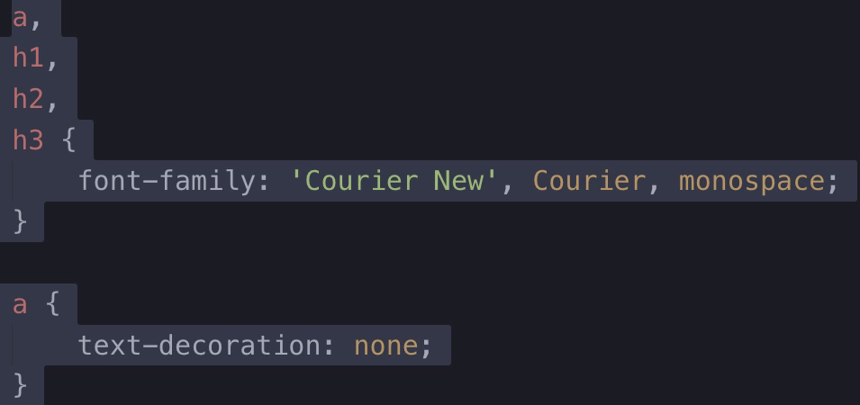

> 针对此**所有**的标签应用样式，影响范围比较大

### 类选择器

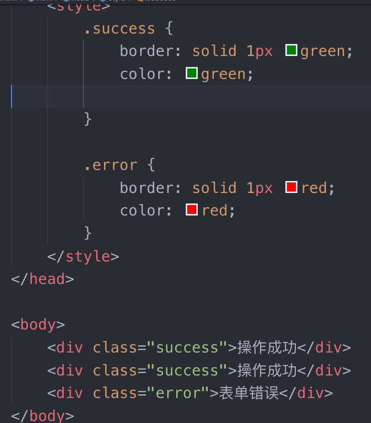


### id选择器

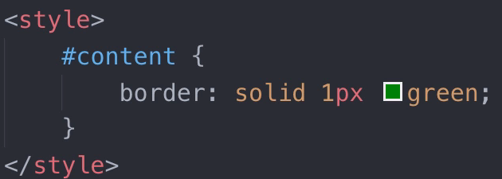

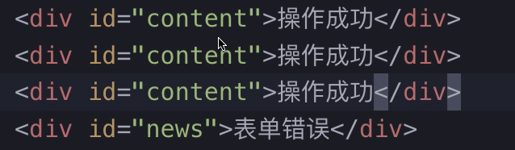


## 关系选择器

### 包含选择器

### 子选择器

### 相邻选择器

### 兄弟选择器


## 属性选择器

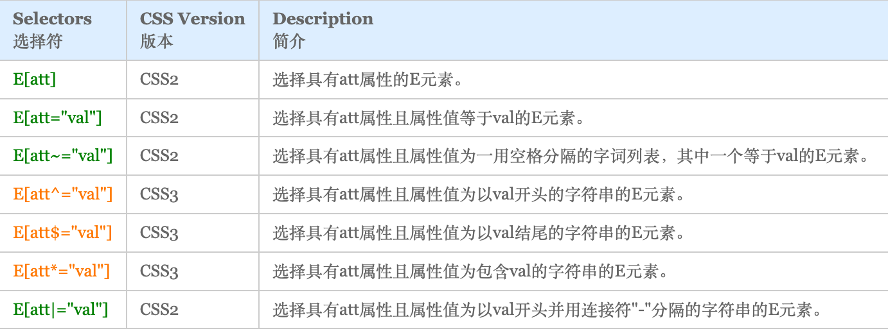


## 伪类选择器

* 用于标签元素[超链接、input等]触发各种事件[点击前、获取焦点时、点击后、悬浮时等]

	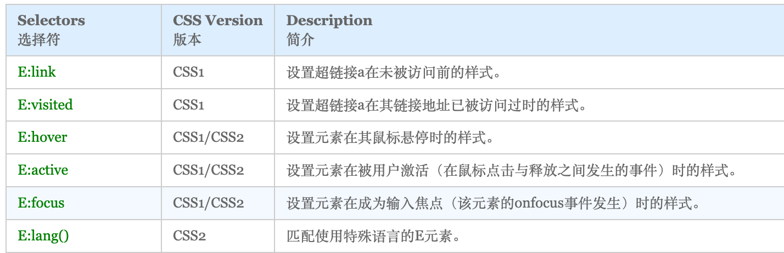

	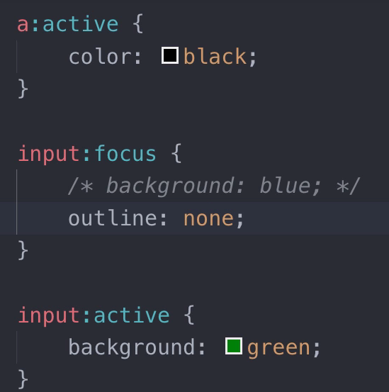

* 匹配父元素中的各种子元素

	

* 匹配处于某种状态的元素

	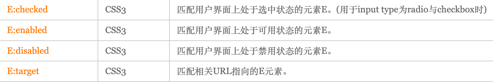


# 元素权重

## 权重应用

| 规则            | 粒度 |
| --------------- | ---- |
| ID              | 0100 |
| class，类属性值 | 0010 |
| 标签,伪元素     | 0001 |
| *               | 0000 |
| 行内样式        | 1000 |

`权重叠加`

```css
<style>
  /* 权重:0021 */
  h2[class="color"][id] {
		color: red;
  }

  /* 权重:0012 */
  article h2[class="color"] {
  	color: blue;
  }
</style>

<article>
	<h2 class="color" id="hot">HDCMS</h2>
</article>
```


## 强制提升权重

通常修改第三方组件库中样式

```css
<style>
  /* 权重:0021 */
  h2[class="color"][id] {
		color: red;
  }

  /* 权重:0012 */
  article h2[class="color"] {
  	color: blue !important;
  }
</style>

<article>
	<h2 class="color" id="hot">HDCMS</h2>
</article>
```


## 继承规则

子元素可以继承父元素设置的样式。

- 子元素并不是全部样式。比如边框、高度等并不会继承。
- 继承的规则没有权重


# 文本控制

[文本基础 | 后盾人 (houdunren.com)](https://doc.houdunren.com/css/4 文本控制.html#文本基础)


# 浮动布局

* 浮动float元素只会对后面的元素影响，脱离文档流。
	* 如果后面的元素没有浮动，则由于感知不到前面元素会挤占浮动元素的空间。
	* 如果后面的元素也要浮动，则两浮动元素并排显示

## FLOAT

使用浮动可以控制相邻元素间的排列关系。

| 选项  | 说明     |
| ----- | -------- |
| left  | 向左浮动 |
| right | 向右浮动 |
| none  | 不浮动   |


## 文档流

没有设置浮动的块元素是独占一行的。

![image-20190820202706957](data:image/png;base64,iVBORw0KGgoAAAANSUhEUgAAALkAAAFoCAYAAAALuFpiAAABRmlDQ1BJQ0MgUHJvZmlsZQAAKJFjYGASSSwoyGFhYGDIzSspCnJ3UoiIjFJgf8zAwSDCIMhgwsCSmFxc4BgQ4ANUwgCjUcG3awyMIPqyLsis122+YvYPLIzOz48X+lJhGIepHgVwpaQWJwPpP0CcnlxQVMLAwJgCZCuXlxSA2B1AtkgR0FFA9hwQOx3C3gBiJ0HYR8BqQoKcgewbQLZAckYi0AzGF0C2ThKSeDoSG2ovCPD6uCuE+oQEOYZ7urgScC/JoCS1ogREO+cXVBZlpmeUKDgCQylVwTMvWU9HwcjA0JKBARTmENWfb4DDklGMAyFWIMbAYDEDKPgQIRYP9MN2OQYG/j6EmBrQvwJeDAwH9xUkFiXCHcD4jaU4zdgIwubezsDAOu3//8/hDAzsmgwMf6////97+///f5cxMDDfYmA48A0A7i9gVM3FyEcAAAllSURBVHgB7dexThZoEIZRUetNrLzBvXkrCy+ANVsi82tBnuCbQ+cHYZgzTwg+Pf/8+OCDwLDAx+HdrEbgfwGRC2Fe4PPLDZ+/fH355N8E/gqBp+/fXv05/SZ/lcXjkoDIl65pl1cFRP4qi8clgV/+Jn+53PV3zsuv828CtcCf/v/Rb/L6MublAiLPyQ2sBURei5uXC4g8JzewFhB5LW5eLiDynNzAWkDktbh5uYDIc3IDawGR1+Lm5QIiz8kNrAVEXoublwuIPCc3sBYQeS1uXi4g8pzcwFpA5LW4ebmAyHNyA2sBkdfi5uUCIs/JDawFRF6Lm5cLiDwnN7AWEHktbl4uIPKc3MBaQOS1uHm5gMhzcgNrAZHX4ublAiLPyQ2sBURei5uXC4g8JzewFhB5LW5eLiDynNzAWkDktbh5uYDIc3IDawGR1+Lm5QIiz8kNrAVEXoublwuIPCc3sBYQeS1uXi4g8pzcwFpA5LW4ebmAyHNyA2sBkdfi5uUCIs/JDawFRF6Lm5cLiDwnN7AWEHktbl4uIPKc3MBaQOS1uHm5gMhzcgNrAZHX4ublAiLPyQ2sBURei5uXC4g8JzewFhB5LW5eLiDynNzAWkDktbh5uYDIc3IDawGR1+Lm5QIiz8kNrAVEXoublwuIPCc3sBYQeS1uXi4g8pzcwFpA5LW4ebmAyHNyA2sBkdfi5uUCIs/JDawFRF6Lm5cLiDwnN7AWEHktbl4uIPKc3MBaQOS1uHm5gMhzcgNrAZHX4ublAiLPyQ2sBURei5uXC4g8JzewFhB5LW5eLiDynNzAWkDktbh5uYDIc3IDawGR1+Lm5QIiz8kNrAVEXoublwuIPCc3sBYQeS1uXi4g8pzcwFpA5LW4ebmAyHNyA2sBkdfi5uUCIs/JDawFRF6Lm5cLiDwnN7AWEHktbl4uIPKc3MBaQOS1uHm5gMhzcgNrAZHX4ublAiLPyQ2sBURei5uXC4g8JzewFhB5LW5eLiDynNzAWkDktbh5uYDIc3IDawGR1+Lm5QIiz8kNrAVEXoublwuIPCc3sBYQeS1uXi4g8pzcwFpA5LW4ebmAyHNyA2sBkdfi5uUCIs/JDawFRF6Lm5cLiDwnN7AWEHktbl4uIPKc3MBaQOS1uHm5gMhzcgNrAZHX4ublAiLPyQ2sBURei5uXC4g8JzewFhB5LW5eLiDynNzAWkDktbh5uYDIc3IDawGR1+Lm5QIiz8kNrAVEXoublwuIPCc3sBYQeS1uXi4g8pzcwFpA5LW4ebmAyHNyA2sBkdfi5uUCIs/JDawFRF6Lm5cLiDwnN7AWEHktbl4uIPKc3MBaQOS1uHm5gMhzcgNrAZHX4ublAiLPyQ2sBURei5uXC4g8JzewFhB5LW5eLiDynNzAWkDktbh5uYDIc3IDawGR1+Lm5QIiz8kNrAVEXoublwuIPCc3sBYQeS1uXi4g8pzcwFpA5LW4ebmAyHNyA2sBkdfi5uUCIs/JDawFRF6Lm5cLiDwnN7AWEHktbl4uIPKc3MBa4PPvBj5/+fq7L/F5Au9awG/yd30eP9xbCIj8LRR9j3ctIPJ3fR4/3FsI/PI3+T//fnqL7+t7EMgFfhwT/SY/YDzvCIh855Y2OQREfsB43hEQ+c4tbXIIiPyA8bwjIPKdW9rkEBD5AeN5R0DkO7e0ySEg8gPG846AyHduaZNDQOQHjOcdAZHv3NImh4DIDxjPOwIi37mlTQ4BkR8wnncERL5zS5scAiI/YDzvCIh855Y2OQREfsB43hEQ+c4tbXIIiPyA8bwjIPKdW9rkEBD5AeN5R0DkO7e0ySEg8gPG846AyHduaZNDQOQHjOcdAZHv3NImh4DIDxjPOwIi37mlTQ4BkR8wnncERL5zS5scAiI/YDzvCIh855Y2OQREfsB43hEQ+c4tbXIIiPyA8bwjIPKdW9rkEBD5AeN5R0DkO7e0ySEg8gPG846AyHduaZNDQOQHjOcdAZHv3NImh4DIDxjPOwIi37mlTQ4BkR8wnncERL5zS5scAiI/YDzvCIh855Y2OQREfsB43hEQ+c4tbXIIiPyA8bwjIPKdW9rkEBD5AeN5R0DkO7e0ySEg8gPG846AyHduaZNDQOQHjOcdAZHv3NImh4DIDxjPOwIi37mlTQ4BkR8wnncERL5zS5scAiI/YDzvCIh855Y2OQREfsB43hEQ+c4tbXIIiPyA8bwjIPKdW9rkEBD5AeN5R0DkO7e0ySEg8gPG846AyHduaZNDQOQHjOcdAZHv3NImh4DIDxjPOwIi37mlTQ4BkR8wnncERL5zS5scAiI/YDzvCIh855Y2OQREfsB43hEQ+c4tbXIIiPyA8bwjIPKdW9rkEBD5AeN5R0DkO7e0ySEg8gPG846AyHduaZNDQOQHjOcdAZHv3NImh4DIDxjPOwIi37mlTQ4BkR8wnncERL5zS5scAiI/YDzvCIh855Y2OQREfsB43hEQ+c4tbXIIiPyA8bwjIPKdW9rkEBD5AeN5R0DkO7e0ySEg8gPG846AyHduaZNDQOQHjOcdAZHv3NImh4DIDxjPOwIi37mlTQ4BkR8wnncERL5zS5scAiI/YDzvCIh855Y2OQREfsB43hEQ+c4tbXIIiPyA8bwjIPKdW9rkEBD5AeN5R0DkO7e0ySEg8gPG846AyHduaZNDQOQHjOcdAZHv3NImh4DIDxjPOwIi37mlTQ4BkR8wnncERL5zS5scAiI/YDzvCIh855Y2OQREfsB43hEQ+c4tbXIIiPyA8bwjIPKdW9rkEBD5AeN5R0DkO7e0ySEg8gPG846AyHduaZNDQOQHjOcdAZHv3NImh4DIDxjPOwIi37mlTQ4BkR8wnncERL5zS5scAiI/YDzvCIh855Y2OQREfsB43hEQ+c4tbXIIiPyA8bwjIPKdW9rkEBD5AeN5R0DkO7e0ySEg8gPG846AyHduaZNDQOQHjOcdAZHv3NImh4DIDxjPOwIi37mlTQ4BkR8wnncERL5zS5scAiI/YDzvCIh855Y2OQREfsB43hEQ+c4tbXIIiPyA8bwjIPKdW9rkEBD5AeN5R0DkO7e0ySEg8gPG846AyHduaZNDQOQHjOcdAZHv3NImh4DIDxjPOwIi37mlTQ6Bp+efH8fnPBOYEPCbfOKMlngkIPJHOj43ISDyiTNa4pGAyB/p+NyEgMgnzmiJRwIif6TjcxMC/wFQ/xNePk7G7gAAAABJRU5ErkJggg==)

浮动是对后面元素的影响，下图中第二个元素设置浮动对第一个元素没有影响

![image-20190820202706957](data:image/png;base64,iVBORw0KGgoAAAANSUhEUgAAALkAAAFoCAYAAAALuFpiAAABRmlDQ1BJQ0MgUHJvZmlsZQAAKJFjYGASSSwoyGFhYGDIzSspCnJ3UoiIjFJgf8zAwSDCIMhgwsCSmFxc4BgQ4ANUwgCjUcG3awyMIPqyLsis122+YvYPLIzOz48X+lJhGIepHgVwpaQWJwPpP0CcnlxQVMLAwJgCZCuXlxSA2B1AtkgR0FFA9hwQOx3C3gBiJ0HYR8BqQoKcgewbQLZAckYi0AzGF0C2ThKSeDoSG2ovCPD6uCuE+oQEOYZ7urgScC/JoCS1ogREO+cXVBZlpmeUKDgCQylVwTMvWU9HwcjA0JKBARTmENWfb4DDklGMAyFWIMbAYDEDKPgQIRYP9MN2OQYG/j6EmBrQvwJeDAwH9xUkFiXCHcD4jaU4zdgIwubezsDAOu3//8/hDAzsmgwMf6////97+///f5cxMDDfYmA48A0A7i9gVM3FyEcAAAllSURBVHgB7dexThZoEIZRUetNrLzBvXkrCy+ANVsi82tBnuCbQ+cHYZgzTwg+Pf/8+OCDwLDAx+HdrEbgfwGRC2Fe4PPLDZ+/fH355N8E/gqBp+/fXv05/SZ/lcXjkoDIl65pl1cFRP4qi8clgV/+Jn+53PV3zsuv828CtcCf/v/Rb/L6MublAiLPyQ2sBURei5uXC4g8JzewFhB5LW5eLiDynNzAWkDktbh5uYDIc3IDawGR1+Lm5QIiz8kNrAVEXoublwuIPCc3sBYQeS1uXi4g8pzcwFpA5LW4ebmAyHNyA2sBkdfi5uUCIs/JDawFRF6Lm5cLiDwnN7AWEHktbl4uIPKc3MBaQOS1uHm5gMhzcgNrAZHX4ublAiLPyQ2sBURei5uXC4g8JzewFhB5LW5eLiDynNzAWkDktbh5uYDIc3IDawGR1+Lm5QIiz8kNrAVEXoublwuIPCc3sBYQeS1uXi4g8pzcwFpA5LW4ebmAyHNyA2sBkdfi5uUCIs/JDawFRF6Lm5cLiDwnN7AWEHktbl4uIPKc3MBaQOS1uHm5gMhzcgNrAZHX4ublAiLPyQ2sBURei5uXC4g8JzewFhB5LW5eLiDynNzAWkDktbh5uYDIc3IDawGR1+Lm5QIiz8kNrAVEXoublwuIPCc3sBYQeS1uXi4g8pzcwFpA5LW4ebmAyHNyA2sBkdfi5uUCIs/JDawFRF6Lm5cLiDwnN7AWEHktbl4uIPKc3MBaQOS1uHm5gMhzcgNrAZHX4ublAiLPyQ2sBURei5uXC4g8JzewFhB5LW5eLiDynNzAWkDktbh5uYDIc3IDawGR1+Lm5QIiz8kNrAVEXoublwuIPCc3sBYQeS1uXi4g8pzcwFpA5LW4ebmAyHNyA2sBkdfi5uUCIs/JDawFRF6Lm5cLiDwnN7AWEHktbl4uIPKc3MBaQOS1uHm5gMhzcgNrAZHX4ublAiLPyQ2sBURei5uXC4g8JzewFhB5LW5eLiDynNzAWkDktbh5uYDIc3IDawGR1+Lm5QIiz8kNrAVEXoublwuIPCc3sBYQeS1uXi4g8pzcwFpA5LW4ebmAyHNyA2sBkdfi5uUCIs/JDawFRF6Lm5cLiDwnN7AWEHktbl4uIPKc3MBaQOS1uHm5gMhzcgNrAZHX4ublAiLPyQ2sBURei5uXC4g8JzewFhB5LW5eLiDynNzAWkDktbh5uYDIc3IDawGR1+Lm5QIiz8kNrAVEXoublwuIPCc3sBYQeS1uXi4g8pzcwFpA5LW4ebmAyHNyA2sBkdfi5uUCIs/JDawFRF6Lm5cLiDwnN7AWEHktbl4uIPKc3MBaQOS1uHm5gMhzcgNrAZHX4ublAiLPyQ2sBURei5uXC4g8JzewFhB5LW5eLiDynNzAWkDktbh5uYDIc3IDawGR1+Lm5QIiz8kNrAVEXoublwuIPCc3sBYQeS1uXi4g8pzcwFpA5LW4ebmAyHNyA2sBkdfi5uUCIs/JDawFRF6Lm5cLiDwnN7AWEHktbl4uIPKc3MBa4PPvBj5/+fq7L/F5Au9awG/yd30eP9xbCIj8LRR9j3ctIPJ3fR4/3FsI/PI3+T//fnqL7+t7EMgFfhwT/SY/YDzvCIh855Y2OQREfsB43hEQ+c4tbXIIiPyA8bwjIPKdW9rkEBD5AeN5R0DkO7e0ySEg8gPG846AyHduaZNDQOQHjOcdAZHv3NImh4DIDxjPOwIi37mlTQ4BkR8wnncERL5zS5scAiI/YDzvCIh855Y2OQREfsB43hEQ+c4tbXIIiPyA8bwjIPKdW9rkEBD5AeN5R0DkO7e0ySEg8gPG846AyHduaZNDQOQHjOcdAZHv3NImh4DIDxjPOwIi37mlTQ4BkR8wnncERL5zS5scAiI/YDzvCIh855Y2OQREfsB43hEQ+c4tbXIIiPyA8bwjIPKdW9rkEBD5AeN5R0DkO7e0ySEg8gPG846AyHduaZNDQOQHjOcdAZHv3NImh4DIDxjPOwIi37mlTQ4BkR8wnncERL5zS5scAiI/YDzvCIh855Y2OQREfsB43hEQ+c4tbXIIiPyA8bwjIPKdW9rkEBD5AeN5R0DkO7e0ySEg8gPG846AyHduaZNDQOQHjOcdAZHv3NImh4DIDxjPOwIi37mlTQ4BkR8wnncERL5zS5scAiI/YDzvCIh855Y2OQREfsB43hEQ+c4tbXIIiPyA8bwjIPKdW9rkEBD5AeN5R0DkO7e0ySEg8gPG846AyHduaZNDQOQHjOcdAZHv3NImh4DIDxjPOwIi37mlTQ4BkR8wnncERL5zS5scAiI/YDzvCIh855Y2OQREfsB43hEQ+c4tbXIIiPyA8bwjIPKdW9rkEBD5AeN5R0DkO7e0ySEg8gPG846AyHduaZNDQOQHjOcdAZHv3NImh4DIDxjPOwIi37mlTQ4BkR8wnncERL5zS5scAiI/YDzvCIh855Y2OQREfsB43hEQ+c4tbXIIiPyA8bwjIPKdW9rkEBD5AeN5R0DkO7e0ySEg8gPG846AyHduaZNDQOQHjOcdAZHv3NImh4DIDxjPOwIi37mlTQ4BkR8wnncERL5zS5scAiI/YDzvCIh855Y2OQREfsB43hEQ+c4tbXIIiPyA8bwjIPKdW9rkEBD5AeN5R0DkO7e0ySEg8gPG846AyHduaZNDQOQHjOcdAZHv3NImh4DIDxjPOwIi37mlTQ4BkR8wnncERL5zS5scAiI/YDzvCIh855Y2OQREfsB43hEQ+c4tbXIIiPyA8bwjIPKdW9rkEBD5AeN5R0DkO7e0ySEg8gPG846AyHduaZNDQOQHjOcdAZHv3NImh4DIDxjPOwIi37mlTQ4BkR8wnncERL5zS5scAiI/YDzvCIh855Y2OQREfsB43hEQ+c4tbXIIiPyA8bwjIPKdW9rkEBD5AeN5R0DkO7e0ySEg8gPG846AyHduaZNDQOQHjOcdAZHv3NImh4DIDxjPOwIi37mlTQ4BkR8wnncERL5zS5scAiI/YDzvCIh855Y2OQREfsB43hEQ+c4tbXIIiPyA8bwjIPKdW9rkEBD5AeN5R0DkO7e0ySEg8gPG846AyHduaZNDQOQHjOcdAZHv3NImh4DIDxjPOwIi37mlTQ6Bp+efH8fnPBOYEPCbfOKMlngkIPJHOj43ISDyiTNa4pGAyB/p+NyEgMgnzmiJRwIif6TjcxMC/wFQ/xNePk7G7gAAAABJRU5ErkJggg==)

```css
div:first-of-type {
    border: solid 2px red;
}

div:last-of-type {
 		float: left;
    background: green;
}
```

## 丢失空间

如果只给第一个元素设置浮动，第二个元素不设置，后面的元素会占用第一个元素空间。

![image-20190820202823601](data:image/png;base64,iVBORw0KGgoAAAANSUhEUgAAALkAAAC+CAYAAABpqK7kAAABRmlDQ1BJQ0MgUHJvZmlsZQAAKJFjYGASSSwoyGFhYGDIzSspCnJ3UoiIjFJgf8zAwSDCIMhgwsCSmFxc4BgQ4ANUwgCjUcG3awyMIPqyLsis122+YvYPLIzOz48X+lJhGIepHgVwpaQWJwPpP0CcnlxQVMLAwJgCZCuXlxSA2B1AtkgR0FFA9hwQOx3C3gBiJ0HYR8BqQoKcgewbQLZAckYi0AzGF0C2ThKSeDoSG2ovCPD6uCuE+oQEOYZ7urgScC/JoCS1ogREO+cXVBZlpmeUKDgCQylVwTMvWU9HwcjA0JKBARTmENWfb4DDklGMAyFWIMbAYDEDKPgQIRYP9MN2OQYG/j6EmBrQvwJeDAwH9xUkFiXCHcD4jaU4zdgIwubezsDAOu3//8/hDAzsmgwMf6////97+///f5cxMDDfYmA48A0A7i9gVM3FyEcAAAUgSURBVHgB7dYxblNhFERhDNRIqbJBlsUGU0WiR06gipxXTMn59bmyn6aYe+boybf7++eLDwIHE/h68G1OQ+AfAZIT4XgCJD9+YgeSnAPHE/j+eOH96fnxkd8IJAjcXl8ue3qTX2Lx8CQCJD9pTbdcEiD5JRYPTyLw6T/543E/fn57fOQ3Av8Fgd+//kw9vMknTEJlAiQvr6f7RIDkEyahMgGSl9fTfSJA8gmTUJkAycvr6T4RIPmESahMgOTl9XSfCJB8wiRUJkDy8nq6TwRIPmESKhMgeXk93ScCJJ8wCZUJkLy8nu4TAZJPmITKBEheXk/3iQDJJ0xCZQIkL6+n+0SA5BMmoTIBkpfX030iQPIJk1CZAMnL6+k+ESD5hEmoTIDk5fV0nwiQfMIkVCZA8vJ6uk8ESD5hEioTIHl5Pd0nAiSfMAmVCZC8vJ7uEwGST5iEygRIXl5P94kAySdMQmUCJC+vp/tEgOQTJqEyAZKX19N9IkDyCZNQmQDJy+vpPhEg+YRJqEyA5OX1dJ8IkHzCJFQmQPLyerpPBEg+YRIqEyB5eT3dJwIknzAJlQmQvLye7hMBkk+YhMoESF5eT/eJAMknTEJlAiQvr6f7RIDkEyahMgGSl9fTfSJA8gmTUJkAycvr6T4RIPmESahMgOTl9XSfCJB8wiRUJkDy8nq6TwRIPmESKhMgeXk93ScCJJ8wCZUJkLy8nu4TAZJPmITKBEheXk/3iQDJJ0xCZQIkL6+n+0SA5BMmoTIBkpfX030iQPIJk1CZAMnL6+k+ESD5hEmoTIDk5fV0nwiQfMIkVCZA8vJ6uk8ESD5hEioTIHl5Pd0nAiSfMAmVCZC8vJ7uEwGST5iEygRIXl5P94kAySdMQmUCJC+vp/tEgOQTJqEyAZKX19N9IkDyCZNQmQDJy+vpPhEg+YRJqEyA5OX1dJ8IkHzCJFQmQPLyerpPBEg+YRIqEyB5eT3dJwIknzAJlQmQvLye7hMBkk+YhMoESF5eT/eJAMknTEJlAiQvr6f7RIDkEyahMgGSl9fTfSJA8gmTUJkAycvr6T4RIPmESahMgOTl9XSfCJB8wiRUJkDy8nq6TwRIPmESKhMgeXk93ScCJJ8wCZUJkLy8nu4TAZJPmITKBEheXk/3iQDJJ0xCZQIkL6+n+0SA5BMmoTIBkpfX030iQPIJk1CZAMnL6+k+ESD5hEmoTIDk5fV0nwiQfMIkVCZA8vJ6uk8ESD5hEioTIHl5Pd0nAiSfMAmVCZC8vJ7uEwGST5iEygRIXl5P94kAySdMQmUCJC+vp/tEgOQTJqEyAZKX19N9IkDyCZNQmQDJy+vpPhEg+YRJqEyA5OX1dJ8IkHzCJFQmQPLyerpPBEg+YRIqEyB5eT3dJwIknzAJlQmQvLye7hMBkk+YhMoESF5eT/eJAMknTEJlAiQvr6f7RIDkEyahMgGSl9fTfSJA8gmTUJkAycvr6T4RIPmESahMgOTl9XSfCJB8wiRUJkDy8nq6TwRIPmESKhMgeXk93ScCJJ8wCZUJkLy8nu4TAZJPmITKBEheXk/3iQDJJ0xCZQIkL6+n+0SA5BMmoTIBkpfX030iQPIJk1CZAMnL6+k+Ebjd3z8fk/en548/fUcgQ+D2+nLZ1Zv8EouHJxEg+UlruuWSAMkvsXh4EoFP/8lPOs4tCPwl4E3Og+MJkPz4iR1Icg4cT4Dkx0/sQJJz4HgCJD9+YgeSnAPHEyD58RM7kOQcOJ7AG95PFnL+JrOlAAAAAElFTkSuQmCC)

```css
div:first-of-type {
    float: left;
    border: solid 2px red;
}

div:last-of-type {
    background: green;
}
```

## 使用浮动

两个元素都设置浮动后，会并排显示

![image-20190820202913929](data:image/png;base64,iVBORw0KGgoAAAANSUhEUgAAAWkAAAC9CAYAAABxo4zDAAABRmlDQ1BJQ0MgUHJvZmlsZQAAKJFjYGASSSwoyGFhYGDIzSspCnJ3UoiIjFJgf8zAwSDCIMhgwsCSmFxc4BgQ4ANUwgCjUcG3awyMIPqyLsis122+YvYPLIzOz48X+lJhGIepHgVwpaQWJwPpP0CcnlxQVMLAwJgCZCuXlxSA2B1AtkgR0FFA9hwQOx3C3gBiJ0HYR8BqQoKcgewbQLZAckYi0AzGF0C2ThKSeDoSG2ovCPD6uCuE+oQEOYZ7urgScC/JoCS1ogREO+cXVBZlpmeUKDgCQylVwTMvWU9HwcjA0JKBARTmENWfb4DDklGMAyFWIMbAYDEDKPgQIRYP9MN2OQYG/j6EmBrQvwJeDAwH9xUkFiXCHcD4jaU4zdgIwubezsDAOu3//8/hDAzsmgwMf6////97+///f5cxMDDfYmA48A0A7i9gVM3FyEcAAAd7SURBVHgB7dkxahthGEVRO3EdcOUNZjfZZyBViixANinNFIb3X5jiqLPw9xiOzEUkz4+P15MXAQIECNxS4Nstn8pDESBAgMB/AZH2h0CAAIEbC4j0jT8cj0aAAAGR9jdAgACBGwuI9I0/HI9GgACBlyuCx+vb1dveI3B7gR8/v9/+GT0ggSuBf79+X7395Jv0JYs3CRAgcA8Bkb7H5+ApCBAgcCkg0pcs3iRAgMA9BC7/Tfrzoz3//fP5LT8TuIWA/z+5xcfgIUIB36RDXNMECBBYBUR6FXRPgACBUECkQ1zTBAgQWAVEehV0T4AAgVBApENc0wQIEFgFRHoVdE+AAIFQQKRDXNMECBBYBUR6FXRPgACBUECkQ1zTBAgQWAVEehV0T4AAgVBApENc0wQIEFgFRHoVdE+AAIFQQKRDXNMECBBYBUR6FXRPgACBUECkQ1zTBAgQWAVEehV0T4AAgVBApENc0wQIEFgFRHoVdE+AAIFQQKRDXNMECBBYBUR6FXRPgACBUECkQ1zTBAgQWAVEehV0T4AAgVBApENc0wQIEFgFRHoVdE+AAIFQQKRDXNMECBBYBUR6FXRPgACBUECkQ1zTBAgQWAVEehV0T4AAgVBApENc0wQIEFgFRHoVdE+AAIFQQKRDXNMECBBYBUR6FXRPgACBUECkQ1zTBAgQWAVEehV0T4AAgVBApENc0wQIEFgFRHoVdE+AAIFQQKRDXNMECBBYBUR6FXRPgACBUECkQ1zTBAgQWAVEehV0T4AAgVBApENc0wQIEFgFRHoVdE+AAIFQQKRDXNMECBBYBUR6FXRPgACBUECkQ1zTBAgQWAVEehV0T4AAgVBApENc0wQIEFgFRHoVdE+AAIFQQKRDXNMECBBYBUR6FXRPgACBUECkQ1zTBAgQWAVEehV0T4AAgVBApENc0wQIEFgFRHoVdE+AAIFQQKRDXNMECBBYBUR6FXRPgACBUECkQ1zTBAgQWAVEehV0T4AAgVBApENc0wQIEFgFRHoVdE+AAIFQQKRDXNMECBBYBUR6FXRPgACBUECkQ1zTBAgQWAVEehV0T4AAgVBApENc0wQIEFgFRHoVdE+AAIFQQKRDXNMECBBYBUR6FXRPgACBUECkQ1zTBAgQWAVEehV0T4AAgVBApENc0wQIEFgFRHoVdE+AAIFQQKRDXNMECBBYBUR6FXRPgACBUECkQ1zTBAgQWAVEehV0T4AAgVBApENc0wQIEFgFRHoVdE+AAIFQQKRDXNMECBBYBUR6FXRPgACBUECkQ1zTBAgQWAVEehV0T4AAgVBApENc0wQIEFgFRHoVdE+AAIFQQKRDXNMECBBYBUR6FXRPgACBUECkQ1zTBAgQWAVEehV0T4AAgVBApENc0wQIEFgFRHoVdE+AAIFQQKRDXNMECBBYBUR6FXRPgACBUECkQ1zTBAgQWAVEehV0T4AAgVBApENc0wQIEFgFRHoVdE+AAIFQQKRDXNMECBBYBUR6FXRPgACBUECkQ1zTBAgQWAVEehV0T4AAgVBApENc0wQIEFgFRHoVdE+AAIFQQKRDXNMECBBYBUR6FXRPgACBUECkQ1zTBAgQWAVEehV0T4AAgVBApENc0wQIEFgFRHoVdE+AAIFQQKRDXNMECBBYBUR6FXRPgACBUECkQ1zTBAgQWAVEehV0T4AAgVBApENc0wQIEFgFRHoVdE+AAIFQQKRDXNMECBBYBUR6FXRPgACBUECkQ1zTBAgQWAVEehV0T4AAgVBApENc0wQIEFgFRHoVdE+AAIFQQKRDXNMECBBYBUR6FXRPgACBUECkQ1zTBAgQWAVEehV0T4AAgVBApENc0wQIEFgFRHoVdE+AAIFQQKRDXNMECBBYBUR6FXRPgACBUECkQ1zTBAgQWAVEehV0T4AAgVBApENc0wQIEFgFRHoVdE+AAIFQQKRDXNMECBBYBUR6FXRPgACBUECkQ1zTBAgQWAVEehV0T4AAgVBApENc0wQIEFgFRHoVdE+AAIFQQKRDXNMECBBYBUR6FXRPgACBUECkQ1zTBAgQWAVEehV0T4AAgVBApENc0wQIEFgFRHoVdE+AAIFQQKRDXNMECBBYBUR6FXRPgACBUECkQ1zTBAgQWAVEehV0T4AAgVBApENc0wQIEFgFRHoVdE+AAIFQQKRDXNMECBBYBUR6FXRPgACBUECkQ1zTBAgQWAVEehV0T4AAgVBApENc0wQIEFgFRHoVdE+AAIFQQKRDXNMECBBYBUR6FXRPgACBUECkQ1zTBAgQWAVEehV0T4AAgVBApENc0wQIEFgFRHoVdE+AAIFQQKRDXNMECBBYBUR6FXRPgACBUECkQ1zTBAgQWAVEehV0T4AAgVDg5Svbj9e3r/ya3yFAgACBwwK+SR8GNUeAAIGTAiJ9UtMWAQIEDguI9GFQcwQIEDgp8Pz4eJ0ctEWAAAEC5wR8kz5naYkAAQLHBUT6OKlBAgQInBMQ6XOWlggQIHBcQKSPkxokQIDAOQGRPmdpiQABAscFRPo4qUECBAicExDpc5aWCBAgcFzgHRDEEZ7LfH0gAAAAAElFTkSuQmCC)

```css
div:first-of-type {
    float: left;
    border: solid 2px red;
}

div:last-of-type {
    float: left;
    background: green;
}
```

为第二个元素设置右浮动时将移动到右边

![image-20190820203052185](data:image/png;base64,iVBORw0KGgoAAAANSUhEUgAAAnoAAADBCAYAAABYOB2TAAABRmlDQ1BJQ0MgUHJvZmlsZQAAKJFjYGASSSwoyGFhYGDIzSspCnJ3UoiIjFJgf8zAwSDCIMhgwsCSmFxc4BgQ4ANUwgCjUcG3awyMIPqyLsis122+YvYPLIzOz48X+lJhGIepHgVwpaQWJwPpP0CcnlxQVMLAwJgCZCuXlxSA2B1AtkgR0FFA9hwQOx3C3gBiJ0HYR8BqQoKcgewbQLZAckYi0AzGF0C2ThKSeDoSG2ovCPD6uCuE+oQEOYZ7urgScC/JoCS1ogREO+cXVBZlpmeUKDgCQylVwTMvWU9HwcjA0JKBARTmENWfb4DDklGMAyFWIMbAYDEDKPgQIRYP9MN2OQYG/j6EmBrQvwJeDAwH9xUkFiXCHcD4jaU4zdgIwubezsDAOu3//8/hDAzsmgwMf6////97+///f5cxMDDfYmA48A0A7i9gVM3FyEcAAAuUSURBVHgB7dqxapRhGIRRI2ktUgW8T6/C+xSsLLyAGCwDYVPMx/9kOdtplvlnz5tiWPLw8vr64kWAAAECBAgQIHB3Al/v7hP5QAQIECBAgAABAv8FDD2/CAQIECBAgACBOxUw9O70sD4WAQIECBAgQMDQ8ztAgAABAgQIELhTgcf3PtfL0/N7P/L/BNICD39+p/spR4BAS+Dbj++tQtoQ+KDA35+/br7TN3o3ibyBAAECBAgQIPA5BQy9z3k3rQkQIECAAAECNwUMvZtE3kCAAAECBAgQ+JwC7/6N3tuP4++e3or4d0XA35NWLqEHAQIECNQEfKNXu4g+BAgQIECAAIGRgKE3ghRDgAABAgQIEKgJGHq1i+hDgAABAgQIEBgJGHojSDEECBAgQIAAgZqAoVe7iD4ECBAgQIAAgZGAoTeCFEOAAAECBAgQqAkYerWL6EOAAAECBAgQGAkYeiNIMQQIECBAgACBmoChV7uIPgQIECBAgACBkYChN4IUQ4AAAQIECBCoCRh6tYvoQ4AAAQIECBAYCRh6I0gxBAgQIECAAIGagKFXu4g+BAgQIECAAIGRgKE3ghRDgAABAgQIEKgJGHq1i+hDgAABAgQIEBgJGHojSDEECBAgQIAAgZqAoVe7iD4ECBAgQIAAgZGAoTeCFEOAAAECBAgQqAkYerWL6EOAAAECBAgQGAkYeiNIMQQIECBAgACBmoChV7uIPgQIECBAgACBkYChN4IUQ4AAAQIECBCoCRh6tYvoQ4AAAQIECBAYCRh6I0gxBAgQIECAAIGagKFXu4g+BAgQIECAAIGRgKE3ghRDgAABAgQIEKgJGHq1i+hDgAABAgQIEBgJGHojSDEECBAgQIAAgZqAoVe7iD4ECBAgQIAAgZGAoTeCFEOAAAECBAgQqAkYerWL6EOAAAECBAgQGAkYeiNIMQQIECBAgACBmoChV7uIPgQIECBAgACBkYChN4IUQ4AAAQIECBCoCRh6tYvoQ4AAAQIECBAYCRh6I0gxBAgQIECAAIGagKFXu4g+BAgQIECAAIGRgKE3ghRDgAABAgQIEKgJGHq1i+hDgAABAgQIEBgJGHojSDEECBAgQIAAgZqAoVe7iD4ECBAgQIAAgZGAoTeCFEOAAAECBAgQqAkYerWL6EOAAAECBAgQGAkYeiNIMQQIECBAgACBmoChV7uIPgQIECBAgACBkYChN4IUQ4AAAQIECBCoCRh6tYvoQ4AAAQIECBAYCRh6I0gxBAgQIECAAIGagKFXu4g+BAgQIECAAIGRgKE3ghRDgAABAgQIEKgJGHq1i+hDgAABAgQIEBgJGHojSDEECBAgQIAAgZqAoVe7iD4ECBAgQIAAgZGAoTeCFEOAAAECBAgQqAkYerWL6EOAAAECBAgQGAkYeiNIMQQIECBAgACBmoChV7uIPgQIECBAgACBkYChN4IUQ4AAAQIECBCoCRh6tYvoQ4AAAQIECBAYCRh6I0gxBAgQIECAAIGagKFXu4g+BAgQIECAAIGRgKE3ghRDgAABAgQIEKgJGHq1i+hDgAABAgQIEBgJGHojSDEECBAgQIAAgZqAoVe7iD4ECBAgQIAAgZGAoTeCFEOAAAECBAgQqAkYerWL6EOAAAECBAgQGAkYeiNIMQQIECBAgACBmoChV7uIPgQIECBAgACBkYChN4IUQ4AAAQIECBCoCRh6tYvoQ4AAAQIECBAYCRh6I0gxBAgQIECAAIGagKFXu4g+BAgQIECAAIGRgKE3ghRDgAABAgQIEKgJGHq1i+hDgAABAgQIEBgJGHojSDEECBAgQIAAgZqAoVe7iD4ECBAgQIAAgZGAoTeCFEOAAAECBAgQqAkYerWL6EOAAAECBAgQGAkYeiNIMQQIECBAgACBmoChV7uIPgQIECBAgACBkYChN4IUQ4AAAQIECBCoCRh6tYvoQ4AAAQIECBAYCRh6I0gxBAgQIECAAIGagKFXu4g+BAgQIECAAIGRgKE3ghRDgAABAgQIEKgJGHq1i+hDgAABAgQIEBgJGHojSDEECBAgQIAAgZqAoVe7iD4ECBAgQIAAgZGAoTeCFEOAAAECBAgQqAkYerWL6EOAAAECBAgQGAkYeiNIMQQIECBAgACBmoChV7uIPgQIECBAgACBkYChN4IUQ4AAAQIECBCoCRh6tYvoQ4AAAQIECBAYCRh6I0gxBAgQIECAAIGagKFXu4g+BAgQIECAAIGRgKE3ghRDgAABAgQIEKgJGHq1i+hDgAABAgQIEBgJGHojSDEECBAgQIAAgZqAoVe7iD4ECBAgQIAAgZGAoTeCFEOAAAECBAgQqAkYerWL6EOAAAECBAgQGAkYeiNIMQQIECBAgACBmoChV7uIPgQIECBAgACBkYChN4IUQ4AAAQIECBCoCRh6tYvoQ4AAAQIECBAYCRh6I0gxBAgQIECAAIGagKFXu4g+BAgQIECAAIGRgKE3ghRDgAABAgQIEKgJGHq1i+hDgAABAgQIEBgJGHojSDEECBAgQIAAgZqAoVe7iD4ECBAgQIAAgZGAoTeCFEOAAAECBAgQqAkYerWL6EOAAAECBAgQGAkYeiNIMQQIECBAgACBmoChV7uIPgQIECBAgACBkYChN4IUQ4AAAQIECBCoCRh6tYvoQ4AAAQIECBAYCRh6I0gxBAgQIECAAIGagKFXu4g+BAgQIECAAIGRgKE3ghRDgAABAgQIEKgJGHq1i+hDgAABAgQIEBgJGHojSDEECBAgQIAAgZqAoVe7iD4ECBAgQIAAgZGAoTeCFEOAAAECBAgQqAkYerWL6EOAAAECBAgQGAkYeiNIMQQIECBAgACBmoChV7uIPgQIECBAgACBkYChN4IUQ4AAAQIECBCoCRh6tYvoQ4AAAQIECBAYCRh6I0gxBAgQIECAAIGagKFXu4g+BAgQIECAAIGRgKE3ghRDgAABAgQIEKgJGHq1i+hDgAABAgQIEBgJGHojSDEECBAgQIAAgZqAoVe7iD4ECBAgQIAAgZGAoTeCFEOAAAECBAgQqAkYerWL6EOAAAECBAgQGAkYeiNIMQQIECBAgACBmoChV7uIPgQIECBAgACBkYChN4IUQ4AAAQIECBCoCRh6tYvoQ4AAAQIECBAYCRh6I0gxBAgQIECAAIGagKFXu4g+BAgQIECAAIGRgKE3ghRDgAABAgQIEKgJGHq1i+hDgAABAgQIEBgJGHojSDEECBAgQIAAgZqAoVe7iD4ECBAgQIAAgZGAoTeCFEOAAAECBAgQqAkYerWL6EOAAAECBAgQGAkYeiNIMQQIECBAgACBmoChV7uIPgQIECBAgACBkYChN4IUQ4AAAQIECBCoCRh6tYvoQ4AAAQIECBAYCRh6I0gxBAgQIECAAIGagKFXu4g+BAgQIECAAIGRgKE3ghRDgAABAgQIEKgJGHq1i+hDgAABAgQIEBgJGHojSDEECBAgQIAAgZqAoVe7iD4ECBAgQIAAgZGAoTeCFEOAAAECBAgQqAkYerWL6EOAAAECBAgQGAkYeiNIMQQIECBAgACBmoChV7uIPgQIECBAgACBkYChN4IUQ4AAAQIECBCoCTx+tNDL0/NH3+p9BAgQIECAAAECAQHf6AWOoAIBAgQIECBA4ISAoXdCVSYBAgQIECBAICBg6AWOoAIBAgQIECBA4ITAw8vr60SwTAIECBAgQIAAgWsFfKN3rb+nEyBAgAABAgSOCRh6x2gFEyBAgAABAgSuFTD0rvX3dAIECBAgQIDAMQFD7xitYAIECBAgQIDAtQKG3rX+nk6AAAECBAgQOCZg6B2jFUyAAAECBAgQuFbA0LvW39MJECBAgAABAscEDL1jtIIJECBAgAABAtcKGHrX+ns6AQIECBAgQOCYgKF3jFYwAQIECBAgQOBaAUPvWn9PJ0CAAAECBAgcEzD0jtEKJkCAAAECBAhcK/APmSsTpgxo6hEAAAAASUVORK5CYII=)

```css
div:first-of-type {
    float: left;
    border: solid 2px red;
}

div:last-of-type {
    float: right;
    background: green;
}
```

## 浮动边界

浮动元素边界不能超过父元素的 padding

![image-20190820203619915](data:image/png;base64,iVBORw0KGgoAAAANSUhEUgAAAgIAAADWCAYAAACjdercAAABRmlDQ1BJQ0MgUHJvZmlsZQAAKJFjYGASSSwoyGFhYGDIzSspCnJ3UoiIjFJgf8zAwSDCIMhgwsCSmFxc4BgQ4ANUwgCjUcG3awyMIPqyLsis122+YvYPLIzOz48X+lJhGIepHgVwpaQWJwPpP0CcnlxQVMLAwJgCZCuXlxSA2B1AtkgR0FFA9hwQOx3C3gBiJ0HYR8BqQoKcgewbQLZAckYi0AzGF0C2ThKSeDoSG2ovCPD6uCuE+oQEOYZ7urgScC/JoCS1ogREO+cXVBZlpmeUKDgCQylVwTMvWU9HwcjA0JKBARTmENWfb4DDklGMAyFWIMbAYDEDKPgQIRYP9MN2OQYG/j6EmBrQvwJeDAwH9xUkFiXCHcD4jaU4zdgIwubezsDAOu3//8/hDAzsmgwMf6////97+///f5cxMDDfYmA48A0A7i9gVM3FyEcAAAtBSURBVHgB7dpBil4FEIVRf+ksQBy4hewj4OZ0S+7DFbgBhw7aGOyEhIC3hCLF7dOTTjcl79UpwS8/Pp7ff33niwABAgQIEHiVAt+/yq0tTYAAAQIECHwQEAL+RSBAgAABAq9YQAi84uNbnQABAgQIPL0QPB6Plz/6ToAAAQIECJQI/Nf/CugTgZJDW4MAAQIECPwfgY+fCLz8w/9VDi9zvhMgQIAAAQJ3BdJP+n0icPeG3owAAQIECKwLCIF1Yg8gQIAAAQJ3BYTA3dt4MwIECBAgsC4gBNaJPYAAAQIECNwVEAJ3b+PNCBAgQIDAuoAQWCf2AAIECBAgcFdACNy9jTcjQIAAAQLrAkJgndgDCBAgQIDAXQEhcPc23owAAQIECKwLCIF1Yg8gQIAAAQJ3BYTA3dt4MwIECBAgsC4gBNaJPYAAAQIECNwVEAJ3b+PNCBAgQIDAuoAQWCf2AAIECBAgcFdACNy9jTcjQIAAAQLrAkJgndgDCBAgQIDAXQEhcPc23owAAQIECKwLCIF1Yg8gQIAAAQJ3BYTA3dt4MwIECBAgsC4gBNaJPYAAAQIECNwVEAJ3b+PNCBAgQIDAuoAQWCf2AAIECBAgcFdACNy9jTcjQIAAAQLrAkJgndgDCBAgQIDAXQEhcPc23owAAQIECKwLCIF1Yg8gQIAAAQJ3BYTA3dt4MwIECBAgsC4gBNaJPYAAAQIECNwVEAJ3b+PNCBAgQIDAuoAQWCf2AAIECBAgcFdACNy9jTcjQIAAAQLrAkJgndgDCBAgQIDAXQEhcPc23owAAQIECKwLCIF1Yg8gQIAAAQJ3BYTA3dt4MwIECBAgsC4gBNaJPYAAAQIECNwVEAJ3b+PNCBAgQIDAuoAQWCf2AAIECBAgcFdACNy9jTcjQIAAAQLrAkJgndgDCBAgQIDAXQEhcPc23owAAQIECKwLCIF1Yg8gQIAAAQJ3BYTA3dt4MwIECBAgsC4gBNaJPYAAAQIECNwVEAJ3b+PNCBAgQIDAuoAQWCf2AAIECBAgcFdACNy9jTcjQIAAAQLrAkJgndgDCBAgQIDAXQEhcPc23owAAQIECKwLPK0/4Rs94PmHn77Rkz32awJ//f7b137tdwQIvBf48defORwS+POXPw69zf6r+ERg39gTCBAgQIDAWYHaTwRexP1N9EXi23x/8/bdt3mwpxIgQIBAJOATgYjJEAECBAgQ6BQQAp13tRUBAgQIEIgEhEDEZIgAAQIECHQKCIHOu9qKAAECBAhEAkIgYjJEgAABAgQ6BYRA511tRYAAAQIEIgEhEDEZIkCAAAECnQJCoPOutiJAgAABApGAEIiYDBEgQIAAgU4BIdB5V1sRIECAAIFIQAhETIYIECBAgECngBDovKutCBAgQIBAJCAEIiZDBAgQIECgU0AIdN7VVgQIECBAIBIQAhGTIQIECBAg0CkgBDrvaisCBAgQIBAJCIGIyRABAgQIEOgUEAKdd7UVAQIECBCIBIRAxGSIAAECBAh0CgiBzrvaigABAgQIRAJCIGIyRIAAAQIEOgWEQOddbUWAAAECBCIBIRAxGSJAgAABAp0CQqDzrrYiQIAAAQKRgBCImAwRIECAAIFOASHQeVdbESBAgACBSEAIREyGCBAgQIBAp4AQ6LyrrQgQIECAQCQgBCImQwQIECBAoFNACHTe1VYECBAgQCASEAIRkyECBAgQINApIAQ672orAgQIECAQCQiBiMkQAQIECBDoFBACnXe1FQECBAgQiASEQMRkiAABAgQIdAoIgc672ooAAQIECEQCQiBiMkSAAAECBDoFhEDnXW1FgAABAgQiASEQMRkiQIAAAQKdAkKg8662IkCAAAECkYAQiJgMESBAgACBTgEh0HlXWxEgQIAAgUhACERMhggQIECAQKeAEOi8q60IECBAgEAkIAQiJkMECBAgQKBTQAh03tVWBAgQIEAgEhACEZMhAgQIECDQKSAEOu9qKwIECBAgEAkIgYjJEAECBAgQ6BQQAp13tRUBAgQIEIgEhEDEZIgAAQIECHQKCIHOu9qKAAECBAhEAkIgYjJEgAABAgQ6BYRA511tRYAAAQIEIgEhEDEZIkCAAAECnQJCoPOutiJAgAABApGAEIiYDBEgQIAAgU4BIdB5V1sRIECAAIFIQAhETIYIECBAgECngBDovKutCBAgQIBAJCAEIiZDBAgQIECgU0AIdN7VVgQIECBAIBIQAhGTIQIECBAg0CkgBDrvaisCBAgQIBAJCIGIyRABAgQIEOgUEAKdd7UVAQIECBCIBIRAxGSIAAECBAh0CgiBzrvaigABAgQIRAJCIGIyRIAAAQIEOgWEQOddbUWAAAECBCIBIRAxGSJAgAABAp0CQqDzrrYiQIAAAQKRgBCImAwRIECAAIFOASHQeVdbESBAgACBSEAIREyGCBAgQIBAp4AQ6LyrrQgQIECAQCQgBCImQwQIECBAoFNACHTe1VYECBAgQCASEAIRkyECBAgQINApIAQ672orAgQIECAQCQiBiMkQAQIECBDoFBACnXe1FQECBAgQiASEQMRkiAABAgQIdAoIgc672ooAAQIECEQCQiBiMkSAAAECBDoFhEDnXW1FgAABAgQiASEQMRkiQIAAAQKdAkKg8662IkCAAAECkYAQiJgMESBAgACBTgEh0HlXWxEgQIAAgUhACERMhggQIECAQKeAEOi8q60IECBAgEAkIAQiJkMECBAgQKBTQAh03tVWBAgQIEAgEhACEZMhAgQIECDQKfDUudanrd68fffpB38iQIAAAQIEPhPwicBnHH4gQIAAAQKvS+Dx/P7rn5Ufj8eHzf/98XUp2JYAAQIECJQJpP9d94lA2eGtQ4AAAQIEJgJCYKJllgABAgQIlAkIgbKDWocAAQIECEwEhMBEyywBAgQIECgTEAJlB7UOAQIECBCYCAiBiZZZAgQIECBQJiAEyg5qHQIECBAgMBEQAhMtswQIECBAoExACJQd1DoECBAgQGAiIAQmWmYJECBAgECZgBAoO6h1CBAgQIDAREAITLTMEiBAgACBMgEhUHZQ6xAgQIAAgYmAEJhomSVAgAABAmUCQqDsoNYhQIAAAQITASEw0TJLgAABAgTKBIRA2UGtQ4AAAQIEJgJCYKJllgABAgQIlAkIgbKDWocAAQIECEwEhMBEyywBAgQIECgTEAJlB7UOAQIECBCYCAiBiZZZAgQIECBQJiAEyg5qHQIECBAgMBEQAhMtswQIECBAoExACJQd1DoECBAgQGAiIAQmWmYJECBAgECZgBAoO6h1CBAgQIDAREAITLTMEiBAgACBMgEhUHZQ6xAgQIAAgYmAEJhomSVAgAABAmUCQqDsoNYhQIAAAQITASEw0TJLgAABAgTKBIRA2UGtQ4AAAQIEJgJCYKJllgABAgQIlAkIgbKDWocAAQIECEwEhMBEyywBAgQIECgTEAJlB7UOAQIECBCYCAiBiZZZAgQIECBQJiAEyg5qHQIECBAgMBEQAhMtswQIECBAoExACJQd1DoECBAgQGAiIAQmWmYJECBAgECZgBAoO6h1CBAgQIDAREAITLTMEiBAgACBMgEhUHZQ6xAgQIAAgYmAEJhomSVAgAABAmUCQqDsoNYhQIAAAQITASEw0TJLgAABAgTKBIRA2UGtQ4AAAQIEJgJPXw4/Ho8vf+VnAgQIECBAoFTAJwKlh7UWAQIECBBIBD5+IvD8/JzMmyFAgAABAgSKBHwiUHRMqxAgQIAAgamAEJiKmSdAgAABAkUCQqDomFYhQIAAAQJTASEwFTNPgAABAgSKBIRA0TGtQoAAAQIEpgJ/A8K9IyGzPd1QAAAAAElFTkSuQmCC)

```css
main {
    width: 400px;
    border: solid 2px black;
    overflow: auto;
    padding: 50px;
    background-color: antiquewhite;
    background-clip: content-box;
}

div {
    width: 100px;
    height: 100px;
    box-sizing: border-box;
}

div:first-of-type {
    float: left;
    border: solid 2px red;
}

div:last-of-type {
    float: right;
    background: green;
}
```

## 浮动转块

元素浮动后会变为块元素包括行元素如 `span`，所以浮动后的元素可以设置宽高

```css
a {
    float: left;
    width: 300px;
}
```

## 清除浮动

不希望元素受浮动元素影响时，可以清除浮动。CSS 提供了 `clear` 规则用于清除元素浮动影响。

| 选项  | 说明               |
| ----- | ------------------ |
| left  | 左边远离浮动元素   |
| right | 右连远离浮动元素   |
| both  | 左右都远离浮动元素 |

使用清除浮动

![image-20190820210600975](data:image/png;base64,iVBORw0KGgoAAAANSUhEUgAAAkYAAAGqCAYAAADus4sIAAABRmlDQ1BJQ0MgUHJvZmlsZQAAKJFjYGASSSwoyGFhYGDIzSspCnJ3UoiIjFJgf8zAwSDCIMhgwsCSmFxc4BgQ4ANUwgCjUcG3awyMIPqyLsis122+YvYPLIzOz48X+lJhGIepHgVwpaQWJwPpP0CcnlxQVMLAwJgCZCuXlxSA2B1AtkgR0FFA9hwQOx3C3gBiJ0HYR8BqQoKcgewbQLZAckYi0AzGF0C2ThKSeDoSG2ovCPD6uCuE+oQEOYZ7urgScC/JoCS1ogREO+cXVBZlpmeUKDgCQylVwTMvWU9HwcjA0JKBARTmENWfb4DDklGMAyFWIMbAYDEDKPgQIRYP9MN2OQYG/j6EmBrQvwJeDAwH9xUkFiXCHcD4jaU4zdgIwubezsDAOu3//8/hDAzsmgwMf6////97+///f5cxMDDfYmA48A0A7i9gVM3FyEcAABecSURBVHgB7d2xihZmFARQNwhWFlaC7+lT5D0DqVKkstosREVRrP7LzODZRl3hu8OZLca/8en55euVLwIECBAgQIAAgVd/MCBAgAABAgQIEPhfwDDyk0CAAAECBAgQ+CxgGPlRIECAAAECBAh8FjCM/CgQIECAAAECBD4LvP5W4u3HD9/+0e8JEPiFwL9//vWLv/VXBLICz+/eZwO4TmBI4Omfv7+m9YnRVwq/IUCAAAECBH53ge8+MfqC4V/CXyT8SuBHAZ+s/mjiO70C3/5LuDelZAQyAj/7ZNUnRpkuXCVAgAABAgQKBQyjwlJEIkCAAAECBDIChlHG3VUCBAgQIECgUMAwKixFJAIECBAgQCAjYBhl3F0lQIAAAQIECgUMo8JSRCJAgAABAgQyAoZRxt1VAgQIECBAoFDAMCosRSQCBAgQIEAgI2AYZdxdJUCAAAECBAoFDKPCUkQiQIAAAQIEMgKGUcbdVQIECBAgQKBQwDAqLEUkAgQIECBAICNgGGXcXSVAgAABAgQKBQyjwlJEIkCAAAECBDIChlHG3VUCBAgQIECgUMAwKixFJAIECBAgQCAjYBhl3F0lQIAAAQIECgUMo8JSRCJAgAABAgQyAoZRxt1VAgQIECBAoFDAMCosRSQCBAgQIEAgI2AYZdxdJUCAAAECBAoFDKPCUkQiQIAAAQIEMgKGUcbdVQIECBAgQKBQwDAqLEUkAgQIECBAICNgGGXcXSVAgAABAgQKBQyjwlJEIkCAAAECBDIChlHG3VUCBAgQIECgUMAwKixFJAIECBAgQCAjYBhl3F0lQIAAAQIECgUMo8JSRCJAgAABAgQyAoZRxt1VAgQIECBAoFDAMCosRSQCBAgQIEAgI2AYZdxdJUCAAAECBAoFDKPCUkQiQIAAAQIEMgKGUcbdVQIECBAgQKBQwDAqLEUkAgQIECBAICNgGGXcXSVAgAABAgQKBQyjwlJEIkCAAAECBDIChlHG3VUCBAgQIECgUMAwKixFJAIECBAgQCAjYBhl3F0lQIAAAQIECgUMo8JSRCJAgAABAgQyAoZRxt1VAgQIECBAoFDAMCosRSQCBAgQIEAgI2AYZdxdJUCAAAECBAoFDKPCUkQiQIAAAQIEMgKGUcbdVQIECBAgQKBQwDAqLEUkAgQIECBAICNgGGXcXSVAgAABAgQKBQyjwlJEIkCAAAECBDIChlHG3VUCBAgQIECgUMAwKixFJAIECBAgQCAjYBhl3F0lQIAAAQIECgUMo8JSRCJAgAABAgQyAoZRxt1VAgQIECBAoFDAMCosRSQCBAgQIEAgI2AYZdxdJUCAAAECBAoFDKPCUkQiQIAAAQIEMgKGUcbdVQIECBAgQKBQwDAqLEUkAgQIECBAICNgGGXcXSVAgAABAgQKBQyjwlJEIkCAAAECBDIChlHG3VUCBAgQIECgUMAwKixFJAIECBAgQCAjYBhl3F0lQIAAAQIECgUMo8JSRCJAgAABAgQyAoZRxt1VAgQIECBAoFDAMCosRSQCBAgQIEAgI2AYZdxdJUCAAAECBAoFDKPCUkQiQIAAAQIEMgKGUcbdVQIECBAgQKBQwDAqLEUkAgQIECBAICNgGGXcXSVAgAABAgQKBQyjwlJEIkCAAAECBDIChlHG3VUCBAgQIECgUMAwKixFJAIECBAgQCAjYBhl3F0lQIAAAQIECgUMo8JSRCJAgAABAgQyAoZRxt1VAgQIECBAoFDAMCosRSQCBAgQIEAgI2AYZdxdJUCAAAECBAoFDKPCUkQiQIAAAQIEMgKGUcbdVQIECBAgQKBQwDAqLEUkAgQIECBAICNgGGXcXSVAgAABAgQKBQyjwlJEIkCAAAECBDIChlHG3VUCBAgQIECgUMAwKixFJAIECBAgQCAjYBhl3F0lQIAAAQIECgUMo8JSRCJAgAABAgQyAoZRxt1VAgQIECBAoFDAMCosRSQCBAgQIEAgI2AYZdxdJUCAAAECBAoFDKPCUkQiQIAAAQIEMgKGUcbdVQIECBAgQKBQwDAqLEUkAgQIECBAICNgGGXcXSVAgAABAgQKBQyjwlJEIkCAAAECBDIChlHG3VUCBAgQIECgUMAwKixFJAIECBAgQCAjYBhl3F0lQIAAAQIECgUMo8JSRCJAgAABAgQyAoZRxt1VAgQIECBAoFDAMCosRSQCBAgQIEAgI2AYZdxdJUCAAAECBAoFDKPCUkQiQIAAAQIEMgKGUcbdVQIECBAgQKBQwDAqLEUkAgQIECBAICNgGGXcXSVAgAABAgQKBQyjwlJEIkCAAAECBDIChlHG3VUCBAgQIECgUMAwKixFJAIECBAgQCAjYBhl3F0lQIAAAQIECgUMo8JSRCJAgAABAgQyAoZRxt1VAgQIECBAoFDAMCosRSQCBAgQIEAgI2AYZdxdJUCAAAECBAoFDKPCUkQiQIAAAQIEMgKGUcbdVQIECBAgQKBQwDAqLEUkAgQIECBAICNgGGXcXSVAgAABAgQKBQyjwlJEIkCAAAECBDIChlHG3VUCBAgQIECgUMAwKixFJAIECBAgQCAjYBhl3F0lQIAAAQIECgUMo8JSRCJAgAABAgQyAoZRxt1VAgQIECBAoFDAMCosRSQCBAgQIEAgI2AYZdxdJUCAAAECBAoFDKPCUkQiQIAAAQIEMgKGUcbdVQIECBAgQKBQwDAqLEUkAgQIECBAICNgGGXcXSVAgAABAgQKBQyjwlJEIkCAAAECBDIChlHG3VUCBAgQIECgUMAwKixFJAIECBAgQCAjYBhl3F0lQIAAAQIECgUMo8JSRCJAgAABAgQyAoZRxt1VAgQIECBAoFDAMCosRSQCBAgQIEAgI2AYZdxdJUCAAAECBAoFDKPCUkQiQIAAAQIEMgKGUcbdVQIECBAgQKBQwDAqLEUkAgQIECBAICNgGGXcXSVAgAABAgQKBQyjwlJEIkCAAAECBDIChlHG3VUCBAgQIECgUMAwKixFJAIECBAgQCAjYBhl3F0lQIAAAQIECgUMo8JSRCJAgAABAgQyAoZRxt1VAgQIECBAoFDAMCosRSQCBAgQIEAgI2AYZdxdJUCAAAECBAoFDKPCUkQiQIAAAQIEMgKGUcbdVQIECBAgQKBQwDAqLEUkAgQIECBAICNgGGXcXSVAgAABAgQKBQyjwlJEIkCAAAECBDIChlHG3VUCBAgQIECgUMAwKixFJAIECBAgQCAjYBhl3F0lQIAAAQIECgUMo8JSRCJAgAABAgQyAoZRxt1VAgQIECBAoFDAMCosRSQCBAgQIEAgI2AYZdxdJUCAAAECBAoFDKPCUkQiQIAAAQIEMgKGUcbdVQIECBAgQKBQwDAqLEUkAgQIECBAICNgGGXcXSVAgAABAgQKBQyjwlJEIkCAAAECBDIChlHG3VUCBAgQIECgUMAwKixFJAIECBAgQCAjYBhl3F0lQIAAAQIECgUMo8JSRCJAgAABAgQyAoZRxt1VAgQIECBAoFDAMCosRSQCBAgQIEAgI2AYZdxdJUCAAAECBAoFDKPCUkQiQIAAAQIEMgKGUcbdVQIECBAgQKBQwDAqLEUkAgQIECBAICNgGGXcXSVAgAABAgQKBQyjwlJEIkCAAAECBDIChlHG3VUCBAgQIECgUMAwKixFJAIECBAgQCAjYBhl3F0lQIAAAQIECgUMo8JSRCJAgAABAgQyAoZRxt1VAgQIECBAoFDAMCosRSQCBAgQIEAgI2AYZdxdJUCAAAECBAoFDKPCUkQiQIAAAQIEMgKGUcbdVQIECBAgQKBQwDAqLEUkAgQIECBAICNgGGXcXSVAgAABAgQKBQyjwlJEIkCAAAECBDIChlHG3VUCBAgQIECgUMAwKixFJAIECBAgQCAjYBhl3F0lQIAAAQIECgUMo8JSRCJAgAABAgQyAoZRxt1VAgQIECBAoFDg9c8yvf344Wff9j0CBAgQGBN4fvd+LLG4BLICPjHK+rtOgAABAgQIFAk8Pb98FeURhQABAgQIECAQE/CJUYzeYQIECBAgQKBNwDBqa0QeAgQIECBAICZgGMXoHSZAgAABAgTaBAyjtkbkIUCAAAECBGIChlGM3mECBAgQIECgTcAwamtEHgIECBAgQCAmYBjF6B0mQIAAAQIE2gQMo7ZG5CFAgAABAgRiAoZRjN5hAgQIECBAoE3gu/8r7enNp7Z88hCoEXj+9KYmiyAECBAgcCPgE6MbV68SIECAAAECgwKG0WBpIhMgQIAAAQI3AobRjatXCRAgQIAAgUEBw2iwNJEJECBAgACBGwHD6MbVqwQIECBAgMCggGE0WJrIBAgQIECAwI2AYXTj6lUCBAgQIEBgUMAwGixNZAIECBAgQOBGwDC6cfUqAQIECBAgMChgGA2WJjIBAgQIECBwI2AY3bh6lQABAgQIEBgUMIwGSxOZAAECBAgQuBEwjG5cvUqAAAECBAgMChhGg6WJTIAAAQIECNwIGEY3rl4lQIAAAQIEBgUMo8HSRCZAgAABAgRuBAyjG1evEiBAgAABAoMChtFgaSITIECAAAECNwKG0Y2rVwkQIECAAIFBAcNosDSRCRAgQIAAgRsBw+jG1asECBAgQIDAoIBhNFiayAQIECBAgMCNgGF04+pVAgQIECBAYFDAMBosTWQCBAgQIEDgRsAwunH1KgECBAgQIDAoYBgNliYyAQIECBAgcCNgGN24epUAAQIECBAYFDCMBksTmQABAgQIELgRMIxuXL1KgAABAgQIDAoYRoOliUyAAAECBAjcCBhGN65eJUCAAAECBAYFDKPB0kQmQIAAAQIEbgQMoxtXrxIgQIAAAQKDAobRYGkiEyBAgAABAjcChtGNq1cJECBAgACBQQHDaLA0kQkQIECAAIEbAcPoxtWrBAgQIECAwKCAYTRYmsgECBAgQIDAjYBhdOPqVQIECBAgQGBQwDAaLE1kAgQIECBA4EbAMLpx9SoBAgQIECAwKGAYDZYmMgECBAgQIHAjYBjduHqVAAECBAgQGBQwjAZLE5kAAQIECBC4ETCMbly9SoAAAQIECAwKGEaDpYlMgAABAgQI3AgYRjeuXiVAgAABAgQGBQyjwdJEJkCAAAECBG4EDKMbV68SIECAAAECgwKG0WBpIhMgQIAAAQI3AobRjatXCRAgQIAAgUEBw2iwNJEJECBAgACBGwHD6MbVqwQIECBAgMCggGE0WJrIBAgQIECAwI2AYXTj6lUCBAgQIEBgUMAwGixNZAIECBAgQOBGwDC6cfUqAQIECBAgMChgGA2WJjIBAgQIECBwI2AY3bh6lQABAgQIEBgUMIwGSxOZAAECBAgQuBEwjG5cvUqAAAECBAgMChhGg6WJTIAAAQIECNwIGEY3rl4lQIAAAQIEBgUMo8HSRCZAgAABAgRuBAyjG1evEiBAgAABAoMChtFgaSITIECAAAECNwKG0Y2rVwkQIECAAIFBAcNosDSRCRAgQIAAgRsBw+jG1asECBAgQIDAoIBhNFiayAQIECBAgMCNgGF04+pVAgQIECBAYFDAMBosTWQCBAgQIEDgRsAwunH1KgECBAgQIDAoYBgNliYyAQIECBAgcCNgGN24epUAAQIECBAYFDCMBksTmQABAgQIELgRMIxuXL1KgAABAgQIDAoYRoOliUyAAAECBAjcCBhGN65eJUCAAAECBAYFDKPB0kQmQIAAAQIEbgQMoxtXrxIgQIAAAQKDAobRYGkiEyBAgAABAjcChtGNq1cJECBAgACBQQHDaLA0kQkQIECAAIEbAcPoxtWrBAgQIECAwKCAYTRYmsgECBAgQIDAjYBhdOPqVQIECBAgQGBQwDAaLE1kAgQIECBA4EbAMLpx9SoBAgQIECAwKGAYDZYmMgECBAgQIHAjYBjduHqVAAECBAgQGBQwjAZLE5kAAQIECBC4ETCMbly9SoAAAQIECAwKGEaDpYlMgAABAgQI3AgYRjeuXiVAgAABAgQGBQyjwdJEJkCAAAECBG4EDKMbV68SIECAAAECgwKG0WBpIhMgQIAAAQI3AobRjatXCRAgQIAAgUEBw2iwNJEJECBAgACBGwHD6MbVqwQIECBAgMCggGE0WJrIBAgQIECAwI2AYXTj6lUCBAgQIEBgUMAwGixNZAIECBAgQOBGwDC6cfUqAQIECBAgMChgGA2WJjIBAgQIECBwI2AY3bh6lQABAgQIEBgUMIwGSxOZAAECBAgQuBEwjG5cvUqAAAECBAgMChhGg6WJTIAAAQIECNwIGEY3rl4lQIAAAQIEBgUMo8HSRCZAgAABAgRuBAyjG1evEiBAgAABAoMChtFgaSITIECAAAECNwKG0Y2rVwkQIECAAIFBAcNosDSRCRAgQIAAgRsBw+jG1asECBAgQIDAoIBhNFiayAQIECBAgMCNgGF04+pVAgQIECBAYFDAMBosTWQCBAgQIEDgRsAwunH1KgECBAgQIDAoYBgNliYyAQIECBAgcCNgGN24epUAAQIECBAYFDCMBksTmQABAgQIELgRMIxuXL1KgAABAgQIDAoYRoOliUyAAAECBAjcCBhGN65eJUCAAAECBAYFDKPB0kQmQIAAAQIEbgQMoxtXrxIgQIAAAQKDAobRYGkiEyBAgAABAjcChtGNq1cJECBAgACBQQHDaLA0kQkQIECAAIEbAcPoxtWrBAgQIECAwKCAYTRYmsgECBAgQIDAjYBhdOPqVQIECBAgQGBQwDAaLE1kAgQIECBA4EbAMLpx9SoBAgQIECAwKGAYDZYmMgECBAgQIHAjYBjduHqVAAECBAgQGBQwjAZLE5kAAQIECBC4ETCMbly9SoAAAQIECAwKGEaDpYlMgAABAgQI3AgYRjeuXiVAgAABAgQGBQyjwdJEJkCAAAECBG4EDKMbV68SIECAAAECgwKG0WBpIhMgQIAAAQI3AobRjatXCRAgQIAAgUEBw2iwNJEJECBAgACBGwHD6MbVqwQIECBAgMCggGE0WJrIBAgQIECAwI2AYXTj6lUCBAgQIEBgUMAwGixNZAIECBAgQOBGwDC6cfUqAQIECBAgMChgGA2WJjIBAgQIECBwI2AY3bh6lQABAgQIEBgUMIwGSxOZAAECBAgQuBEwjG5cvUqAAAECBAgMChhGg6WJTIAAAQIECNwIGEY3rl4lQIAAAQIEBgUMo8HSRCZAgAABAgRuBAyjG1evEiBAgAABAoMChtFgaSITIECAAAECNwKG0Y2rVwkQIECAAIFBAcNosDSRCRAgQIAAgRsBw+jG1asECBAgQIDAoIBhNFiayAQIECBAgMCNgGF04+pVAgQIECBAYFDAMBosTWQCBAgQIEDgRsAwunH1KgECBAgQIDAoYBgNliYyAQIECBAgcCNgGN24epUAAQIECBAYFDCMBksTmQABAgQIELgRMIxuXL1KgAABAgQIDAoYRoOliUyAAAECBAjcCBhGN65eJUCAAAECBAYFDKPB0kQmQIAAAQIEbgQMoxtXrxIgQIAAAQKDAobRYGkiEyBAgAABAjcChtGNq1cJECBAgACBQQHDaLA0kQkQIECAAIEbAcPoxtWrBAgQIECAwKCAYTRYmsgECBAgQIDAjYBhdOPqVQIECBAgQGBQwDAaLE1kAgQIECBA4EbAMLpx9SoBAgQIECAwKGAYDZYmMgECBAgQIHAjYBjduHqVAAECBAgQGBQwjAZLE5kAAQIECBC4ETCMbly9SoAAAQIECAwKGEaDpYlMgAABAgQI3AgYRjeuXiVAgAABAgQGBQyjwdJEJkCAAAECBG4EDKMbV68SIECAAAECgwKG0WBpIhMgQIAAAQI3AobRjatXCRAgQIAAgUEBw2iwNJEJECBAgACBGwHD6MbVqwQIECBAgMCggGE0WJrIBAgQIECAwI2AYXTj6lUCBAgQIEBgUODp+eVrMLfIBAgQIECAAIGHC/jE6OGkHiRAgAABAgRWBQyj1ebkJkCAAAECBB4uYBg9nNSDBAgQIECAwKqAYbTanNwECBAgQIDAwwUMo4eTepAAAQIECBBYFTCMVpuTmwABAgQIEHi4wH8kOyARQBPlwgAAAABJRU5ErkJggg==)

```css
<style>
	div {
    width: 200px;
    height: 200px;
    margin-bottom: 10px;
  }

  div.green {
      border: solid 2px green;
      float: left;
  }

  div.red {
      border: solid 2px red;
      float: right;
  }

  div.blue {
      background: blue;
      clear: both;
  }
</style>
...

<div class="green"></div>
<div class="red"></div>
<div class="blue"></div>
```

在父元素内部最后面添加一个没有高度的了元素，并使用`clear:both` 。

```css
<style>
	.clearfix {
      clear: both;
      height: 0;
  }

  div {
      width: 200px;
      height: 200px;
      margin-bottom: 10px;
  }


  div.green {
      border: solid 2px green;
      float: left;
  }

  div.red {
      border: solid 2px red;
      height: 200px;
      float: left;
  }

  div.blue {
      background: blue;
  }
</style>

<article>
        <div class="green"></div>
        <div class="red"></div>
        <div class="clear"></div>
    </article>
    <div class="blue"></div>
```

## AFTER

使用 `::after` 伪类为父元素添加后标签，实现清除浮动影响。

```css
.clearfix::after {
    content: "";
    display: block;
    clear: both;
}
```

## OVERFLOW

子元素使用浮动后将不占用空间，这时父元素高度为将为零。通过添加父元素并设置 `overflow` 属性可以清除浮动。

将会使用父元素产生 `BFC` 机制，即父元素的高度计算会包括浮动元素的高度。

```css
<style>
  article {
      overflow: hidden;
  }
...
```

## 页面布局

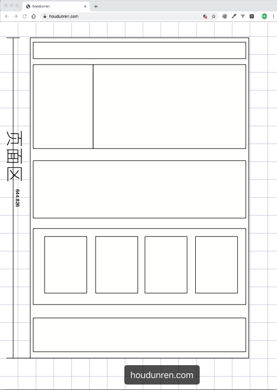

完成页面布局注意以下几点

1. 首先根据设计稿确定页面大小（主要指宽度，移动端不需要考虑），如 1200px 宽度
2. 水平分割页面主要区域
3. 每个区域中按以上两步继续细分

##父容器

一组浮动元素要放在一个父容器中，如下图绿线指父容器，里面的红线为浮动子元素。

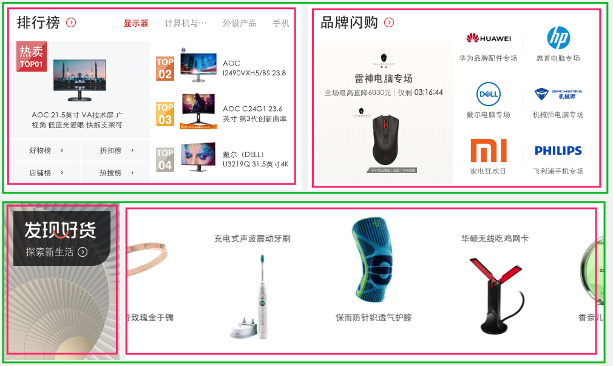

下面是上图的布局结构代码

```css
<style>
	article {
      background: #f3f3f3;
      width: 1020px;
      height: auto;
      overflow: auto;
      padding: 20px;
  }

  article.hot section {
      background: #fff;
      box-shadow: 0 0 5px #777;
      height: 300px;
      width: 500px;
  }

  article.hot section:first-of-type {
      float: left;
  }

  article.hot section:last-of-type {
      float: right;
  }

  article.swiper section {
      height: 200px;
      background: #fff;
      box-shadow: 0 0 5px #777;
  }

  article.swiper section:first-of-type {
      width: 200px;
      float: left;
  }

  article.swiper section:last-of-type {
      width: 820px;
      float: left;
  }
</style>
...

 <article class="hot">
        <section></section>
        <section></section>
</article>
<article class="swiper">
        <section></section>
        <section></section>
</article>
```

## 形状浮动

通过形状浮动可以让内容围绕图片，类似于我们在 word 中的环绕排版。要求图片是有透明度的 PNG 格式。

## 距离控制

| 选项        | 说明       |
| ----------- | ---------- |
| margin-box  | 外边距环绕 |
| padding-box | 内边距环绕 |
| border-box  | 边线环绕   |
| content-box | 内容环绕   |

**外边距环绕**

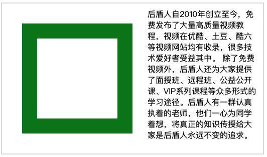

```css
<style>
  span.shape {
      float: left;
      width: 100px;
      height: 100px;
      padding: 30px;
      margin: 30px;
      border: solid 30px green;
      shape-outside: margin-box;
  }
</style>
...


<p>
  <span class="shape"></span>
  后盾人自2010年创立至今，免费发布了大量高质量视频教程，视频在优酷、土豆、酷六等视频网站均有收录，很多技术爱好者受益其中。
  除了免费视频外，后盾人还为大家提供了面授班、远程班、公益公开课、VIP系列课程等众多形式的学习途径。后盾人有一群认真执着的老师，他们一心为同学着想，将真正的知识传授给大家是后盾人永远不变的追求。
</p>
```

**边框环绕**

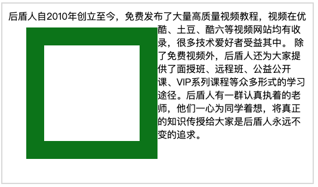

```css
span.shape {
    float: left;
    width: 100px;
    height: 100px;
    padding: 30px;
    margin: 30px;
    border: solid 30px green;
    shape-outside: border-box;
}
```

## 显示区域

| 选项    | 说明   |
| ------- | ------ |
| circle  | 圆形   |
| ellipse | 椭圆   |
| polygon | 多边形 |

**圆形**

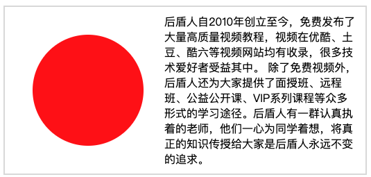

```css
span.shape {
    float: left;
    width: 100px;
    height: 100px;
    padding: 30px;
    margin: 30px;
    background: red;
    clip-path: circle(50% at center);
}
```

**椭圆**


```css
span.shape {
    float: left;
    width: 100px;
    height: 100px;
    padding: 30px;
    margin: 30px;
    background: red;
    clip-path: ellipse(50% 80% at 100% 0);
}
```

**多边形**

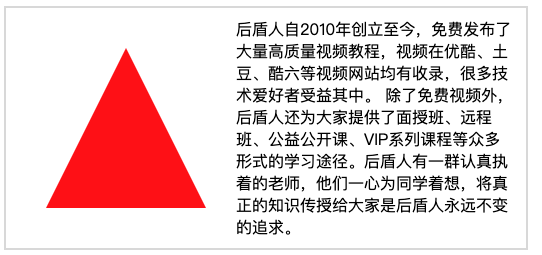

```css
span.shape {
    float: left;
    width: 100px;
    height: 100px;
    padding: 30px;
    margin: 30px;
    background: red;
    clip-path: polygon(50% 0, 100% 100%, 0 100%)
}
```

## 内移距离

使用 `inset` 属性控制环绕向内移动的距离。

```css
span.shape {
    float: left;
    width: 100px;
    height: 100px;
    padding: 30px;
    margin: 30px;
    background: red;
    shape-outside: inset(50px 30px 80px 50px) padding-box;
}
```

## 环绕模式

| 选项    | 说明     |
| ------- | -------- |
| circle  | 圆形环绕 |
| ellipse | 椭圆环绕 |
| url     | 图片环绕 |
| polygan | 多边环绕 |

**圆形环绕**

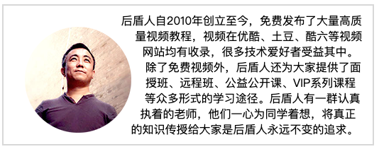

```vdd
img {
    padding: 20px;
    float: left;
    shape-outside: circle(50%) padding-box;
}
```

**椭圆环绕**

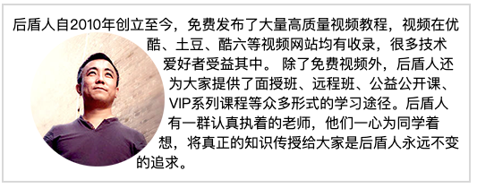

```css
img {
    padding: 20px;
    float: left;
    shape-outside: ellipse(80px 70px) padding-box;
}
```

**图片环绕**

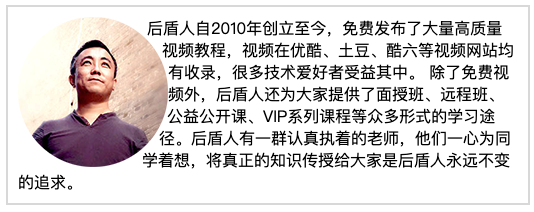

```css
img {
    float: left;
    shape-outside: url(xj.png);
}
```

**多边环绕**

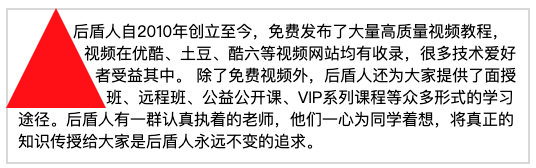

```css
span.shape {
    float: left;
    width: 100px;
    height: 100px;
    background: red;
    clip-path: polygon(50px 0px, 0 100px, 100px 100px);
    shape-outside: polygon(50px 0px, 0 100px, 100px 100px);
}
```