## 拉取MySQL

```bash
docker pull mysql:tag (tag不加默认最新版本) 
```

 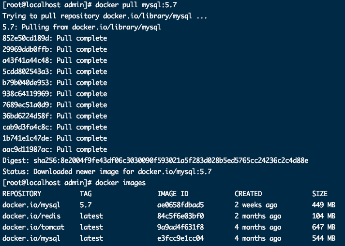

## 运行MySQL服务

```bash
docker run --name mysql -p 3306:3306 -e MYSQL_ROOT_PASSWORD=root -d mysql:latest
```

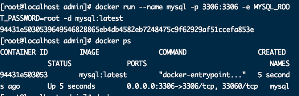

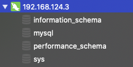


> MySQL服务已启动，但是现在服务和数据文件都保存在容器中，容器被删除后数据将面临丢失的风险。因此数据卷


## 数据卷--配置文件

1. 进入MySQL容器

	```bash
	docker exec -it 容器名称|容器id bash
	```

	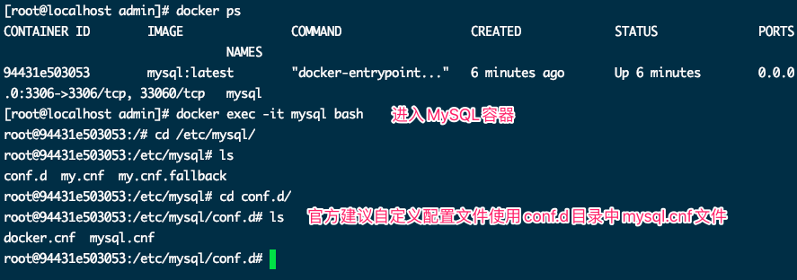


2. 使用数据卷将==容器MySQL配置文件目录/etc/mysql/conf.d==挂载到==本地目录/root/mysql/conf.d==

	```bash
	docker run --name mysql -v /root/mysql/conf.d:/etc/mysql/conf.d -e MYSQL_ROOT_PASSWORD=root -d mysql:tag
	```

	> 在docker命令章节中讲过如果进行数据卷操作必须在创建容器时进行配置。因此重新生成一个容器

3. 删除之前容器

	```bash
	docker rm -f mysql
	```

	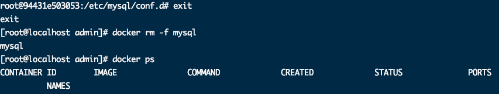

	

	```bash
	docker run --name mysql -v /root/mysql/conf.d:/etc/mysql/conf.d -e MYSQL_ROOT_PASSWORD=root -d mysql:tag
	```

	

	启动报错 ：<font color =ff00aa>mysqld: Can't read dir of '/etc/mysql/conf.d/' (OS errno 13 - Permission denied)</font>

	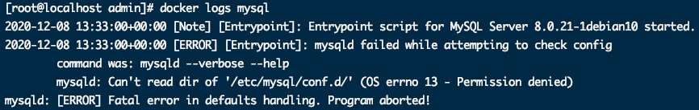

	删除之前容器重新执行命令

	```bash
	docker run --privileged=true --name mysql -v /root/mysql/conf.d:/etc/mysql/conf.d -e MYSQL_ROOT_PASSWORD=root -d mysql:tag
	```

	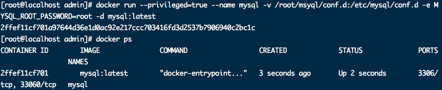

​	

## 数据卷--数据文件

1. 执行命令

	```bash
	docker run --privileged=true --name mysql -v /root/mysql/data:/var/lib/mysql -v /root/mysql/conf.d:/etc/mysql/conf.d -e MYSQL_ROOT_PASSWORD=root -p 3306:3306 -d mysql:tag
	```

	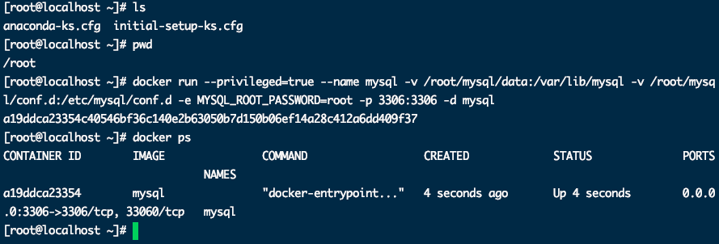

	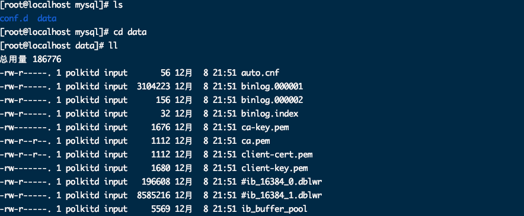


## SpringBoot项目使用Docker中MySQL

1. 进入Docker-MySQL

	```sql
	docker exec -it mysql bash
	```

	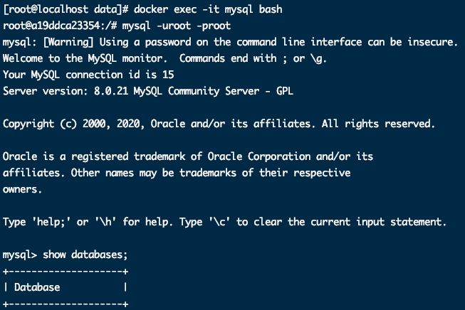


2. 新建数据库

	```sql
	create database dockerDemo;
	```

3. 将user数据表导入到docker-mysql中

	* Spring-boot-demo.sql内容

		```sql
		USE dockerDemo;
		-- ----------------------------
		-- Table structure for users
		-- ----------------------------
		DROP TABLE IF EXISTS `users`;
		CREATE TABLE `users` (
		  `id` int(11) NOT NULL AUTO_INCREMENT COMMENT '用户编号',
		  `username` varchar(64) CHARACTER SET utf8mb4 COLLATE utf8mb4_bin DEFAULT NULL COMMENT '账号',
		  `password` varchar(32) CHARACTER SET utf8mb4 COLLATE utf8mb4_bin DEFAULT NULL COMMENT '密码',
		  `create_time` datetime DEFAULT NULL COMMENT '创建时间',
		  PRIMARY KEY (`id`),
		  UNIQUE KEY `idx_username` (`username`)
		) ENGINE=InnoDB AUTO_INCREMENT=112 DEFAULT CHARSET=utf8mb4 COLLATE=utf8mb4_bin;
		
		-- ----------------------------
		-- Records of users
		-- ----------------------------
		BEGIN;
		INSERT INTO `users` VALUES (111, 'root', '123', '2020-12-08 22:27:07');
		COMMIT;
		
		SET FOREIGN_KEY_CHECKS = 1;
		
		```

		

	* 拷贝主机文件到容器内

		```bash
		docker cp /home/admin/spring-boot-demo.sql mysql:/tmp/spring-boot-demo.sql
		```

	* 进入容器检查是否拷贝成功

		```bash
		docker exec -it mysql bash
		```

		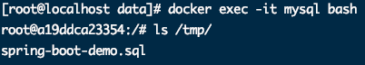

	* 在容器中登录mysql

		```sql
		mysql -uroot -proot
		```

		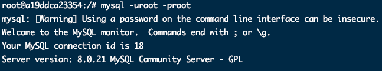

	* 执行source命令

		```sql
		source /tmp/spring-boot-demo.sql
		```

		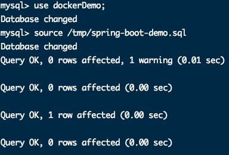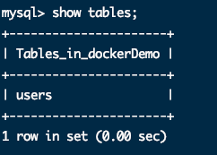


4. 新建SpringBoot-JPA项目 连接 Docker-MySQL

	* 初始化一个SpringBoot-JPA项目

	* yaml文件  `修改服务器IP以及Docker中数据库`

		```yaml
		spring:
		  # datasource 数据源配置内容
		  datasource:
		    url: jdbc:mysql://192.168.124.30:3306/dockerDemo?useSSL=false&useUnicode=true&characterEncoding=UTF-8
		    driver-class-name: com.mysql.jdbc.Driver
		    username: root
		    password: root
		  # JPA 配置内容，对应 JpaProperties 类
		  jpa:
		    show-sql: true # 打印 SQL 。生产环境，建议关闭
		    # Hibernate 配置内容，对应 HibernateProperties 类
		    hibernate:
		      ddl-auto: none
		```

	* 测试类

		```java
		@RunWith(SpringRunner.class)
		@SpringBootTest
		class SpringBootJpaDockerMysqlApplicationTests {
		
		    @Autowired
		    private UserRepository userRepository;
		
		
		    @Test
		    public void testSelectByUsername() {
		        userRepository.findAll().forEach(x -> System.out.println(x.toString()));
		    }
		}
		```

	* 结果

		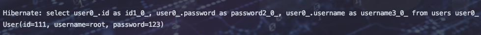

	> 需要springboot-jpa-docker-mysql模块源码的可以到我的gitee上下载
	>
	> 目录：https://gitee.com/gadeGG/ProjectCode.git
	>
	> 具体项目：ProjectCode/SpringBootLearn/SpringBoot-Jpa-Docker-Mysql


## 命令大全

```markdown
# 1.拉取mysql镜像到本地
	docker pull mysql:tag (tag不加默认最新版本)

# 2.运行mysql服务
	docker run --name mysql -e MYSQL_ROOT_PASSWORD=root -d mysql:tag  						  --没有暴露外部端口外部不能连接
	docker run --name mysql -e MYSQL_ROOT_PASSWORD=root -p 3306:3306 -d  mysql:tag  --暴露外部端口

# 3.进入mysql容器
	docker exec -it 容器名称|容器id bash

# 4.外部查看mysql日志
	docker logs 容器名称|容器id

# 5.使用自定义配置参数
	docker run --name mysql -v /root/mysql/conf.d:/etc/mysql/conf.d -e MYSQL_ROOT_PASSWORD=root -d mysql:tag

# 6.将容器数据位置与宿主机位置挂载保证数据安全
	docker run --name mysql -v /root/mysql/data:/var/lib/mysql -v /root/mysql/conf.d:/etc/mysql/conf.d -e MYSQL_ROOT_PASSWORD=root -p 3306:3306 -d mysql:tag

# 7.通过其他客户端访问 如在window系统|macos系统使用客户端工具访问
	
# 8.将mysql数据库备份为sql文件
	docker exec mysql|容器id sh -c 'exec mysqldump --all-databases -uroot -p"$MYSQL_ROOT_PASSWORD"' > /root/all-databases.sql  --导出全部数据
	docker exec mysql sh -c 'exec mysqldump --databases 库表 -uroot -p"$MYSQL_ROOT_PASSWORD"' > /root/all-databases.sql  --导出指定库数据
	docker exec mysql sh -c 'exec mysqldump --no-data --databases 库表 -uroot -p"$MYSQL_ROOT_PASSWORD"' > /root/all-databases.sql  --导出指定库数据不要数据

# 9.执行sql文件到mysql中
	拷贝sql文件到MySQL容器里
	docker cp backup.sql mysql名称:/root/xxx.sql
	docker exec -i mysql sh -c 'exec mysql -uroot -p"$MYSQL_ROOT_PASSWORD"' < /root/xxx.sql
```


## mysqldump命令参数大全

> `mysqldump参数说明:`

```markdown	
# 1.--all-databases  , -A 导出全部数据库。
		mysqldump  -uroot -p --all-databases

# 2.--all-tablespaces  , -Y 导出全部表空间。
		mysqldump  -uroot -p --all-databases --all-tablespaces

# 3.--no-tablespaces  , -y 不导出任何表空间信息。
		mysqldump  -uroot -p --all-databases --no-tablespaces

# 4.--add-drop-database	每个数据库创建之前添加drop数据库语句。
		mysqldump  -uroot -p --all-databases --add-drop-database

# 5.--add-drop-table 每个数据表创建之前添加drop数据表语句。(默认为打开状态，使用--skip-add-drop-table取消选项)
		mysqldump  -uroot -p --all-databases  (默认添加drop语句)
		mysqldump  -uroot -p --all-databases –skip-add-drop-table  (取消drop语句)

# 6.--add-locks	在每个表导出之前增加LOCK TABLES并且之后UNLOCK  TABLE。(默认为打开状态，使用--skip-add-locks取消选项)
		mysqldump  -uroot -p --all-databases  (默认添加LOCK语句)
		mysqldump  -uroot -p --all-databases –skip-add-locks   (取消LOCK语句)

# 7.--allow-keywords 许创建是关键词的列名字。这由表名前缀于每个列名做到。
		mysqldump  -uroot -p --all-databases --allow-keywords

# 8.--apply-slave-statements 'CHANGE MASTER'前添加'STOP SLAVE'，并且在导出的最后添加'START SLAVE'。
		mysqldump  -uroot -p --all-databases --apply-slave-statements

# 9.--character-sets-dir 符集文件的目录
		mysqldump  -uroot -p --all-databases  --character-sets-dir=/usr/local/mysql/share/mysql/charsets

# 10.--comments	附加注释信息。默认为打开，可以用--skip-comments取消
		mysqldump  -uroot -p --all-databases  (默认记录注释)
		mysqldump  -uroot -p --all-databases --skip-comments   (取消注释)

# 11.--compatible导出的数据将和其它数据库或旧版本的MySQL 相兼容。值可以为ansi、mysql323、mysql40、postgresql、oracle、mssql、db2、maxdb、no_key_options、			no_tables_options、no_field_options等，要使用几个值，用逗号将它们隔开。它并不保证能完全兼容，而是尽量兼容。
		mysqldump  -uroot -p --all-databases --compatible=ansi

# 12.--compact导出更少的输出信息(用于调试)。去掉注释和头尾等结构。
		可以使用选项：--skip-add-drop-table  --skip-add-locks --skip-comments --skip-disable-keys
		mysqldump  -uroot -p --all-databases --compact

# 13.--complete-insert,  -c 用完整的insert语句(包含列名称)。这么做能提高插入效率，但是可能会受到max_allowed_packet参数的影响而导致插入失败。
		mysqldump  -uroot -p --all-databases --complete-insert

# 14.--compress, -C 客户端和服务器之间启用压缩传递所有信息
		mysqldump  -uroot -p --all-databases --compress

# 15.--create-options,  -a CREATE TABLE语句中包括所有MySQL特性选项。(默认为打开状态)
		mysqldump  -uroot -p --all-databases

# 16.--databases,  -B 出几个数据库。参数后面所有名字参量都被看作数据库名。
		mysqldump  -uroot -p --databases test mysql

# 17.--debug输出debug信息，用于调试。默认值为：d:t:o,/tmp/mysqldump.trace
    mysqldump  -uroot -p --all-databases --debug
    mysqldump  -uroot -p --all-databases --debug=” d:t:o,/tmp/debug.trace”

# 18.--debug-check 查内存和打开文件使用说明并退出。
		mysqldump  -uroot -p --all-databases --debug-check

# 19.--debug-info 出调试信息并退出
		mysqldump  -uroot -p --all-databases --debug-info

# 20.--default-character-set	设置默认字符集，默认值为utf8
		mysqldump  -uroot -p --all-databases --default-character-set=latin1

# 21.--delayed-insert 用延时插入方式（INSERT DELAYED）导出数据
		mysqldump  -uroot -p --all-databases --delayed-insert

# 22.--delete-master-logs	master备份后删除日志. 这个参数将自动激活--master-data。
		mysqldump  -uroot -p --all-databases --delete-master-logs

# 23.--dump-slave	该选项将导致主的binlog位置和文件名追加到导出数据的文件中。设置为1时，将会以CHANGE MASTER命令输出到数据文件；设置为2时，在命令前增加说明信息。该选			项将会打开--lock-all-tables，除非--single-transaction被指定。该选项会自动关闭--lock-tables选项。默认值为0。
	mysqldump  -uroot -p --all-databases --dump-slave=1
	mysqldump  -uroot -p --all-databases --dump-slave=2

# 24.--events, -E  导出事件。
	mysqldump  -uroot -p --all-databases --events

# 25.--extended-insert,  -e使用具有多个VALUES列的INSERT语法。这样使导出文件更小，并加速导入时的速度。默认为打开状态，使用--skip-extended-insert取消选项。	
		mysqldump  -uroot -p --all-databases
		mysqldump  -uroot -p --all-databases--skip-extended-insert   (取消选项)

# 26.--fields-terminated-by 导出文件中忽略给定字段。与--tab选项一起使用，不能用于--databases和--all-databases选项
		mysqldump  -uroot -p test test --tab=”/home/mysql” --fields-terminated-by=”#”

# 27.--fields-enclosed-by 输出文件中的各个字段用给定字符包裹。与--tab选项一起使用，不能用于--databases和--all-databases选项
		mysqldump  -uroot -p test test --tab=”/home/mysql” --fields-enclosed-by=”#”

# 28.--fields-optionally-enclosed-by 输出文件中的各个字段用给定字符选择性包裹。与--tab选项一起使用，不能用于--databases和--all-databases选项
	mysqldump  -uroot -p test test --tab=”/home/mysql”  --fields-enclosed-by=”#” --fields-optionally-enclosed-by  =”#”

# 29.--fields-escaped-by 输出文件中的各个字段忽略给定字符。与--tab选项一起使用，不能用于--databases和--all-databases选项
	mysqldump  -uroot -p mysql user --tab=”/home/mysql” --fields-escaped-by=”#”

# 30.--flush-logs 开始导出之前刷新日志。
	请注意：假如一次导出多个数据库(使用选项--databases或者--all-databases)，将会逐个数据库刷新日志。除使用--lock-all-tables或者--master-data外。在这种情况下，日志将会被刷新一次，相应的所以表同时被锁定。因此，如果打算同时导出和刷新日志应该使用--lock-all-tables 或者--master-data 和--flush-logs。
	mysqldump  -uroot -p --all-databases --flush-logs

# 31.--flush-privileges	在导出mysql数据库之后，发出一条FLUSH  PRIVILEGES 语句。为了正确恢复，该选项应该用于导出mysql数据库和依赖mysql数据库数据的任何时候。
	mysqldump  -uroot -p --all-databases --flush-privileges

# 32.--force 在导出过程中忽略出现的SQL错误。
	mysqldump  -uroot -p --all-databases --force

# 33.--help 显示帮助信息并退出。
	mysqldump  --help

# 34.--hex-blob 使用十六进制格式导出二进制字符串字段。如果有二进制数据就必须使用该选项。影响到的字段类型有BINARY、VARBINARY、BLOB。
	mysqldump  -uroot -p --all-databases --hex-blob

# 35.--host, -h 需要导出的主机信息
	mysqldump  -uroot -p --host=localhost --all-databases

# 36.--ignore-table 不导出指定表。指定忽略多个表时，需要重复多次，每次一个表。每个表必须同时指定数据库和表名。例如：--ignore-table=database.table1 --ignore-				table=database.table2 ……
	mysqldump  -uroot -p --host=localhost --all-databases --ignore-table=mysql.user

# 37.--include-master-host-port 在--dump-slave产生的'CHANGE  MASTER TO..`语句中增加'MASTER_HOST=<host>，MASTER_PORT=<port>`
	mysqldump  -uroot -p --host=localhost --all-databases --include-master-host-port

# 38.--insert-ignore 在插入行时使用INSERT IGNORE语句.
	mysqldump  -uroot -p --host=localhost --all-databases --insert-ignore

# 39.lines-terminated-by 输出文件的每行用给定字符串划分。与--tab选项一起使用，不能用于--databases和--all-databases选项。	
	mysqldump  -uroot -p --host=localhost test test --tab=”/tmp/mysql”  --lines-terminated-by=”##”

# 40.--lock-all-tables,  -x 提交请求锁定所有数据库中的所有表，以保证数据的一致性。这是一个全局读锁，并且自动关闭--single-transaction 和--lock-tables 选项。
	mysqldump  -uroot -p --host=localhost --all-databases --lock-all-tables

# 41.--lock-tables,  -l
	开始导出前，锁定所有表。用READ  LOCAL锁定表以允许MyISAM表并行插入。对于支持事务的表例如InnoDB和BDB，--single-transaction是一个更好的选择，因为它根本不需要锁定表。
		请注意当导出多个数据库时，--lock-tables分别为每个数据库锁定表。因此，该选项不能保证导出文件中的表在数据库之间的逻辑一致性。不同数据库表的导出状态可以完全不同。
		mysqldump  -uroot -p --host=localhost --all-databases --lock-tables

# 42.--log-error 附加警告和错误信息到给定文件
	mysqldump  -uroot -p --host=localhost --all-databases  --log-error=/tmp/mysqldump_error_log.err

# 43.--master-data 该选项将binlog的位置和文件名追加到输出文件中。如果为1，将会输出CHANGE MASTER 命令；如果为2，输出的CHANGE  MASTER命令前添加注释信息。该选项将				打开--lock-all-tables 选项，除非--single-transaction也被指定（在这种情况下，全局读锁在开始导出时获得很短的时间；其他内容参考下面的--single-transaction选			项）。该选项自动关闭--lock-tables选项。
	mysqldump  -uroot -p --host=localhost --all-databases --master-data=1;
	mysqldump  -uroot -p --host=localhost --all-databases --master-data=2;

# 44.--max_allowed_packet 服务器发送和接受的最大包长度。
	mysqldump  -uroot -p --host=localhost --all-databases --max_allowed_packet=10240

# 45.--net_buffer_length TCP/IP和socket连接的缓存大小。
	mysqldump  -uroot -p --host=localhost --all-databases --net_buffer_length=1024

# 46.--no-autocommit 使用autocommit/commit 语句包裹表。
	mysqldump  -uroot -p --host=localhost --all-databases --no-autocommit

# 47.--no-create-db,  -n 只导出数据，而不添加CREATE DATABASE 语句。
	mysqldump  -uroot -p --host=localhost --all-databases --no-create-db

# 48.--no-create-info,  -t 只导出数据，而不添加CREATE TABLE 语句。
	mysqldump  -uroot -p --host=localhost --all-databases --no-create-info

# 49.--no-data, -d 不导出任何数据，只导出数据库表结构。
	mysqldump  -uroot -p --host=localhost --all-databases --no-data

# 50.--no-set-names,  -N 等同于--skip-set-charset
	mysqldump  -uroot -p --host=localhost --all-databases --no-set-names

# 51.--opt 等同于--add-drop-table,  --add-locks, --create-options, --quick, --extended-insert, --lock-tables,  --set-charset, --disable-keys   			该选项默认开启,  可以用--skip-opt禁用.
	mysqldump  -uroot -p --host=localhost --all-databases --opt

# 52.--order-by-primary 如果存在主键，或者第一个唯一键，对每个表的记录进行排序。在导出MyISAM表到InnoDB表时有效，但会使得导出工作花费很长时间。 
	mysqldump  -uroot -p --host=localhost --all-databases --order-by-primary

# 53.--password, -p 连接数据库密码

# 54.--pipe(windows系统可用) 使用命名管道连接mysql
	mysqldump  -uroot -p --host=localhost --all-databases --pipe

# 45.--port, -P 连接数据库端口号

# 56.--protocol 使用的连接协议，包括：tcp, socket, pipe, memory.
	mysqldump  -uroot -p --host=localhost --all-databases --protocol=tcp

# 57.--quick, -q 不缓冲查询，直接导出到标准输出。默认为打开状态，使用--skip-quick取消该选项。
	mysqldump  -uroot -p --host=localhost --all-databases 
	mysqldump  -uroot -p --host=localhost --all-databases --skip-quick

# 58.--quote-names,-Q 使用（`）引起表和列名。默认为打开状态，使用--skip-quote-names取消该选项。
	mysqldump  -uroot -p --host=localhost --all-databases
	mysqldump  -uroot -p --host=localhost --all-databases --skip-quote-names

# 42.--replace	使用REPLACE INTO 取代INSERT INTO.
	mysqldump  -uroot -p --host=localhost --all-databases --replace

# 43.--result-file,  -r 直接输出到指定文件中。该选项应该用在使用回车换行对（\\r\\n）换行的系统上（例如：DOS，Windows）。该选项确保只有一行被使用。
	mysqldump  -uroot -p --host=localhost --all-databases --result-file=/tmp/mysqldump_result_file.txt

# 44.--routines, -R 导出存储过程以及自定义函数。
	mysqldump  -uroot -p --host=localhost --all-databases --routines

# 45.--set-charset 添加'SET NAMES  default_character_set'到输出文件。默认为打开状态，使用--skip-set-charset关闭选项。
	mysqldump  -uroot -p --host=localhost --all-databases 
	mysqldump  -uroot -p --host=localhost --all-databases --skip-set-charset

# 46.--single-transaction 该选项在导出数据之前提交一个BEGIN SQL语句，BEGIN 不会阻塞任何应用程序且能保证导出时数据库的一致性状态。它只适用于多版本存储引擎，仅						InnoDB。本选项和--lock-tables 选项是互斥的，因为LOCK  TABLES 会使任何挂起的事务隐含提交。要想导出大表的话，应结合使用--quick 选项。
	mysqldump  -uroot -p --host=localhost --all-databases --single-transaction

# 47.--dump-date 将导出时间添加到输出文件中。默认为打开状态，使用--skip-dump-date关闭选项。
	mysqldump  -uroot -p --host=localhost --all-databases
	mysqldump  -uroot -p --host=localhost --all-databases --skip-dump-date

# 48.--skip-opt 禁用–opt选项.
	mysqldump  -uroot -p --host=localhost --all-databases --skip-opt

# 49.--socket,-S 指定连接mysql的socket文件位置，默认路径/tmp/mysql.sock
	mysqldump  -uroot -p --host=localhost --all-databases --socket=/tmp/mysqld.sock

# 50.--tab,-T 为每个表在给定路径创建tab分割的文本文件。注意：仅仅用于mysqldump和mysqld服务器运行在相同机器上。
	mysqldump  -uroot -p --host=localhost test test --tab="/home/mysql"

# 51.--tables 覆盖--databases (-B)参数，指定需要导出的表名。
	mysqldump  -uroot -p --host=localhost --databases test --tables test

# 52.--triggers 导出触发器。该选项默认启用，用--skip-triggers禁用它。
	mysqldump  -uroot -p --host=localhost --all-databases --triggers

# 53.--tz-utc 在导出顶部设置时区TIME_ZONE='+00:00' ，以保证在不同时区导出的TIMESTAMP 数据或者数据被移动其他时区时的正确性。
	mysqldump  -uroot -p --host=localhost --all-databases --tz-utc

# 54.--user, -u 指定连接的用户名。

# 55.--verbose, --v 输出多种平台信息。

# 56.--version, -V 输出mysqldump版本信息并退出

# 57.--where, -w 只转储给定的WHERE条件选择的记录。请注意如果条件包含命令解释符专用空格或字符，一定要将条件引用起来。
	mysqldump  -uroot -p --host=localhost --all-databases --where=” user=’root’”

# 58.--xml, -X 导出XML格式.
	mysqldump  -uroot -p --host=localhost --all-databases --xml

# 59.--plugin_dir 客户端插件的目录，用于兼容不同的插件版本。
	mysqldump  -uroot -p --host=localhost --all-databases --plugin_dir=”/usr/local/lib/plugin”

# 60.--default_auth 客户端插件默认使用权限。
	mysqldump  -uroot -p --host=localhost --all-databases --default-auth=”/usr/local/lib/plugin/<PLUGIN>”
```


