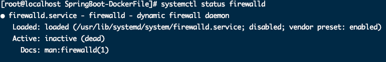

1. Dockerfile制作SpringBoot镜像启动报错

	> Caused by: java.net.NoRouteToHostException: No route to host (Host unreachable)

	`原因：`防火墙未关

	* 关闭防火墙

		```bash
		systemctl status firewalld   --查看防火墙状态
		systemctl disable firewalld  --永久关闭防火墙
		systemctl stop firewalld     --暂时关闭防火墙
		systemctl enable firewalld   --重启防火墙 
		```

		​	

	* 启动任然提示

		> /usr/bin/docker-current: Error response from daemon: driver failed programming external connectivity on endpoint springboot-mysql (1501f60334c385cc7a70181ba2b191529509acaf77e2c1e18049764b9f5d3e2b):  (iptables failed: iptables --wait -t nat -A D

	* 删除docker网桥，重启

		```bash
			[root@seichung ] pkill docker                        # 终止进程
			[root@seichung ] iptables -t nat -F                  # 清空 nat 表的所有链
			[root@seichung ] ifconfig docker0 down               # 停止 docker 默认网桥
			[root@seichung ] yum install bridge-utils -y         # 部分机器是无法使用 brctl，所以需要提前安装
			[root@seichung ] brctl delbr docker0                 # 删除网桥  
			[root@seichung ] systemctl restart docker            # 重启docker
		```


​		

