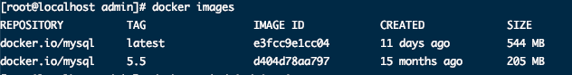
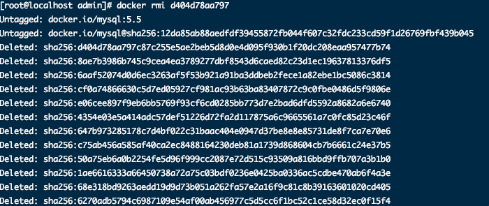
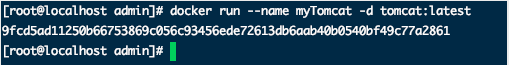
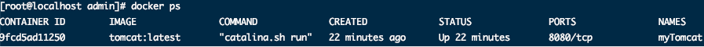
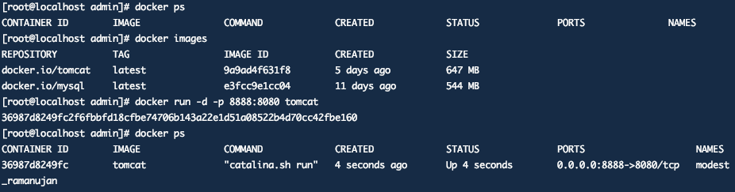
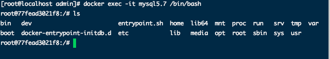
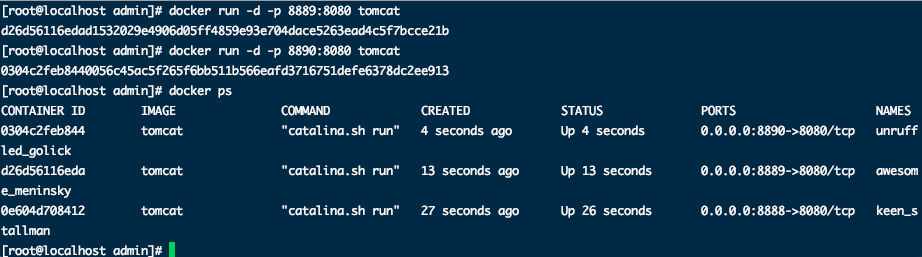

# Docker命令


> 文档在桌面》程序羊 》安装手册.pdf  以及 springboot核心技术.pdf


1. 安装docker

	   ```bash
	yum install -y docker
	```


2. 镜像加速

	进入 阿里云》镜像服务 》 镜像加速器

	

​	


3. 重启docker

	```bash
	systemctl restart docker
	systemctl start docker.service
	```

	


## 镜像操作


1. 检索镜像

	```bash
	docker search 关键字 
	```

	> eg：docker search redis  我们经常去docker hub上检索镜像的详细信息，如镜像的TAG。

2. 查看已安装镜像

	```bash
	docker images   必须是sudo环境，否则看不到
	```

		

3.  安装镜像

	```bash
	docker pull name ： 安装镜像 例如 docker pull mysql   
	docker pull name:5.5 下载指定镜像版本(也叫标签)
	```

4. 删除指定的本地镜像

	```bash
	docker rmi image-id
	```

	


## 容器操作

1. 运行镜像 

	```bash
	docker run ‐‐name mytomcat ‐d tomcat:latest   
	```

	- -name ：起别名。区分多实例

	* -d     : 后台启动

	* ：	    : 启动指定版本

	

2. 查看运行中的容器 

	```bash
	docker ps
	```

	


3. 停止运行中的容器  :  docker stop 容器的id


4. 查看所有的容器  :  docker ps ‐a


5. 启动容器    docker start 容器id


6. 删除一个容器   docker rm 容器id


7. 启动一个做了端口映射的tomcat  docker run ‐d ‐p 8888:8080 tomcat


​		‐d：后台运行

​		‐p: 将主机的端口映射到容器的一个端口 主机端口:容器内部的端口

​		-v: 目录挂载 将主机目录挂载到容器内部文件目录

​		-e: 修改参数


​	查看容器的日志   docker logs container‐name/container‐id




​	为了演示简单关闭了linux的防火墙

​		service firewalld status ；查看防火墙状态

​		service firewalld stop：关闭防火墙


​	进入容器(交互模式)：

​		docker exec -it 容器ID

​		eg: docker exec -it mysql5.7 /bin/bash

​			




更多命令参看

https://docs.docker.com/engine/reference/commandline/docker/ 可以参考每一个镜像的文档


​	启动多实例

​		


Tips：

​	

1. 容器中启动的服务如果外界想要访问需要进行映射。因为docker有沙箱机制。


启动MySQL实例

​	docker run -p 3306:3306 —name mysql \

​	-v /mydata/mysql/log:/var/log/mysql \

​	-v /mydata/mysqldata:/var/lib/mysql \

​	-v /mydata/mysql/conf:/etc/mysql \

​	-e /MYSQL_ROOT_PASSWORD=root \

​	-d mysql:5.7


物理机下mydata/mysqldata  mydata/mysql/conf   mydata/mysql/log  端口号为第一个3306


## 启动mysql

 sudo docker run -p 3306:3306 --name mysql \

 -v /mydata/mysql/log:/var/log/mysql \

 -v /mydata/mysql/data:/var/lib/mysql \

 -v /mydata/mysql/conf:/etc/mysql \

 -e MYSQL_ROOT_PASSWORD=root \

 -d mysql:5.7

##  

 **[root@hadoop-104 conf]**# pwd

 /mydata/mysql/conf

 

 

 **[root@hadoop-104 conf]**# cat my.cnf

 **[client]**

 default-character-set=utf8

 **[mysql]**

 default-character-set=utf8

 **[mysqld]**

 init_connect='SET collation_connection = utf8_unicode_ci'

 init_connect='SET NAMES utf8'

 character-set-server=utf8

 collation-server=utf8_unicode_ci

 skip-character-set-client-handshake

 skip-name-resolve

 **[root@hadoop-104 conf]**# 

 

 **[root@hadoop-104 conf]**# docker restart mysql

 mysql

 **[root@hadoop-104 conf]**# 

 

##  

 [root@hadoop-104 conf]# docker exec -it mysql /bin/bash

 root@b3a74e031bd7:/# whereis mysql

 mysql: /usr/bin/mysql /usr/lib/mysql /etc/mysql /usr/share/mysql

 

 root@b3a74e031bd7:/# ls /etc/mysql 

 my.cnf

 root@b3a74e031bd7:/# cat /etc/mysql/my.cnf 

 [client]

 default-character-set=utf8

 [mysql]

 default-character-set=utf8

 [mysqld]

 init_connect='SET collation_connection = utf8_unicode_ci'

 init_connect='SET NAMES utf8'

 character-set-server=utf8

 collation-server=utf8_unicode_ci

 skip-character-set-client-handshake

 skip-name-resolve

 root@b3a74e031bd7:/# 

##  

 [root@hadoop-104 ~]# docker update mysql --restart=always

 mysql

 [root@hadoop-104 ~]# 

