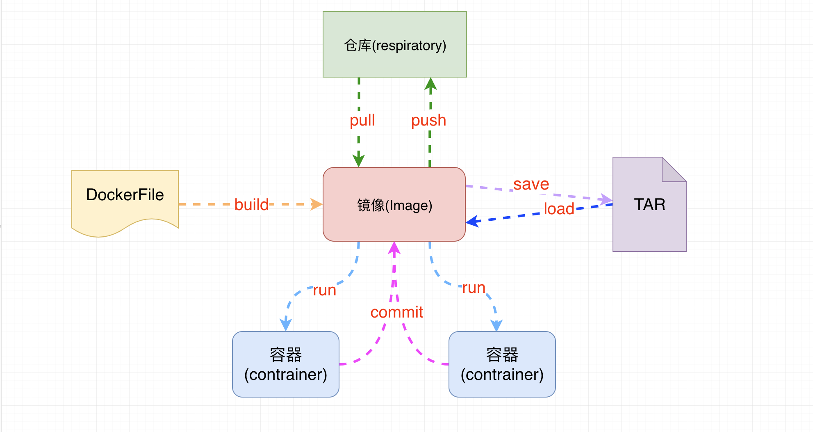

# Docker简介

## 什么是虚拟化

​	在计算机中，虚拟化（英语：Virtualization）是一种资源管理技术，是将计算机的各种实体资源，如服务器、网络、内存及存储等，予以抽象、转换后呈现出来，打破实体结构间的不可切割的障碍，使用户可以比原本的组态更好的方式来应用这些资源。这些资源的新虚拟部份是不受现有资源的架设方式，地域或物理组态所限制。一般所指的虚拟化资源包括计算能力和资料存储。

​	在实际的生产环境中，虚拟化技术主要用来解决高性能的物理硬件产能过剩和老的旧的硬件产能过低的重组重用，透明化底层物理硬件，从而最大化的利用物理硬件   对资源充分利用

​	虚拟化技术种类很多，例如：软件虚拟化、硬件虚拟化、内存虚拟化、网络虚拟化(vip)、桌面虚拟化、服务虚拟化、虚拟机等等。

## 什么是Docker

​	Docker 是一个开源项目，诞生于 2013 年初，最初是 dotCloud 公司内部的一个业余项目。它基于 Google 公司推出的 Go 语言实现。 项目后来加入了 Linux 基金会，遵从了 Apache 2.0 协议，项目代码在 [GitHub](https://github.com/docker/docker) 上进行维护。

​	

​	Docker 自开源后受到广泛的关注和讨论，以至于 dotCloud 公司后来都改名为 Docker Inc。Redhat 已经在其 RHEL6.5 中集中支持 Docker；Google 也在其 PaaS 产品中广泛应用。

​	Docker 项目的目标是实现轻量级的操作系统虚拟化解决方案。 Docker 的基础是 Linux 容器（LXC）等技术。

​	在 LXC 的基础上 Docker 进行了进一步的封装，让用户不需要去关心容器的管理，使得操作更为简便。用户操作 Docker 的容器就像操作一个快速轻量级的虚拟机一样简单。

## 为什么选择Docker?

（1）上手快。

​	用户只需要几分钟，就可以把自己的程序“Docker化”。Docker依赖于“写时复制”（copy-on-write）模型，使修改应用程序也非常迅速，可以说达到“随心所致，代码即改”的境界。	

         随后，就可以创建容器来运行应用程序了。大多数Docker容器只需要不到1秒中即可启动。由于去除了管理程序的开销，Docker容器拥有很高的性能，同时同一台宿主机中也可以运行更多的容器，使用户尽可能的充分利用系统资源。

（2）职责的逻辑分类

​	使用Docker，开发人员只需要关心容器中运行的应用程序，而运维人员只需要关心如何管理容器。Docker设计的目的就是要加强开发人员写代码的开发环境与应用程序要部署的生产环境一致性。从而降低那种“开发时一切正常，肯定是运维的问题（测试环境都是正常的，上线后出了问题就归结为肯定是运维的问题）”

（3）快速高效的开发生命周期

​	Docker的目标之一就是缩短代码从开发、测试到部署、上线运行的周期，让你的应用程序具备可移植性，易于构建，并易于协作。（通俗一点说，Docker就像一个盒子，里面可以装很多物件，如果需要这些物件的可以直接将该大盒子拿走，而不需要从该盒子中一件件的取。）

（4）鼓励使用面向服务的架构

​	Docker还鼓励面向服务的体系结构和微服务架构。Docker推荐单个容器只运行一个应用程序或进程，这样就形成了一个分布式的应用程序模型，在这种模型下，应用程序或者服务都可以表示为一系列内部互联的容器，从而使分布式部署应用程序，扩展或调试应用程序都变得非常简单，同时也提高了程序的内省性。（当然，可以在一个容器中运行多个应用程序）

## 容器与虚拟机比较

> 关于Docker与虚拟机的区别，我在网上找到的一张图，非常直观形象地展示出来，话不多说，直接上图。

`比较上面两张图，我们发现虚拟机是携带操作系统，本身很小的应用程序却因为携带了操作系统而变得非常大，很笨重`。Docker是不携带操作系统的，所以Docker的应用就非常的轻巧。另外在调用宿主机的CPU、磁盘等等这些资源的时候，拿内存举例，虚拟机是利用Hypervisor去虚拟化内存，整个调用过程是虚拟内存->虚拟物理内存->真正物理内存，但是Docker是利用Docker Engine去调用宿主的的资源，这时候过程是虚拟内存->真正物理内存。

|             | 传统虚拟机                           | Docker容器                            |
| ----------- | ------------------------------------ | ------------------------------------- |
| 磁盘占用    | 几个GB到几十个GB左右                 | 几十MB到几百MB左右                    |
| CPU内存占用 | 虚拟操作系统非常占用CPU和内存        | Docker引擎占用极低                    |
| 启动速度    | （从开机到运行项目）几分钟           | （从开启容器到运行项目）几秒          |
| 安装管理    | 需要专门的运维技术                   | 安装、管理方便                        |
| 应用部署    | 每次部署都费时费力                   | 从第二次部署开始轻松简捷              |
| 耦合性      | 多个应用服务安装到一起，容易互相影响 | 每个应用服务一个容器，达成隔离        |
| 系统依赖    | 无                                   | 需求相同或相似的内核，目前推荐是Linux |

## Docker 组件

### Docker服务器与客户端

​	Docker是一个客户端-服务器（C/S）架构程序。Docker客户端只需要向Docker服务器或者守护进程发出请求，服务器或者守护进程将完成所有工作并返回结果。Docker提供了一个命令行工具Docker以及一整套RESTful API。你可以在同一台宿主机上运行Docker守护进程和客户端，也可以从本地的Docker客户端连接到运行在另一台宿主机上的远程Docker守护进程。

## Docker 的核心

- `镜像:` 一个镜像代表一个应用环境,他是一个只读的文件,如 mysql镜像,tomcat镜像,nginx镜像等
- `容器:` 镜像每次运行之后就是产生一个容器,就是正在运行的镜像,特点就是可读可写
- `仓库:`用来存放镜像的位置,类似于maven仓库,也是镜像下载和上传的位置
- `dockerFile:`docker生成镜像配置文件,用来书写自定义镜像的一些配置
- `tar:`一个对镜像打包的文件,日后可以还原成镜像

### docker 运行流程

### Registry（注册中心）

​	Docker用Registry来保存用户构建的镜像。Registry分为公共和私有两种。Docker公司运营公共的Registry叫做Docker Hub。用户可以在Docker Hub注册账号，分享并保存自己的镜像（说明：在Docker Hub下载镜像巨慢，可以自己构建私有的Registry）。

​	https://hub.docker.com/