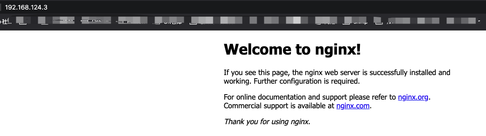
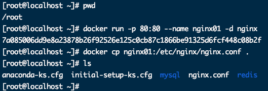
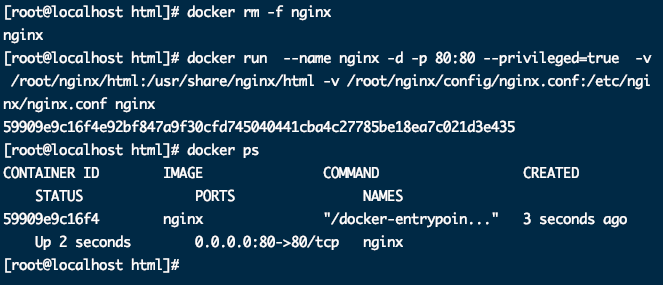
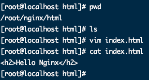

## 拉取Nginx

```bash
docker pull nginx
```


## 运行Nginx容器

```bash
docker run -p 80:80 --name nginx01 -d nginx
```





## 数据卷-配置文件/数据

* 将容器中nginx配置文件拷贝到宿主机

	```bash
	docker cp nginx01:/etc/nginx/nginx.conf .
	```

	

	

* 按原有模式在root根目录下新建nginx/config存放配置文件

	```bash
	mv nginx.conf nginx/config/
	```

* 重新挂载

	```bash
	docker run  --name nginx -d -p 80:80 --privileged=true  -v /root/nginx/html:/usr/share/nginx/html -v /root/nginx/config/nginx.conf:/etc/nginx/nginx.conf nginx
	
	```

	

* 宿主机放入修改HTML页面

	

	

