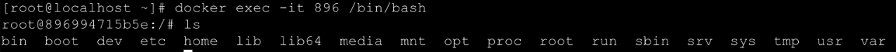
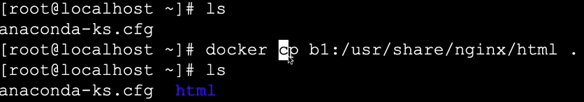
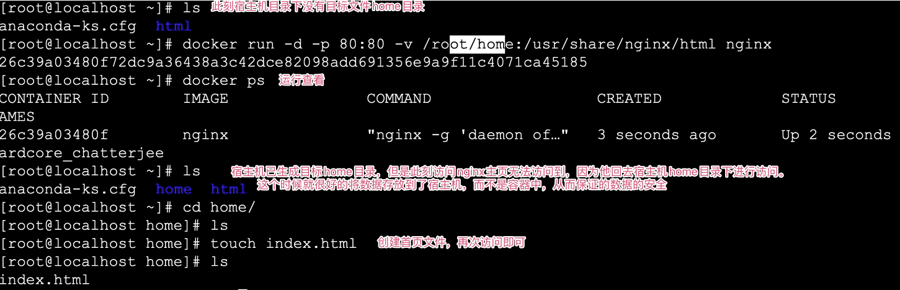

# Docker命令

## 关掉防火墙

```markdown
 systemctl status firewalld   --查看防火墙状态
 systemctl disable firewalld  --永久关闭防火墙
 systemctl stop firewalld     --暂时关闭防火墙
 systemctl enable firewalld   --重启防火墙 
```


## 辅助命令

~~~markdown
# 1.安装完成辅助命令

		docker version	--------------------------	查看docker的信息
		docker info		--------------------------	查看更详细的信息
		docker --help	--------------------------	帮助命令
~~~

## Images镜像操作

> \+ 文件和元数据的集合
>
> \+ 镜像是分层的
>
> \+ 不同的image可以共享相同的层
>
> \+ 镜像本身是只读的

~~~markdown
# 1.查看本机中所有镜像
	docker images	--------------------------	列出本地所有镜像
		-a			   列出所有镜像（包含中间映像层）
  	-q			   只显示镜像id
  	-digests   显示摘要信息
    -no-trunc  不截断输出，显示完整的镜像ID

# 2.搜索镜像
	docker search [options] 镜像名	-------------------	去dockerhub上查询当前镜像
		-s 指定值		列出收藏数不少于指定值的镜像
  	--no-trunc	  显示完整的镜像信息

# 3.从仓库下载镜像
	docker pull 镜像名[:TAG|@DIGEST]
	docker pull 镜像name      安装最新版镜像 
	docker pull 镜像name:5.5  下载指定镜像版本(也叫标签)

# 4.删除镜像
	docker rmi 镜像名	--------------------------  删除镜像
		-f		强制删除
	删除单个镜像
		docker rmi 镜像id/镜像名称
	删除多个镜像
		docker rmi id1 id2
	删除全部镜像
		docker rmi `docker images -qa`


~~~

## 容器操作

### 基本命令(容器外操作)

~~~markdown
# 1.运行容器
	docker run 镜像名	--------------------------	镜像名新建并启动容器
    --name 					起别名。区分多实例
  	-d     					后台启动
  	-：	  				 启动指定版本
  	-i      				交换方式运行
  	-t      				伪终端
  	-p    				 	映射端口号：原始端口号		 指定端口号启动
  	-P     					随机端口映射

	例：docker run -it --name myTomcat -p 8888:8080 tomcat
   	 docker run -d --name myTomcat -P tomcat

# 2.查看运行的容器
	docker ps					--------------------------	列出所有正在运行的容器
	-a			正在运行的和历史运行过的容器
	-q			静默模式，只显示容器编号
	-l			显示最近创建的容器
	-n			显示最近创建的n个容器


# 3.停止|关闭|重启容器
	docker start   容器名字或者容器id  --------------- 开启容器
	docker restart 容器名或者容器id    --------------- 重启容器
	docker stop  容器名或者容器id 	    ------------------ 正常停止容器运行
	docker kill  容器名或者容器id      ------------------ 立即停止容器运行

# 4.删除容器
	docker rm -f 容器id和容器名     
	docker rm -f $(docker ps -aq)		--------------------------	删除所有容器
	docker kill 容器id/名称		--------------------------	强制停止容器

# 5.查看容器内进程
	docker top 容器id或者容器名 ------------------ 查看容器内的进程

# 6.查看查看容器内部细节
	docker inspect 容器id 		------------------ 查看容器内部细节：详细信息

# 7.查看容器的运行日志
	docker logs [OPTIONS] 容器id或容器名	------------------ 查看容器日志
    -t			 加入时间戳
    -f			 跟随最新的日志打印
    --tail 	 数字	显示最后多少条

# 8. 容器 <->拷贝文件<->主机
	docker cp [OPTIONS] CONTAINER:SRC_PATH DEST_PATH
	docker cp [OPTIONS] SRC_PATH CONTAINER:DEST_PATH
	
	eg:docker cp c314:/usr/local/tomcat/webapps.dist/ /root/tomcat/webapps
~~~

#### 6.3.2 进阶命令(容器内数据交互)

centos ----> docker(引擎) ---->  mynginx(容器) 

~~~markdown
# 1.进入容器内部
	docker exec [options] 容器id 容器内命令 ------------------ 进入容器执行命令
		-i		以交互模式运行容器，通常与-t一起使用
    -t		分配一个伪终端    临时shell窗口   /bin/bash 
    eg docker exec -it 896 /bin/bash

# 2.容器内安装软件
	apt-get update
	apt-get install 安装包名称

# 3.修改容器内文件
	没有装任何的依赖，需要进行install

# 4.退出容器
	exit		退出容器

# 5.将容器打包为新的镜像
	docker commit -a="作者" -m="描述信息" 容器ID 目标镜像名称:TAG   # 打包之前必须将镜像关闭

# 6.从容器中复制文件到宿主机目录中
	docker cp 容器id:容器内资源路径 宿主机目录路径  -----------------   将容器内资源拷贝到主机上

# 7.设置容器和宿主机共享目录  数据卷：将容器中目录和宿主机目录实时主从复制。可以保证数据的安全
		docker run -it -v /宿主机的路径:/容器内的路径:ro(只读) 镜像名   # 可以执行很多次。日志、数据等等
			注意: 宿主机路径必须是绝对路径,宿主机目录会覆盖容器内目录内容	
		运行 docker inspect 容器id 命令 检查json串里有没有以下内容，如果有则证明卷挂载成功。
		"Mounts": [
            {
                "Type": "bind",
                "Source": "/hostDataValueme",  # 原始目录
                "Destination": "/containerDataValueme",   #目标目录，如果有这两个目录则挂载成功
                "Mode": "",
                "RW": true,
                "Propagation": "rprivate"
            }
        ]

# 8.打包镜像
		docker save 镜像名 -o  名称.tar     # 镜像名最好使用名称，如果使用id打包则会导致载入后描述和tag为空
# 9.载入镜像
		docker load -i   名称.tar
~~~

> 容器中启动的服务如果外界想要访问需要进行映射。因为docker有沙箱机制。







## 更多命令参看

https://docs.docker.com/engine/reference/commandline/docker/ 可以参考每一个镜像的文档
