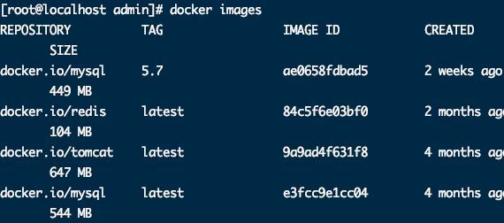
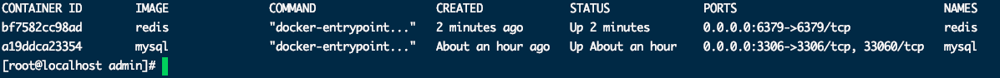
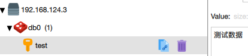
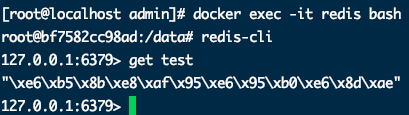
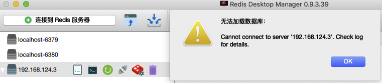
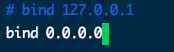
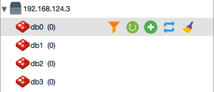
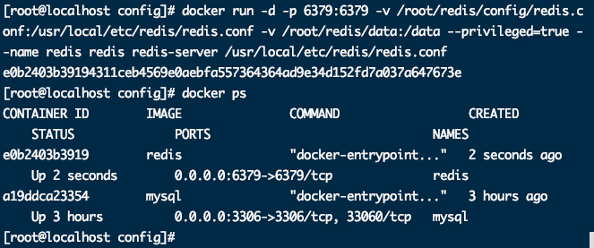
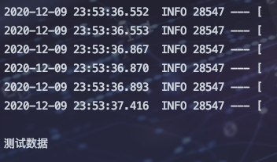

## 拉取Redis

```bash
docker pull redis
```




## 运行Redis

```bash
docker run --name redis -p 6379:6379 -d redis
```




## 外部进行连接访问




## 进入容器内部查看redis数据

```bash
docker exec -it redis bash
redis-cli
```




## 数据卷--配置文件

* 下载Redis压缩包

	> 下载压缩包提取配置文件，或者从其他地方导入配置文件

	```bash
	wget http://download.redis.io/releases/redis-6.0.8.tar.gz  # 注意和自己redis版本最好一致
	tar -zxvf redis-6.0.8.tar.gz  # 解压缩
	cd redis-6.0.8
	cp redis.conf /root/redis/conf 
	```

* 配置文件映射

	```bash
	docker run --privileged=true --name redis -v /root/redis/config:/usr/local/etc/redis -p 6379:6379 -d redis redis-server /usr/local/etc/redis/redis.conf
	```

* 外部链接

	提示错误：

	


* 修改配置文件 修改bind

	```bash
	docker stop redis
	vim /root/redis/config/redis.conf   # 修改绑定地址为0.0.0.0  #redis持久化 appendonly yes
	docker start redis
	```

	

	

	


## 数据卷-数据

* 删除之前的redis

	> 数据挂载需要重新生成镜像

	```bash
	docker rm -f redis
	```

* 重新挂载

	```bash
	docker run -d -p 6379:6379 -v /root/redis/config/redis.conf:/usr/local/etc/redis/redis.conf -v /root/redis/data:/data --privileged=true --name redis redis redis-server /usr/local/etc/redis/redis.conf   
	```

	

## Redis命令

```markdown
# 1.在docker hub搜索redis镜像
	docker search redis

# 2.拉取redis镜像到本地
	docker pull redis

# 3.启动redis服务运行容器
	docker run --name redis -d redis:tag (没有暴露外部端口)
	docker run --name redis -p 6379:6379 -d redis:tag (暴露外部宿主机端口为6379进行连接) 

# 4.查看启动日志
	docker logs -t -f 容器id|容器名称

# 5.进入容器内部查看
	docker exec -it 容器id|名称 bash  

# 6.加载外部自定义配置启动redis容器
	默认情况下redis官方镜像中没有redis.conf配置文件 需要去官网下载指定版本的配置文件
	1. wget http://download.redis.io/releases/redis-5.0.8.tar.gz  下载官方安装包
	2. 将官方安装包中配置文件进行复制到宿主机指定目录中如 /root/redis/redis.conf文件
	3. 修改需要自定义的配置
		 bind 0.0.0.0 开启远程权限
		 appenonly yes 开启aof持久化
	4. 加载配置启动
	docker run --privileged=true --name redis -v /root/redis:/usr/local/etc/redis -p 6379:6379 -d redis redis-server /usr/local/etc/redis/redis.conf  

# 7.将数据目录挂在到本地保证数据安全
	docker run --privileged=true --name redis -v /root/redis/data:/data -v /root/redis:/usr/local/etc/redis -p 6379:6379 -d redis redis-serve /usr/local/etc/redis/redis.conf  
```

### 


## 使用SpringBoot连接Docker-Redis

* 创建SpringBoot项目并引入spring-boot-starter-data-redis依赖

* 修改配置文件redis地址为服务器地址

	```yaml
	spring:
	  # 对应 RedisProperties 类
	  redis:
	    host: 192.168.124.3
	    port: 6379
	    password: # Redis 服务器密码，默认为空。生产中，一定要设置 Redis 密码！
	    database: 0 # Redis 数据库号，默认为 0 。
	    timeout: 0 # Redis 连接超时时间，单位：毫秒。
	    # 对应 RedisProperties.Jedis 内部类
	    jedis:
	      pool:
	        max-active: 8 # 连接池最大连接数，默认为 8 。使用负数表示没有限制。
	        max-idle: 8 # 默认连接数最小空闲的连接数，默认为 8 。使用负数表示没有限制。
	        min-idle: 0 # 默认连接池最小空闲的连接数，默认为 0 。允许设置 0 和 正数。
	        max-wait: -1 # 连接池最大阻塞等待时间，单位：毫秒。默认为 -1 ，表示不限制。
	```

* 工具类封装  太多了，需要的可以去gitee下载

	```
	@Component
	public class RedisUtilSelf{
	    @Autowired
	    private RedisTemplate redisTemplate;
	    @Autowired
	    private StringRedisTemplate stringRedisTemplate;
	}
	```

* 测试

	```java
	@RunWith(SpringRunner.class)
	@SpringBootTest
	class SpringBootDataRedisApplicationTests {
	
	//    @Autowired
	//    private StringRedisTemplate stringRedisTemplate;
	    @Autowired
	    private RedisUtilSelf redisUtilSelf;
	
	    @Test
	    public void testStringSetKey() {
	        redisUtilSelf.set("test","测试数据");
	        System.out.println(redisUtilSelf.get("test"));
	    }
	
	}
	```
	
	

> 需要spring-boot-data-redis模块源码的可以到我的gitee上下载
>
> 目录：https://gitee.com/gadeGG/ProjectCode.git
>
> 具体项目：ProjectCode/SpringBootLearn/SpringBoot-DataRedis-Docker