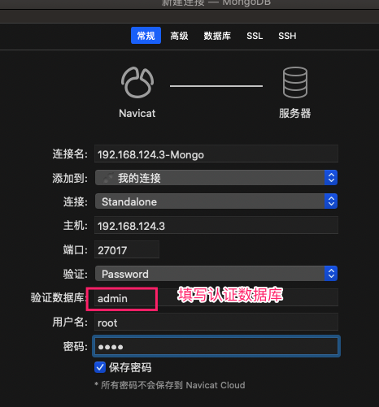

## 拉取MongoDB

```bash
docker pull mongo
```


## 启动MongoDB

* 权限控制启动

	``` bash
	docker run --name  mongo  -p 27017:27017  -d mongo --auth   #带有权限认证启动mongo
	```

* 进入容器配置权限

	```bash
	docker exec -it mongo /bin/bash
	mongo
	use admin 选择admin库
	db.createUser({user:"root",pwd:"root",roles:[{role:'root',db:'admin'}]})   //创建用户,此用户创建成功,则后续操作都需要用户认证
	exit
	```

* 外部链接

	


## 数据卷-数据

```bash
docker run --privileged=true --name mongo -p 27017:27017 -v /root/mongo/data/:/data/db -d mongo --auth
```

* 配置权限

	```bash
	docker exec -it mongo /bin/bash
	mongo
	use admin 选择admin库
	db.createUser({user:"root",pwd:"root",roles:[{role:'root',db:'admin'}]})   //创建用户,此用户创建成功,则后续操作都需要用户认证
	exit
	```

	


# 1.运行mongDB
	docker run -d -p 27017:27017 --name mymongo mongo  ---无须权限
	docker logs -f mymongo --查看mongo运行日志

# 2.进入mongodb容器
	docker exec -it mymongo /bin/bash
		直接执行mongo命令进行操作

# 3.常见具有权限的容器
	docker run --name  mymongo  -p 27017:27017  -d mongo --auth

# 4.进入容器配置用户名密码
	mongo
	use admin 选择admin库
	db.createUser({user:"root",pwd:"root",roles:[{role:'root',db:'admin'}]})   //创建用户,此用户创建成功,则后续操作都需要用户认证
	exit

# 5.将mongoDB中数据目录映射到宿主机中
	docker run -d -p 27017:27017 -v /root/mongo/data:/data/db --name mymongo mongo 