## 什么是Dockerfile

Dockerfile可以认为是**Docker镜像的描述文件，是由一系列命令和参数构成的脚本**。主要作用是**用来构建docker镜像的构建文件**。


- **通过架构图可以看出通过DockerFile可以直接构建镜像**

## Dockerfile解析过程

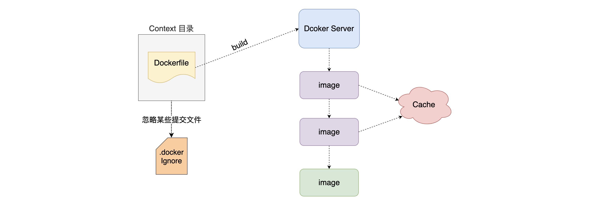

> Context目录可以是本地目录也可以是远程仓库目录，打包时会递归扫描context当前所有目录发布到docker server,因此构建Dockerfile时候最好使用空目录存放Dockerfile，或者使用.dockerignore过滤不需要发布的目录。

## Dockerfile的保留命令

官方说明:https://docs.docker.com/engine/reference/builder/

| 保留字         | 作用                                                         |
| -------------- | ------------------------------------------------------------ |
| **FROM**       | **当前镜像是基于哪个镜像的** `第一个指令必须是FROM`          |
| MAINTAINER     | **镜像维护者的姓名和邮箱地址**                               |
| **RUN**        | **构建镜像时需要运行的指令**                                 |
| **EXPOSE**     | **当前容器对外暴露出的端口号**                               |
| **WORKDIR**    | **指定在创建容器后，终端默认登录进来的工作目录，一个落脚点** |
| **ENV**        | **用来在构建镜像过程中设置环境变量**                         |
| **ADD**        | **将宿主机目录下的文件拷贝进镜像且ADD命令会自动处理URL和解压tar包** |
| **COPY**       | **类似于ADD，拷贝文件和目录到镜像中<br/>将从构建上下文目录中<原路径>的文件/目录复制到新的一层的镜像内的<目标路径>位置** |
| **VOLUME**     | **容器数据卷，用于数据保存和持久化工作**                     |
| **CMD**        | **指定一个容器启动时要运行的命令<br/>Dockerfile中可以有多个CMD指令，但只有最后一个生效，CMD会被docker run之后的参数替换** |
| **ENTRYPOINT** | **指定一个容器启动时要运行的命令<br/>ENTRYPOINT的目的和CMD一样，都是在指定容器启动程序及其参数** |

### FROM 命令

- 基于那个镜像进行构建新的镜像,在构建时会自动从docker hub拉取base镜像 必须作为Dockerfile的第一个指令出现

- 语法:

	```dockerfile
	FROM  <image>
	FROM  <image>[:<tag>]     使用版本不写为latest
	FROM  <image>[@<digest>]  使用摘要
	```

### MAINTAINER  命令

- 镜像维护者的姓名和邮箱地址[废弃]

- 语法:

	```dockerfile
	MAINTAINER <name>
	```

### RUN 命令

- RUN指令将在当前映像之上的新层中执行任何命令并提交结果。生成的提交映像将用于Dockerfile中的下一步

- 语法:

	```dockerfile
	RUN <command> (shell form, the command is run in a shell, which by default is /bin/sh -c on Linux or cmd /S /C on Windows)
	RUN echo hello
	
	RUN ["executable", "param1", "param2"] (exec form)
	RUN ["/bin/bash", "-c", "echo hello"]
	```

### EXPOSE 命令

- 用来指定构建的镜像在运行为容器时对外暴露的端口

- 语法:

	```dockerfile
	EXPOSE 80/tcp  如果没有显示指定则默认暴露都是tcp
	EXPOSE 80/udp
	```

### CMD 命令

- 用来为启动的容器指定执行的命令,在Dockerfile中只能有一条CMD指令。如果列出多个命令，则只有最后一个命令才会生效。

- 注意: **Dockerfile中只能有一条CMD指令。如果列出多个命令，则只有最后一个命令才会生效。**

- 语法:

	```dockerfile
	CMD ["executable","param1","param2"] (exec form, this is the preferred form)
	CMD ["param1","param2"] (as default parameters to ENTRYPOINT)
	CMD command param1 param2 (shell form)
	```

### WORKDIR 命令

- 用来为Dockerfile中的任何RUN、CMD、ENTRYPOINT、COPY和ADD指令设置工作目录。如果WORKDIR不存在，即使它没有在任何后续Dockerfile指令中使用，它也将被创建。

- 语法:

	```dockerfile
	WORKDIR /path/to/workdir
	
	WORKDIR /a
	WORKDIR b
	WORKDIR c
	`注意:WORKDIR指令可以在Dockerfile中多次使用。如果提供了相对路径，则该路径将与先前WORKDIR指令的路径相对`
	```

### ENV 命令

- 用来为构建镜像设置环境变量。这个值将出现在构建阶段中所有后续指令的环境中。

- 语法：

	```dockerfile
	ENV <key> <value>
	ENV <key>=<value> ...
	```

### ADD 命令

- 用来从context上下文复制新文件、目录或远程文件url，并将它们添加到位于指定路径的映像文件系统中。

- 语法:

	```dockerfile
	ADD hom* /mydir/       通配符添加多个文件
	ADD hom?.txt /mydir/   通配符添加
	ADD test.txt relativeDir/  可以指定相对路径
	ADD test.txt /absoluteDir/ 也可以指定绝对路径
	ADD url 
	```

### COPY 命令

- 用来将context目录中指定文件复制到镜像的指定目录中

- 语法:

	```dockerfile
	COPY src dest
	COPY ["<src>",... "<dest>"]
	```

### VOLUME 命令

- 用来定义容器运行时可以挂在到宿主机的目录,即为什么我们可以将宿主机目录挂载到mysql中目录，因为mysql已将容器中==/var/lib/mysql==和==/etc/mysql==目录设置为挂载点。==简单来说，就是如果没有设置挂载点则容器不允许宿主机进行挂载==

- 语法:

	```dockerfile
	VOLUME ["/data"]
	```

### ENTRYPOINT命令

- 用来指定容器启动时执行命令和CMD类似

- 语法:

	```dockerfile
	ENTRYPOINT ["executable", "param1", "param2"]
	ENTRYPOINT command param1 param2
	```

	ENTRYPOINT指令，往往用于设置容器启动后的**第一个命令**，这对一个容器来说往往是固定的。
	CMD指令，往往用于设置容器启动的第一个命令的**默认参数**，这对一个容器来说可以是变化的。


## 使用如上命令构建centos镜像

1. 创建空目录下Dockerfile文件

	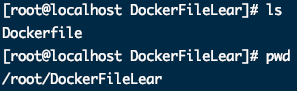

2. 写入FROM 命令

	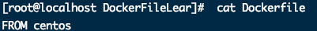

	* 构建镜像 mycentos01

		```bash
		docker build -t mycentos01 .
		```

	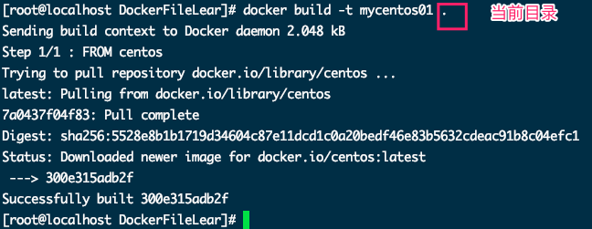

3. 写入RUN命令 下载vim

	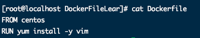

	* 注意

		> 这里 RUN yum install -y vim命令还有另外两种使用方式
		>
		> * RUN ["yum", "install", "-y","vim"]
		> * RUN ["/bin/bash","-c","yum install -y vim"]

	* 构建镜像mycentos03  

		```bash
		docker build -t mycentos03 .
		```

	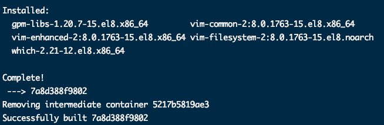

	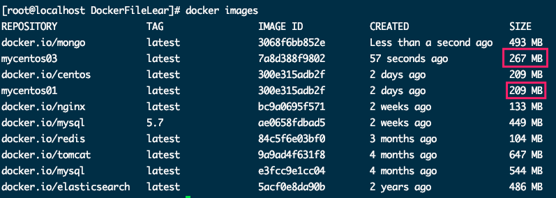

	* > 可以看到两次构建的镜像，第二次明显比第一次体积打了60多MB。

	* 进入mycentos03使用vim

		```bash
		docker run -it mycentos03 /bin/bash
		```

	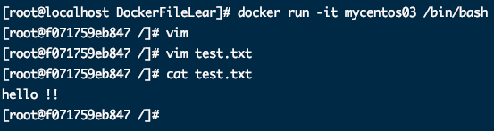

4. 写入EXPOSE 命令

	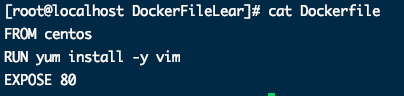

	* 构建镜像

		```bash
		docker build -t mycentos04 .
		```

		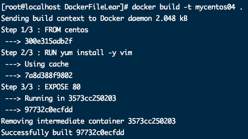

	 

5. 写入CMD 命令

	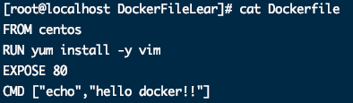

	* 构建镜像

		```bash
		docker build -t mycentos05 .
		```

		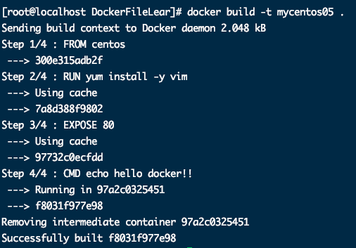

	* 运行镜像

		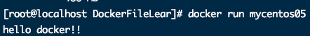

	* 注意

		> 这里 CMD ["echo","hello docker !!"]命令还有另外一种使用方式
		>
		> * CMD echo "hello docker !!"
		>
		> 如果在运行镜像时后面跟的命令会覆盖CMD 命令。比如docker run mycentos05 ls / 。其中==ls /==会覆盖CMD命令


6. 写入ENTRYPOINT命令

	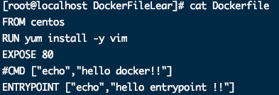

	* 构建镜像

		```bash
		docker build -t mycentos06 .
		```

		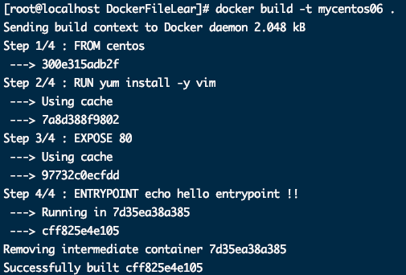

	* 运行镜像

		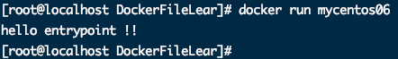

	* 注意

		> 如果想要在运行镜像时覆盖ENTRYPOINT需要指定具体的命令，例如：
		>
		> docker run --entrypoint="ls" mycentos06 /      # ls 为替换命令，将echo替换为ls  之后跟镜像   再之后跟替换命令的参数

		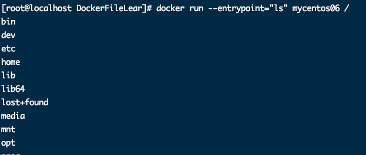

7. CMD命令和ENTRYPOINT命令结合使用

	> 一般ENTRYPOINT指令，往往用于设置容器启动后的**第一个命令**，这对一个容器来说往往是固定的。
	> 		CMD指令，往往用于设置容器启动的第一个命令的**默认参数**，这对一个容器来说可以是变化的。
	>
	> 因此我们在使用中，将ENTRYPOINT写在CMD前面。ENTRYPOINT做命令主体，而CMD做参数。两条命令相结合做容器启动默认命令。并且在启动时候可以传入参数来替换CMD。

	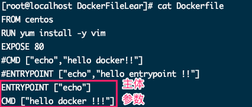

	* 构建镜像

		```bash
		docker build -t mycentos07 .
		```

		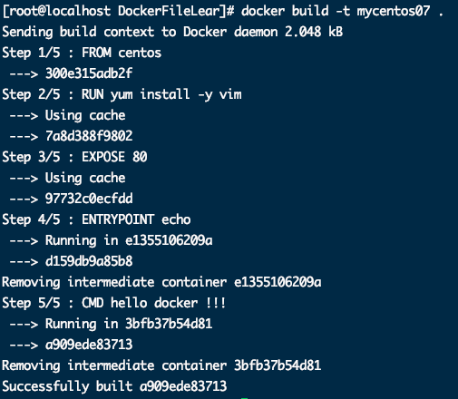

	* 带参数启动容器

		```bash
		docker run mycentos07 AMD YES !!
		```

		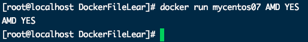

	* 不带单数启动

		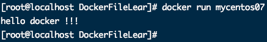

8. 写入WORKDIR 命令

	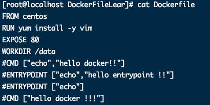

	* 构建镜像

		```bash
		docker build -t mycentos08 .
		```

		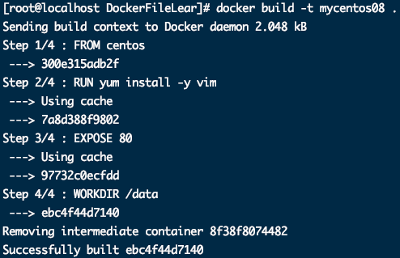

	* 启动容器

		```bash
		docker run -it mycentos08
		pwd
		```

		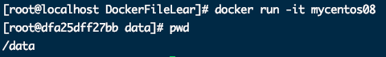


9. 写入ENV命令

	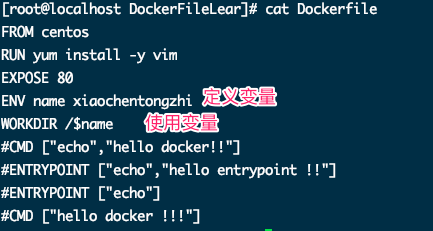

	* 构建镜像

		```bash
		docker build -t mycentos09 .
		```

		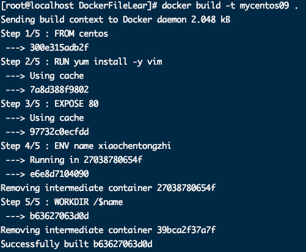

	* 运行容器

		```bash
		docker run -it mycentos09
		```

		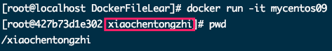


10. 写入VOLUME 命令

	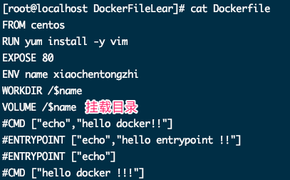

	* 构建镜像

		```bash
		docker build -t mycentos10 .
		```

		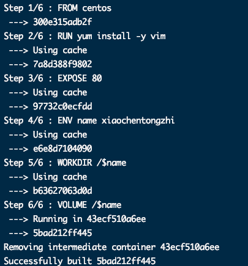

	* 将宿主机目录挂载到VOLUME设置的容器目录

		```bash
		docker run --privileged=true -it -v /root/xiaochentongzhi:/xiaochentongzhi mycentos10
		```

	* 宿主机挂载目录下新建文件

		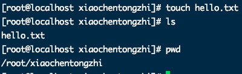

	* 再次运行mycentos10

		```bash
		docker run --privileged=true -it -v /root/xiaochentongzhi:/xiaochentongzhi mycentos10
		```

		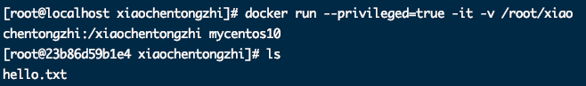


11. 写入ADD命令

	* 拷贝文件到Dockerfile同级目录

		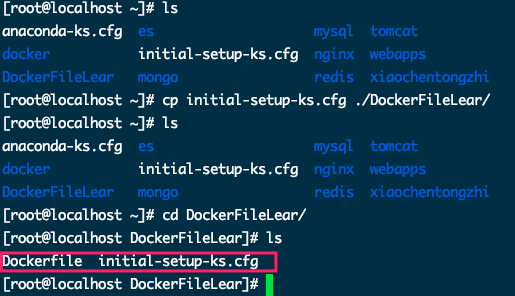

	* 添加文件

		```bash
		ADD INITIAL-SET-KS.CFG /
		```

		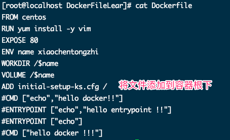

	* 构建镜像

		```bash
		docker build -t mycentos11 .
		```

	* 运行容器

		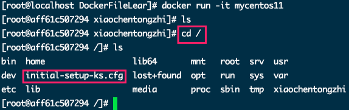

	* 注意

		> ADD命令可以添加远程URL。这里就不做演示了


12. 写入COPY命令

* 添加文件

	```bash
	COPY  initial-setup-ks.cfg /demo.cfg
	```

	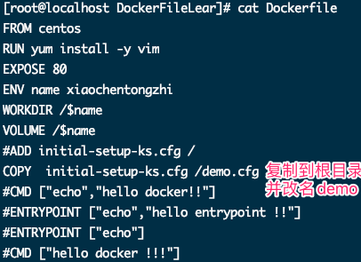

* 构建镜像

	```bash
	docker build -t mycentos12 .
	```

* 运行容器

	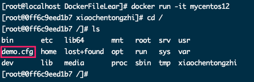

	