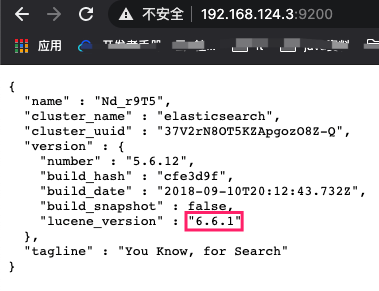
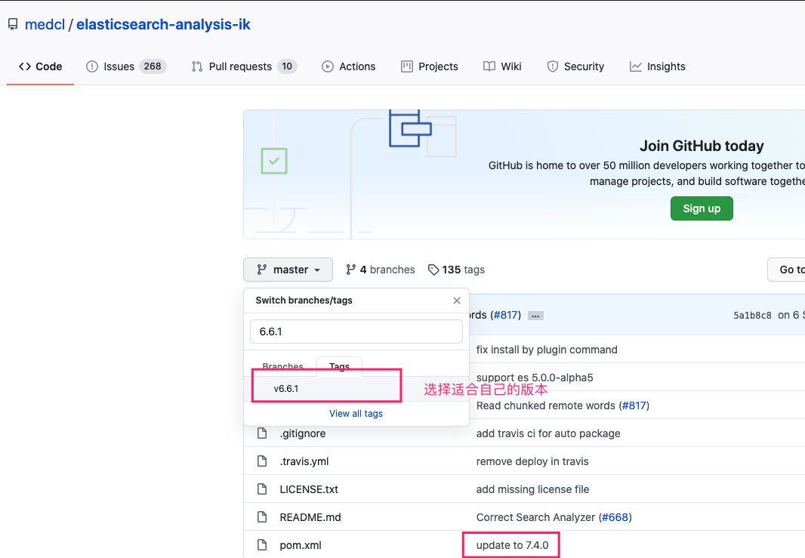
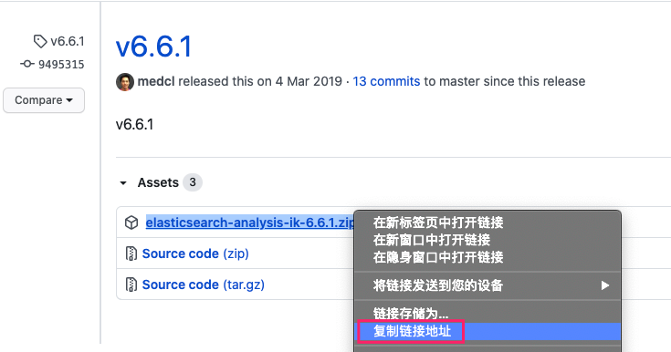

## 拉取ElasticSearch

```bash
docker pull elasticsearch
```


## 运行ElasticSearch

* 调高JVM线程数限制数量

	```markdown
	# 1.在centos虚拟机中，修改配置sysctl.conf
		vim /etc/sysctl.conf
	# 2.加入如下配置
		vm.max_map_count=262144 
	# 3.启用配置
		sysctl -p
		注：这一步是为了防止启动容器时，报出如下错误：
		bootstrap checks failed max virtual memory areas vm.max_map_count [65530] likely too low, increase to at least [262144]
	```

* 运行ElasticSearch

	```bash
	docker run -d -p 9200:9200 -p 9300:9300 --name es elasticsearch
	```

	

## 数据卷-数据

```bash
mkdir -p /root/es/data

docker cp es:/usr/share/elasticsearch/data /root/es/data/

docker rm -f es

docker run --privileged=true -d --name es -p 9200:9200 -p 9300:9300 -e ES_JAVA_OPTS="-Xms128m -Xmx128m" -v /root/es/plugins:/usr/share/elasticsearch/plugins -v /root/es/data:/usr/share/elasticsearch/data elasticsearch
```


## 安装IK分词器

* 查看ElasticSearch版本

	

	* 在GitHub上下载对应版本的IK

		

* 使用wget下载

	

	