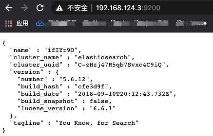
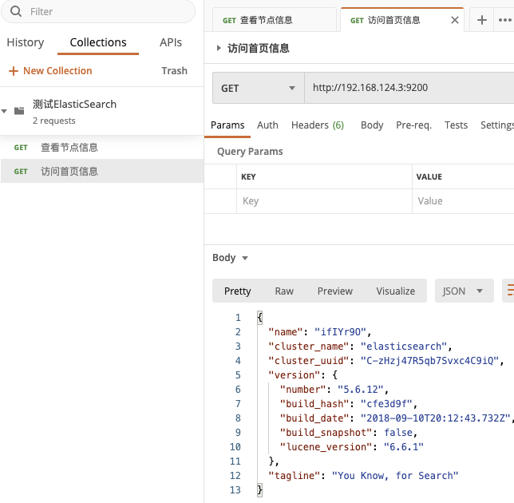
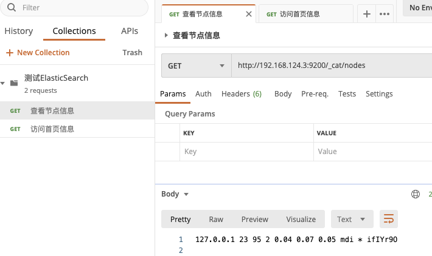
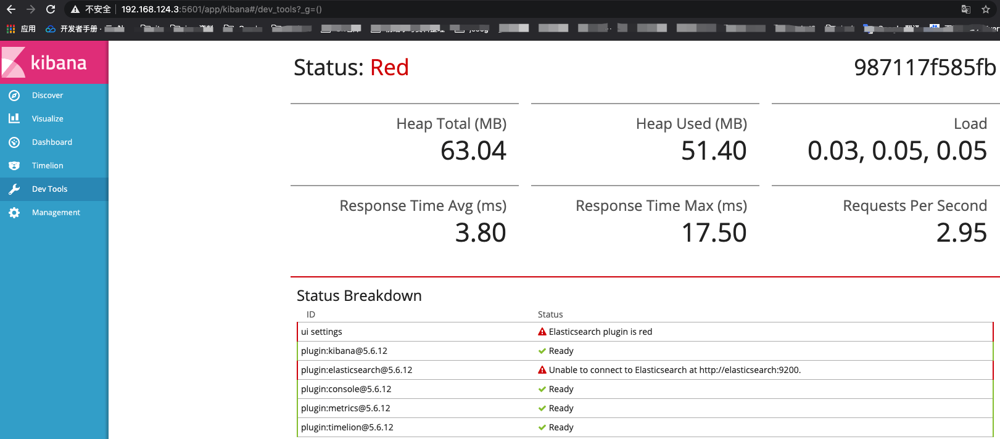

## Docker安装ElasticSearch和kibana

1. 拉取

	```bash
	docker pull elasticsearch
	docker pull kibana
	```

2. ElasticSearch数据卷

	```bash
	# 1. 在宿主机中创建配置文件以及数据文件
	mkdir -p /root/elasticsearch/config
	mkdir -p /root/elasticsearch/data
	# 2. 写入内容 :后面一定要有空格
	echo "http.host: 0.0.0.0" >> /root/elasticsearch/config/elasticsearch.yml
	# 3. 数据挂载
	docker run --privileged=true -p 9200:9200 -p 9300:9300 -e "discovery.type=single-node" -e ES_JAVA_OPTS="-Xms512m -Xmx512m" -v /root/elasticsearch/config/elasticsearch.yml:/usr/share/elasticsearch/config/elasticsearch.yml -v /root/elasticsearch/data:/usr/share/elasticsearch/data -v /root/elasticsearch/plugins:/usr/share/elasticsearch/plugins -d --name es elasticsearch
	```

	

3. 修改宿主机es目录权限

	```bash
	chmod -R 777 /root/elasticsearch/
	```


4. 访问 宿主机IP:9200




5. 使用postman测试ElasticSearch






6. 安装kibana可视化工具

	```bash
	# 这里的192.168.124.3切换为自己宿主机的IP地址。
	docker run --name kibana -e ELASTICSEARCH_HOSTS=http://192.168.124.3:9200 -p 5601:5601 -d kibana
	```

	

7. 访问 192.168.124.3:5610




​	