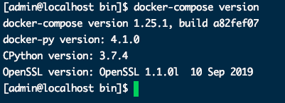

## 背景介绍

上一章我们使用Docker构建了SpringBoot镜像，SpringBoot项目中依赖容器Mysql。因此我们在启动项目时必须先启动Mysql。但是如果我们项目是微服务以及使用了更多的其他服务，且他们之间都有依赖关系。这个时候我们任然一个一个启动容器那将是一场灾难。因此我们急需一个像注册中心一样的技术来统一管理我们的容器。


## Docker Compose

* 定义、运行、管理多个容器
* YAML file配置文件
* single command


## 使用步骤 

* 定义Dockerfile 保证我们的项目运行在任何地方
* 定义docker-compose.yml
* 执行docker-compose up 启动项目


## 安装、授权

```bash
# 安装
sudo curl -L https://get.daocloud.io/docker/compose/releases/download/1.25.1/docker-compose-`uname -s`-`uname -m` -o /usr/local/bin/docker-compose

# 授权
sudo chmod +x /usr/local/bin/docker-compose
```




## docker-compose.yml编写规则

> 官网:https://docs.docker.com/compose/compose-file/

```markdown
version: '' #版本 ：与docker对应的版本、向下兼容
services:   #服务
	服务1：web
		#服务配置
		images
		build
		network
		...
	服务2: redis
  	...
  服务3: mysql
  	...
 # 其他配置  网络/卷、全局规则
 vulumes:
 networks:
 configs:
 
```

