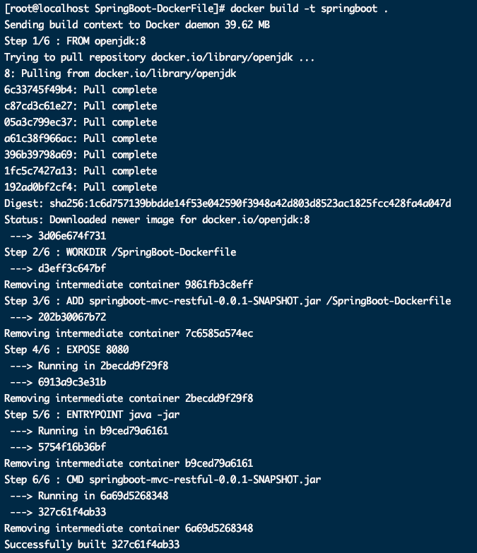

## Dockerfile构建springboot项目部署

##### 1.准备springboot可运行项目


> SpringBoot-Mvc-RestFul模块依赖SpringBoot-Common模块。

##### 2.将可运行项目放入linux虚拟机中


##### 3.编写Dockerfile

```dockerfile
FROM openjdk:8
WORKDIR /SpringBoot-Dockerfile
ADD springboot-mvc-restful-0.0.1-SNAPSHOT.jar /SpringBoot-Dockerfile
EXPOSE 8080
ENTRYPOINT ["java","-jar"]
CMD ["springboot-mvc-restful-0.0.1-SNAPSHOT.jar"]
```

##### 4.构建镜像

```shell
docker build -t springboot .
```




##### 5.运行镜像

```shell
 docker run -d -p 8080:8080 --name springboot springboot
```

```bash
[root@localhost SpringBoot-DockerFile]# docker run -p 8080:8080 springboot

  .   ____          _            __ _ _
 /\\ / ___'_ __ _ _(_)_ __  __ _ \ \ \ \
( ( )\___ | '_ | '_| | '_ \/ _` | \ \ \ \
 \\/  ___)| |_)| | | | | || (_| |  ) ) ) )
  '  |____| .__|_| |_|_| |_\__, | / / / /
 =========|_|==============|___/=/_/_/_/
 :: Spring Boot ::        (v2.3.0.RELEASE)

2020-12-10 23:44:39.007  INFO 1 --- [           main] c.s.s.SpringbootMvcRestfulApplication    : Starting SpringbootMvcRestfulApplication on c5cb15d261df with PID 1 (/SpringBoot-Dockerfile/springboot-mvc-restful-0.0.1-SNAPSHOT.jar started by root in /SpringBoot-Dockerfile)
2020-12-10 23:44:39.009  INFO 1 --- [           main] c.s.s.SpringbootMvcRestfulApplication    : No active profile set, falling back to default profiles: default
2020-12-10 23:44:40.859  INFO 1 --- [           main] o.s.b.w.embedded.tomcat.TomcatWebServer  : Tomcat initialized with port(s): 8080 (http)
2020-12-10 23:44:40.872  INFO 1 --- [           main] o.apache.catalina.core.StandardService   : Starting service [Tomcat]
2020-12-10 23:44:40.872  INFO 1 --- [           main] org.apache.catalina.core.StandardEngine  : Starting Servlet engine: [Apache Tomcat/9.0.35]
2020-12-10 23:44:40.959  INFO 1 --- [           main] o.a.c.c.C.[Tomcat].[localhost].[/]       : Initializing Spring embedded WebApplicationContext
2020-12-10 23:44:40.960  INFO 1 --- [           main] o.s.web.context.ContextLoader            : Root WebApplicationContext: initialization completed in 1849 ms
2020-12-10 23:44:41.429  INFO 1 --- [           main] pertySourcedRequestMappingHandlerMapping : Mapped URL path [/v2/api-docs] onto method [springfox.documentation.swagger2.web.Swagger2Controller#getDocumentation(String, HttpServletRequest)]
2020-12-10 23:44:41.561  INFO 1 --- [           main] o.s.s.concurrent.ThreadPoolTaskExecutor  : Initializing ExecutorService 'applicationTaskExecutor'
2020-12-10 23:44:41.851  INFO 1 --- [           main] o.s.b.w.embedded.tomcat.TomcatWebServer  : Tomcat started on port(s): 8080 (http) with context path ''
2020-12-10 23:44:41.852  INFO 1 --- [           main] d.s.w.p.DocumentationPluginsBootstrapper : Context refreshed
2020-12-10 23:44:41.879  INFO 1 --- [           main] d.s.w.p.DocumentationPluginsBootstrapper : Found 1 custom documentation plugin(s)
2020-12-10 23:44:41.920  INFO 1 --- [           main] s.d.s.w.s.ApiListingReferenceScanner     : Scanning for api listing references
2020-12-10 23:44:42.100  INFO 1 --- [           main] c.s.s.SpringbootMvcRestfulApplication    : Started SpringbootMvcRestfulApplication in 3.957 seconds (JVM running for 4.476)

```

##### 6.访问项目

* http://192.168.124.3:8080/users/list


## Dockerfile构建springboot项目部署-Mysql

##### 1.准备连接MySQL的SpringBoot项目


##### 2.将可运行项目放入linux虚拟机中


##### 3.编写Dockerfile和.dockerignore

```dockerfile
FROM openjdk:8
WORKDIR /SpringBoot-Dockerfile-Mysql
ADD springboot-jpa-docker-mysql-0.0.1-SNAPSHOT.jar /SpringBoot-Dockerfile-Mysql
EXPOSE 8080
ENTRYPOINT ["java","-jar"]
CMD ["springboot-jpa-docker-mysql-0.0.1-SNAPSHOT.jar"]
```

```dockerignore
ckerfile.bak
springboot-mvc-restful-0.0.1-SNAPSHOT.jar
```

##### 4.构建镜像

```shell
docker build -t springboot-mysql .
```


##### 5.运行镜像

```shell
docker run --privileged=true -d -p 8080:8080 --name springboot-mysql springboot-mysql
```

```bash
[root@localhost SpringBoot-DockerFile]# docker run -p 8080:8080 springboot

  .   ____          _            __ _ _
 /\\ / ___'_ __ _ _(_)_ __  __ _ \ \ \ \
( ( )\___ | '_ | '_| | '_ \/ _` | \ \ \ \
 \\/  ___)| |_)| | | | | || (_| |  ) ) ) )
  '  |____| .__|_| |_|_| |_\__, | / / / /
 =========|_|==============|___/=/_/_/_/
 :: Spring Boot ::        (v2.3.0.RELEASE)
2020-12-11 04:58:25.783  INFO 1 --- [           main] c.s.s.SpringbootMvcRestfulApplication    : Starting SpringbootMvcRestfulApplication on cb683bbfb261 with PID 1 (/SpringBoot-Dockerfile/springboot-mvc-restful-0.0.1-SNAPSHOT.jar started by root in /SpringBoot-Dockerfile)
2020-12-11 04:58:25.787  INFO 1 --- [           main] c.s.s.SpringbootMvcRestfulApplication    : No active profile set, falling back to default profiles: default
2020-12-11 04:58:27.720  INFO 1 --- [           main] o.s.b.w.embedded.tomcat.TomcatWebServer  : Tomcat initialized with port(s): 8080 (http)
2020-12-11 04:58:27.733  INFO 1 --- [           main] o.apache.catalina.core.StandardService   : Starting service [Tomcat]
2020-12-11 04:58:27.734  INFO 1 --- [           main] org.apache.catalina.core.StandardEngine  : Starting Servlet engine: [Apache Tomcat/9.0.35]
2020-12-11 04:58:27.816  INFO 1 --- [           main] o.a.c.c.C.[Tomcat].[localhost].[/]       : Initializing Spring embedded WebApplicationContext
2020-12-11 04:58:27.816  INFO 1 --- [           main] o.s.web.context.ContextLoader            : Root WebApplicationContext: initialization completed in 1905 ms
2020-12-11 04:58:28.342  INFO 1 --- [           main] pertySourcedRequestMappingHandlerMapping : Mapped URL path [/v2/api-docs] onto method [springfox.documentation.swagger2.web.Swagger2Controller#getDocumentation(String, HttpServletRequest)]
2020-12-11 04:58:28.455  INFO 1 --- [           main] o.s.s.concurrent.ThreadPoolTaskExecutor  : Initializing ExecutorService 'applicationTaskExecutor'
2020-12-11 04:58:28.713  INFO 1 --- [           main] o.s.b.w.embedded.tomcat.TomcatWebServer  : Tomcat started on port(s): 8080 (http) with context path ''
2020-12-11 04:58:28.715  INFO 1 --- [           main] d.s.w.p.DocumentationPluginsBootstrapper : Context refreshed
2020-12-11 04:58:28.746  INFO 1 --- [           main] d.s.w.p.DocumentationPluginsBootstrapper : Found 1 custom documentation plugin(s)
2020-12-11 04:58:28.789  INFO 1 --- [           main] s.d.s.w.s.ApiListingReferenceScanner     : Scanning for api listing references
2020-12-11 04:58:28.997  INFO 1 --- [           main] c.s.s.SpringbootMvcRestfulApplication    : Started SpringbootMvcRestfulApplication in 4.091 seconds (JVM running for 4.606)
```

##### 6.访问项目

* http://192.168.124.3:8080/users/list


