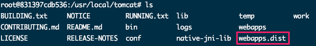
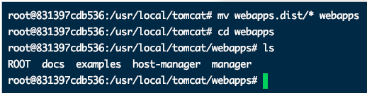
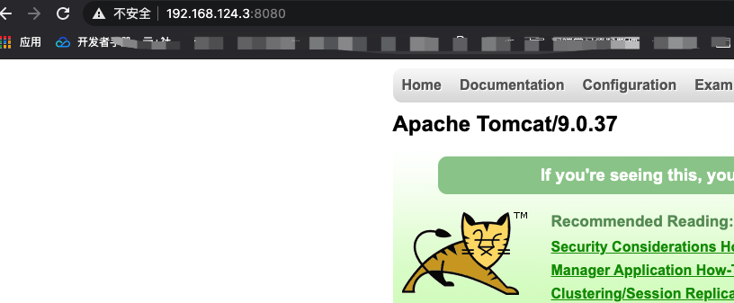
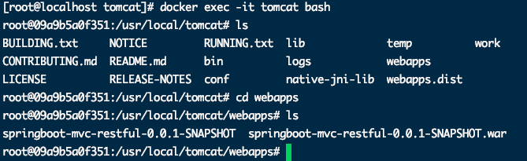
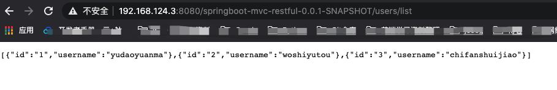

## 拉取Tomcat

```bash
docker pull tomcat
```


## 启动Tomcat

```bash
docker run -p 8080:8080 -d --name mytomcat tomcat
```

> docker 下载下来的Tomcat中默认webapps中没有默认服务，默认服务在webapps.dist中



* 将webapps.dist目录中服务拷贝到webapps中继续访问

	

	


​		

## 数据卷-数据

1. 拷贝SpringBoot项目war包到宿主机/root/tomcat/webapps下

2. 启动Tomcat

	```bash
	docker run --privileged=true -p 8080:8080 -v /root/tomcat/webapps:/usr/local/tomcat/webapps -d --name tomcat tomcat
	```

3. 进入容器查看

	```bash
	docker exec -it tomcat bash
	```

	

4. 外部访问

	

	