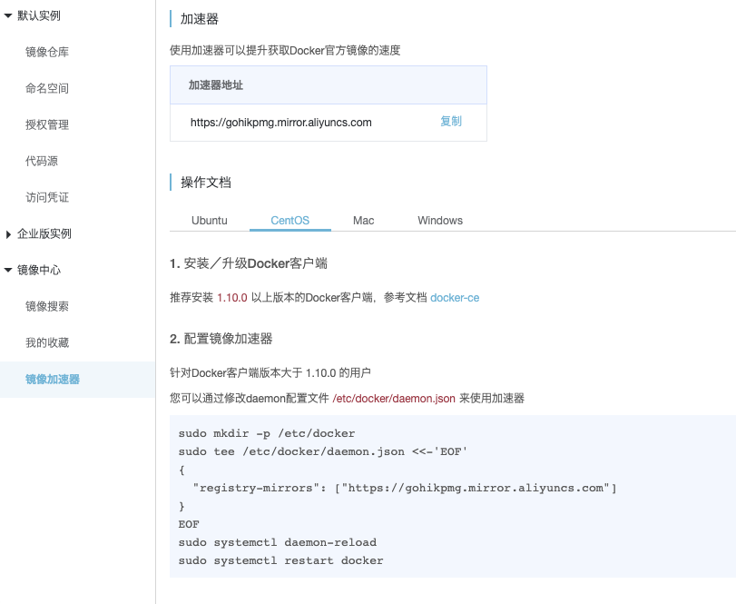
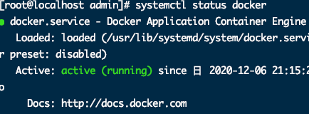
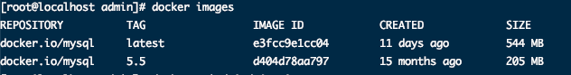
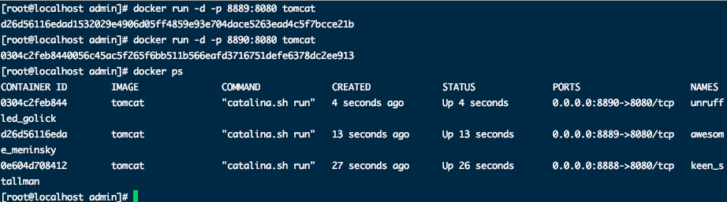

# Docker命令


> 文档在桌面》程序羊 》安装手册.pdf  以及 springboot核心技术.pdf 以及/Volumes/Mac/学习视频/Java面试专题和简历/Java架构面试专题/docker学习思维笔记.xmind


1. 安装docker

	   ```bash
	yum install -y docker
	```


2. 镜像加速 

	进入 阿里云》镜像服务 》 镜像加速器

	

​	

3. 重启docker

	```bash
	systemctl restart docker
	systemctl start docker.service
	```

4. 查看docker状态

	```bash
	systemctl status docker
	```

	


5. 开机启动

	```bash
	systemctl enable docker
	```

6. 查看docker信息及帮助文档

	```bash
	docker info
	docker --help
	```

	


## 镜像操作

> \+ 文件和元数据的集合
>
> \+ 镜像是分层的
>
> \+ 不同的image可以共享相同的层
>
> \+ 镜像本身是只读的

1. 检索镜像

	```bash
	docker search 关键字 
	```

	> eg：docker search redis  我们经常去docker hub上检索镜像的详细信息，如镜像的TAG。

2. 查看已安装镜像

  ```bash
  docker images   必须是sudo环境，否则看不到
  ```

  

  *  -a 列出所有镜像
  * -q 只显示镜像ID
  * --digests：显示摘要信息
  * --no-trunc：不截断输出，显示完整的镜像ID

3.  安装镜像

	```bash
	docker pull name ： 安装镜像 例如 docker pull mysql   
	docker pull name:5.5 下载指定镜像版本(也叫标签)
	```

4. 删除指定的本地镜像

	* 删除单个镜像
	
		```bash
	docker rmi 镜像id/镜像名称
		```
	
		
	
	* 删除多个镜像
	
		```bash
		docker rmi id1 id2
		```
	
	* 删除全部镜像
	
		```bash
		docker rmi `docker images -qa`
		```


## 容器操作

1. 运行镜像 

  ```bash
  docker run ‐‐name mytomcat ‐d tomcat:latest   
  ```

  - -name ：起别名。区分多实例

  * -d     : 后台启动
  * ：	  : 启动指定版本
  * -i      ：交换方式运行
  * -t      ：伪终端
  * -p     ：端口映射
  * -P     ：随机端口映射

  

2. 查看运行中的容器 

	```bash
	docker ps
	```

	* -a :所有正在运行和运行过的
	* -l: 显示最近创建的容器
	* -n:显示最近创建的n个容器
	* -q:只显示容器id
	
	

3. 停止运行中的容器  

	```bash
	 docker stop 容器的id/名称
	```

4. 查看所有的容器  

	```bash
	docker ps ‐a
	```

5. 启动容器  

	```bash
	docker start 容器id
	```

6. 重启容器

	```bash
	docker restart 容器id/名称
	```

7. 删除一个容器   docker rm 容器id

	```bash
	docker rm 容器id/名称
	```

8. 删除所有容器

	```bash
	docker rm -f $(docker ps -aq)
	docker ps -a -q | xargs docker rm
	```

9. 强制停止容器

	```bash
	docker kill 容器id/名称
	```

10. 进入正在运行的容器，并以前台方式运行

	* > docker exec -t 容器id/名称 bashshell 产生新的进程

	* > docker attach 容器id/名称 进入容器不产生新的进程

11. 容器 <->拷贝文件<->主机

	* > docker cp [OPTIONS] CONTAINER:SRC_PATH DEST_PATH|-

	* > docker cp [OPTIONS] SRC_PATH|- CONTAINER:DEST_PATH

7. 启动一个做了端口映射的tomcat  docker run ‐d ‐p 8888:8080 tomcat


​		‐d：后台运行

​		‐p: 将主机的端口映射到容器的一个端口 主机端口:容器内部的端口

​		-v: 目录挂载 将主机目录挂载到容器内部文件目录

​		-e: 修改参数


​	查看容器的日志   docker logs container‐name/container‐id


​	为了演示简单关闭了linux的防火墙

​		service firewalld status ；查看防火墙状态

​		service firewalld stop：关闭防火墙


​	进入容器(交互模式)：

​		docker exec -it 容器ID

​		eg: docker exec -it mysql5.7 /bin/bash

​			


更多命令参看

https://docs.docker.com/engine/reference/commandline/docker/ 可以参考每一个镜像的文档


​	启动多实例

​		


Tips：

​	

1. 容器中启动的服务如果外界想要访问需要进行映射。因为docker有沙箱机制。


启动MySQL实例

​	docker run -p 3306:3306 —name mysql \

​	-v /mydata/mysql/log:/var/log/mysql \

​	-v /mydata/mysqldata:/var/lib/mysql \

​	-v /mydata/mysql/conf:/etc/mysql \

​	-e /MYSQL_ROOT_PASSWORD=root \

​	-d mysql:5.7


物理机下mydata/mysqldata  mydata/mysql/conf   mydata/mysql/log  端口号为第一个3306


## 启动mysql

 sudo docker run -p 3306:3306 --name mysql \

 -v /mydata/mysql/log:/var/log/mysql \

 -v /mydata/mysql/data:/var/lib/mysql \

 -v /mydata/mysql/conf:/etc/mysql \

 -e MYSQL_ROOT_PASSWORD=root \

 -d mysql:5.7

##  

 **[root@hadoop-104 conf]**# pwd

 /mydata/mysql/conf

 

 

 **[root@hadoop-104 conf]**# cat my.cnf

 **[client]**

 default-character-set=utf8

 **[mysql]**

 default-character-set=utf8

 **[mysqld]**

 init_connect='SET collation_connection = utf8_unicode_ci'

 init_connect='SET NAMES utf8'

 character-set-server=utf8

 collation-server=utf8_unicode_ci

 skip-character-set-client-handshake

 skip-name-resolve

 **[root@hadoop-104 conf]**# 

 

 **[root@hadoop-104 conf]**# docker restart mysql

 mysql

 **[root@hadoop-104 conf]**# 

 

##  

 [root@hadoop-104 conf]# docker exec -it mysql /bin/bash

 root@b3a74e031bd7:/# whereis mysql

 mysql: /usr/bin/mysql /usr/lib/mysql /etc/mysql /usr/share/mysql

 

 root@b3a74e031bd7:/# ls /etc/mysql 

 my.cnf

 root@b3a74e031bd7:/# cat /etc/mysql/my.cnf 

 [client]

 default-character-set=utf8

 [mysql]

 default-character-set=utf8

 [mysqld]

 init_connect='SET collation_connection = utf8_unicode_ci'

 init_connect='SET NAMES utf8'

 character-set-server=utf8

 collation-server=utf8_unicode_ci

 skip-character-set-client-handshake

 skip-name-resolve

 root@b3a74e031bd7:/# 

##  

 [root@hadoop-104 ~]# docker update mysql --restart=always

 mysql

 [root@hadoop-104 ~]# 

