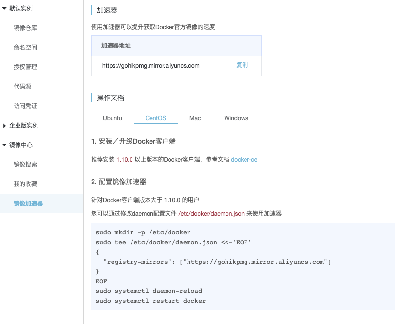
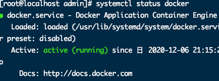

# Docker安装

> 文档在桌面》程序羊 》安装手册.pdf  以及 springboot核心技术.pdf 以及/Volumes/Mac/学习视频/Java面试专题和简历/Java架构面试专题/docker学习思维笔记.xmind


1. 安装docker

	   ```bash
	yum install -y docker
	```


2. 镜像加速 

	进入 阿里云》镜像服务 》 镜像加速器

	

​	

3. 重启docker

	```bash
	systemctl restart docker
	systemctl start docker.service
	```

4. 查看docker状态

	```bash
	systemctl status docker
	```

	


5. 开机启动

	```bash
	systemctl enable docker
	```

6. 查看docker信息及帮助文档

	```bash
	docker info
	docker --help
	```

	


