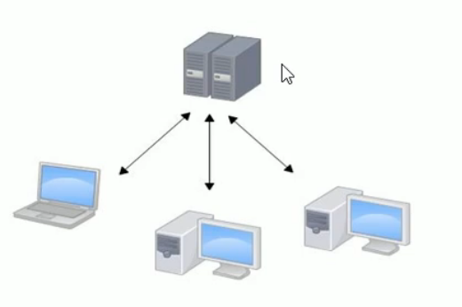
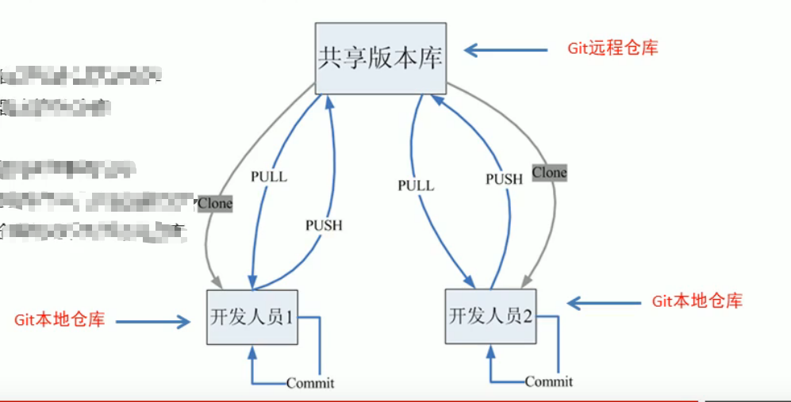
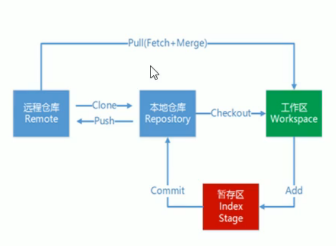
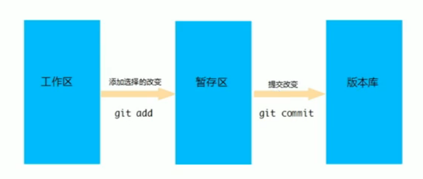

## Git和SVN

### 1、SVN

`特点:`

*   集中式版本控制，类似于C/S架构，版本库是放在中央服务器。
*   开发人员先从中央服务器拉取代码，然后开发，然后提交到中央服务器

`缺点:`

*   服务器单点故障
*   容错性差

### 2、Git

`特点:`

*   分布式版本控制系统，包含了本地仓库和远程仓库

`工作流程:`

## Git版本库、暂存区、版本库

*   版本库

    Git项目中.git文件夹就是版本库，其中存放了很多配置信息，日志信息，和文件版本信息等

*   工作目录

    包含.git文件夹的目录就是工作目录，主要存放开发的代码

*   暂存区

    .git文件夹中有很多文件，其中有一个index文件就是暂存区，也可以叫stage，暂存区是一个临时保存修改文件的地方

    

## Git网络传输方式

*   htpps

    此方式需要用户名密码，存储在计算机凭据中，永久保存，每次和远程仓库交互时进行验证

*   ssh

    此方式需要公钥私钥，将本地计算机公钥拷贝到gitee中，每次和远程仓库交互时使用公钥私钥验证