`注意`

>   分支是由两种，一种是远程仓库分支，另一种是本地仓库分支

## 查看分支

*   查看本地所有分支

    ```bash
    git branch
    ```

*   查看远程所有分支

    ```bash
    git branch -r
    ```

*   查看本地远程所有分支

    ```bash
    git branch -a
    ```

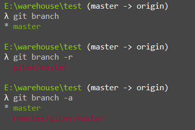


## 创建分支

>   <font color=ff00aa size=4>创建分支时一定要切换到master，除非你是想要以其他分支作为基础创建分支</font>

```bash
git branch xxx
```


## 切换分支

```bash
git checkout xxx
```

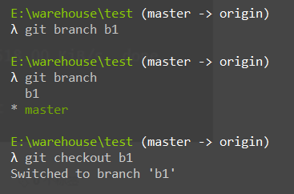


## 推送到远程分支

>   将本地创建的分支推送到远程仓库

```bash
git push 仓库别名 分支
```

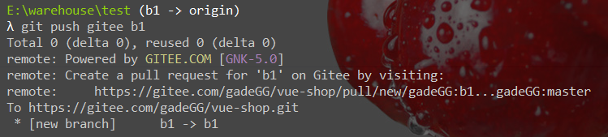

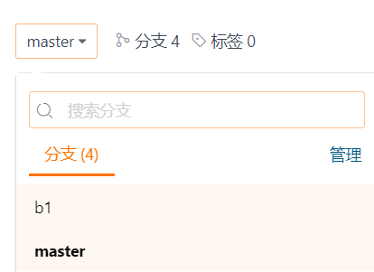


## 合并分支

1.  b1分支下操作

    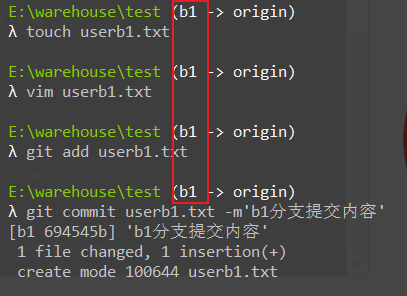

2.  切换回master分支后，并没有新增的userb1.txt，因为分支之间是独立的

    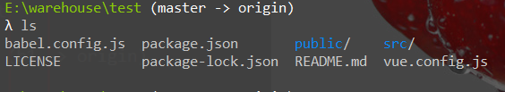

3.  master分支合并b1【`本地仓库分支合并`】

    *   切换到master分支

        ```bash
        git checkout master
        ```

    *   b1分支合并到master

        ```bash
        git merge b1
        ```

    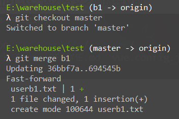

    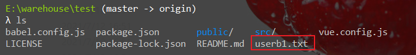


>   :fox_face:<font color=ff00aa size=4>如果不同的分支同时修改了同一个文件同一处，那么进行分支合并时会文件冲突，需要打开冲突文件解决冲突，然后使用git add来标识冲突已解决</font>


## 删除分支

*   删除本地分支

    ```bash
    git branch -d 分支名  #删除的只是本地仓库分支，删除前需要checkout到其他仓库
    ```

    >   :fleur_de_lis:如果删除的本地分支仓库内容和远程分支仓库内容不一致则不允许删除，可以使用强制删除
    >
    >   ```bash
    >   git branch -D 分支名
    >   ```

*   删除远程分支

    ```bash
    git push 仓库别名 -d 分支名
    ```

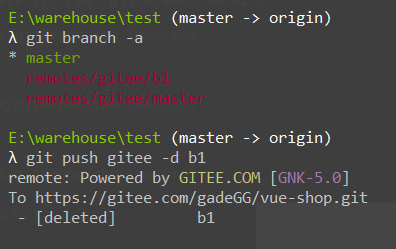

## 分支合并冲突解决

>   :fox_face:<font color=ff00aa size=4>如果不同的分支同时修改了同一个文件同一处，那么进行分支合并时会文件冲突，需要打开冲突文件解决冲突，然后使用git add来标识冲突已解决</font>

1.  分支冲突说明

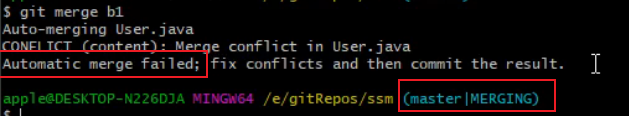

2.  冲突文件说明

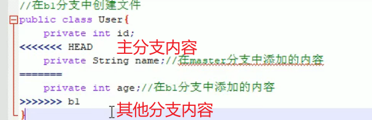

3.  文件处理好以后 保存

4.  标识冲突文件已处理好

    ```bash
    git add 冲突文件名
    ```

5.  提交

    ```bash
    git commit    #默认分支合并注释即可
    ```

    