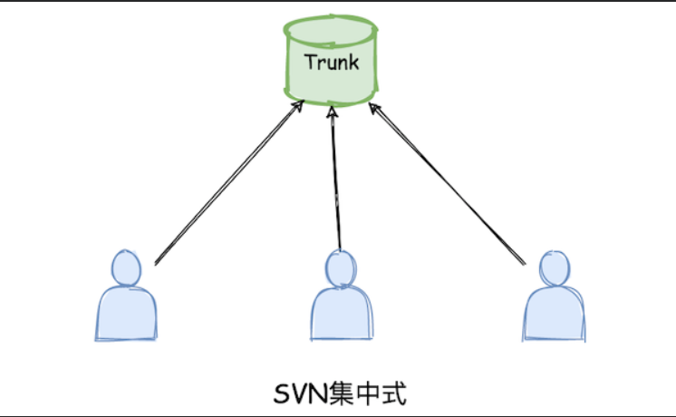
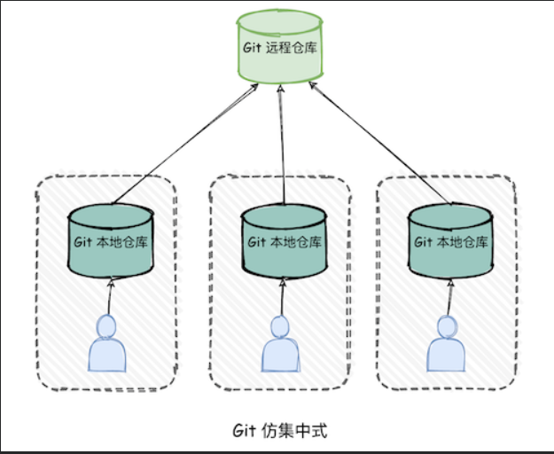
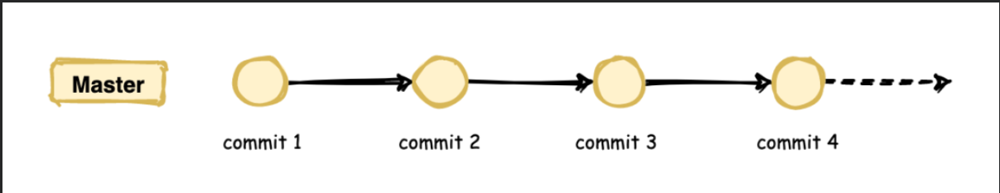
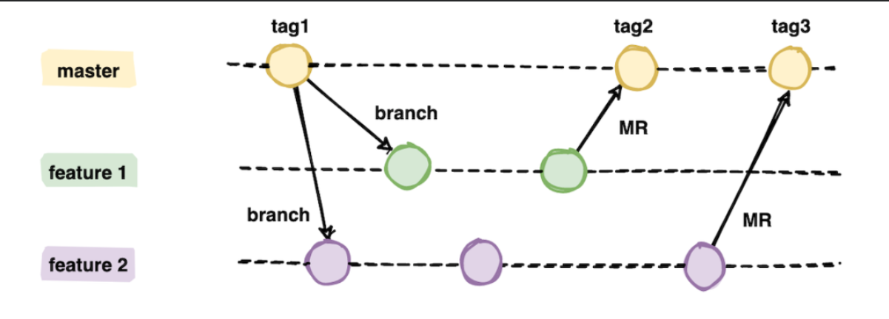
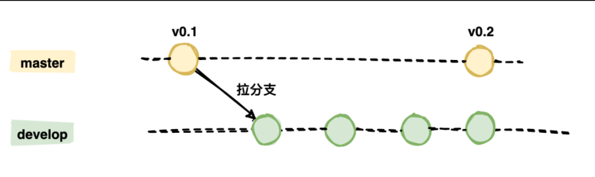
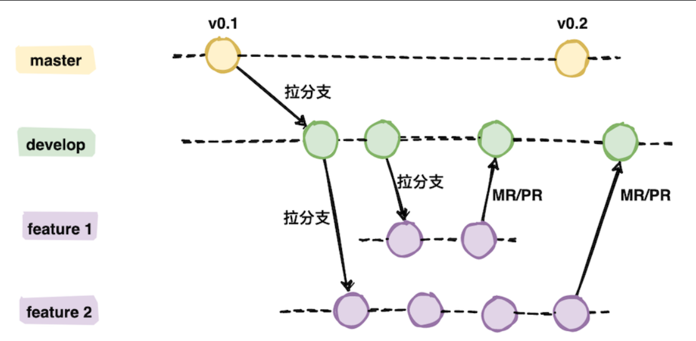
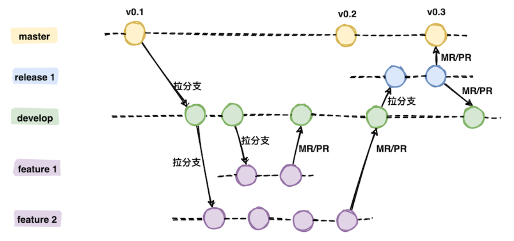

`引言:`

工作流指的是，团队协作中如何使用Git来进行代码提交以及发布流程的规范。

## 集中式工作流（不推荐）

**从提交记录来看，集中式工作流如下**

>   *   在SVN中，这种工作模式比较常见，适合于很小团队开发，代码管理不是很规范，很难应对突发情况以及处理各种复杂场景。并且随着项目体量增大，人员增多，解决冲突的时间要多于写代码的时间。
>
>   *   Git集中式工作流与SVN类似，只是多了一个本地仓库的概念

## 功能分支工作流（不推荐）

`引言`

为了便于大家==并发==开展工作，通常会基于 master 主干分支拉取几个特性分支，每个开发人员关注于自己的分支，需要提交代码时直接提交到本地库的特性分支，在合入到主干分支前通常会拉取最新的代码，如果有冲突先在本地解决好冲突，解决完提交 MR 申请将特性分支合入主干分支。如下图：

`问题:`

新功能大量合并到 master 分支后容易造成 master 分支质量不稳定，不稳定会有什么问题？比如线上突然有个 bug 要解决，可能只需要修改一行代码就能解决，但是 master 分支已经合入了大量新特性，测试人员还没来得及测试，那最稳妥的办法就是将代码回退到上一次发版本的时间节点，基于这个节点再修改一行代码，是不是太麻烦了？

## Gitflow 工作流 （推荐）

`介绍`

*   Gitflow 工作流常驻的分支有两个：`主干分支 master`、`开发分支 develop`。

`常见分支`

-   开发主分支：`master 分支`

    master 分支的代码是可以直接部署到生成环境的，为了保持稳定性一般不会直接在这个分支上修改代码，都是通过其他分支合并过来的。

-   开发主分支：`develop分支`

    develop 分支是主开发分支，包含所有要发布到下一个release的代码，主要是由feature分支合并过来的。

-   临时分支：`feature 分支`

    feature 分支主要是用来开发一个新特性，一旦开发完成会合入 develop 分支，feature 分支也随即删除掉。

-   临时分支：`release 分支`

    当需要一个发布一个新release版本时，会基于==develop==分支创建一个==release==分支，经过测试人员充分测试后再合入 master 分支和 develop 分支。

-   临时分支：`hotfix 分支`

    当在生成环境发现新的Bug时候，如果需要紧急修复，会创建一个hotfix分支， 充分测试后合入master和develop分支，随后删除该分支。

`各分支如何工作`

*   master/develop分支

    *   **原则上master分支上所有的commit 都应该打上Tag**，因为一般情况下master不存在 直接commit
    *   devlop分支 是基于 master分支创建的，与 master 分支一样都是主分支，不会被删除
    *   **develop 从 master 拉出来之后会独立发展，不会与 master 直接产生联系。**

    

*   feature 分支

    *   通常一个迭代上线会拉一个release 分支，比如开发一个新功能。

    *   **开发人员开发完毕所有的代码都已合入 develop 分支，这时候会基于 develop 分支拉出一个 release 分支，测试人员基于该分支进行测试。**

    *   >   基于feature拉取release分支，交给测试人员测试，这种是基于一个功能/特性进行充分测试。当然也可以基于develop分支进行拉取release分支进行测试 

    

*   release 分支

    *   通常一个迭代上线会拉一个release 分支，开发人员开发完毕所有的代码都已合入 develop 分支，这时候会基于 develop 分支拉出一个 release 分支，测试人员基于该分支进行测试。

    

*   hotfix 分支
    *   hotfix分支基于master分支创建，用于紧急修复bug。
    *   开发完后需要同时回合到master和develop分支，同时在master上打一个tag。

`分支命名规范`

1.  feature分支：以`feature_`开头，如 feature_order
2.  release分支：以`release_`开头，如 release_v1.0
3.  hotfix分支：以`hotfix_`开头，如hotfix_20210117
4.  tag标记：如果是release分支合并，则以`release_`开头，如果是hotfix分支合并，则以`hotfix_`开头。

## Forking 工作流

`引言`

Forking 工作流是以 Github 为代表的一种代码协作方式，开发者通过克隆（fork）源仓库进行编写代码，一旦完成会发起 `pull request`，源仓库作者可以选择是否接受该 PR。

`步骤`

`Watch` 是关注的意思，一旦你点击了之后该项目有任何改动都会第一时间通知到你；

`Star` 类似于点赞的意思，多给开源项目点个赞，鼓励一下作者；

`Fork` 本意是分叉，实际上是克隆的意思，点了之后会将该项目拷贝一份到自己的 ==github 远程仓库==中。

1.  Fork一个开源项目
2.  修改后提交到自己远程仓库
3.  远程仓库界面中发起pull request请求。

## 我的 MD-Book仓库工作流

*   master分支 ：最终远程仓库内容
*   dev分支 ：在push master前统一接受mac和win分支push的内容
*   Mac分支：Mac系统（家里面）提交
*   win分支：笔记本（办公室）提交

>   当win和mac同时写一个知识点文章时，都推送到dev分支，当这一个知识点内容总结完毕后，然后由dev分支推送到master分支，Mac和win分支协作期间使用dev分支进行同步。