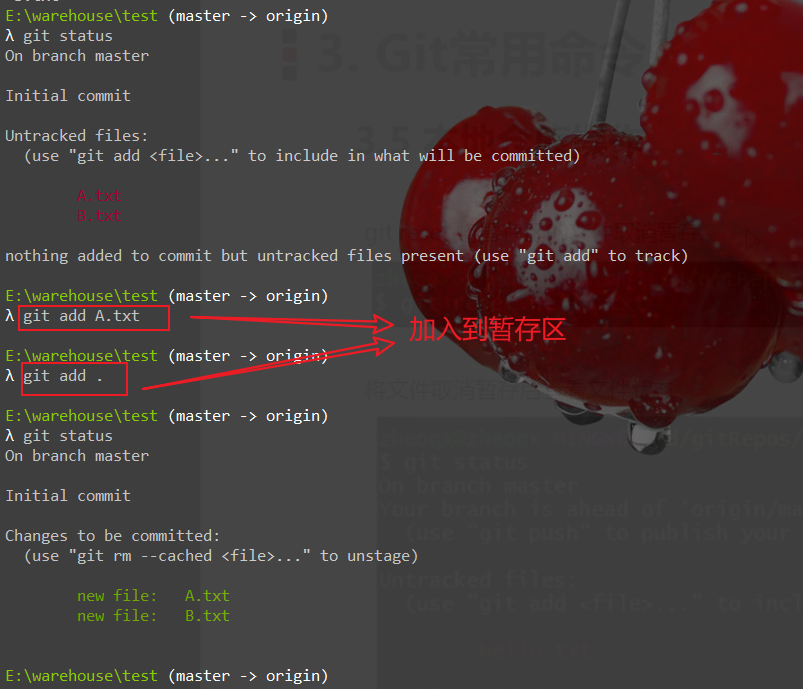
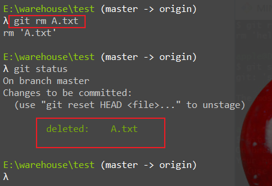
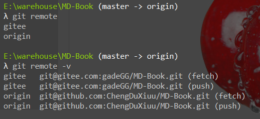
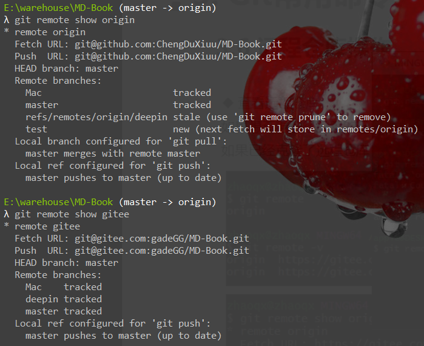
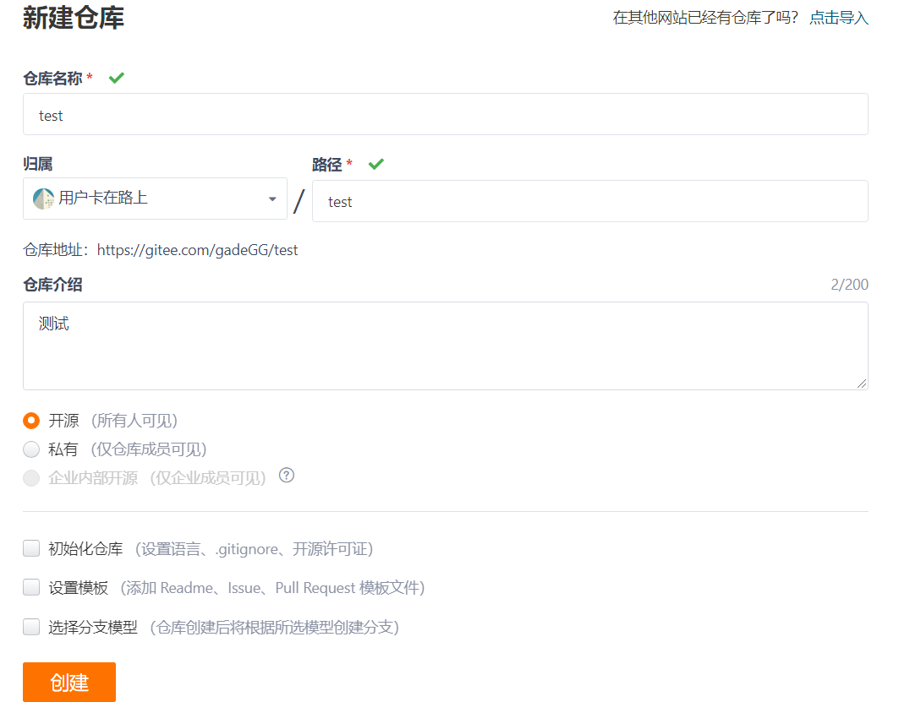
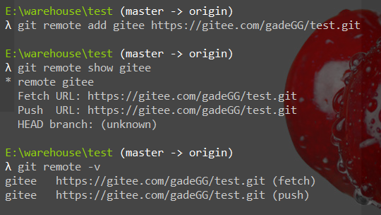
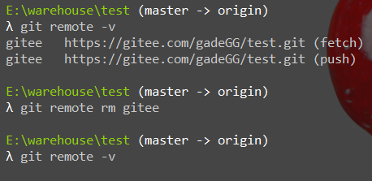
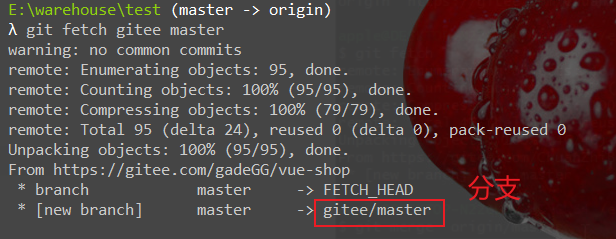
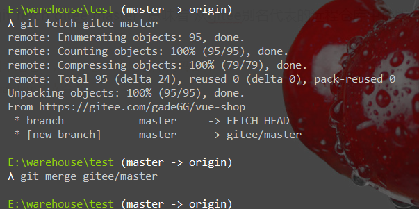

## 环境配置

*   查看git已配置信息

    ```bash
    git config --list
    ```

*   设置用户信息

    ```bash
    git config --global user.name "renyi"
    git config --global user.email "email@qq.com"
    ```

    

## 获取Git仓库

*   本地初始化一个Git仓库

    1.  新建仓库文件夹 test，cmd进入test目录

    2.  ```bash
        git init
        ```

*   克隆远程仓库

    ```bash
    git clone 仓库地址
    ```

## 查看文件状态

```bash
git status
git status -s
```


## 文件<-->暂存区

`加入文件到暂存区`

```bash
git add .    #所有修改文件加入到暂存区
git add xxx   #将指定文件加入到暂存区
```



`将暂存区文件拖拽出来，即监管状态到不监管状态`

```bash
git reset xxx   #指定文件从监管状态(暂存区)恢复到未监管状态
git reset .     #将所有暂存区文件全部恢复到未监管状态
```


## 本地仓库操作

### `提交到本地仓库`

```bash
git commit . -m '日志信息'
git commit -a -m'日志信息' #针对新增或删除文件直接提交，不需要使用git add，另外也可以解决fatal: cannot do a partial commit during a merge.问题
```


### `删除本地文件`

```bash
git rm xxx   #只是删除了工作空间中文件并加入到暂存区，本地仓库中并没有删除
手动删除状态并不会加入到暂存区，需要使用git add 然后在git commit才能从本地仓库中删除
```



```bash
git commit . -m'delete A.txt'  #提交后才会从本地仓库中删除
```


### `将文件加入到忽略列表，不需要Git监管`

1.  工作目录中创建 .gitignore 文件

2.  文件演示

    ```bash
    # 文件
    *.a    # 所有a文件后缀的文件不被Git监管
    !lib.a   # lib.a 除外
    
    # 目录
    /TODO    #TODO目录以及目录下所有内容都不被Git管理
    build/    #build目录以及目录下所有内容都不被Git管理
    doc/*.txt   #doc目录下所有以txt结尾的文件忽略，不包括doc子目录
    doc/**/*.txt   #/**/代表多层目录，即doc下所有层级目录下以txt结尾的文件忽略
    ```

    

### `查看日志`

```bash
git log
```


### `切换到指定版本版本`

>   接手一个项目，让我在指定版本上开发，如何处理？

```bash
git checkout 版本号
```

1.  拉取项目 
2.  切换版本号


## 远程仓库管理

### `查看远程仓库`

```bash
git remote
git remote -v
git remote show origin
```






### `添加远程仓库`

```bash
git remote add 名称 远程仓库地址
```

1.  新建远程仓库

    

2.  关联远程仓库

    ```bash
    git remote add gitee https://gitee.com/gaaade111GG/test.git   # 其中gitee为远程仓库地址别名
    ```

    


### `从远程仓库克隆`

```bash
git clone 远程仓库地址
```

### `移除无效的远程仓库`

```bash
git remote rm xxx   #只是移除了本地仓库和远程仓库的关联关系，远程仓库不受影响
```



### `从远程仓库中抓取与拉取`



>   :jack_o_lantern:其中 gitee为关联远程仓库起的别名，git fetch gitee master  意味着 从gitee别名代表的远程仓库中拉取master分支到本地仓库，

```bash
git fetch 仓库名 分支   #从远程仓库拉取最新代码到本地仓库，并不会和本地仓库代码合并
git merge origin/master   #从origin/master分支合并

git pull  仓库名  分支    #从远程仓库拉取并合并
```



>   :alarm_clock:如果本地仓库有内容，管理啊远程仓库后进行拉取，提示 ： fatal: refusing to merge unrelated histories 。则使用
>
>   ```bash
>   git pull origin master --allow-unrelated-histories 然后输入内容后wq 再次push即可。
>   ```

### `推送到远程仓库`

```bash
git push 仓库别名 分支
```

