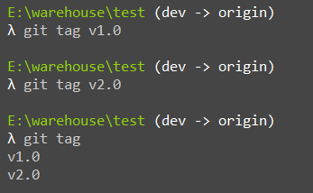
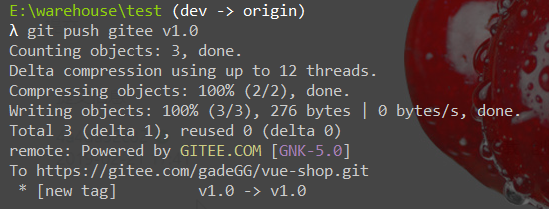
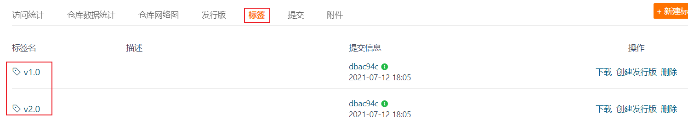
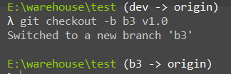
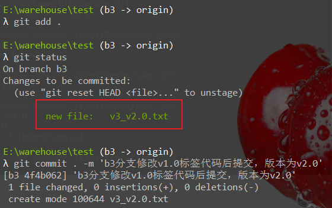
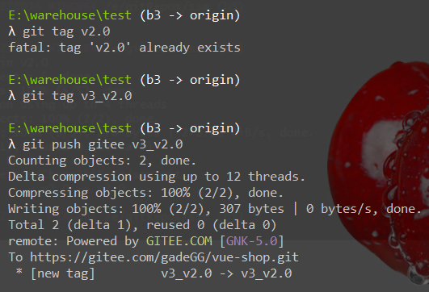
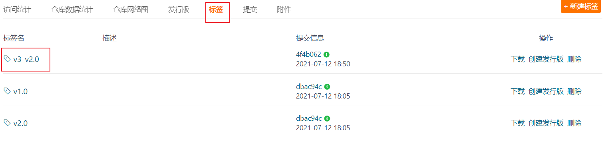

## 作用

*   分支 作用是 不同版本的控制
*   标签的作用的给分支打标签，以示重要，比较有代表性的是人们会使用这个功能来标记发布节点（例如v1.0，v2.0等），通过标签我们可以很快得切换到标记时的状态


## 标签

>   标签是针对分支而言，即对不同的分支创建多个标签

### 列出所有标签

```bash
git tag   #显示标签
git show tagName  # 显示指定标签信息
```


### 创建标签

```bash
git tag name
```




### 将标签推送至远程仓库

```bash
git push 仓库别名 标签名
```






### 检出标签

>   作用 ： 比如某个功能提交时，打了标签，如果出现了问题我们可以将标签指定代码拉取到分支下进行操作修改。

```bash
#新建分支  指向某个tag
git checkout -b branchName tagName
```




1.  在 b3分支上 修改 v1.0对应的代码

    

2.  将修改后的状态打标签

    

    


## 删除标签

*   删除本地标签

    ```bash
    git tag -d tagName
    ```

*   删除远程标签

    ```bash
    git push 仓库别名 :refs/tags/tagName  ## 千万注意呐，仓库别名后面有一个空格
    ```

    