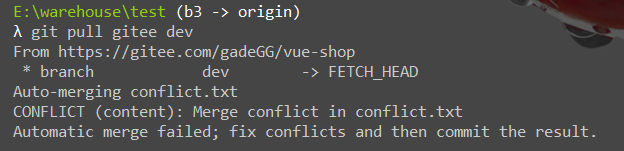

## 使用compare软件快速解决冲突

1.  冲突制造

    *   b3和fix分支同时修改 一个文件 conflict.txt
    *   fix 分支先提交并push到fix分支，然后合并到dev分支
    *   b3 分支在提交前pull dev分支，发现冲突

    

    

2.  下载compare软件

3.  在Git中配置

    *   win

        1.  在 C:\Users\用户名\\.gitconfig 添加如下内容

            ```bash
            [diff]
                tool = bc3
            [difftool]
                prompt = false
            [difftool "bc3"]
                cmd = \"D:\Beyond Compare 4/BCompare.exe\" \"$LOCAL\" \"$REMOTE\" 
            
            [merge]
                tool = bc3
            [mergetool]
                prompt = false
                keepBackup = false
            [mergetool "bc3"]
                cmd = \"D:\Beyond Compare 4/BCompare.exe\" \"$LOCAL\" \"$REMOTE\" \"$BASE\" \"$MERGED\"
            ```

        2.  修改为自己的BCompare路径

4.  应用并使用beyond compare解决冲突

    *   查看指定文件

        ```bash
        git difftool <file_name>
        ```

    *   查看所有更改的文件

        ```bash
        git difftool
        ```


