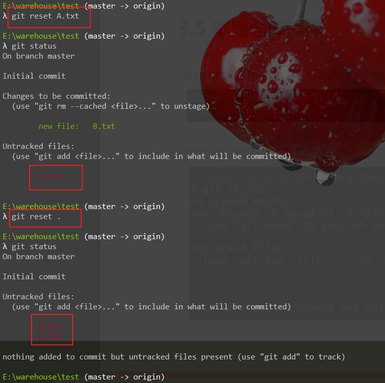
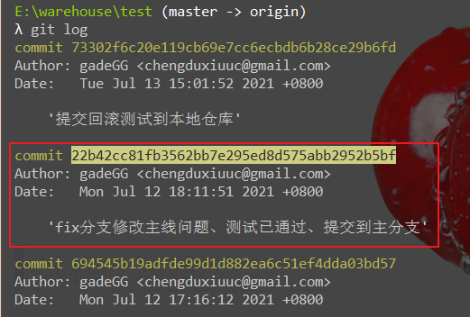
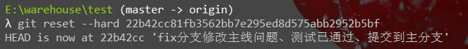
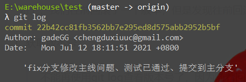
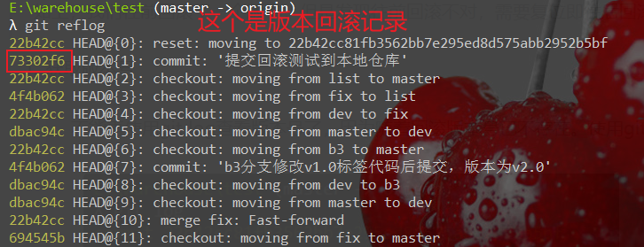

## 暂存区回滚

>   从暂存区 将监管文件修改为不可监管文件

```bash
git reset xxx   #指定文件从监管状态(暂存区)恢复到未监管状态
git reset .     #将所有暂存区文件全部恢复到未监管状态
```




## 本地仓库回滚

1.  获取要回滚的版本号

    ```bash
    git log
    ```

    

    >   我想要删除掉 '提交回滚测试到本地仓库' 这一块修改的代码，即回滚到上一个版本，那么拷贝上一个版本号 ，即黄色底色的字符串

2.  回滚到指定版本号

    ```bash
    git reset --hard 版本号
    ```

    


## 本地仓库回滚后再回滚回去

>   如上，我们往前回滚了一个版本，但是发现往前回滚不对，需要复位即往后回滚，怎么办？

1.  获取版本号

    >   不能再使用git log查看版本号了，因为随着回滚版本号已不存在。使用git reflog

    

    

    

    

2.  版本复位

    ```bash
    git reset --hard 版本号
    ```

    

## 远程仓库回滚

