`引言:`

>   在GitHub中创建一个组织，在该组织下创建不同的项目，并且针对不同的项目拉取不同的成员开发，并且方便给每个成员赋予权限

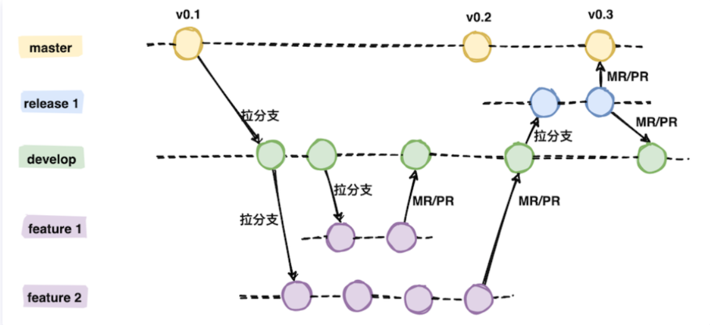

>   下面用实例逐步实现上图中内容

## Gitflow流程

### 1、创建组织

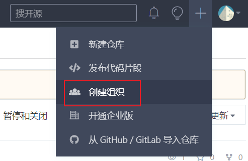


### 2、组织中创建项目

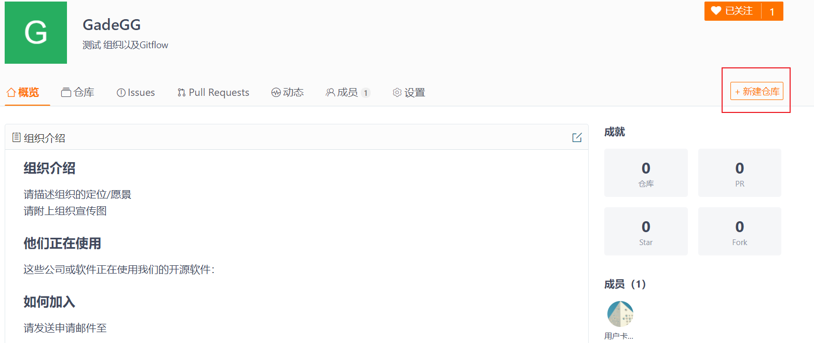

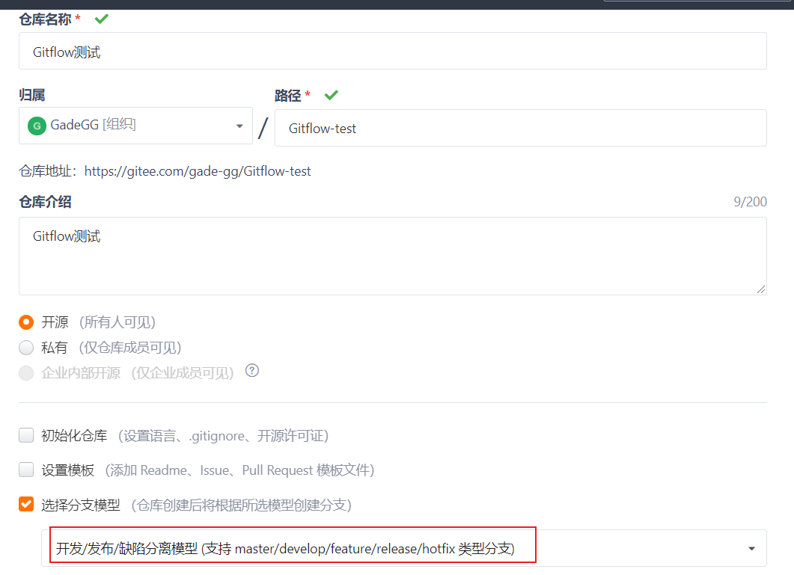


### 3、添加成员

*   组织中添加成员

    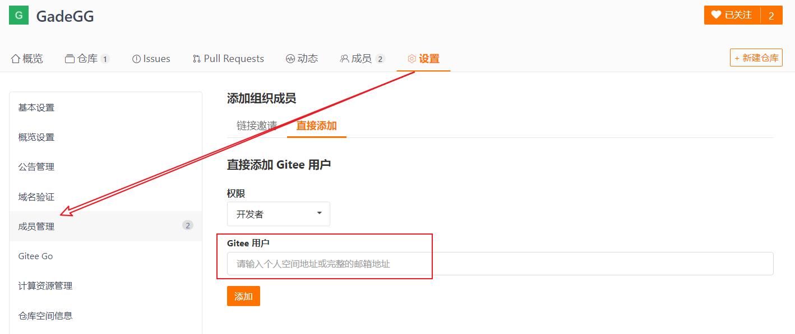

*   组织项目中添加成员

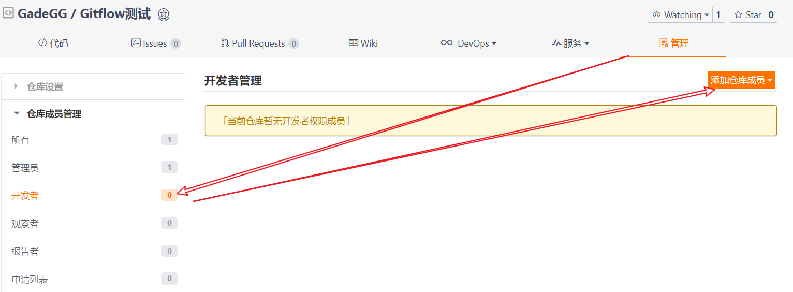

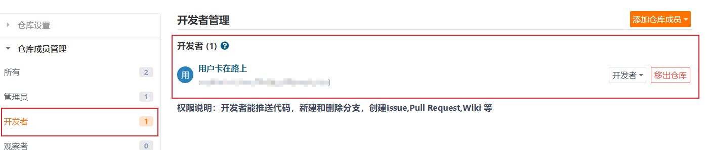


### 4、初始化和远程仓库关联

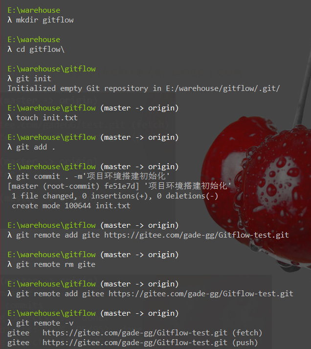

### 5、push到远程仓库分享其他组员

```bash
git push gitee master
```


### 6、master分支打标签

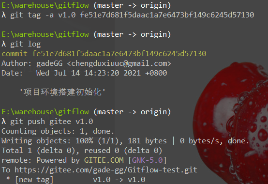

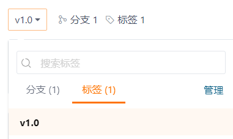

### 7、创建发行版供用户下载

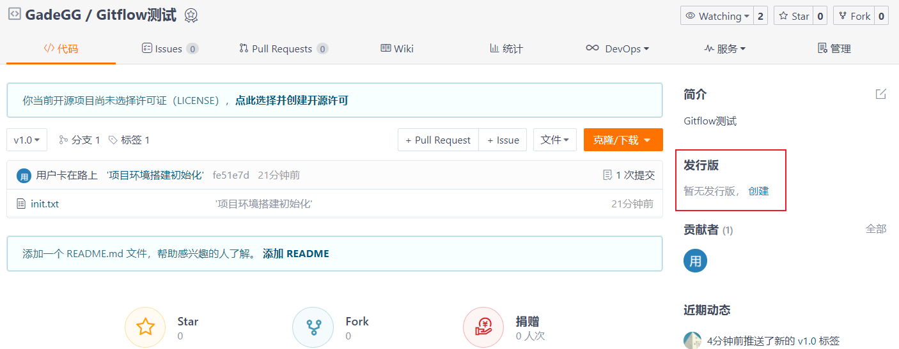

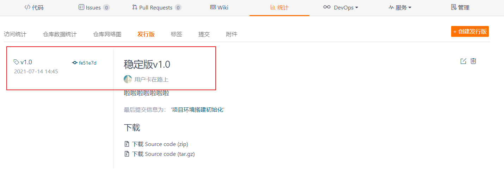

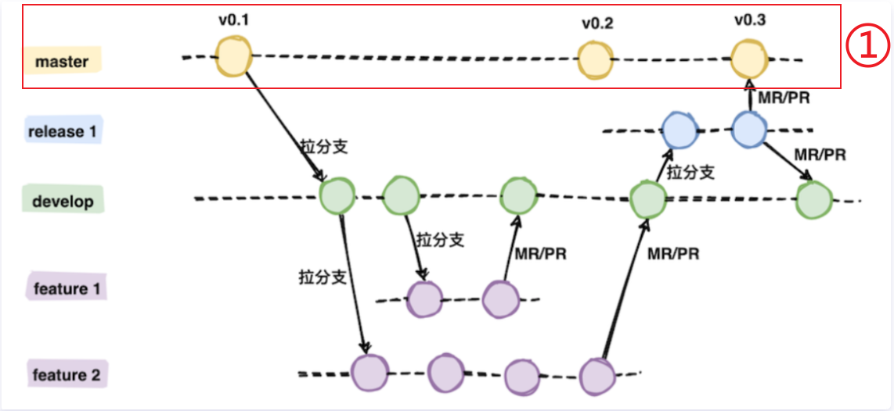

>   至此，上图中 master分支项目环境搭建以及第一版已完成


### 8、管理员创建dev分支，供其他成员以此发展分支

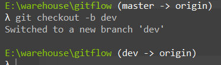

假如有两个成员，以开发功能命名分支，当然也可以使用成员姓名命名。管理员在dev分支基础上创建两个分支，一个叫斗地主（ddz），一个叫扎金花（zjh）

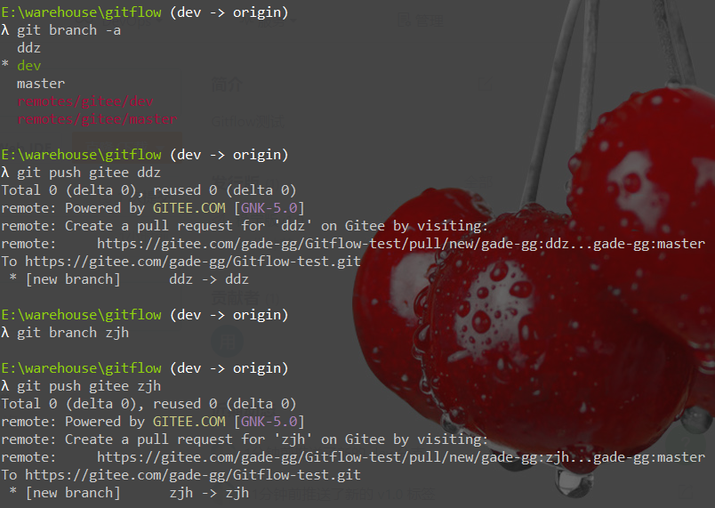


### 9、模拟成员开发ddz功能

*   新建文件夹并拉取仓库代码

    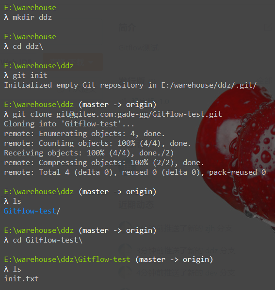

*   切换到 ddz分支开发功能，开发了一半 先提交到远程仓库ddz分支，回家继续干

    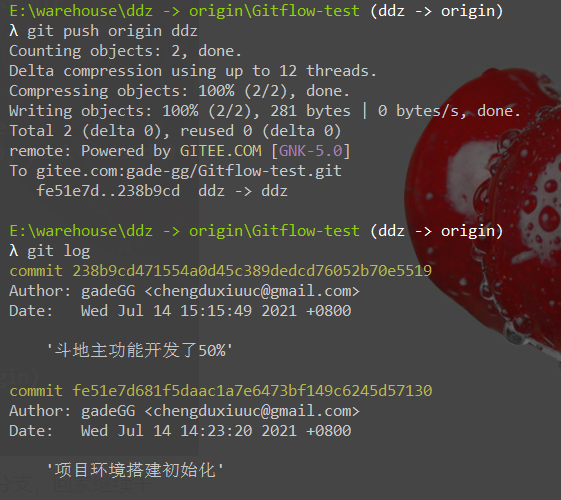

    

*   回家拉取ddz分支继续干，干完提交到ddz远程分支

    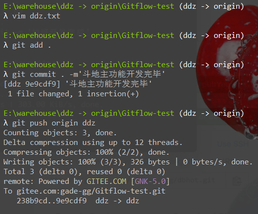


### 10、ddz功能开发完毕->合到dev分支前需要代码review

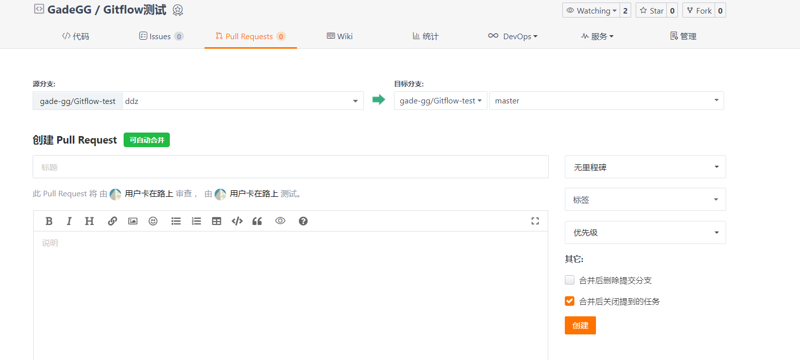

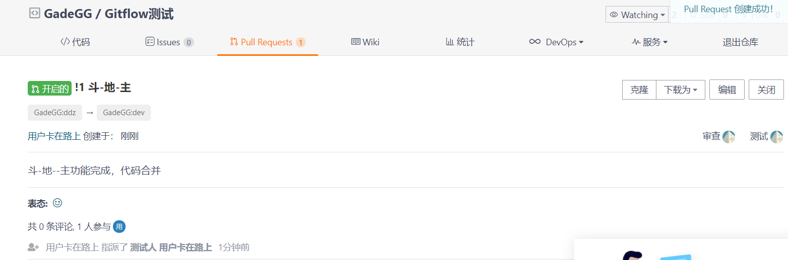

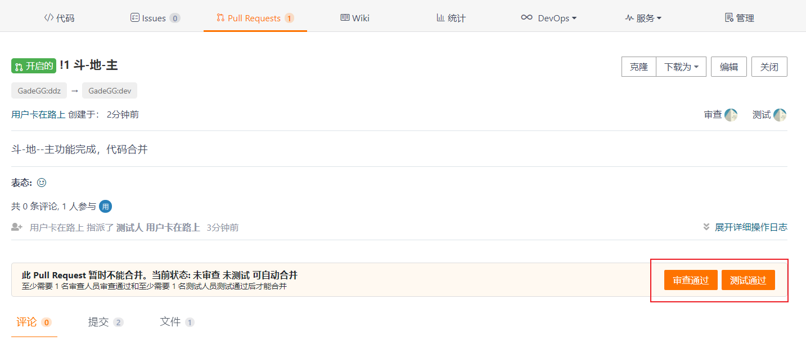


### 11、创建release分支，交给测试回滚，测试通过直接和master合并，并打标签

