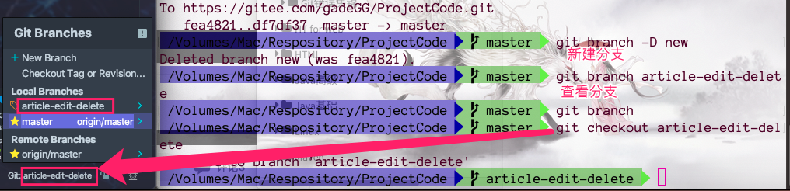

1. Ang新建一个分支

	```bash
	git branch newbranch
	```

2. 查看所有分支

	```bash
	git branch
	```

3. 切换分支

	```bash
	git checkout newbranch
	```

	> IDEA切换分支修改代码：当本地分支修改后，idea同步修改。webstrom一样。

	

4. 分支代码提交

	```bash
	git add . 
	git commit -m "提交"
	```

	> <font color=ff00aa>注意：</font>分支不需要 push 如果push则省略掉第六步骤中的第四小步

5. 检查

	```bash
	git status
	```

6. 同步到主分支

	1. ```bash
		git checkout master  --切换到主分支
		```

	2. ```bash
		git merge newbranch --将newbranch分支（本地）代码合并到master
		```

	3. ```bash
		git push origin master --主分支提交
		```

	4. ```bash
		git push origin newbranch --分支提交
		```

		> <font color=ff00aa>注意：</font> 如果在   同步到主分支    之前已push分支代码则第四步不用执行

7. 删除分支

	```bash
	git branch -D newbranch
	```

	