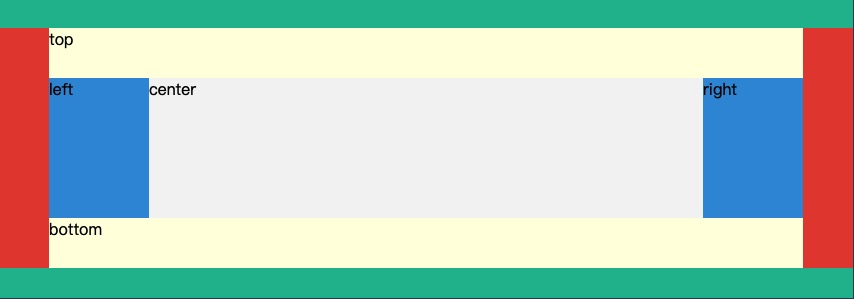

### 属性组件
HT for Web提供了属性组件类ht.widget.PropertyView，用于显示DataModel数据容器中，当前选中的Data类型对象的属性， 支持分组、排序和过滤等方式展示属性。另外ht提供了属性面板插件， 该扩展插件将分组、排序和过滤提供了可视化的组件封装。

### 列表组件

HT for Web提供了列表组件类ht.widget.ListView，用于显示DataModel数据容器中Data类型对象的属性信息，支持排序和过滤等功能。

### 树形组件
HT for Web提供了树表组件类ht.widget.TreeView，用于显示DataModel数据容器中Data类型对象的父子关系树形结构，支持排序和过滤等功能。

### 表格组件
HT for Web提供了表格组件类ht.widget.TableView，用于显示DataModel数据容器中Data类型对象的属性信息，支持排序和过滤等功能。

通过tableView = new ht.widget.TableView(dataModel);初始化构建一个表格组件对象，dataModel参数为表格组件绑定的数据模型， 该模型为空时表格组件构造函数内部将创建一个新的数据模型进行绑定。

### 树表组件
HT for Web提供了树表组件类ht.widget.TreeTableView，该组件融合了树和表格的展示方式，显示DataModel数据容器中Data对象的父子关系和属性信息， 支持排序和过滤等功能。

### 工具条组件
HT for Web提供了工具条组件类ht.widget.Toolbar，工具条上的元素可为原生的html元素， 也支持ht提供的如ht-form.js的表单插件中的组件，并内置提供了按钮、单选按钮、复选框等组件。

### 分割组件
HT for Web提供了分割组件类ht.widget.SplitView，分割组件用于左右或上下分割两个子组件， 子组件可为HT框架提供的组件，也可为HTML的原生组件，子组件以position为absolute方式进行绝对定位。

### 边框面板组件
HT for Web提供了边框面板ht.widget.BorderPane的组件布局容器，可在上、下、左、右、中的五个区域位置摆放子组件， 子组件可为HT框架提供的组件，也可为HTML原生组件，子组件以position为absolute方式进行绝对定位。

### 折叠组件
HT for Web提供了折叠组件类ht.widget.AccordionView，用于多组件的折叠展开效果， 提供水平和垂直两种布局方式，折叠组件以position为absolute方式进行绝对定位。

### 页签组件
HT for Web提供了页签组件类ht.widget.TabView，以页签的方式呈现多组件，页签支持拖拽和关闭等功能， 页签对应的视图组件可为HT框架提供的组件，也可为HTML原生组件，子组件以position为absolute方式进行绝对定位。

