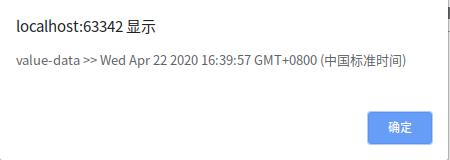

### 1、cookie

　　Cookie实际上是一小段的文本信息。客户端请求服务器，如果服务器需要记录该用户状态，就使用response向客户端浏览器颁发一个Cookie。客户端浏览器会把Cookie保存起来。当浏览器再请求该网站时，浏览器把请求的网址连同该Cookie一同提交给服务器。服务器检查该Cookie，以此来辨认用户状态。服务器还可以根据需要修改Cookie的内容。由于cookie的安全性不高并且每个domain最多只能有20条cookie，每个cookie长度不能超过4KB。否则会被截掉。，所以一般不把密码保存在cookie中；

```JavaScript
//设置固定过期时间的cookies
function setCookie(name,value){
    var Days = 30;
    var exp = new Date();
    exp.setTime(exp.getTime() + Days*24*60*60*1000);
    document.cookie = name + "="+ escape (value) + ";expires=" + exp.toGMTString();
}
//设置自定义过期时间cookie
function setCookie(name,value,time){
    var msec = getMsec(time); //获取毫秒
    var exp = new Date();
    exp.setTime(exp.getTime() + msec*1);
    document.cookie = name + "="+ escape (value) + ";expires=" + exp.toGMTString();
}
//将字符串时间转换为毫秒,1秒=1000毫秒
function getMsec(DateStr){
   var timeNum=str.substring(0,str.length-1)*1; //时间数量
   var timeStr=str.substring(str.length-1,str.length); //时间单位前缀，如h表示小时
   if (timeStr=="s"){ //20s表示20秒
        return timeNum*1000;}
   else if (timeStr=="h"){ //12h表示12小时
       return timeNum*60*60*1000;}
   else if (timeStr=="d"){
       return timeNum*24*60*60*1000;} //30d表示30天
}
//读取cookies
function getCookie(name){
    var arr,reg=new RegExp("(^| )"+name+"=([^;]*)(;|$)"); //正则匹配
    if(arr=document.cookie.match(reg)){
      return unescape(arr[2]);
    }
    else{
     return null;
    }
}
//删除cookies
function delCookie(name){
    var exp = new Date();
    exp.setTime(exp.getTime() - 1);
    var cval=getCookie(name);
    if(cval!=null){
      document.cookie= name + "="+cval+";expires="+exp.toGMTString();
    }
}
```

### 2、localStorage

　　①相当于一个5M大小的前端数据库；

　　②存储的所有数据类型都为字符串型，如果要求其他类型，取出的时候要自行转换；

　　③localStorage的值在浏览器为隐私模式时无法读取；

　　④localStorage不会被网站爬虫读取到；

　　⑤localStorage具有同源策略，所以不能在不同网站之间使用；

　　⑤localStorage的存储：

　　　　1. localStorage.a=1;

　　　　2. localStorage["a"]=1;

　　　　3. localStorage.setItem（"a",1）；（取的时候为localStorage . getItem,删的时候为localStorage.removeItem("a")或者localStorage.clear()删除全部。）

　　　　4.key()方法，相当于遍历，获取 / 删除localStorage中的第几个数据

　　　　
```JavaScript
//自定义localstorage的过期逻辑
function set(key,val){
    var curTime=new Date().getTime();
    localStorage.setItem(key,JSON.stringify({data:val,time:curTime}))
}
function get(key,exp){
    var data=localStorage.getItem(key);
    var dataObj=JSON.parse(data);
    if(new Date().getTime()-dataObj.time>exp){
        console.log("已过期")
    }else{
        console.log("data="+dataObj.data)
    }
}
```
　　

### 3、sessionStorage

    sessionStorage与localStorage的一点区别就是会化结束时，sessionStorage的值会消失，而localStorage的值则会永久保存；

>session取决于三个要素：浏览器关闭，你设置的时长，和手动销毁，你随便哪个操作，session就都不会存在了  

```JavaScript
//存数据
window.onload=function () {
    var val="value-data";
    var curTime=new Date().getTime();//毫秒数  使用new Date(curTime)即可转成日期格式
    sessionStorage.setItem("key",JSON.stringify({data:val,time:curTime}));
}
//读数据
window.onload=function () {
  var time=JSON.parse(sessionStorage.getItem("key")).time;
  alert(JSON.parse(sessionStorage.getItem("key")).data+" >> "+new Date(JSON.parse(sessionStorage.getItem("key")).time));
}
```
<center>
    
    <br>
    <div style="color:orange; border-bottom: 1px solid #d9d9d9;
    display: inline-block;
    color: #999;
    padding: 2px;">sessionStorage效果图</div>
</center>

### localStorage和sessionStorage相同点：
具有相同的API > 用法：

1、设置 localStorage.setItem(‘name’,‘tina’)

2、获取 localStorage.getItem(‘name’)

3、删除单个 localStorage.removeItem(‘name’)

4、删除全部 localStorage.clear()

5、获取长度 localStorage.length

### localStorage和sessionStorage区别：

1、不同浏览器无法共享localStorage或sessionStorage中的信息。

2、相同浏览器的不同页面间可以共享相同的 localStorage（页面属于相同域名和端口），但是不同页面或标签页间无法共享sessionStorage的信息。这里需要注意的是，页面及标 签页仅指顶级窗口，如果一个标签页包含多个iframe标签且他们属于同源页面，那么他们之间是可以共享sessionStorage的。
