## GC分类

### 1、按照线程数分

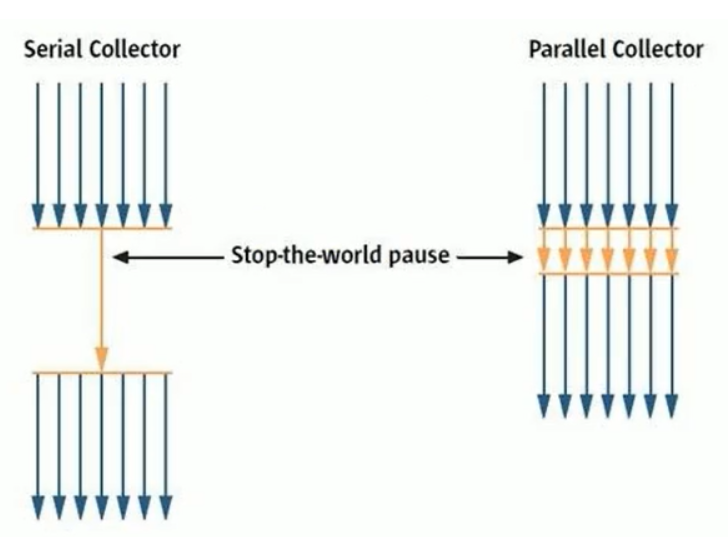

*   串行垃圾回收器

    指在同一段时间内只允许有一个CPU执行GC垃圾回收，此时所有的用户线程都会被暂停。适用于单核CPU或者硬件性能指标低的设备上或者是JVM Client上。

*   并行垃圾回收器

    旨在同一段时间内允许多核CPU并发或者并行执行GC线程。适用于CPU并发能力强劲的设备上，提高了GC吞吐量因此STW短于串行

### 2、按照工作模式分

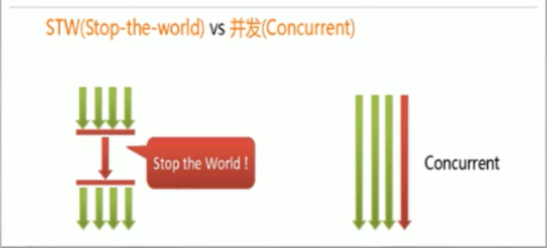

*   并发式垃圾回收器

    与应用程序交替工作，尽可能减少停顿时间

*   独占式垃圾回收器

    一旦运行，所有的用户线程必须停止，等待其GC结束

### 3、按照碎片处理方式分

*   压缩式垃圾回收器

    使用标记清除压缩算法GC后，则会进行存活对象碎片整理

*   非压缩式垃圾回收器

    使用复制或者标记清除算法GC后，没有碎片整理

## GC性能指标

-   **`吞吐量`**：运行用户代码的时间占总运行时间的比例（吞吐量=运行用户代码时间 /（运行用户代码时间+垃圾收集时间））
-   **垃圾收集开销**：吞吐量的补数，垃圾收集所用时间与总运行时间的比例。
-   **`暂停时间`**：执行垃圾收集时，程序的工作线程被暂停的时间。
-   **收集频率**：相对于应用程序的执行，收集操作发生的频率。
-   **内存占用**：Java堆区所占的内存大小。
-   **快速**：一个对象从诞生到被回收所经历的时间。

>   其中 吞吐量  和  STW 占比最大，也是优秀垃圾回收器的优化指标。并且这两个指标并不能在一款垃圾回收器中全部达到最优解，只能满足一个最优。

### 1、吞吐量

>   比如：虚拟机总共运行了100分钟，其中垃圾收集花掉1分钟，那吞吐量就是99%。

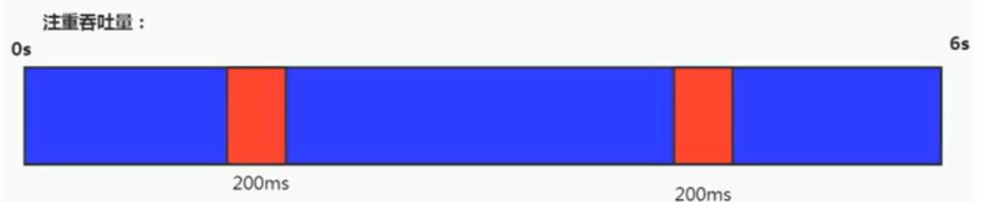

这种情况下，应用程序能容忍较高的暂停时间，因此，高吞吐量的应用程序有更长的时间基准，快速响应是不必考虑的

吞吐量优先，意味着在单位时间内，STW的时间最短：0.2+0.2=e.4

>   高吞吐量的程序适用于服务器开发，即非交互式产品上，会让用户感觉到程序运行很快，高吞吐量意味着 gc频率降低，从而导致GC次数提升，即STW次数变多

### 2、STW

“暂停时间”是指一个时间段内应用程序线程暂停，让Gc线程执行的状态

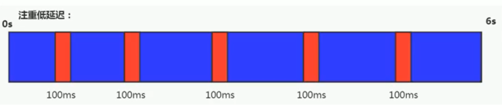

例如，GC期间1e0毫秒的暂停时间意味着在这1e0毫秒期间内没有应用程序线程是活动的。暂停时间优先，意味着尽可能让单次STW的时间最短：0.1+0.1 + 0.1+ 0.1+ 0.1=0.5

>   低延时则适用于交互式产品上，注重体验的用户上。类似于王者网络延时

## 标记清除  标记压缩  复制算法   可达性分析算法

### 1、复制算法：

1.  将内存分为两块
2.  可达性分析算法找到可触及对象，标记可触及对象【不是标记垃圾对象】
3.  GC时将可触及对象放到另外一块内存，注意此时并不会删除不可触及对象，而是下次使用时直接覆盖，跟我们电脑硬盘格式化后还能恢复一个道理，如果你格式化后又重新写入了数据，那就。。。。
4.  下次GC时，谁空谁是TO，和我们S0和S1区就对上了

>   因为是来回复制，从"0"地址开始，因此它的内存划分 是通过指针碰撞来进行的。

### 2、可达性分析算法

对象存活的状态三种

在Java语言中，可作为GC Roots的对象包含以下几种：

1.  虚拟机栈(栈帧中的本地变量表)中引用的对象。(可以理解为:引用栈帧中的本地变量表的所有对象)
2.  方法区中静态属性引用的对象(可以理解为:引用方法区该静态属性的所有对象)
3.  方法区中常量引用的对象(可以理解为:引用方法区中常量的所有对象)
4.  本地方法栈中(Native方法)引用的对象(可以理解为:引用Native方法的所有对象)

>   而只要是和GC Roots对象有强引用关系则为可触及对象，不可回收。

### 3、标记清楚算法

## 垃圾收集器发展史

-   1999年随JDK1.3.1一起来的是串行方式的serialGc，它是第一款GC。ParNew垃圾收集器是Serial收集器的多线程版本
-   2002年2月26日，Parallel GC和Concurrent Mark Sweep GC跟随JDK1.4.2一起发布·
-   Parallel GC在JDK6之后成为HotSpot默认GC。
-   2012年，在JDK1.7u4版本中，G1可用。
-   2017年，JDK9中G1变成默认的垃圾收集器，以替代CMS。
-   2018年3月，JDK10中G1垃圾回收器的并行完整垃圾回收，实现并行性来改善最坏情况下的延迟。
-   2018年9月，JDK11发布。引入Epsilon 垃圾回收器，又被称为 "No-Op(无操作)“ 回收器。同时，引入ZGC：可伸缩的低延迟垃圾回收器（Experimental）
-   2019年3月，JDK12发布。增强G1，自动返回未用堆内存给操作系统。同时，引入Shenandoah GC：低停顿时间的GC（Experimental）。·2019年9月，JDK13发布。增强zGC，自动返回未用堆内存给操作系统。
-   2020年3月，JDK14发布。删除cMs垃圾回收器。扩展zGC在macos和Windows上的应用

## 七种经典垃圾收集器

-   串行回收器：Serial、Serial old
-   并行回收器：ParNew、Parallel Scavenge、Parallel old
-   并发回收器：CMS、G1

### 1、垃圾收集器与jvm分代之间的关系

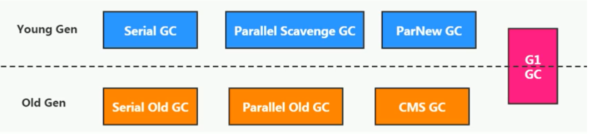	

新生代收集器：Serial、ParNew、Paralle1 Scavenge；

老年代收集器：Serial old、Parallel old、CMS；

整堆收集器：G1；

### 2、垃圾收集器组合关系

>   不同 代 中用到的垃圾回收算法不一样，例如 新生代就非常适合复制算法，浪费了20分之一的新生代内存，提升了极高的垃圾回收效率，老年代适合于标记清楚和标记整理算法。也就适配不同的垃圾回收器。

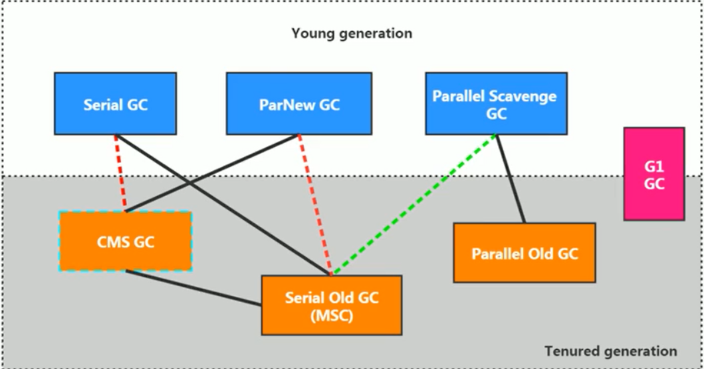

-   两个收集器间有连线，表明它们可以搭配使用(即老年代和新生代垃圾回收器)：Serial/Serial old、Serial/CMS、ParNew/Serial old、ParNew/CMS、Parallel Scavenge/Serial 0ld、Parallel Scavenge/Parallel 01d、G1；
-   其中Serial o1d作为CMs出现"Concurrent Mode Failure"失败的后备预案。
-   （红色虚线）由于维护和兼容性测试的成本，在JDK 8时将Serial+CMS、ParNew+Serial old这两个组合声明为废弃（JEP173），并在JDK9中完全取消了这些组合的支持（JEP214），即：移除。
-   （绿色虚线）JDK14中：弃用Paralle1 Scavenge和Serialold GC组合（JEP366）
-   （青色虚线）JDK14中：删除CMs垃圾回收器（JEP363）

**为什么要有很多收集器，一个不够吗？**

>   因为不同的硬件环境适用不同的垃圾回收器，没有最好的垃圾回收器，只有最适合的垃圾回收器，比如串行垃圾回收器在单CPU场景下效率就高于并发|并行垃圾回收器

### 3、查看默认垃圾回收器

-XX:+PrintcommandLineFlags ：查看命令行相关参数（包含使用的垃圾收集器）

使用命令行指令：jinfo -flag 相关垃圾回收器参数 进程ID

*   JDK 1.7.0_80 Server VM   :  默认 ParallelGC 并行垃圾回收器

    >   -XX:MaxHeapSize=1073741824 -XX:MaxPermSize=536870912 -XX:+PrintCommandLineFlags -XX:+UseCompressedOops -XX:-UseLargePagesIndividualAllocation -XX:+UseParallelGC

*   JDK 1.8.0_212 Server VM ：默认 ParallelGC 并行垃圾回收器

    >   -XX:+UseParallelGC 

    

*   JDK 11  默认G1

    >   -XX:+UseG1GC 

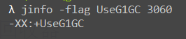

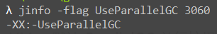

##  Serial回收器：串行回收

Serial收集器 分为年轻代->Serial GC    老年代 ->Serial Old GC

Serial收集器是最基本、历史最悠久的垃圾收集器了。JDK1.3之前回收新生代唯一的选择。

Serial收集器作为**HotSpot中client模式下**的默认**新生代**垃圾收集器。

Serial收集器采用**复制算法**、**串行回收**和"stop-the-World"机制的方式执行内存回收。

除了年轻代之外，Serial收集器还提供用于执行老年代垃圾收集的Serial old收集器。Serial old收集器同样也采用了串行回收和"stop the World"机制，只不过内存回收算法使用的是标记-压缩算法。

-   Serial old是运行在Client模式下默认的老年代的垃圾回收器
-   Serial 0ld在Server模式下主要有两个用途：
    -   与新生代的Parallel scavenge配合使用
    -   作为老年代CMS收集器的后备垃圾收集方案

这个收集器是一个单线程的收集器，但它的“单线程”的意义并不仅仅说明它只会使用一个CPU或一条收集线程去完成垃圾收集工作，**更重要的是在它进行垃圾收集时，必须暂停其他所有的工作线程，直到它收集结束（Stop The World）**

`优势`

串行垃圾回收器，简单而高效，对于单CPU设备来讲，其省去了并发垃圾回收器线程切换的开销，性能相对较高

### 1、使用它

在HotSpot虚拟机中

>   使用-XX：+UseSerialGC  可以指定年轻代和老年代都使用串行收集器。等价于新生代用Serial GC，且老年代用Serial old GC

现在的服务器一般都不是单核的了，因此这个垃圾回收器了解下即可。

##  ParNew回收器：并行回收

如果说serialGC是年轻代中的单线程垃圾收集器，那么ParNew收集器则是serial收集器的多线程版本。

-   Par是Parallel的缩写，New：只能处理的是新生代
-   是Serial GC 收集器的多线程版本，除此之外，其余都差不多，也是**复制算法**
-   是很多jvm Server模式下默认的垃圾收集器

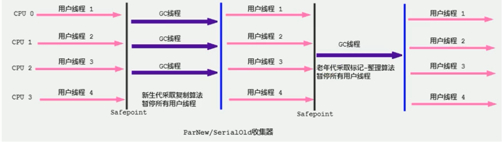

>   -   对于新生代，回收次数频繁，使用并行方式高效。
>   -   对于老年代，回收次数少，使用串行方式节省资源。（CPU并行需要切换线程，串行可以省去切换线程的资源）

### 1、使用它

>   -XX：+UseParNewGC 指定使用ParNew收集器执行内存回收任务。**它表示年轻代使用并行收集器，不影响老年代。**

>   -XX:ParallelGCThreads限制线程数量，默认开启和CPU数据相同的线程数。

因为 ParNew 新生代垃圾收集器只能与 Serial Old GC 和CMS GC搭配，但是在JDK8中已经不再维护Serial Old GC和ParNew了，更要命的是在JDK14中已删除CMS GC，因此该回收器已成光杆司令，了解就好

##  `Parallel回收器：吞吐量优先`

*   和ParNew很相似，也是并行回收，复制算法，STW
*   其对应的老年代回收器为Parallel Old GC
*   **Parallel Old GC 同样基于并行回收，STW，采用了 标记-压缩算法**
*   区别在于，Parallel更注重吞吐量，因此它可以通过设置来保持一个可控的吞吐量，它也被称为吞吐量优先的垃圾收集器。
*   自适应调节策略也是Paralle1 Scavenge与ParNew一个重要区别。
*   常见在服务器模式JVM Server环境中使用。例如，那些执行批量处理、订单处理、工资支付、科学计算的应用程序。
*   jdk7和8之中都是用的此垃圾回收器。

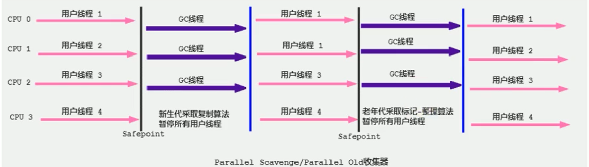

### 1、使用

1.  -XX：+UseParallelGC     指定年轻代使用Paralle GC并行收集器执行内存回收任务。

2.  -XX：+UseParallelOldGC    手动指定老年代都是使用并行回收收集器。

    >   分别适用于新生代和老年代。默认jdk8是开启的。
    >
    >   上面两个参数，默认开启一个，另一个也会被开启。（互相激活）

3.  -XX:ParallelGcrhreads     设置年轻代并行收集器的线程数。一般地，最好与CPU数量相等，以避免过多的线程数影响垃圾收集性能。

    >   在默认情况下，当CPU数量小于8个，ParallelGcThreads的值等于CPU数量。
    >
    >   当CPU数量大于8个，ParallelGCThreads的值等于3+[5*CPU Count]/8]

4.  -XX:MaxGCPauseMillis    设置垃圾收集器最大停顿时间（即STW的时间）。单位是毫秒。

    >   为了尽可能地把停顿时间控制在MaxGCPauseMi11s以内，收集器在工作时会调整Java堆大小或者其他一些参数。 对于用户来讲，停顿时间越短体验越好。但是在服务器端，我们注重高并发，整体的吞吐量。所以服务器端适合Parallel，进行控制。该参数使用需谨慎。
    >
    >   简单来讲就是，MaxGCPauseMills 越小，则GC次数越多吞吐量越小，MaxGCPauseMills 稍大，则GC次数越少吞吐量越大

5.  -XX:GCTimeRatio      垃圾收集时间占总时间的比例（=1/（N+1））。用于衡量吞吐量的大小。

6.  -XX:+UseAdaptivesizepplicy     设置Parallel scavenge收集器具有自适应调节策略

    >   强烈建议使用此配置
    >
    >   在这种模式下，年轻代的大小、Eden和Survivor的比例、晋升老年代的对象年龄等参数会被自动调整，已达到在堆大小、吞吐量和停顿时间之间的平衡点。

##  CMS回收器：低延迟

*   在JDK1.5时期，Hotspot推出了一款在强交互应用中几乎可认为有划时代意义的垃圾收集器：CMS（Concurrent-Mark-Sweep）收集器，这款收集器是HotSpot虚拟机中第一款真正意义上的并发收集器，**它第一次实现了让垃圾收集线程与用户线程同时工作**。

*   CMS收集器的关注点是**尽可能缩短垃圾收集时用户线程的停顿时间**。停顿时间越短（低延迟）就越适合与用户交互的程序，良好的响应速度能提升用户体验。

*   目前很大一部分的Java应用集中在互联网站或者B/S系统的服务端上，这类应用尤其重视服务的响应速度，希望系统停顿时间最短，以给用户带来较好的体验。CMS收集器就非常符合这类应用的需求。

*   CMS的垃圾收集算法采用**标记-清除算法**，并且也会"stop-the-world"

*   不幸的是，CMS作为老年代的收集器，却无法与JDK1.4.0中已经存在的新生代收集器Parallel Scavenge配合工作，所以在JDK1.5中使用CMS来收集老年代的时候，新生代只能选择ParNew或者Serial收集器中的一个。

    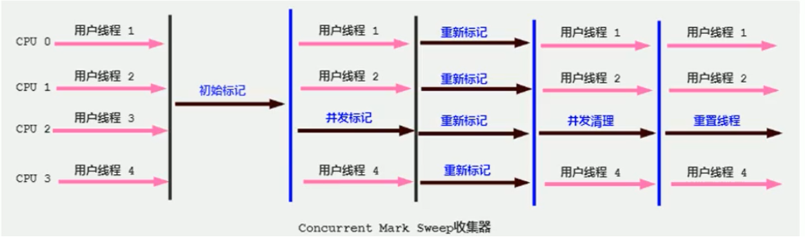

1.  **初始标记**（Initial-Mark）阶段：在这个阶段中，程序中所有的工作线程都将会因为“stop-the-world”机制而出现短暂的暂停，这个阶段的主要任务仅仅只是**标记出GCRoots能直接关联到的对象**。一旦标记完成之后就会恢复之前被暂停的所有应用线程。由于直接关联对象比较小，所以这里的速度非常快。---> 需要STW

2.  **并发标记**（Concurrent-Mark）阶段：从Gc Roots的直接关联对象开始遍历整个对象图的过程，这个过程耗时较长但是不需要停顿用户线程，可以与垃圾收集线程一起并发运行。---> 不需要STW

3.  **重新标记**（Remark）阶段：由于在并发标记阶段中，程序的工作线程会和垃圾收集线程同时运行或者交叉运行，因此为了修正并发标记期间，因用户程序继续运作而导致标记产生变动的那一部分对象的标记记录，这个阶段的停顿时间通常会比初始标记阶段稍长一些，但也远比并发标记阶段的时间短。----需要STW

3.  **并发清除**（Concurrent-Sweep）阶段：此阶段清理删除掉标记阶段判断的已经死亡的对象，释放内存空间。由于不需要移动存活对象，所以这个阶段也是可以与用户线程同时并发的 ----> 不需要STW

>   另外，由于在垃圾收集阶段用户线程没有中断，所以在CMS回收过程中，还应该确保应用程序用户线程有足够的内存可用。因此，CMS收集器不能像其他收集器那样等到老年代几乎完全被填满了再进行收集，而是当堆内存使用率达到某一阈值时，便开始进行回收，以确保应用程序在CMS工作过程中依然有足够的空间支持应用程序运行。要是CMS运行期间预留的内存无法满足程序需要，就会出现一次“Concurrent Mode Failure” 失败，这时虚拟机将启动后备预案：临时启用Serial old收集器来重新进行老年代的垃圾收集，这样停顿时间就很长了。