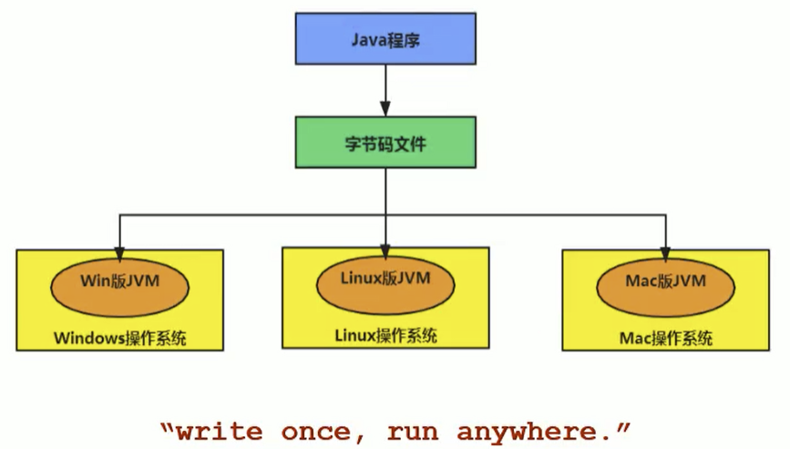
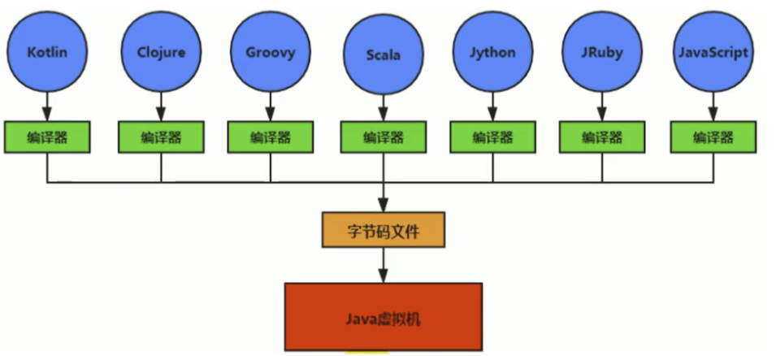
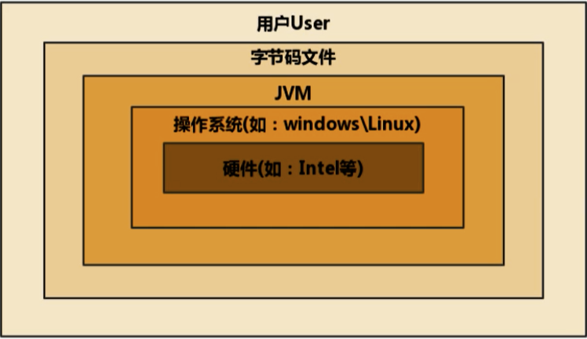
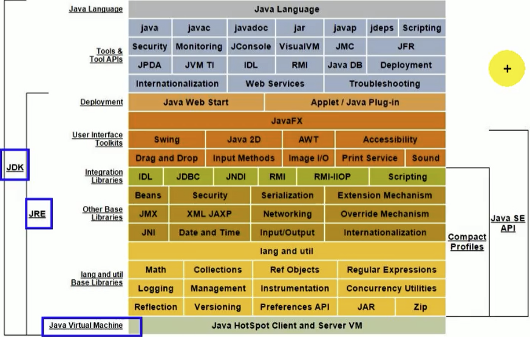
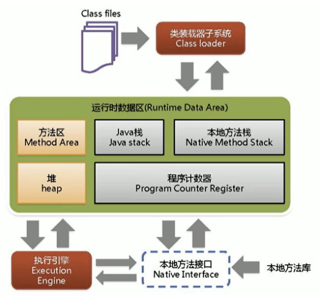
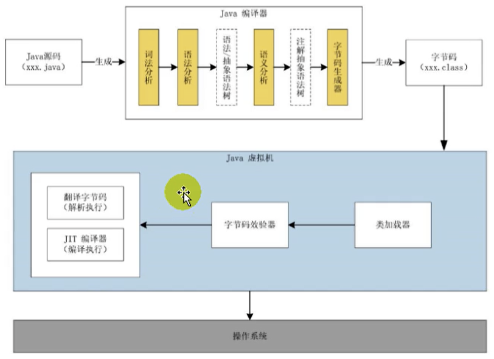
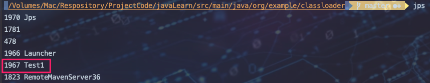

## 概念

`跨平台`





> 跨平台指的是：Java程序在编译class字节码文件后可以运行在不同平台的操作系统，之所以能运行在不同的操作系统得益于jvm虚拟机，即Java程序编译后的class字节码文件运行在不同平台的虚拟机上进行奔跑，实现跨平台特性。`字节码文件`  和`虚拟机`


`字节码文件`

* 我们都知道Java时SUN旗下产品，SUN每年都会推出`JVM虚拟机规范`  和  `JVM虚拟机(规范的实现) -- Java HotSpot Virtual Machine`
* 很多厂家根据SUN公司推出的 `JVM虚拟机规范`，研发出了不同的 `JVM虚拟机`,只不过 `HotSpot虚拟机`是Java是默认虚拟机。

* 上图我们看到，JVM虚拟机操作的对象 就是`字节码文件`。不同`语言的编译器`可以产生`相同的字节码`，只要`符合jvm规范`就可以使用`不同的JVM虚拟机`去运行，人话就是：一门语言只要你推出能够产生`符合JVM虚拟机规范的字节码class文件的编译器`，那么你就能跨平台。
* Java虚拟机和Java语言并没有强关联，JVM虚拟机只与特定的二进制文件格式—Class文件格式所关联，其他语言编译后也可以产生Class字节码文件,Class文件中包含了Java虚拟机指令集（或者称为字节码、Bytecodes）和符号表，还有一些其他辅助信息。如上图
* 一个项目中特定领域的问题由特定领域的语言去解决，使用其编译器编译成Class文件，然后使用JVM去运行。未来微服务的一大发展趋势。

> 试想一下，在一个项目之中，并行处理用clojure语言编写，展示层使用JRuby/Rails，中间层则是Java，每个应用层都将使用不同的编程语言来完成，而且，接口对每一层的开发者都是透明的，各种语言之间的交互不存在任何困难，就像使用自己语言的原生API一样方便，因为它们最终都运行在一个虚拟机之上。

`虚拟机`

* 有系统虚拟机(VM)、容器虚拟机(Docker)、Java虚拟机等等。
* Java虚拟机是一台执行Java字节码的虚拟计算机，它拥有独立的运行机制，其运行的Java字节码也未必由Java语言编译而成。
* JVM平台的各种语言可以共享Java虚拟机带来的`跨平台`、优秀的`垃圾回收器`，以及可靠的`即时编译器`。
* Java技术的核心就是Java虚拟机，Java所有的程序都是运行在JVM虚拟机上。
* 三大主流虚拟机：`Java默认虚拟机HotSpot`、`JRockit`、`J9`

> 由于JVM虚拟机高特性，越来越多的语言使用JVM虚拟机去解释运行，上面讲到的微服务统一使用JVM去运行将成为趋势。

## Java发展重大事件

- 1990年，在Sun计算机公司中，由Patrick Naughton、MikeSheridan及James Gosling领导的小组Green Team，开发出的新的程序语言，命名为`oak`，后期命名为`Java`
- 1995年，Sun正式发布Java和HotJava产品，Java首次公开亮相。
- 1996年1月23日sun Microsystems发布了JDK 1.0。
- 1998年，JDK1.2版本发布。同时，sun发布了JSP/Servlet、EJB规范，以及将Java分成了`J2EE、J2SE和J2ME`。这表明了Java开始向企业、桌面应用和移动设备应用3大领域挺进。
- 2000年，JDK1.3发布，`Java HotSpot Virtual Machine`正式发布，成为Java的`默认虚拟机`。
- 2002年，JDK1.4发布，古老的`Classic虚拟机`退出历史舞台。
- 2003年年底，Java平台的scala正式发布，同年Groovy也加入了Java阵营。
- 2004年，JDK1.5发布。同时JDK1.5改名为JavaSE5.0。
- 2006年，JDK6发布。同年，`Java开源并建立了openJDK`。顺理成章，`Hotspot虚拟机也成为了openJDK中的默认虚拟机`。
- 2007年，Java平台迎来了新伙伴Clojure。
- 2008年，oracle收购了BEA，得到了`JRockit虚拟机`。
- 2009年，Twitter宣布把后台大部分程序从Ruby迁移到scala，这是Java平台的又一次大规模应用。
- 2010年，`oracle收购了sun`，获得Java商标和最真价值的HotSpot虚拟机。此时，oracle拥有市场占用率最高的两款虚拟机HotSpot和JRockit，并计划在未来对它们进行整合：HotRockit
- 2011年，JDK7发布。在JDK1.7u4中，正式启用了新的`垃圾回收器G1`。
- 2017年，JDK9发布。将`G1设置为默认Gc，替代CMS`
- 同年，IBM的J9开源，形成了现在的open J9社区
- 2018年，Android的Java侵权案判决，Google赔偿oracle计88亿美元
- 同年，oracle宣告JavagE成为历史名词JDBC、JMS、Servlet赠予Eclipse基金会
- 同年，JDK11发布，LTS版本的JDK，发布革命性的`垃圾回收器zGc`，调整JDK授权许可
- 2019年，JDK12发布，加入RedHat领导开发的shenandoah GC


## JVM位置和体系



> JVM是运行在操作系统之上的，它与硬件没有直接的交互




## JVM整体架构



* 上图分为三部分：`上部分负责将Java文件(在本地磁盘|JAR或者远程服务器磁盘|JAR)   编译   为class字节码文件`。`中部分将class文件指令等加载解析到内存`。`下部分将字节码指令等编译为机器语言交由操作系统执行`

- HotSpot VM是目前市面上高性能虚拟机的代表作之一。
- 它采用解释器与即时编译器并存的架构。
- 在今天，Java程序的运行性能早已脱胎换骨，已经达到了可以和C/C++程序一较高下的地步。
- 执行引擎包含三部分：`解释器`，`及时编译器`，`垃圾回收器`


## Java代码执行流程



* 上部分 ：`Java前端编译器`中任何一步错误，都不会生成字节码文件，防止恶意攻击
* 中部分 ：`翻译字节码、JIT编译器`属于`执行引擎`

* `翻译字节码`：将class字节码及时编译（逐行编译）为机器码去执行，保证`响应时间`。
* `JIT编译器`：字节码中有一些为`热点代码`会多次执行，`JIT编译器`将`热点代码编译后进行缓存存入方法区`，下一次直接执行即可省掉了编译时间，保证了`执行速度`


## JVM的架构模型

Java编译器输入的指令流基本上是一种基于栈的指令集架构，另外一种指令集架构则是基于寄存器的指令集架构。具体来说：这两种架构之间的区别：

`基于栈式架构的特点`

- 设计和实现更简单，`适用于资源受限的系统`(机顶盒等小件终端)；
- 避开了寄存器的分配难题：使用`零地址指令方式分配`。
- 指令流中的指令大部分是零地址指令，其执行过程`依赖于操作栈`。`指令集更小，编译器容易实现`。
- `不需要硬件支持，可移植性更好，更好实现跨平台`

`基于寄存器架构的特点`

- 典型的应用是`x86的二进制指令集`：比如传统的`PC以及Android的Davlik虚拟机`。
- 指令集架构则`完全依赖硬件`，`可移植性差`
- `性能优秀和执行更高效`
- `花费更少的指令`去完成一项操作。
- 在大部分情况下，基于寄存器架构的指令集往往都以一地址指令、二地址指令和三地址指令为主，而基于栈式架构的指令集却是以零地址指令为主

### 举例

同样执行2+3这种逻辑操作，其指令分别如下：

基于栈的计算流程（以Java虚拟机为例）：

```bash
iconst_2 //常量2入栈
istore_1
iconst_3 // 常量3入栈
istore_2
iload_1
iload_2
iadd //常量2/3出栈，执行相加
istore_0 // 结果5入栈
```

而基于寄存器的计算流程

```bash
mov eax,2 //将eax寄存器的值设为1
add eax,3 //使eax寄存器的值加3
```

### 字节码反编译

我们编写一个简单的代码，然后查看一下字节码的反编译后的结果

```java
/**
 * @author: 陌溪
 * @create: 2020-07-04-21:17
 */
public class StackStruTest {
    public static void main(String[] args) {
        int i = 2 + 3;
    }
}
```

然后我们找到编译后的 class文件，使用下列命令进行反编译

```java
javap -v StackStruTest.class
```

得到的文件为:

```java
  public static void main(java.lang.String[]);
    descriptor: ([Ljava/lang/String;)V
    flags: ACC_PUBLIC, ACC_STATIC
    Code:
      stack=2, locals=4, args_size=1
         0: iconst_2
         1: istore_1
         2: iconst_3
         3: istore_2
         4: iload_1
         5: iload_2
         6: iadd
         7: istore_3
         8: return
      LineNumberTable:
        line 9: 0
        line 10: 2
        line 11: 4
        line 12: 8
      LocalVariableTable:
        Start  Length  Slot  Name   Signature
            0       9     0  args   [Ljava/lang/String;
            2       7     1     i   I
            4       5     2     j   I
            8       1     3     k   I
```

### 总结

由于跨平台性的设计，Java的指令都是根据栈来设计的。不同平台CPU架构不同，所以不能设计为基于寄存器的。优点是跨平台，指令集小，编译器容易实现，缺点是性能下降，实现同样的功能需要更多的指令。

时至今日，尽管嵌入式平台已经不是Java程序的主流运行平台了（准确来说应该是HotSpotVM的宿主环境已经不局限于嵌入式平台了），那么为什么不将架构更换为基于寄存器的架构呢？已完全适配


## JVM生命周期

`虚拟机启动`

Java虚拟机的启动是通过引导类加载器（bootstrap class loader）创建一个初始类（initial class类似于web启动类或者Java程序MAIN函数所在的类）来完成的，这个类是由虚拟机的具体实现指定的。


`虚拟机执行`

- 一个运行中的Java虚拟机有着一个清晰的任务：执行Java程序。
- `程序开始执行时他才运行，程序结束时他就停止`。
- 执行一个所谓的Java程序的时候，真真正正在执行的是一个叫做Java虚拟机的进程。

> 即一个JVM对应一个系统进程，当程序结束后，虚拟机进程也就结束了

```java
public class Test1 {
    public static void main(String[] args) throws InterruptedException {
        Thread.sleep(500000);
    }
}
```

> 查看当前Java进程 ：jps



`虚拟机结束`

* 程序正常结束
* 物理异常或者error错误
* 某线程调用Runtime类或system类的exit方法，或Runtime类的halt方法，并且Java安全管理器也允许这次exit或halt操作。


## JVM发展历程

### Sun Classic VM

- 早在1996年Java1.0版本的时候，Sun公司发布了一款名为`sun classic VM`的Java虚拟机，它同时也是世界上第一款商用Java虚拟机，`JDK1.4时完全被淘汰`。
- 这款虚拟机内部`只提供解释器`。没有`JIT及时编译器`，因此效率比较低，而`JIT及时编译器会把热点代码缓存起来`，那么以后使用热点代码的时候，效率就比较高。
- 如果使用`JIT编译器`，就需要进行`外挂`。但是一旦使用了JIT编译器，JIT就会接管虚拟机的执行系统。解释器就不再工作。`解释器和编译器不能配合工作`。
- 现在hotspot内置了此虚拟机。

### Exact VM

为了解决上一个虚拟机问题，jdk1.2时，sun提供了此虚拟机。 Exact Memory Management：准确式内存管理

- 也可以叫Non-Conservative/Accurate Memory Management
- 虚拟机可以知道内存中某个位置的数据具体是什么类型。|

具备现代高性能虚拟机的维形

- `热点探测`（寻找出热点代码进行缓存）
- `编译器与解释器混合工作模式`

* 只在solaris平台短暂使用，其他平台上还是classic vm，英雄气短，`终被Hotspot虚拟机替换`

### HotSpot VM

HotSpot历史

- 最初由一家名为“Longview Technologies”的小公司设计
- 1997年，此公司被sun收购；2009年，Sun公司被甲骨文收购。
- `JDK1.3时，HotSpot VM成为默认虚拟机`

目前Hotspot占有绝对的市场地位，称霸武林。

- 不管是现在仍在广泛使用的JDK6，还是使用比例较多的JDK8中，`默认的虚拟机都是HotSpot`
- `Sun/oracle JDK和openJDK的默认虚拟机`
- `因此本课程中默认介绍的虚拟机都是HotSpot，相关机制也主要是指HotSpot的Gc机制`。（比如其他两个商用虚机都没有方法区的概念）从服务器、桌面到移动端、嵌入式都有应用。`名称中的HotSpot指的就是它的热点代码探测技术。`

- 通过`计数器找到最具编译价值代码，触发即时编译或栈上替换`
- 通过`编译器与解释器协同工`作，在最优化的程序响应时间与最佳执行性能中取得平衡

### JRockit

`专注于服务器端应用`

- 它可以`不太关注程序响应速度`，因此JRockit内部`不包含解析器`实现，全部代码都靠`即时编译器编译后执行`。大量的行业基准测试显示，JRockit JVM是世界上最快的JVM。

- 使用JRockit产品，客户已经体验到了显著的性能提高（一些超过了70%）和硬件成本的减少（达50%）。

优势：全面的Java运行时解决方案组合

- JRockit面向延迟敏感型应用的解决方案JRockit Real Time提供以毫秒或微秒级的JVM响应时间，适合财务、军事指挥、电信网络的需要
- MissionControl服务套件，它是一组以极低的开销来监控、管理和分析生产环境中的应用程序的工具。

2008年，JRockit被oracle收购。oracle表达了整合两大优秀虚拟机的工作，大致在JDK8中完成。整合的方式是在HotSpot的基础上，移植JRockit的优秀特性。

高斯林：目前就职于谷歌，研究人工智能和水下机器人

### IBM的J9

全称：IBM Technology for Java Virtual Machine，简称IT4J，内部代号：J9

市场定位与HotSpot接近，服务器端、桌面应用、嵌入式等多用途VM广泛用于IBM的各种Java产品。

目前，有影响力的三大商用虚拟机之一，也号称是世界上最快的Java虚拟机。

2017年左右，IBM发布了开源J9VM，命名为openJ9，交给EClipse基金会管理，也称为Eclipse OpenJ9

OpenJDK -> 是JDK开源了，包括了虚拟机

### KVM和CDC / CLDC Hotspot

oracle在`Java ME`产品线上的两款虚拟机为：CDC/CLDC HotSpot Implementation VM KVM（Kilobyte）是CLDC-HI早期产品目前移动领域地位尴尬，智能机被Angroid和ioS二分天下。

KVM简单、轻量、高度可移植，面向更低端的设备上还维持自己的一片市场

- 智能控制器、传感器
- 老人手机、经济欠发达地区的功能手机

所有的虚拟机的原则：一次编译，到处运行。

### Azul VM

前面三大“高性能Java虚拟机”使用在通用硬件平台上这里Azu1VW和BEALiquid VM是与特定硬件平台绑定、软硬件配合的专有虚拟机I

- 高性能Java虚拟机中的战斗机。

Azul VM是Azu1Systems公司在HotSpot基础上进行大量改进，运行于Azul Systems公司的专有硬件Vega系统上的ava虚拟机。

每个Azu1VM实例都可以管理至少数十个CPU和数百GB内存的硬件资源，并提供在巨大内存范围内实现可控的GC时间的垃圾收集器、专有硬件优化的线程调度等优秀特性。

2010年，AzulSystems公司开始从硬件转向软件，发布了自己的zing JVM，可以在通用x86平台上提供接近于Vega系统的特性。

### Liquid VM

高性能Java虚拟机中的战斗机。

BEA公司开发的，直接运行在自家Hypervisor系统上Liquid VM即是现在的JRockit VE（Virtual Edition），

Liquid VM不需要操作系统的支持，或者说它自己本身实现了一个专用操作系统的必要功能，如线程调度、文件系统、网络支持等。

随着JRockit虚拟机终止开发，Liquid vM项目也停止了。

### 总结

具体JVM的内存结构，其实取决于其实现，不同厂商的JVM，或者同一厂商发布的不同版本，都有可能存在一定差异。主要以oracle HotSpot VM为默认虚拟机。