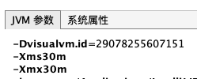
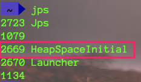
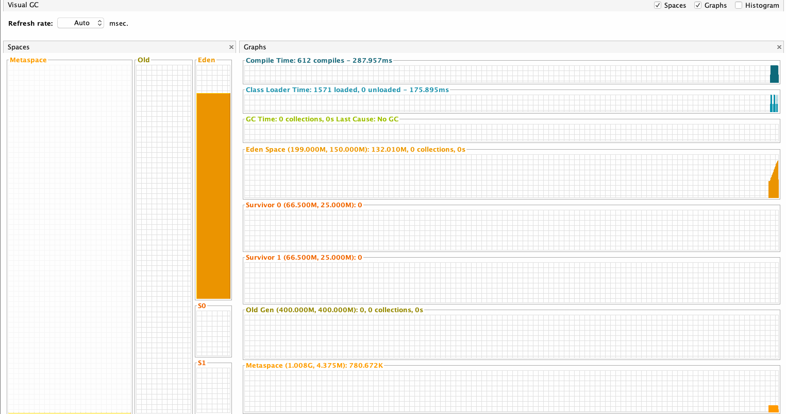

`引言:`

​	前几章讲到了 ==运行时数据区==中的 ==PC寄存器==、==本地方法栈==、==虚拟机栈==。

* 其中PC寄存器主管 jvm指令在多线程下运行控制
* 本地方法栈主管 本地方法调用管理，现在随着Java生态完善，很少用到
* 虚拟机栈也是最重要的，其分为一个个栈帧，一个栈帧对应一个方法，栈顶栈帧对应当前运行时方法，主管方法运行。栈帧又分为
	* 局部变量表：保存方法局部变量
	* 操作数栈：临时存放 jvm执行引擎执行结果
	* 动态链接：运行时常量池引用，为了在方法执行中用到常量池中变量
	* 方法返回地址：无论是否异常返回，都会返回方法调用时的地址

> jvm执行引擎  从局部变量表中获取数据，在操作数栈中执行逻辑。然后交由CPU处理jvm指令编译后的机器码。并根据PC寄存器一步步执行


## 堆介绍


* 一个进程只有一个JVM，但是进程中包含多个线程，堆为线程共享数据区域

* 堆在JVM启动即进程启动时，其空间已经确定了。并且其大小是可以调节的。

	> -Xms10m：最小堆内存
	>
	> -Xmx10m：最大堆内存
	>
	> <font color=ff00aa>最大最小堆内存在设置时应保持一样。减少堆内存动态调解时性能损耗</font>

* 几乎所有的对象实例都是在 堆 中进行分配内存(下面会讲到 `标量替换`、`栈上分配`)
* 堆中的对象只有在GC时才会进行垃圾回收，并不会随着方法的结束而消除
* 堆是GC的重点关照区域


## 堆内存细分

Java 7及之前堆内存逻辑上分为三部分：新生区+养老区+永久区

- Young Generation Space 新生区 Young/New 又被划分为==Eden区==和==Survivor区==
- Tenure generation space 养老区 Old/Tenure
- Permanent Space永久区 Perm

Java 8及之后堆内存逻辑上分为三部分：新生区+养老区+元空间

- Young Generation Space新生区 Young/New 又被划分为==Eden区==和==Survivor区==
- Tenure generation space 养老区 Old/Tenure
- Meta Space 元空间 Meta

> Java 8 将之前的永久区 替换为 电脑物理内存(元空间)。这块将不会发生OOM。新生代 分为==Eden区==和 ==Survivor区==。而==Survivor区== 又分为了S0和S1：作用是对象复制。


### 1、堆内存为什么要分这么细？

存储在Java堆内存中的对象，一般分为两类

* 一类是生命周期较短的瞬时对象，这类对象的创建和消亡都非常迅速。生命周期短的，及时回收即可
* 另外一类对象的生命周期却非常长，在某些极端的情况下还能够与JVM的生命周期保持一致

因此，如果不细分的话，将所有对象直接存储在堆内存中，那么在GC的时候，需要将堆内存全部扫描，而85%的对象都属于短生命周期。而如果划分了年轻代和老年代，我们只需要频繁的GC年轻代 + 少次数GC老年代即可提高效率


### 2、堆中老年代年轻代内存占比


- 新生代：老年代 - > 1 : 2
- Eden：From：to -> 8:1:1


### 3、修改默认占比

配置新生代与老年代在堆结构的占比。

- 默认-XX:NewRatio=2，表示新生代占1，老年代占2，新生代占整个堆的1/3
- 可以修改-XX:NewRatio=4，表示新生代占1，老年代占4，新生代占整个堆的1/5

> 当发现在整个项目中，生命周期长的对象偏多，那么就可以通过调整 老年代的大小，来进行调优

1. Java代码

	```java
	public class EdenSurvivorTest {
	    public static void main(String[] args) throws InterruptedException {
	        System.out.println("打个酱油 ~~");
	        Thread.sleep(1000*1000);
	    }
	}
	```

2. jvm参数

	-Xms30m -Xmx30m

3. 查看

	

	

4. 修改年轻代老年代默认比例  JVM参数 -Xms30m -Xmx30m -XX:NewRatio=5

	

	

5. jvm命令查看

	> jps
	>
	> jinfo -flag 参数名称
	>
	> jinfo -flag NewRatio 进程号

	

6. 修改伊甸园：S0:S1 占比 JVM参数 ：  -Xms30m -Xmx30m -XX:NewRatio=5 -XX:SurvivorRatio=3

	

	

7. jvm命令查看

	> jps
	>
	> jinfo -flag SurvivorRatio 进程号

	


##堆内存查看

### 1、Java代码查看

- 初始内存大小：物理电脑内存大小/64
- 最大内存大小：物理电脑内存大小/4

```java
public class HeapSpaceInitial {
    public static void main(String[] args) {
        /*Every Java application has a single instance of class Runtime 
        that allows the application to interface with the environment in 
        which the application is running. The current runtime can be obtained from the getRuntime method*/
        long initialMemory = Runtime.getRuntime().totalMemory() / 1024 / 1024;
        long maxMemory = Runtime.getRuntime().maxMemory() / 1024 / 1024;
        System.out.println("-Xms:" + initialMemory + "M");
        System.out.println("-Xmx:" + maxMemory + "M");
    }
}

//-Xms:491M  即 年轻代(伊甸园 + E0 | E1) + 老年代  内存总量
//-Xmx:7282M
#电脑 32G
```


### 2、Java命令 查看

* jps  :  查看Java进程
* jstat  ： 查看Java进程详细信息


1. Java程序

	```java
	public class HeapSpaceInitial {
	    public static void main(String[] args) throws InterruptedException {
	        /*Every Java application has a single instance of class Runtime
	        that allows the application to interface with the environment in
	        which the application is running. The current runtime can be obtained from the getRuntime method*/
	        long initialMemory = Runtime.getRuntime().totalMemory() / 1024 / 1024;
	        long maxMemory = Runtime.getRuntime().maxMemory() / 1024 / 1024;
	        System.out.println("-Xms:" + initialMemory + "M");
	        System.out.println("-Xmx:" + maxMemory + "M");
	
	        //等待1000s 方便我们查看信息
	        Thread.sleep(1000*1000);
	    }
	}
	```

2. Jps 查看进程 ID

	

3. jstat 查看进程详细信息

	

	* S0C –幸存者0区域的容量，以KB为单位
	* S1C –幸存者1区域的容量，以KB为单位
	* S0U –幸存者0区域使用的空间以KB为单位
	* S1U –幸存者1区域以KB为单位使用空间
	* EC  –伊甸园地区容量（KB）
	* EU  –伊甸园地区的已利用空间（以KB为单位）
	* OC –老年代区域容量（KB）
	* OU –老年代区域的已利用空间，以KB为单位
	* MC –元空间区域容量（KB）
	* MU –元空间区域以KB为单位的使用空间
	* CCSC –压缩类空间区域的容量，以KB为单位
	* CCSU –压缩类空间区域以KB为单位使用空间
	* YGC –迄今为止发生的年轻GC事件的数量
	* YGCT –到目前为止，年轻GC花费的时间
	* FGC –迄今为止已发生的**完全GC**事件的数量
	* FGCT –到目前为止已花费的完整GC时间
	* GCT –到目前为止所花费的GC时间总量（基本上是YGCT + FGCT）

> 默认堆内存  =  伊甸园区 + 幸存者E0|E1 +老年代    ：（ 131584 + 21504 + 349696 ）/1024 = 491M

4. 查看进程下 某个参数值

	> jinfo -flag 参数名称
	>
	> Eg : 
	>
	> ​		jinfo -flag UseAdaptiveSizePolicy 3360
	>
	> ​		jinfo -flag NewRatio 3503 

### 3、Java参数查看


```java
public class HeapSpaceInitial {
    public static void main(String[] args) throws InterruptedException {
        /*Every Java application has a single instance of class Runtime
        that allows the application to interface with the environment in
        which the application is running. The current runtime can be obtained from the getRuntime method*/
        long initialMemory = Runtime.getRuntime().totalMemory() / 1024 / 1024;
        long maxMemory = Runtime.getRuntime().maxMemory() / 1024 / 1024;
        System.out.println("-Xms:" + initialMemory + "M");
        System.out.println("-Xmx:" + maxMemory + "M");

        //等待1000s 方便我们查看信息
//        Thread.sleep(1000*1000);
    }
}
```

> -Xms:491M
> -Xmx:7282M
>
> Heap    //堆内存信息
>  PSYoungGen      total 153088K, used 10527K [0x0000000715580000, 0x0000000720000000, 0x00000007c0000000)  //年轻代 总量 = 伊甸园 + 幸存者E0 | E1
>   eden space 131584K, 8% used [0x0000000715580000,0x0000000715fc7c98,0x000000071d600000)  // 伊甸园
>   from space 21504K, 0% used [0x000000071eb00000,0x000000071eb00000,0x0000000720000000)   // 幸存者E0 | FROM
>   to   space 21504K, 0% used [0x000000071d600000,0x000000071d600000,0x000000071eb00000)     // 幸存者E1 | TO
>  ParOldGen       total 349696K, used 0K [0x00000005c0000000, 0x00000005d5580000, 0x0000000715580000)  // 老年代
>   object space 349696K, 0% used [0x00000005c0000000,0x00000005c0000000,0x00000005d5580000)
>  Metaspace       used 2967K, capacity 4556K, committed 4864K, reserved 1056768K   // 元空间
>   class space    used 313K, capacity 392K, committed 512K, reserved 1048576K

### 4、Java自带 jvisualvm 查看


## 堆内存大小设置以及OOM

### 1、JVM参数

- “-Xms"用于表示堆区的起始内存，等价于-xx:InitialHeapSize
- “-Xmx"则用于表示堆区的最大内存，等价于-XX:MaxHeapSize

> 通常会将-Xms和-Xmx两个参数配置相同的值，其目的是**为了能够在ava垃圾回收机制清理完堆区后不需要重新分隔计算堆区的大小，从而提高性能**。


### 2、手动设置OOM

1. 修改 堆内存大小

	

2. 代码

	```java
	public class OomTest {
	    public static void main(String[] args) {
	        List<Integer> list = new ArrayList<>();
	        while(true) {
	            list.add(999999999);
	        }
	    }
	}
	```

3. 异常

	


## 对象分配过程

`流程:`

1. new的对象先放==伊甸园区==。此区有大小限制。

2. 当==伊甸园的空间填满==时，程序又需要创建对象，JVM的垃圾回收器将对伊甸园区进行==垃圾回收（MinorGC）==，将伊甸园区中的不再被其他对象所引用的对象进行销毁。再加载新的对象放到伊甸园区

	然后将伊甸园中的剩余对象移动到==幸存者0区==。并且幸存对象计数+1。

3. 如果==伊甸园再次触发垃圾回收==，并且同时也触发==幸存者0区垃圾回收==。然后将幸存下来的对象一并放入到==幸存者1区==。初次经历GC后剩余的计数为1。而从幸存者0再次幸存的对象放入幸存者1区,由于经历过两次GC，因此计数继续加1为2.

4. 如果再次经历垃圾回收，与步骤3类似，只是这次幸存者0区空了，需要将幸存者对象一并放入到幸存者0区。以此循环往复，直至幸存者0区或1区满。

5. 啥时候能去养老区呢？可以设置次数。默认是15次。

6. 在养老区，相对悠闲。当养老区内存不足时，再次触发GC：Major GC，进行养老区的内存清理、

7. 若养老区执行了Major GC之后，发现依然无法进行对象的保存，就会产生OOM异常。

> 简单来讲就是，伊甸园区创建对象，伊甸园满，触发 YGC 顺便将 S0或者 S1中有对象的区域GC。放入到没有对象的幸存者区域。以此循环往复，直至任一幸存者区满，放入老年代。老年代满则FGC。如果对象任然无法存入则OOM

`图解:`

1. 新创建的对象，一般都是存放在Eden区的，当我们Eden区满了后，就会触发GC操作，一般被称为 YGC / Minor GC操作

	

	> 初次都会放入到S0区域。当我们进行一次YGC后，红色的将会被回收，而绿色的还会被占用着，存放在S0(Survivor From)区。同时我们给每个对象设置了一个年龄计数器，一次回收后就是1。

2. 经历过GC后Eden区还有两个对象空位。继续存放对象，当Eden区再次存满的时候，又会触发一个MinorGC操作，此时`GC将会把 Eden和Survivor From（S0）中`的对象 进行一次收集，把存活的对象放到 `Survivor To区`，同时让年龄 + 1

	

	> 我们发现，幸存者区域 触发条件都是被动的，随着伊甸园区YGC而捎带上GC。并且每一次GC都会有一个幸存者区域是空的。因此在GC时，哪个幸存者区域为空则 为Survivor To区 而GC的幸存者区为Survivor From区
	>
	> <font color=ff00aa>YGC的触发条件是伊甸园区满，FGC触发条件是老年代满，而幸存者区并不会触发GC，被动触发，随着Eden的YGC而GC</font>

3. 不断的进行对象生成 和 垃圾回收，当Survivor中的对象的==年龄达到15==的时候，将会触发一次 Promotion晋升的操作，也就是将年轻代中的对象 晋升到 ==老年代==中

	


`流程:`


> 上图发现：晋升到老年代两种方式：1、对象存活达到阈值。2、对象太大，年轻代放不下

1. 代码

	```java
	public class HeapInstanceTest {
	    byte [] buffer = new byte[new Random().nextInt(1024 * 200)];
	    public static void main(String[] args) throws InterruptedException {
	        ArrayList<HeapInstanceTest> list = new ArrayList<>();
	        while (true) {
	            list.add(new HeapInstanceTest());
	            Thread.sleep(10);
	        }
	    }
	}
	```

2. JVM参数

	-Xms600m -Xmx600m

3. 示意图

	

	> S0和S1终有一个为空。为空则为to 另一个为from。最后当老年代满时触发FGC，因为我们这里创建的所有对象都在用，因此老年代执行一次FGC后直接OOM。现实项目中还是可以挣扎好久的。


##  Minor GC，MajorGC、Full GC

> STW : Stop-The-World ，当垃圾收集线程执行时，所有的业务线程都需要暂定直至垃圾收集完毕，因此减少GC 是JVM优化的着重点。
>
> <font color=ff00aa>Major GC 和 Full GC 的STW 时间是Minor GC 的十几倍</font>

- Minor GC：新生代的GC
- Major GC：老年代的GC
- Full GC：整堆收集，收集整个Java堆和方法区的垃圾收集


### 1、Minor GC

`触发条件` : 

​	年轻代，准确来讲是伊甸园区 满 ，触发 Minor GC(YGC)

`特点:`

* 百分之八十的Java对象都是朝生夕死，因此 YGC执行的非常频繁，并且回收速度也比较快
* Minor GC会引发STW，暂停其它用户的线程，等垃圾回收结束，用户线程才恢复运行

### 2、Major GC

`触发条件` : 

​	老年代满 ，触发 Major GC(YGC)

`特点:`

* Major GC的速度一般会比MinorGc慢10多倍以上，STW的时间更长，如果Major GC后，内存还不足，就报OOM了
* Major GC会引发STW，暂停其它用户的线程，等垃圾回收结束，用户线程才恢复运行

### 3、Full GC

触发Fu11GC执行的情况有如下五种：

- 调用System.gc（）时，系统建议执行Full - GC，但是`不必然执行`
- 老年代空间不足
- 方法区空间不足
- 通过Minor GC后进入老年代的平均大小大于老年代的可用内存
- 由Eden区、survivor spacee（From Space）区向survivor spacel（To Space）区复制时，对象大小大于To Space可用内存，则把该对象转存到老年代，且老年代的可用内存小于该对象大小

说明：Full GC 是开发或调优中尽量要避免的。这样暂时时间会短一些


### 4、GC举例

1. 代码

	```java
	public class GCTest {
	    public static void main(String[] args) {
	        int i = 0;
	        try {
	            List<String> list = new ArrayList<>();
	            String a = "新生代、老年代对象创建细节";
	            while(true) {
	                list.add(a);
	                a = a + a;
	                i++;
	            }
	        }catch (Exception e) {
	            e.getStackTrace();
	        }
	    }
	}
	```

2. JVM参数

	-Xms10m -Xmx10m -XX:+PrintGCDetails\

3. 结果

	```bash
	[GC (Allocation Failure) [PSYoungGen: 2048K->486K(2560K)] 2048K->688K(9728K), 0.0021135 secs] [Times: user=0.00 sys=0.00, real=0.00 secs] 
	## 伊甸园区 满  触发  YGC       				 新生代共2560K   由2048K 占有  YGC  后为486K	  整个堆 共9728K  由2048K 占有 YGC  后为688K
	[GC (Allocation Failure) [PSYoungGen: 2418K->484K(2560K)] 2621K->1622K(9728K), 0.0017872 secs] [Times: user=0.01 sys=0.01, real=0.01 secs] 
	## 伊甸园区 满  触发  YGC							 新生代共2560K   由2418K 占有  YGC  后为484K		整个堆 共9728K  由2621K 占有 YGC  后为1622K  
	[Full GC (Ergonomics) [PSYoungGen: 1689K->0K(2560K)] [ParOldGen: 6898K->4999K(7168K)] 8588K->4999K(9728K), [Metaspace: 3073K->3073K(1056768K)], 0.0071202 secs] [Times: user=0.01 sys=0.00, real=0.01 secs] 
	## 老年代区 满  触发  FGC	新生代共2560K由1689K占有FGC后为0K	老年代 共7168K 由6898K占有FGC后为4999K。 整个堆 共9728K由8588K占FGC后为4999K     ==》为何新生代为0K 因为字符串越来越大，新生代放不下，直接放到老年代
	[GC (Allocation Failure) [PSYoungGen: 0K->0K(2560K)] 4999K->4999K(9728K), 0.0020625 secs] [Times: user=0.00 sys=0.00, real=0.00 secs] 
	## 伊甸园区 满  触发  TGC	新生代共2560K由0K占有TGC后为0K	 整个堆 没有变化 ==》因为字符串越来越大，新生代放不下，直接放到老年代，由上次FGC可知。老年代GC后最终大小为4999K ，因此现在所有的对象都存放在老年代。新生代为0K。
	[Full GC (Allocation Failure) [PSYoungGen: 0K->0K(2560K)] [ParOldGen: 4999K->4981K(7168K)] 4999K->4981K(9728K), [Metaspace: 3073K->3073K(1056768K)], 0.0042067 secs] [Times: user=0.01 sys=0.00, real=0.00 secs] 
	## 老年代放不下FGC后也放不下，直接OOM
	Heap
	 PSYoungGen      total 2560K, used 70K [0x00000007bfd00000, 0x00000007c0000000, 0x00000007c0000000)
	  eden space 2048K, 3% used [0x00000007bfd00000,0x00000007bfd11820,0x00000007bff00000)
	  from space 512K, 0% used [0x00000007bff00000,0x00000007bff00000,0x00000007bff80000)
	  to   space 512K, 0% used [0x00000007bff80000,0x00000007bff80000,0x00000007c0000000)
	 ParOldGen       total 7168K, used 4981K [0x00000007bf600000, 0x00000007bfd00000, 0x00000007bfd00000)
	  object space 7168K, 69% used [0x00000007bf600000,0x00000007bfadd668,0x00000007bfd00000)
	 Metaspace       used 3113K, capacity 4496K, committed 4864K, reserved 1056768K
	  class space    used 341K, capacity 388K, committed 512K, reserved 1048576K
	Exception in thread "main" java.lang.OutOfMemoryError: Java heap space
	```


## TLAB

Thread Local Allocation Buffer，即线程本地分配缓存区

### 1、为什么有TLAB

* 堆中存放的数据线程共享
* 为了解决高并发下 在  堆-伊甸园区 划分内存 安全问题。势必会上锁等机制来保证内存划分安全。从而影响到 性能。
* 因为 在 堆- 伊甸园区 中单独为每个线程开辟一个 TLAB 空间 ，用以分配内存，这样就不存在竞争或者锁机制，提高分配效率


### 2、 什么是TLAB

* 从内存模型而不是垃圾收集的角度，对Eden区域继续进行划分，JVM为每个线程分配了一个私有缓存区域，它包含在==Eden空间内==。

* 多线程同时分配内存时，使用TLAB可以避免一系列的非线程安全问题，同时还能够提升内存分配的吞吐量，因此我们可以将这种内存分配方式称之为==快速分配策略==。


* 默认情况下，TLAB空间 栈 伊甸园区的 1%。
* 一旦对象在TLAB空间分配内存失败时，JVM就会尝试着通过使用加锁机制确保数据操作的原子性，从而直接在Eden空间中分配内存。
* 尽管不是所有的对象实例都能够在TLAB中成功分配内存，但JVM确实是将TLAB作为内存分配的首选。


`命令`

* 开启TLAB

	-XX:+UseTLAB

	

* 关闭 TLAB

	-XX:-UseTLAB

	

* 设置 TLAB 占 Eden百分比

	-XX:TLABWasteTargetPercent=X   默认为1

	

	-XX:TLABWasteTargetPercent=10

	


`流程:`


## 逃逸分析:栈上分配:标量替换:同步省略

`引言:`

​	所有的对象都是在堆中创建的吗？

不一定。因为有了标量替换。对象分为了一个个标量分配在栈-局部变量表中


### 1、逃逸分析

- 当一个`对象`在`方法中`被定义后，对象只在方法`内部使用`，则认为没有发生逃逸。
- 当一个对象在方法中被定义后，它被`外部方法所引用`，则认为发生逃逸。例如：
	- 方法参数
	- 方法返回值
	- 全局对象


### 2、逃逸分析举例

```java
/**
 * 逃逸分析
 * 如何快速的判断是否发生了逃逸分析，大家就看new的对象是否在方法外被调用。
 * @author: 陌溪
 * @create: 2020-07-07-20:05
 */
public class EscapeAnalysis {

    public EscapeAnalysis obj;

    /**
     * 方法返回EscapeAnalysis对象，发生逃逸
     * @return
     */
    public EscapeAnalysis getInstance() {
        return obj == null ? new EscapeAnalysis():obj;
    }

    /**
     * 为成员属性赋值，发生逃逸
     */
    public void setObj() {
        this.obj = new EscapeAnalysis();
    }

    /**
     * 引用成员变量的值，发生逃逸
     */
    public void useEscapeAnalysis2() {
        EscapeAnalysis e = getInstance();
        // getInstance().XXX  发生逃逸
    }
  
   /**
     * 对象的作用于仅在当前方法中有效，没有发生逃逸
     */
    public void useEscapeAnalysis() {
        EscapeAnalysis e = new EscapeAnalysis();
    }
  
      /**
     * 方法中对象作为返回值，发生逃逸
     */
    public static StringBuffer createStringBuffer1(String s1, String s2) {
        StringBuffer sb = new StringBuffer();
        sb.append(s1);
        sb.append(s2);
        return sb;
    }

    /**
     * 重新创建对象作为返回值，之前对象并没有返回，没有发生逃逸
     */
    /*toString 源码，可见重新new 了一个 string
    public synchronized String toString() {
        if (toStringCache == null) {
            toStringCache = Arrays.copyOfRange(value, 0, count);
        }
        return new String(toStringCache, true);
    }*/
    public static String createStringBuffer2(String s1, String s2) {
        StringBuffer sb = new StringBuffer();
        sb.append(s1);
        sb.append(s2);
        return sb.toString();
    }
}
```


### 3、开启逃逸分析

JDK1.7 之后默认开启逃逸分析

- 选项“-xx:+DoEscapeAnalysis"显式开启逃逸分析
- 通过选项“-xx:+PrintEscapeAnalysis"查看逃逸分析的筛选结果


### 4、栈上分配

JIT编译器在编译期间`根据逃逸分析的结果`，发现如果一个对象并`没有逃逸出方法`的话，就可能被`优化成栈上分配`。分配完成后，继续在调用栈内执行，最后线程结束，栈空间被回收，局部变量对象也被回收。这样就无须进行垃圾回收了。


`举例没有开启逃逸分析`

1. 关闭逃逸分析

	-Xmx1G -Xms1G -XX:-DoEscapeAnalysis -XX:+PrintGCDetails

2. 代码

	```java
	class User {
	    private String name;
	    private Integer age;
	    private Boolean gender;
	    private Long phone;
	}
	public class StackAllocation {
	    public static void main(String[] args) throws InterruptedException {
	        long start = System.currentTimeMillis();
	        for (int i = 0; i < 100000000; i++) {
	            alloc();
	        }
	        long end = System.currentTimeMillis();
	        System.out.println("花费的时间为：" + (end - start) + " ms");
	
	        // 为了方便查看堆内存中对象个数，线程sleep
	        Thread.sleep(10000000);
	    }
	
	    private static void alloc() {
	        // 未发生逃逸
	        User user = new User();
	    }
	}
	```

3. 结果

	

	

	> * `没有开启逃逸分析`  +   `没有发生逃逸`  花费的时间为：428 ms
	>
	> * 分配在堆中
	>
	> * 内存中占用了大量的User对象


`举例开启逃逸分析`

1. 开启逃逸分析

	-Xmx1G -Xms1G -XX:+DoEscapeAnalysis -XX:+PrintGCDetails

2. 代码不变

3. 结果

	

	

	> * `开启逃逸分析`  +   `没有发生逃逸`  花费的时间为：4 ms
	>
	> * 几乎都是在栈中分配，堆中很少内存
	> * 并且也没有发生GC


### 5、同步省略

线程同步的代价是相当高的，同步的后果是降低并发性和性能。

在动态编译同步块的时候，JIT编译器可以借助逃逸分析来判断同步块所使用的锁对象是否只能够被一个线程访问而没有被发布到其他线程。如果没有，那么JIT编译器在编译这个同步块的时候就会取消对这部分代码的同步。这样就能大大提高并发性和性能。这个取消同步的过程就叫同步省略，也叫锁消除。

例如下面的代码

```java
public void f() {
    Object hellis = new Object();
    synchronized(hellis) {
        System.out.println(hellis);
    }
}
```

代码中对hellis这个对象加锁，但是hellis对象的生命周期只在f()方法中，并不会被其他线程所访问到，所以在JIT编译阶段就会被优化掉，优化成：

```java
public void f() {
    Object hellis = new Object();
	System.out.println(hellis);
```


### 6、分离对象和标量替换

`概念:`

* 标量
	* 即无法在分解为更小的数据单元，简单来讲就是Java中8个基本数据类型
* 聚合量
	* 简单理解，是标量的聚合对象，例如一个对象 是由很多个基本数据类型和子对象组成，而最终的子对象必是由标量组成。例如String 类型就是由Char数组组成


`什么是标量替换:`

在JIT	阶段,如果经过逃逸分析,发现==一个对象不会发生逃逸==,则经过JIT优化，会把这个==对象分解为标量==存储在  ==局部变量表==中。这个过程就是==标量替换==


`示例`

```java
public static void main(String args[]) {
    alloc();
}
class Point {
    private int x;
    private int y;
}
private static void alloc() {
    Point point = new Point(1,2);
    System.out.println("point.x" + point.x + ";point.y" + point.y);
}
```

经过标量替换后

```java
private static void alloc() {
    int x = 1;
    int y = 2;
    System.out.println("point.x = " + x + "; point.y=" + y);
}
```

> 经过标量替换 后，减少堆内存使用，以及GC的STW 时间。并且标量替换为栈上分配提供了很好的基础


## 优化

### 逃逸分析

* 能用局部变量就用局部变量，`局部变量`创建在栈上。
* 方法中对象尽量不要让其发生逃逸，JVM 会默认将 方法中`没有发生逃逸的对象`进行`标量替换`，然后`栈上分配`。根本用不着GC ，直接出栈即可，因此减少了GC数据量，并且速度也是杠杠的。

### 标量替换

* 符合逃逸分析


### 堆栈参数

* 


### TLAB 调大


## 命令总结

- -XX:+PrintFlagsInitial
	- 查看所有的参数的默认初始值
- -XX:+PrintFlagsFinal
	- 查看所有的参数的最终值（可能会存在修改，不再是初始值）
- -Xms:500m
	- 初始堆空间内存（默认为物理内存的1/64）
- -Xmx:500m
	- 最大堆空间内存（默认为物理内存的1/4）
- -Xmn:100m
	- 设置新生代的大小。（初始值及最大值）
- -XX:NewRatio=2
	- 配置新生代与老年代在堆结构的占比 （默认 新生代：老年代 = 1：2）
- -XX:SurvivorRatio=8
	- 设置新生代中Eden和S0/S1空间的比例（默认 Eden : S0 : S1 =8:1:1）
- -XX:MaxTenuringThreshold=15
	- 设置新生代垃圾的最大年龄（默认为15）
- -XX:+PrintGCDetails
	- 输出详细的GC处理日志
	- 打印gc简要信息：①-Xx：+PrintGC ② - verbose:gc
- -XX:+DoEscapeAnalysis 
	- 开启逃逸分析（默认开启）
- -XX:+EliminateAllocations
	- 开启标量替换(默认开启)
- -XX:HandlePromotionFalilure=true
	- 是否设置空间分配担保

> 在发生Minor GC之前，虚拟机会检查老年代最大可用的连续空间是否大于新生代所有对象的总空间。I
>
> - 如果大于，则此次Minor GC是安全的
> - 如果小于，则虚拟机会查看-xx:HandlePromotionFailure设置值是否允担保失败。
> 	- 如果HandlePromotionFailure=true，那么会继续检查老年代最大可用连续空间是否大于历次晋升到老年代的对象的平均大小。
> 	- 如果大于，则尝试进行一次Minor GC，但这次Minor GC依然是有风险的；
> 	- 如果小于，则改为进行一次FullGC。
> 	- 如果HandlePromotionFailure=false，则改为进行一次Ful1 Gc。
>
> 在JDK6 Update24之后，HandlePromotionFailure参数不会再影响到虚拟机的空间分配担保策略，观察openJDK中的源码变化，虽然源码中还定义了HandlePromotionFailure参数，但是在代码中已经不会再使用它。
>
> JDK6 Update 24之后的规则变为只要老年代的连续空间大于新生代对象总大小或者历次晋升的平均大小就会进行Minor GC，否则将进行FullGC。


