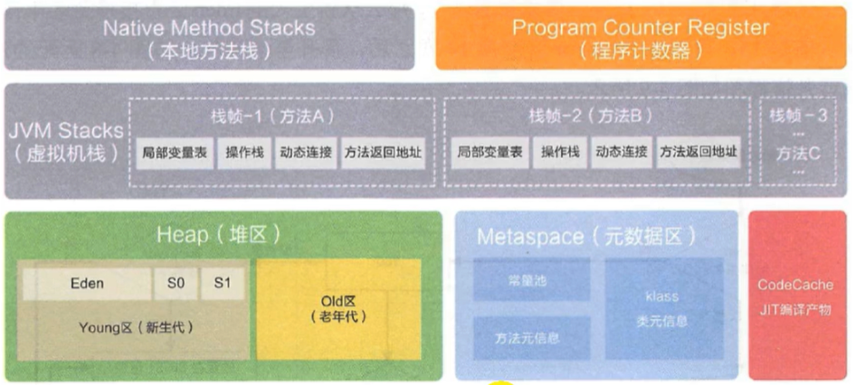

 `引言：`

​	前两章我们研究了`类加载子系统` 其职责是根据指定包路径  从  不同位置且经过编译的类  加载  到`内存并存放在堆中`。其中比较重要的点有

* 类加载器
* 双亲委派

## 运行时数据区

> 当我们通过前面的：`类加载子系统` 完成后，就会用到`执行引擎对`我们的类进行使用，同时执行引擎将会使用到我们`运行时数据区`

> `JVM内存布局`规定了Java在运行过程中内存`申请`、`分配`、`管理`的策略，保证了JVM的高效稳定运行。不同的JVM对于内存的划分方式和管理机制存在着部分差异。

**完整运行时数据区**

> Java虚拟机定义了若干种程序运行期间会使用到的运行时数据区，其中有一些会随着虚拟机启动而创建，随着虚拟机退出而销毁。另外一些则是与线程一一对应的，这些与线程对应的数据区域会随着线程开始和结束而创建和销毁。

上上图灰色的为单独线程私有的,生命周期与线程同步，上上图红色的为多个线程共享的，生命周期与虚拟机同步。即：

- 每个线程：独立包括程序计数器、栈、本地栈。
- 线程间共享：堆、堆外内存（永久代或元空间、代码缓存）

##  线程

* Java多线程

* 在Hotspot JVM里，每个线程都与操作系统的本地线程直接映射。

	> 当一个Java线程准备好执行以后，此时一个操作系统的本地线程也同时创建。Java线程执行终止后，本地线程也会回收。操作系统负责所有线程的安排调度到任何一个可用的CPU上。一旦本地线程初始化成功，它就会调用Java线程中的run（）方法。

### JVM系统线程

Hotspot JVM里主要是以下几种线程：

- 虚拟机线程：这种线程的操作是需要JVM达到安全点才会出现。这些操作必须在不同的线程中发生的原因是他们都需要JVM达到安全点，这样堆才不会变化。这种线程的执行类型包括"stop-the-world"的垃圾收集，线程栈收集，线程挂起以及偏向锁撤销。
- 周期任务线程：这种线程是时间周期事件的体现（比如中断），他们一般用于周期性操作的调度执行。
- GC线程：这种线程对在JVM里不同种类的垃圾收集行为提供了支持。
- 编译线程：这种线程在运行时会将字节码编译成到本地代码。
- 信号调度线程：这种线程接收信号并发送给JVM，在它内部通过调用适当的方法进行处理。