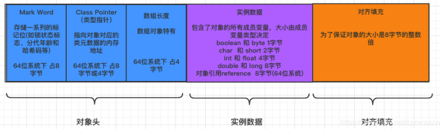
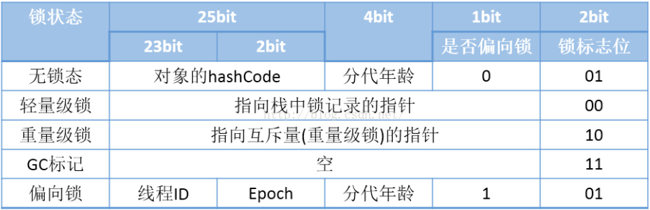
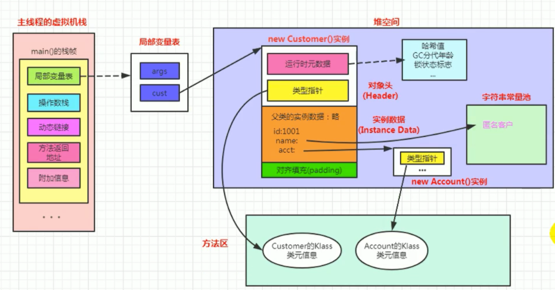
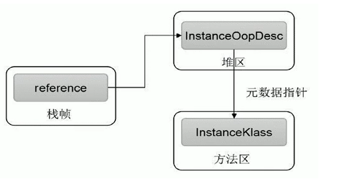
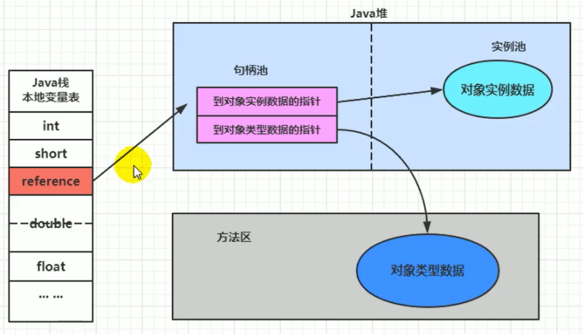
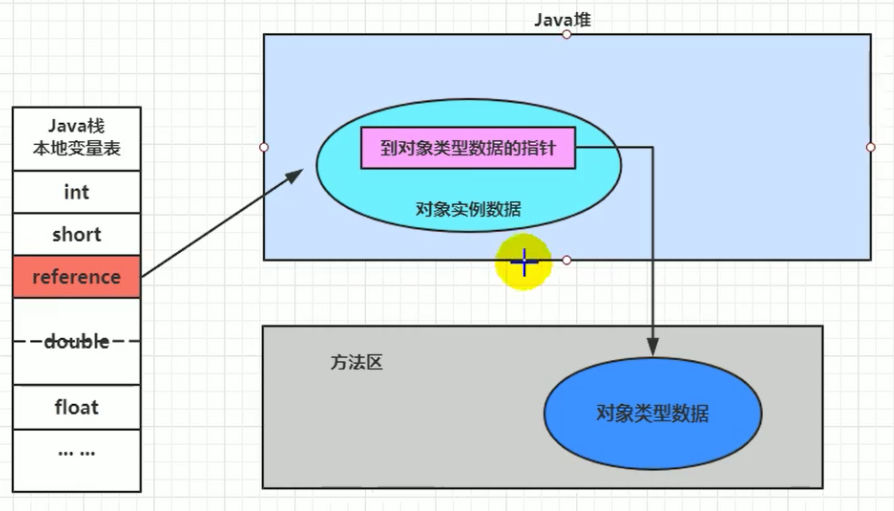

`引言:`

​	前面内容主要掌握了一个Java文件使用前在jvm内存中的执行流程。其中 讲堆的时候，我们了解到，只要是对象实体都会存放在堆中。那么对象实体在堆中又是如何存放的呢？

## 对象实例化

### 1、创建对象的方式

1. new

	```java
	person p1 = new person("zs", 20, "男");
	```

2. 反射：Class的newInstance()

3. 反射：Constructor的newInstance(xxx)

4. 使用clone()

5. 使用反序列化
  1. jdk
  2. cglib

6. 第三方库Objenesis


### 2、创建对象的步骤

1. 判断对象对应的类是否加载到方法区即   加载、链接、初始化

2. 为对象分配内存

	* 计算对象占用内存空间大小

		> <font color=ff00aa>计算对象所占内存大小，只需要计算对象中包含的属性大小，可以使用局部变量表中的 槽 类进行类比计算，即基本数据类型中4字节即以下按4字节计算、8字节(long、double)，引用数据类型按照4字节计算。</font>

	* 接着在堆中划分一块内存给新对象。

		* ==内存规整==，==指针碰撞==分配

			> 如果内存是规整的，那么虚拟机将采用的是指针碰撞法来为对象分配内存。简单理解，因为内存规整，因此内存一半空闲一半占用，==指针碰撞法分配内存是只需要将指针从空闲区域移动 对象 大小 的距离罢了.==

		* ==内存不规整==，虚拟机维护一个  ==空闲列表== 进行分配

			> 内存不规整，已使用和空闲内存相互交错，碎片化。虚拟机将采用的是空闲列表来为对象分配内存。意思是虚拟机维护了一个列表，==记录上那些内存块是可用的，再分配的时候从列表中找到一块足够大的空间划分给对象实例==，并更新列表上的内容。

3. 处理并发问题
	* 采用==CAS配上失败重试==保证更新的原子性
	* 伊甸园区 ==TLAB==


4. 初始化分配到的内存

	给对象的属性赋初始值，防止使用时空指针。

	- 属性的默认初始化
	- 显示初始化
	- 代码块中的初始化
	- 构造器初始化
	- 所有属性设置默认值，保证对象实例字段在不赋值可以直接使用

5. 设置对象的对象头

	对象头中包含了：

	* 类的元数据信息
	* 对象的HashCode
	* GC信息-对象年龄
	* 锁信息

6. 执行init方法进行初始化

	> 初始化成员变量，执行实例化代码块，调用类的构造方法，并把堆内对象的首地址赋值给引用变量.因此一般来说，new指令之后会接着就是执行方法，把对象按照程序员的意愿进行初始化，这样一个真正可用的对象才算完成创建出来。


## 对象内存布局



### 1、对象头



主要包含了两部分内容

* 运行时元数据 ：存储对象自身运行时的数据
	* 哈希值（HashCode）：确定对象存储地址，通过Hash算法生成，常用equals()比较对象是否相等
	* GC分代年龄 ： GC时老年代晋升
	* 锁状态标志 ：锁
	* 线程持有的锁
	* 偏向线程ID
	* 翩向时间戳

* 类型指针

	指向 方法区 中类元数据地址。用以确定该对象的类型。

* 如果是数组，还要存放 数组长度

### 2、实例数据

​	是对象正真存储的有效信息，也是在程序代码中所定义的各种类型的字段内容。

* boolean 和 byte            		===>     1字节

* char 和 short                 	  ===>     2字节

* int 和 float                          ===>     4字节    

* double 和 long                    ===>     8字节

* 对象引用reference               ===>     4字节

> 类似于  上面  计算对象内存占用大小   ==》 类比  局部变量表  中  槽 计算方式

`eg :`

```java
public class User{
  private Integer id;
  private String userName;
  private Hobby hobby;
  private long 25L;
}
// 内存大小 ：4 + 4 + 4 + 8 = 20
```

### 3、对齐填充

不是必须的，也没有特别的含义，仅仅起到占位符的作用


## 举例

`代码:`

```java
@Data
public class Coust {
    private String id;
    private String name;
    private Account acct;
    
    {
        name = "好好学习，天天向上。";
    }

    public void method(){
        System.out.println("~~~~~~");
    }
}
@Data
class Account{
    private int num;
    private String name;
}

public class ObjectTest {
    public static void main(String[] args) {
        Coust cust = new Coust();
    }
}
```



1. Main函数  对应的栈帧   在jvm栈  栈顶
2. 其局部变量表中只存放了两个变量 args   cust
3. 其中cust 是引用类型 指向  堆中对象实体
4. 堆中对象实体  包含了三大内容 
	* 运行时数据区 ：哈希值、分代年龄、锁。。。
	* 类型指针 ： 指向了方法区中 的 Class元数据模板
	* 实例数据 ： 对象中的==成员变量== 数据，其中==字符串常量==存放在== 字符串常量池==中
		* <font color=ff00aa size=5>所有的对象实体(不论是否static)都存储在堆中</font>
		* <font color=ff00aa size=5>所有的成员变量(不论是否基本数据类型和引用类型)实体都存放在堆中，作为对象的一部分</font>
		* <font color=ff00aa size=5>局部变量如果是基本数据类型则直接将实体放在局部变量表，如果是引用类型，将引用存放在 栈，实体存放在堆。</font>
		* <font color=ff00aa size=5>字符串常量池，静态变量保存在堆中，占比很大放在老年代也有GC不过得等到FGC，而堆中Major GC即可回收</font>
		* <font color=ff00aa size=5>元空间主要保存 `类信息`</font>


## 对象访问定位

`引言:`

​	上面我们讲过，栈帧局部变量表中存放了对象索引指向了堆，而堆中又包含了对象头、实例数据。其中对象头中又包含了该对象的类元信息。如下图：



对象访问有如下两种方式：


### 1、句柄访问



* 在堆内存中 专门开辟一个==句柄池==  用以存放对象实例数据地址以及类型数据地址。

* 优点是 reference中存储稳定句柄地址，对象被移动（垃圾收集时移动对象很普遍）时只会改变句柄中实例数据指针即可，reference本身不需要被修改


### 2、直接指针 ： HotSpot采用



* 直接指针是局部变量表中的引用，直接指向堆中的实例，在对象实例中有类型指针，指向的是方法区中的对象类型数据
* 缺点是 当对象被移动时需要修改reference中存储稳定句柄地址