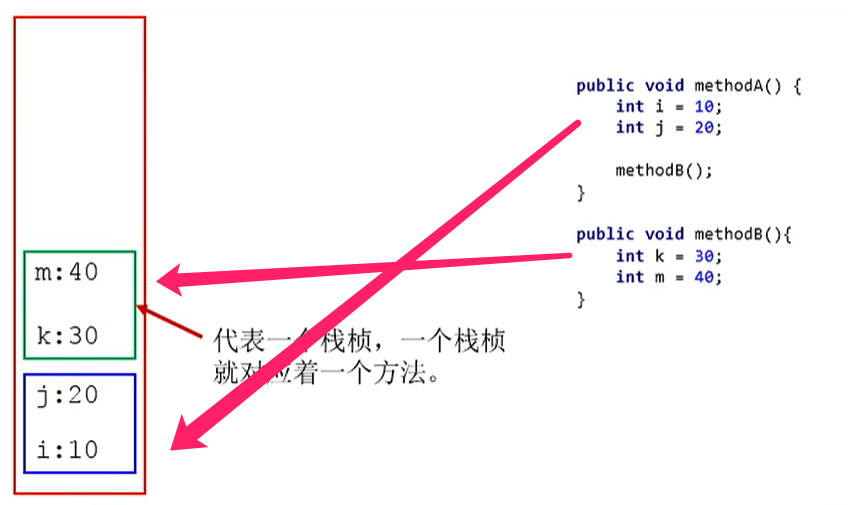
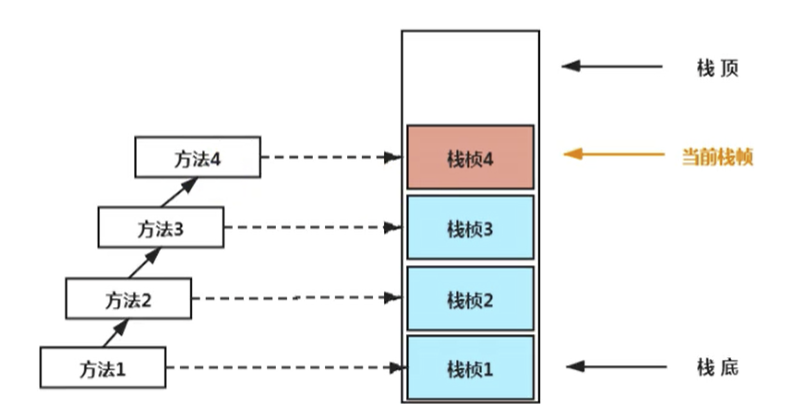
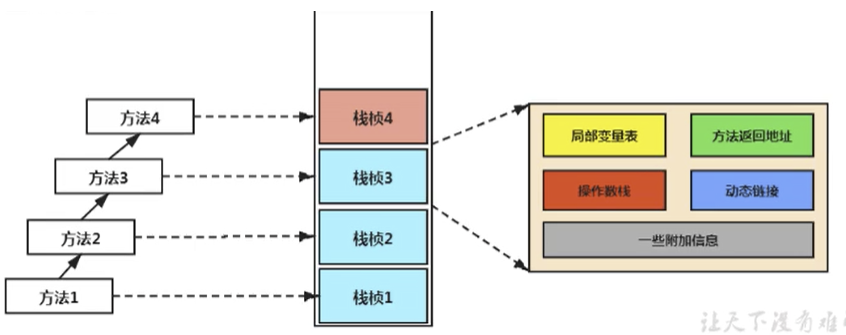

`引言:`

​	上一章讲到，PC寄存器能够  为 `执行引擎` 在多线程情况下提供 每个线程 下一个`要执行的JVM指令`的地址。其中有几个重要的点：

* 类加载子系统：翻译为字节码文件(由PC寄存器偏移量和JVM指令集命令组成)
	* 类加载器以及  类加载、连接、初始化
	* 双亲委派机制
* class字节码中内容：偏移地址和操作指令
* 局部变量表：存放方法变量，方法内有效
* JVM指令集架构和常见指令
* 执行引擎


## 虚拟机栈

### 1、虚拟机栈中数据结构

* 堆

	存储单位，解决数据存储的问题，即数据怎么放，放哪里

* 栈

	运行时单位，解决程序运行时问题，即如何处理数据


### 2、是什么

Java虚拟机栈（Java Virtual Machine Stack），早期也叫Java栈。`每个线程`在创建时都会创建一个虚拟机栈，其内部保存一个个的`栈帧（Stack Frame）`，对应着一次次的`Java方法调用`。

* 基本单位为栈帧，一个栈帧对应一个方法调用。
* 栈顶存放的是当前方法调用
* 线程私有
* 生命周期和线程生命周期同步
* 只有进栈和出栈操作，运行速度次于PC寄存器




### 3、作用

主管Java程序的运行，它保存方法的局部变量、部分结果，并参与方法的调用和返回。


### 4、栈中异常

* Java 虚拟机规范允许Java栈的大小是`动态`的或者是`固定不变`的。

	* 默认 -Xss为1024kb，即1MB

	* 手动调整栈大小

		```bash
		-Xss1m
		-Xss1k
		```

* 如果一个方法死循环，不停的创建局部变量等`栈帧`，从而会导致`局部变量表`等内存空间占满。即使手动调整后，StackoverflowError虚拟机栈溢出异常也是迟早问题。

	```java
	public class StackErrorTest {
	    private static int count = 1;
	    public static void main(String[] args) {
	        System.out.println(count++);
	        main(args);
	    }
	}
	// 1. Java文件通过类加载器 经过(加载--链接[验证、准备、解析]--初始化)编译为class字节码文件：PC寄存器偏移量  和   jvm指令
	// 2. 其中 【解析】就是负责将常量池中符号引用变为直接引用。 其中常量池 就 包含在 class字节码中。而#4 等都是符号引用。#4后面的地址为直接引用
	// 3. 将class字节码文件 加载进入jvm内存。
	// 4. 执行引擎 使用class字节码信息时操作时，比如new对象等操作，会进一步解析 class 字节码信息。为运行做准备。这个时候引入了 运行时数据区。
	// 5. 主线程创建、main函数执行，随着主线程创建，虚拟机栈创建
	// 6. 执行引擎 根据PC寄存器偏移量  一步一步执行 class字节码中的jvm指令。其中main函数中不停迭代，args变量同时在局部变量表中不停的创建【load和store指令不停切换执行】，从而导致虚拟机栈溢出StackoverflowError
	```


### 5、虚拟机栈存储单位以及存储内容

`单位` ： 栈帧。

* 栈帧是一个数据集，维系这方法执行过程中各种数据信息
* 一个栈帧对应一个方法。
* 每个线程都有自己的虚拟机栈
* 栈顶栈帧为当前活动方法
* 执行引擎运行的所有字节码指令只针对当前栈帧进行操作。
* 如果在该方法中调用了其他方法，对应的新的栈帧会被创建出来，放在栈的顶端，成为新的当前帧。

> 栈帧的大小主要由局部变量表 和 操作数栈决定的



`存储内容 即 栈帧包含内容`

1. 局部变量表（Local Variables）：<font color=ffaa00></font>
2. 操作数栈（operand Stack）（或表达式栈）：<font color=ffaa00></font>
3. 动态链接（DynamicLinking）（或指向运行时常量池的方法引用）：<font color=ffaa00></font>
4. 方法返回地址（Return Address）（或方法正常退出或者异常退出的定义）：<font color=ffaa00></font>
5. 一些附加信息 ：<font color=ffaa00></font>

> 栈帧的大小主要由`局部变量表` 和 `操作数栈`决定的



