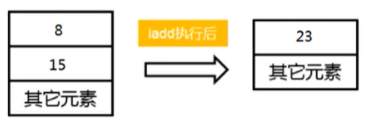

`引言:`

​	上一章讲到，PC寄存器能够  为 `执行引擎` 在多线程情况下提供 每个线程 下一个`要执行的JVM指令`的地址。其中有几个重要的点：

* 类加载子系统：翻译为字节码文件(由PC寄存器偏移量和JVM指令集命令组成)
	* 类加载器以及  类加载、连接、初始化
	* 双亲委派机制
* class字节码中内容：偏移地址和操作指令
* 局部变量表：存放方法变量，方法内有效
* JVM指令集架构和常见指令
* 执行引擎


## 虚拟机栈

### 1、虚拟机栈中数据结构

* 堆

	存储单位，解决数据存储的问题，即数据怎么放，放哪里

* 栈

	运行时单位，解决程序运行时问题，即如何处理数据


### 2、是什么

Java虚拟机栈（Java Virtual Machine Stack），早期也叫Java栈。`每个线程`在创建时都会创建一个虚拟机栈，`用以保存运行时方法相关数据`，其内部保存一个个的`栈帧（Stack Frame）`，对应着一次次的`Java方法调用`。

* 基本单位为栈帧，一个栈帧对应一个方法调用。
* 栈顶存放的是当前方法调用
* 线程私有，生命周期和线程生命周期同步，线程安全：线程独有
* 只有进栈和出栈操作，运行速度次于PC寄存器


### 3、作用

`主管Java程序的运行`，它保存方法的局部变量、部分结果，并参与方法的调用和返回。


### 4、栈中异常

* Java 虚拟机规范允许Java栈的大小是`动态`的或者是`固定不变`的。

	* 默认 -Xss为1024kb，即1MB

	* 手动调整栈大小

		```bash
		-Xss1m
		-Xss1k
		```

* 如果一个方法死循环，不停的创建局部变量等`栈帧`，从而会导致`局部变量表`等内存空间占满。即使手动调整后，StackoverflowError虚拟机栈溢出异常也是迟早问题。

	```java
	public class StackErrorTest {
	    private static int count = 1;
	    public static void main(String[] args) {
	        System.out.println(count++);
	        main(args);
	    }
	}
	// 1. Java文件通过类加载器 经过(加载--链接[验证、准备、解析]--初始化)编译为class字节码文件：PC寄存器偏移量  和   jvm指令
	// 2. 其中 【解析】就是负责将常量池中符号引用变为直接引用。 其中常量池 就 包含在 class字节码中。而#4 等都是符号引用。#4后面的地址为直接引用
	// 3. 将class字节码文件 加载进入jvm内存。
	// 4. 执行引擎 使用class字节码信息时操作时，比如new对象等操作，会进一步解析 class 字节码信息。为运行做准备。这个时候引入了 运行时数据区。
	// 5. 主线程创建、main函数执行，随着主线程创建，虚拟机栈创建
	// 6. 执行引擎 根据PC寄存器偏移量  一步一步执行 class字节码中的jvm指令。其中main函数中不停迭代，args变量同时在局部变量表中不停的创建【load和store指令不停切换执行】，从而导致虚拟机栈溢出StackoverflowError
	```


### 5、虚拟机栈存储单位以及存储内容

`单位` ： 栈帧。

* 栈帧是一个数据集，维系这`方法执行`过程中各种数据信息
* 一个栈帧对应一个方法。
* 每个线程都有自己的虚拟机栈
* 栈顶栈帧为当前活动方法
* 执行引擎运行的所有字节码指令只针对当前栈帧进行操作。
* 如果在该方法中调用了其他方法，对应的新的栈帧会被创建出来，放在栈的顶端，成为新的当前帧。

> 栈帧的大小主要由局部变量表 和 操作数栈决定的


`存储内容 即 栈帧包含内容`

1. 局部变量表（Local Variables）：<font color=ffaa00>存储方法中局部变量的一个数组</font>
2. 操作数栈（operand Stack）（或表达式栈）：<font color=ffaa00>jvm工作区，jvm指令架构基于的栈就是此栈，保存计算过程的中间结果，同时作为计算过程中变量临时的存储空间</font>
3. 动态链接（DynamicLinking）（或指向运行时常量池的方法引用）：<font color=ffaa00>class字节码中jvm指令中 #4 等都是指向常量池中的符号引用</font>
4. 方法返回地址（Return Address）（或方法正常退出或者异常退出的定义）：<font color=ffaa00>无论哪种返回。最后都将返回方法调用时的地址</font>
5. 一些附加信息 ：<font color=ffaa00></font>

> 栈帧的大小主要由`局部变量表` 和 `操作数栈`决定的，栈帧生命周期由当前方法调用是否结束来决定


#### 1、局部变量表

*   `存放线程在当前方法执行过程中依然有效的局部变量`，建立在`虚拟机栈`上，属于栈帧，即线程私有，线程安全。`生命周期 随着当前方法调用结束(栈帧)结束而销毁`
*   是一个`数字数组`，用来保存`方法参数`或者方法体内的`局部变量`，便于`方法在执行过程`中`执行引擎数`据相关的操作。其类型可以是 `基本数据类型`、`引用类型`
*   局部变量表 所需大小 在编译期间就已确定，因此如果线程中方法 参数或者局部变量居多，会存在栈溢出 异常。
*   `普通方法`中 `局部变量` `数组索引为0`存放当前`对象引用this`，静态方法中没有，也不需要直接对象 .

`槽 solt`

​	**为什么有槽的概念**

​		局部变量表 中 存放Java基本类型、引用类型数据。而各种数据长度不一致。因此引出槽的概念，节省内存。

​	**是什么**

*   局部变量表，最`基本的存储单元是Slot（变量槽）`局部变量表中存放编译期可知的各种基本数据类型（8种），引用类型（reference）.

*   在局部变量表里，`32位(字节数*8)以内的类型只占用一个slot`、`64位(字节数*8)的类型（1ong和double）占用两个slot`。

    >   byte、short、char 在存储前被转换为int，boolean也被转换为int，0表示false，非0表示true。 long和double则占据两个slot。

*   JVM会为局部变量表中的每一个Slot都分配一个访问索引，通过这个索引即可成功访问到局部变量表中指定的局部变量值


>   其中 long 和 double占了两个 slot，因此 访问索引加+1

`槽slot 重复利用`

栈帧中的局部变量表中的槽位是可以重用的，如果一个局部变量过了其作用域，那么在其作用域之后申明的新的局部变就很有可能会复用过期局部变量的槽位，从而达到节省资源的目的。`比如，methodA 调用 methodB。B调用结束后，栈帧中局部变量表中槽slot已经创建，并且B中局部变量已销毁，此时空缺出来的槽 可以给A中调用B之后创建的局部变量使用。`或者如下，代码块方式：


`变量的分类：`

-   按数据类型分：基本数据类型、引用数据类型
-   按类中声明的位置分：成员变量（类变量，实例变量）、局部变量
    -   类变量：linking的paper阶段，给类变量默认赋值/静态常量显示赋值，init阶段给类变量显示赋值
    -   实例变量：随着对象创建，会在堆空间中分配实例变量空间，并进行默认赋值
    -   局部变量：在使用前必须进行显式赋值，不然编译不通过。

#### 2、操作数栈 : jvm执行引擎一个工作区  :  jvm指令集基于栈中的栈就是操作数栈

每一个独立的栈帧除了包含局部变量表以外，还包含一个后进先出（Last - In - First -Out）的 **操作数栈**，也可以称之为 **表达式栈**（Expression Stack）

操作数栈，在方法执行过程中，根据字节码指令，往栈中写入数据或提取数据，即入栈（push）和 出栈（pop）

-   某些字节码指令将值压入操作数栈，其余的字节码指令将操作数取出栈。使用它们后再把结果压入栈
-   比如：执行复制、交换、求和等操作



* `操作数栈，主要用于保存计算过程的中间结果，同时作为计算过程中变量临时的存储空间。`

* 操作数栈就是JVM执行引擎的一个工作区，当一个方法刚开始执行的时候，一个新的栈帧也会随之被创建出来，这个方法的操作数栈是空的。
* 我们说Java虚拟机的`解释引擎是基于栈的执行引擎`，其中的栈指的就是`操作数栈`。

`流程:`

```java
public void testAddOperation() {
    byte i = 15;
    int j = 8;
    int k = i + j;
}
```


1. 首先执行第一条语句，PC寄存器指向的是0，也就是指令地址为0，然后使用bipush让操作数15入栈

	

2. 执行完后，让PC + 1，指向下一行代码，下一行代码就是将操作数栈的元素存储到局部变量表1的位置，我们可以看到局部变量表的已经增加了一个元素

	

	> 为什么局部变量表不是从0开始的呢？
	>
	> `其实局部变量表也是从0开始的，该方法为普通方法，因此0号位置存储的是this指针，所以说就直接省略了~`

3. 然后PC+1，指向的是下一行。让操作数8也入栈，同时执行store操作，存入局部变量表中

	

4. 然后从局部变量表中，依次将数据放在操作数栈中

	

5. 然后将操作数栈中的两个元素执行相加操作，并存储在局部变量表3的位置

	

6. 最后PC寄存器的位置指向10，也就是return方法，则直接退出方法

> 结合  MD-Book/JVM/01内存与垃圾回收/第四章-PC寄存器(程序寄存器).md 即上一章中的流程。

#### 3、动态链接

> 动态链接、方法返回地址、附加信息 ： 有些地方被称为帧数据区

每一个栈帧内部都包含一个指向**运行时常量池**中该栈帧所属方法的引用，包含这个引用的目的就是为了支持当前方法的代码能够实现动态链接（Dynamic Linking）。比如：invokedynamic指令

在Java源文件被编译到字节码文件中时，所有的变量和方法引用都作为符号引用（symbolic Reference）保存在class文件的常量池里。#4 等都为class常量池中的符号引用

比如：描述一个方法调用了另外的其他方法时，就是通过常量池中指向方法的符号引用来表示的，那么动态链接的作用就是为了将这些符号引用转换为调用方法的直接引用。


`为什么需要运行时常量池？`

类似于静态变量方法。只需要保存一份 多个对象共享。而运行时常量池，即只需要编译一次，该类中所有方法都可公用


`绑定机制` : 

* 前期绑定

	指被`调用的目标方法`如果在`编译期可知`，且运行期保持不变，这样一来，由于明确了被调用的目标方法究竟是哪一个，因此也就可以使用`静态链接`的方式将`符号引用`转换为`直接引用`。

* 后期绑定 

	被调用的方法在编译期无法被确定下来，只能够在程序运行期根据实际的类型绑定相关的方法，这种绑定方式也就被称之为晚期绑定。

`虚函数和非虚函数`

C++ 中的虚函数 : 后期绑定,Java中绝大多数普通方法都是 虚方法,即后期绑定。

* 非虚方法

	静态方法、私有方法、final方法、实例构造器、父类方法都是非虚方法

* 虚方法

	其他的方法

` 普通调用指令：`

- invokestatic：调用静态方法，`解析阶段`确定唯一方法版本   ** 非虚方法**
- invokespecial：调用方法、私有及父类方法，`解析阶段`确定唯一方法版本    ** 非虚方法**
- invokevirtual：调用所有虚方法       ** 虚方法**
- invokeinterface：调用接口方法      ** 虚方法**

#### 4、方法返回地址

存放调用该方法的pc寄存器的值。一个方法的结束，有两种方式：

- 正常执行完成
- 出现未处理的异常，非正常退出

无论通过哪种方式退出，在方法退出后都返回到该方法被调用的位置。方法正常退出时，`调用者的pc计数器的值作为返回地址`，即调用该方法的指令的下一条指令的地址。**而通过异常退出的，返回地址是要通过异常表来确定，栈帧中一般不会保存这部分信息。**

当一个方法开始执行后，只有两种方式可以退出这个方法：

执行引擎遇到任意一个方法返回的字节码指令（return），会有返回值传递给上层的方法调用者，简称正常完成出口；

- 一个方法在正常调用完成之后，究竟需要使用哪一个返回指令，还需要根据方法返回值的实际数据类型而定。
- 在字节码指令中，返回指令包含ireturn（当返回值是boolean，byte，char，short和int类型时使用），lreturn（Long类型），freturn（Float类型），dreturn（Double类型），areturn。另外还有一个return指令声明为void的方法，实例初始化方法，类和接口的初始化方法使用。

在方法执行过程中遇到异常（Exception），并且这个异常没有在方法内进行处理，也就是只要在本方法的异常表中没有搜索到匹配的异常处理器，就会导致方法退出，简称异常完成出口。

方法执行过程中，抛出异常时的异常处理，存储在一个异常处理表，方便在发生异常的时候找到处理异常的代码


## 问题

- 举例栈溢出的情况？（StackOverflowError）
	- 一方面通过 -Xss设置栈的大小
	- 另一方面 方法递归或者方法死循环，在局部变量表中不停的创建变量，栈溢出迟早问题
- 调整栈大小，就能保证不出现溢出么？
	- 不能保证不溢出，只能推迟
- 分配的栈内存越大越好么？
	- 不是，一定时间内降低了OOM概率，但是会挤占其它的线程空间，因为整个空间是有限的。
- 垃圾回收是否涉及到虚拟机栈？
	- 不会
- 方法中定义的局部变量是否线程安全？
	- 具体问题具体分析
		1. 如果是方法中创建的局部变量，则线程安全，因为虚拟机栈线层独有
		2. 如果变量为参数或者返回值，局部变量表中值并不会随着方法的结束而销毁，有可能被其他程序调用

| 运行时数据区 | 是否存在Error | 是否存在GC |
| ------------ | ------------- | ---------- |
| 程序计数器   | 否            | 否         |
| 虚拟机栈     | 是            | 否         |
| 本地方法栈   | 是            | 否         |
| 方法区       | 是（OOM）     | 是         |
| 堆           | 是            | 是         |