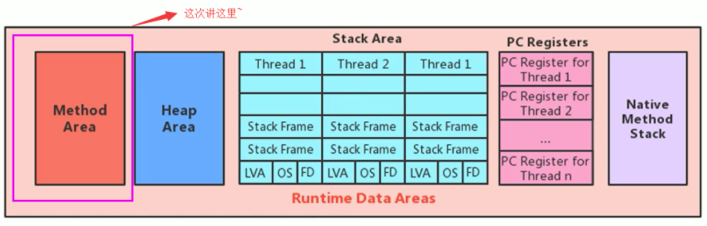
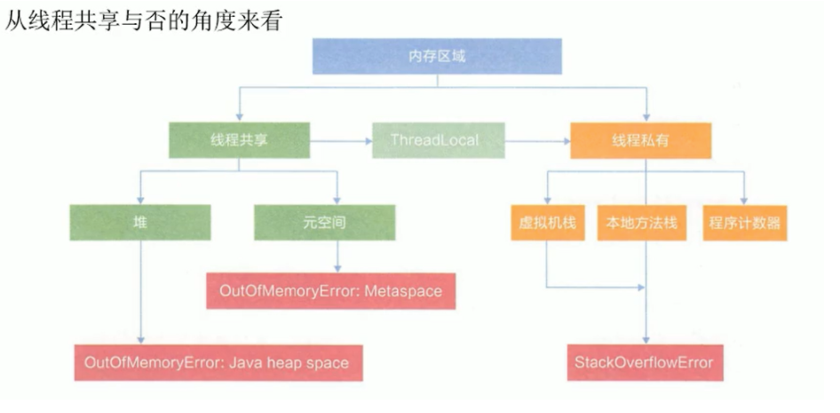
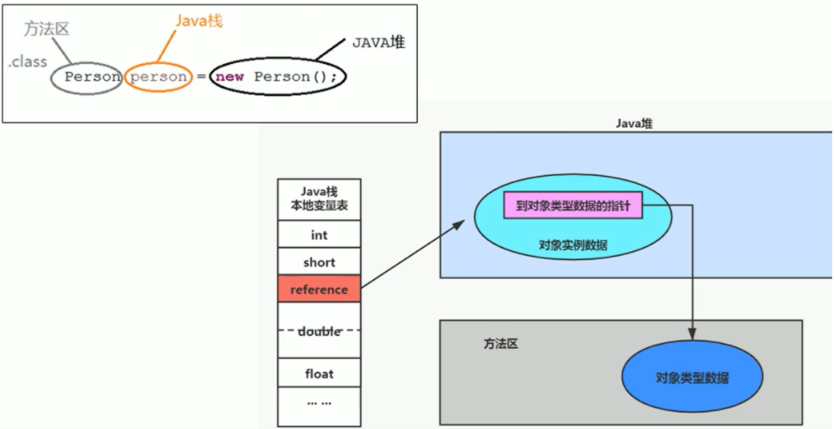
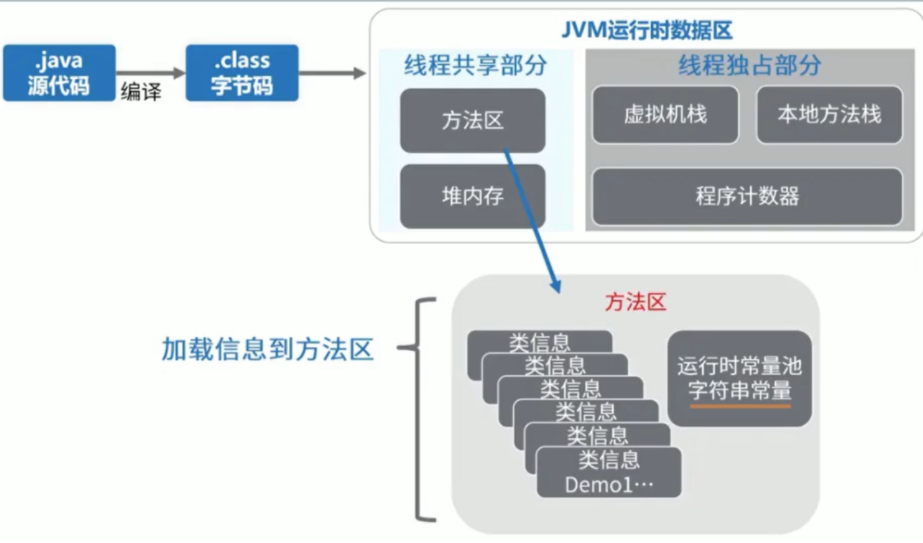
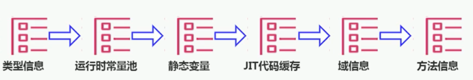

`引言:`

​	之前已经讲了 `运行时数据区` ==PC寄存器==、==JVM虚拟机栈==、==本地方法栈==、==堆==，还有一块内存区域 也特备重要。即 ==方法区==

## 方法区是什么

### 1、理解方法区

* 在以后JDK的演进中，方法区  和  堆  肯定是要分开的两个内存空间。具体原因官方给定的是要和JRockit 对其。
* 方法区（Method Area）与Java堆一样，是各个线程共享的内存区域。
* 方法区生命周期和堆一样随着JVM的启动而创建，销毁而终止，并且它的实际的物理内存空间中和Java堆区一样都可以是不连续的。
* 方法区的大小，跟堆空间一样，可以选择固定大小或者可扩展
* 方法区 主要存放的就是类信息，即我们在类加载时，==需要将class字节码文件加载到内存并解析为元数据模板放入到 方法区==，就是这个方法区。

### 2、方法区、栈、堆 关系

- Person：存放在元空间，也可以说方法区
- person：存放在Java栈的局部变量表中
- new Person()：存放在Java堆中

### 3、方法区 在 JDK6、JDK7、JDK8演变

* JDK6时 方法区称为 ==永久代==,并且 静态变量存储在永久代上。

* JDK7时 方法区称为 ==永久代==，其内存大小由JVM分配，与堆内存一样 需要人为分配调整，否则超出OOM。==字符串常量池，静态变量保存在堆中==
* JDK8时 方法区修改为 ==元空间== ，彻底的和堆区划分开，并直接使用物理内存，相交 之前的永久代，oom出现几率变小，并且其内部结构也发生了变化。==类型信息，字段，方法，常量保存在本地内存的元空间，但字符串常量池、静态变量仍然在堆中。==

* 所有的对象实体(不论是否static)都存储在堆中
* 所有的成员变量(不论是否基本数据类型和引用类型)实体都存放在堆中，作为对象的一部分
* 局部变量如果是基本数据类型则直接将实体放在局部变量表，如果是引用类型，将引用存放在 栈，实体存放在堆。
* 字符串常量池，静态变量保存在堆中，占比很大放在老年代也有GC不过得等到FGC，而堆中Major GC即可回收
* 元空间主要保存 `类信息`

### 4、设置方法区大小与OOM

> 方法区的大小不必是固定的，JVM可以根据应用的需要动态调整。
>
> 方法区在JDK8后最好指定内存大小，并且为其指定相对较高的值。 和堆 初始值和最大值设置成一样一个道理，减少其动态调整带来的性能消耗

`JDK7`

- -XX:Permsize来设置永久代初始分配空间。默认值是20.75M
- -XX:MaxPermsize来设定永久代最大可分配空间。32位机器默认是64M，64位机器模式是82M
- 当JVM加载的类信息容量超过了这个值，会报异常 ==OutofMemoryError:PermGen space==。

`JDK8`

- -XX:MetaspaceSize来设置元数据区初始分配空间。默认值是21M
- -XX:MaxMetaspaceSize来设定元数据区最大可分配空间，默认值是-1，即没有限制
- 最大值为-1，如果消耗完物理内存则也会报异常 ==OutofMemoryError:PermGen space==。

## 方法区内部信息

### 1、 类型信息

对每个加载的类型（类class、接口interface、枚举enum、注解annotation），JVm必须在方法区中存储以下类型信息：

- 这个类型的完整有效名称（全名=包名.类名）
- 这个类型直接父类的完整有效名（对于interface或是java.lang.object，都没有父类）
- 这个类型的修饰符（public，abstract，final的某个子集）
- 这个类型直接接口的一个有序列表

### 2、域信息

JVM必须在方法区中保存类型的所有域的相关信息以及域的声明顺序。

域的相关信息包括：域名称、域类型、域修饰符（public，private，protected，static，final，volatile，transient的某个子集）

### 3、方法（Method）信息

JVM必须保存所有方法的以下信息，同域信息一样包括声明顺序：

- 方法名称
- 方法的返回类型（或void）
- 方法参数的数量和类型（按顺序）
- 方法的修饰符（public，private，protected，static，final，synchronized，native，abstract的一个子集）
- 方法的字节码（bytecodes）、操作数栈、局部变量表及大小（abstract和native方法除外）
- 异常表（abstract和native方法除外）

> 每个异常处理的开始位置、结束位置、代码处理在程序计数器中的偏移地址、被捕获的异常类的常量池索引

### 4、运行时常量池

* `运行时常量池和常量池表不是一个东西，常量池表即 jclasslib 编译字节码文件后的常量池数据，保存在class文件中。而运行时常量池是相对于整个系统而言的常量池表,属于方法区。`

* 运行时的常量池，包含了各种字面量、域和方法的引用。
* 我们在 JVM虚拟机栈中说到虚拟机栈 --> 栈帧 --> 运行时常量池符号引用。

> Java程序运行时需要JRE运行时环境，其包含了很多核心类库，当JVM执行引擎解析一个class字节码文件时，其中包含了很多的核心类库引用以及一些常量、方法、字段、类引用信息。我们不能为每个字节码文件都写入其引用信息。

## 方法区垃圾回收

> 方法区的垃圾回收，之前在堆中讲过，只有FGC才会触发方法区的垃圾收集，而触发FGC的条件有很多，包括system.gc、堆满、方法区满

有些人认为方法区（如Hotspot虚拟机中的元空间或者永久代）是没有垃圾收集行为的，其实不然。《Java虚拟机规范》对方法区的约束是非常宽松的，提到过可以不要求虚拟机在方法区中实现垃圾收集。事实上也确实有未实现或未能完整实现方法区类型卸载的收集器存在（如JDK11时期的zGC收集器就不支持类卸载）。

一般来说这个区域的回收效果比较难令人满意，尤其是类型的卸载，条件相当苛刻。但是这部分区域的回收有时又确实是必要的。以前sun公司的Bug列表中，曾出现过的若干个严重的Bug就是由于低版本的HotSpot虚拟机对此区域未完全回收而导致内存泄漏。

方法区的垃圾收集主要回收两部分内容：==常量池中废弃的常量==和==不再使用的类型==。