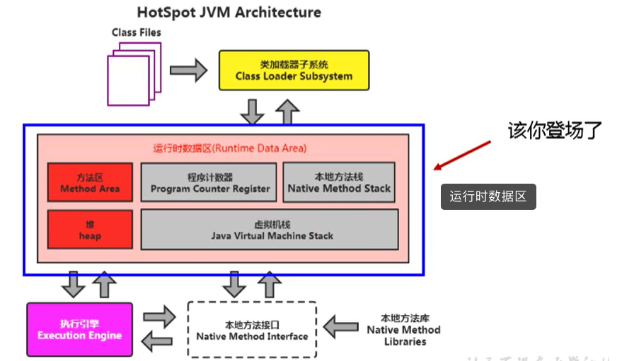
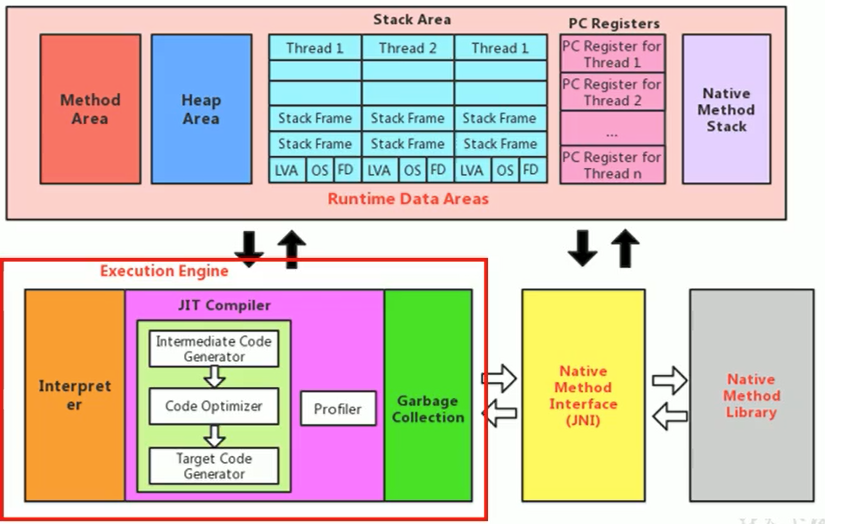
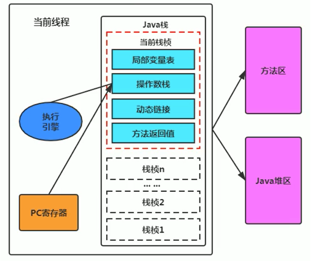
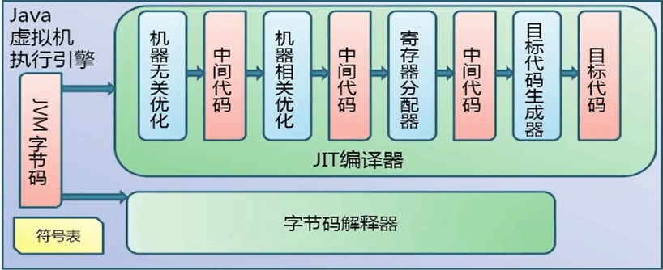
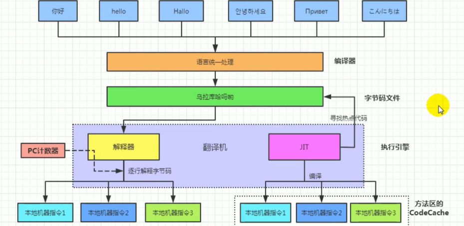
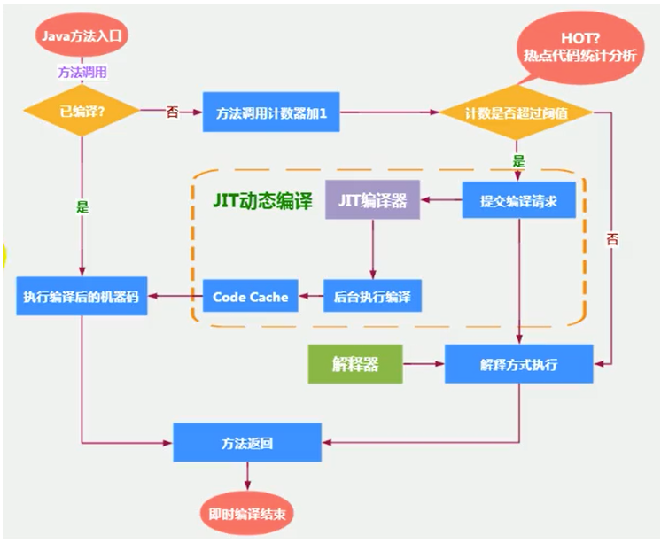
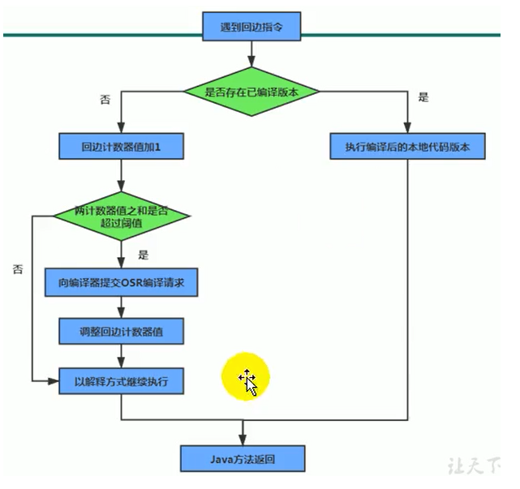
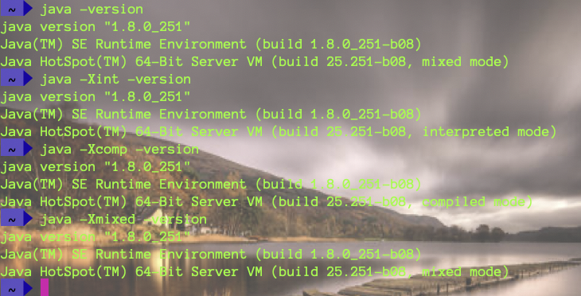

`引言:`

​	在讲JVM栈中，提及到 ==执行引擎==起到一个==核心处理器==的作用。负责：

1. 其操作流程主要来源于 ==运行时方法【栈顶栈帧】==编译后的==JVM指令==
2. 根据==PC寄存器==偏移量执行JVM指令
3. 从==局部变量表==获取运行时方法中的数据
4. 有逻辑运算的JVM指令 编译后 交由CPU处理
5. 处理后的数据临时存放在 ==操作数栈==中

## 是什么

在进一步细分

> 执行引擎属于JVM的下层，里面包括 ==解释器==、==及时编译器（JIT编译器）==、==垃圾回收器==

* JVM-类操作系统  ： 负责将class字节码文件装载到 方法区 即Class对象。
* JVM-执行引擎     ：  当我们使用对象时，懒加载，将对象放入运行时数据区   进行操作，其中负责对象中数据处理以及和CPU交互的就是执行引擎。因为我们编译后的字节码或者是其包含的JVM指令并不能被CPU直接处理。因此需要进行编译成机器码交由CPU处理。JVM指令【基于栈架构】也是Java跨平台的原因。

> 因此 JVM执行引擎 主要职责有 ： 方法中数据处理、JVM指令编译为机器码，如下图

## Java代码编译和执行过程

大部分的程序代码转换成物理机的目标代码或虚拟机能执行的指令集之前，都需要经过上图中的各个步骤

- 前面橙色部分是生成字节码文件的过程，交由类加载器完成，和JVM无关
- 后面蓝色和绿色才是JVM需要考虑的过程

## JIT编译器和字节码解释器

### 1、字节码解释器

简单理解，就是==字节码文件==中的==JVM指令==经由  ==执行引擎==  翻译为==机器码==  交由CPU进行处理。

> 输入的代码 -> [ 解释器 解释执行 ] -> 执行结果

* 特点是，代码经过解释执行，马上就返回结果，即响应快

### 2、JIT编译器

出现JIT编译器的原因 ： 提高Java执行速度。类似于缓存的效果，比如一个for循环中执行add操作，那么每个add并不需要一次又一次的翻译为机器码，可以交给JIT编译器 把 ==热点代码==编译为==机器码==并缓存起来，省去了解释环节，提高性能。

其中热点代码 是一些频繁处理的代码，取决于虚拟机如何定义。

> JIT编译器既然是缓存作用，那么它缓存的热点代码数据存放在哪里？方法区。

> 输入的代码 -> [ 编译器 编译 ] -> 编译后的代码 -> [ 执行 ] -> 执行结果

* 特点是，需要经过编译器编译后再执行，初次编译耗时，再次使用时直接使用本地机器码[编译后的代码]执行，性能提高

### 3、Java半编译半解释

类似于 Java半静态语言半动态语言，其动态语言在于 反射特性。

而 半解释在于 字节码解释器。Java代码最初就是使用全解释执行。后为了提升性能以及整合其他虚拟机，加入了JIT及时编译器。

### 4、解释器分类

在Java的发展历史里，一共有两套解释执行器，即古老的==字节码解释器==、现在普遍使用的==模板解释器==。

字节码解释器在执行时通过纯软件代码模拟字节码的执行，效率非常低下。

而模板解释器将每一条字节码和一个模板函数相关联，模板函数中直接产生这条字节码执行时的机器码，从而很大程度上提高了解释器的性能。

在HotSpot VM中，解释器主要由Interpreter模块和Code模块构成。

- Interpreter模块：实现了解释器的核心功能
- Code模块：用于管理HotSpot VM在运行时生成的本地机器指令

## 现在JIT这么流程，为什么HotSpot 还要使用解释器和编译器结合模式

* 这就取决于 编译器和解释器各自的特性，解释器响应快，多次执行都一样的时间，编译器初次时间相较解释器慢，之后就很快了。
* 项目中代码可以分为 执行一次的代码以及频繁执行的热点代码，如果对于一次执行的代码 也使用JIT编译器，就有点得不偿失了。
* 因此最好的解决办法就是 代码初次都是经由解释器执行，JVM在执行过程中 嗅探到了热点代码 将热点代码交由JIT编译器。之后热点代码执行效率就提升上去了。

## 热点嗅探

一块代码怎么确定是 ==热点代码==? 

一个方法究竟要被调用多少次，或者一个循环体究竟需要执行多少次循环才可以达到这个标准？必然需要一个明确的阈值，JIT编译器才会将这些“热点代码”编译为本地机器指令执行。这里主要依靠热点探测功能。

目前HotSpot VM所采用的热点探测方式是基于==计数器的热点探测==。

采用基于计数器的热点探测，HotSpot V将会为每一个方法都建立2个不同类型的计数器，分别为==方法调用计数器==（Invocation Counter）和==回边计数器==（Back Edge Counter）。

- 方法调用计数器  用于统计方法的调用次数

	- 默认阀值在Client模式下是1500次，在Server模式下是10000次。超过这个阈值，就会触发JIT编译。

	- > 64位的机器下JDK默认都是Server模式

	-  -XX:CompileThreshold 设置 方法调用计数器 阈值。

	- 方法调用计数器中 计数 并不是绝对的，即是一个相对的执行频率，在一段时间内方法被调用的次数任然没有达到阈值则会减少一半。-XX:CounterHalfLifeTime设置时间，单位是s

	

- 回边计数器  则用于统计循环体执行的循环次数

	

## 设置解释器或者及时编译器模式

缺省情况下HotSpot VM是采用解释器与即时编译器并存的架构，当然开发人员可以根据具体的应用场景，通过命令显式地为Java虚拟机指定在运行时到底是完全采用解释器执行，还是完全采用即时编译器执行。如下所示：

- -Xint：完全采用解释器模式执行程序；
- -Xcomp：完全采用即时编译器模式执行程序。如果即时编译出现问题，解释器会介入执行
- -Xmixed：采用解释器+即时编译器的混合模式共同执行程序。

