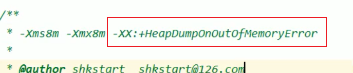

垃圾回收目标对象是 堆中的对象，栈中不用垃圾回收。没有发生逃逸的对象是可以进行标量替换的。

引用技术算法(Java没有选择此算法) 不能解决循环引用的问题，而可达性分析算法解决了，如何解决的？

各种垃圾回收器 特点，g1等常见垃圾回收器 在GC时都有 STW  而cwt 垃圾回收器低延时，即STW时间很短

finaliize方法调用后并不会马上被执行，有可能还不会被执行，因为该方法的线程是低优先级，且finalize只能被执行一次

一个对象被回收前有三个状态，其中第二个状态即  可以被复活的对象，触发的条件有 该对象必须重写finalize方法，并且该方法中有GC ROOT的直接或间接引用。

可达性分析算法中循环应用怎么解决

arthas和jprofiler等工具使用

加入到常用参数，当出现oom时生成dump文件

145集 jprofiler   GC ROOT溯源

标记清除算法，其中清除指的是删除后数据并不会置空，而是加入到空闲数据列表中，下次有新数据则直接覆盖，类似于磁盘格式化，数据并不会全部置为00000而是加入到数据列表，下次使用时直接覆盖，如果格式化后存入新的数据则会造成数据丢失，如果只是简单格式化后没有进行存储操作则是可以恢复的 

复制算法快   浪费内存并且适用于存货对象少的情况，如果多的话100个对象有90个对象存活并且需要复制，则浪费性能，因此适用于新生代 GC算法 

新生代  复制算法

老年代 标记删除   标记删除整理算法混合使用

