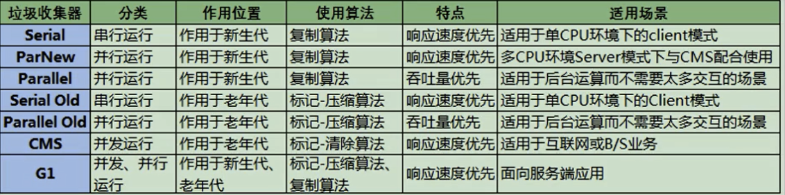

`引言:`

在运行时数据区我们知道了。

* jvm指令集使用了 基于栈 实现的
* PC寄存器 无异常 无GC
* 虚拟机栈、本地方法栈  有stackoverflower 异常，无GC
* 堆、方法区 有OOM，有GC
* 当然 JIT即使编译阶段，如果发现对象没有发生逃逸则进行标量替换然后站上分配。从而不用GC直接进出栈即可。


## 什么是垃圾回收

即 程序中无任何引用的对象。


## 为什么需要GC

例如一个方法中声明了一些变量，指向堆中的对象，当时当方法运行结束后，局部变量表中变量随着栈帧的结束而销毁，但是指向的对象仍然存在于堆中。如果一个方法在高并发下或者程序长时间运行后，堆中对象不GC，那么很快就会触发OOM。


## Java垃圾回收机制

`优点`

自动垃圾回收，开发人员无需参与内存的分配和回收，降低了各种悬垂指针，野指针，泄露问题。


`缺点`

开发人员过渡依赖GC，内部细节不够了解以及弱化问题解决能力


## GC 清除对象区域

* 方法区
* 堆

> 当然堆中对象， JIT即使编译阶段，如果发现没有发生逃逸则进行标量替换然后站上分配。从而不用GC直接进出栈即可。

> 频繁YGC，较少收集老年代，几乎不收集永久代


## System.gc()

* 之前我们讲到堆内存 触发 Full GC时，可以使用System.gc来手动触发。最好不要，否则垃圾回收器毫无意义
* System.gc 并不能保证马上调用 GC，效果与 Runtime.getRuntime().gc() 一样

* System.runFinalization()  强制调用使用引用的对象的finalize()方法，也并不会马上执行。
* 如果需要马上进行垃圾回收可以 结合使用

```java
public class Test{
    String name = "haha";
    public Test(String name){
        this.name=name;
    }
    @Override
    protected void finalize() throws Throwable {
        super.finalize();
        System.out.println(" - -- - - - - - -Test 对象销毁  > > "+name);
    }

    public static void main(String[] args) throws InterruptedException {
        Thread.sleep(1000*1000);
        for (int i = 0; i < 100; i++) {
            System.out.println("第  "+i +"  次 执行");
            Test test = new Test(i+"");
            test=null;
            System.out.println("执行垃圾回收");
            System.gc();
            System.runFinalization();
            System.out.println(test);
        }
    }
}
```


## 内存溢出和内存泄漏

* 内存溢出 OOM

	即 Java程序运行所需内存不足，并且Full GC后内存仍不足分配。

* 内存泄漏

	即对象不再被使用，但是GC长时间无法进行回收。内存泄漏并不会马上造成程序OOM，但是内存泄漏会逐渐蚕食内存。例如使用了一次的static 变量 、 单例对象或者未关闭的资源对象等等。


## Stop The World

即我们前面讲到的 STW ，指的是GC线程执行时，所有用户线程必须暂停，等待GC线程扫描完。而所有用户线程没有任何响应，这个停顿即STW.

> 几乎所有的jvm 都使用的是可达性分析算法，其中最重要的一点就是 GC Root扫描。下面会介绍到jvm相关算法。
>
> 并不是整个GC过程都会有STW，而是发生在GC 进行枚举根节点时触发。这也很好理解，用户线程在不停的创造GC Root，而GC线程需要扫描GC Root，如果数据无法保持一致性，则枚举处的GC Root也不准确

* 所有的GC 都会存在 STW，区别于时间长短


## 垃圾回收的并行与并发

之前我们说过：

* 并发是一核cpu高速切换执行多个任务，而并行是多核CPU执行与核心数一样的任务，即一核CPU执行一个任务。
* 并发在同一段时间内执行，并行是同一时刻内执行

`串行垃圾处理器`

即 单线程 垃圾回收器 执行GC，并STW。咋枚举GC Roots时 用户线程卡顿，用户单CPU的应用，避免了CPU切换，保证较高的吞吐量。

* Serial收集器：
	用于新生代，单线程并Stop The World

* SerialOld收集器：

	用于老年代

`并发垃圾处理器`

指用户线程和GC线程同时执行，CPU来回切换交替执行，GC线程的执行并不影响用户线程的执行。

* ParNew收集器
	用于新生代，用户响应时间比较短，适用于server。是CMS默认的新生代收集器
* Parallel Scavenge收集器
	用于新生代，吞吐量比较高，但是用户响应时间比较长，适用于后台。
* Parallel Old收集器
	用于老年代，响应时间较长，吞吐量较大。适用于后台，和Parallel Scavenge配合使用。

`并行垃圾处理器`

多条GC线程并行工作

* CMS（Concurrent Mark Sweep）

* G1（Garbage First）


> <font color=f00aa>这里将到的 用户线程和GC线程相互影响，并不等同于STW，这里讲的是线程之间的关系，无论哪种线程方式都会有STW</font>


## 安全点和安全区域

上面我们讲到 GC 作用的对象的堆中对象，那么作用时间又是什么时间呢？

`安全点`

* 用户线程在特定的位置停顿，然后GC线程执行，这个特定的位置叫安全点
* 安全点的设置很重要，如果太少了，那么每次GC执行的时间就会太长。太多了，则会导致频繁的GC。【垃圾对象总量=GC次数(安全点) * GC时间】

`用户线程中断方式`

* 抢先式中断 ： 首先中断所有线程，如果还有线程不在安全点，就恢复线程，让线程跑到安全点。(没有虚拟机使用了)
* 主动式中断 ： 设置一个中断标志，各个线程运行到安全点的时候主动轮训这个标志，如果中断标志为真，则将自己进行中断挂起

`安全区域`

* Safepoint机制保证了程序执行时，在不太长的时间内就会遇到可进入GC的Safepoint 。但是，程序“不执行”的时候呢？例如线程处于Sleep 状态或Blocked状态，这时候线程无法响应JVM的中断请求，“走” 到安全点去中断挂起，JVM也不太可能等待线程被唤醒。对于这种情况，就需要安全区域（Safe Region）来解决。
* 安全区域是指在一段代码片段中，对象的引用关系不会发生变化，在这个区域中的任何位置开始GC都是安全的。我们也可以把Safe Region 看做是被扩展了的Safepoint。


`实际执行时`

1、当线程运行到Safe Region的代码时，首先标识已经进入了Safe Region，如果这段时间内发生GC，JVM会 忽略标识为Safe Region状态 的线程；

2、当线程即将离开Safe Region时， 会检查JVM是否已经完成GC，如果完成了，则继续运行，否则线程必须等待直到收到可以安全离开SafeRegion的信号为止；


## 引用

`含义:`

​	即 变量和 引用对象的 引用关系

`目的:`

​	希望有一种东西能够标识 不同垃圾回收器状态下 回收哪些对象，而不是执行GC时一股脑的全部回收  垃圾对象。即对象分类。在GC时分情况处理。


### 1、强引用

​		最传统的“引用”的定义，是指在程序代码之中普遍存在的引用赋值，即类似“0bject obj=new object（ ）”这种引用关系，也是默认的引用类型。==无论任何情况下，只要强引用关系还存在，垃圾收集器就永远不会回收掉被引用的对象==。

```java
public class StrongReferenceTest {
    public static void main(String[] args) {
        StringBuffer str = new StringBuffer ("Hello,尚硅谷");
        StringBuffer str1 = str;

        str = null;
        System.gc();

        try {
            Thread.sleep(3000);
        } catch (InterruptedException e) {
            e.printStackTrace();
        }

        System.out.println(str1);
    }
}
```


* Java中所有的对象赋值都是强引用
* 强引用的对象是可触及的，垃圾收集器就永远不会回收掉被引用的对象，及时oom。
* 强引用可以直接访问对象
* 对于一一个普通的对象，如果没有其他的引用关系，只要超过了引用的作用域或者显式地将相应（强）引用赋值为null，就是可以当做垃圾被收集了，当然具体回收时机还是要看垃圾收集策略。
* 相对的，软引用、 弱引用和虚引用的对象是软可触及、弱可触及和虛可触及的，在一定条件下，都是可以被回收的。所以，强引用是造成Java内存泄漏的主要原因之一。


### 2、软引用

​		强引用对象 ，如果被GC Root直接或者间接关联(可达对象)，即使发生oom也不会被回收。

而软引用对象，即当即将OOM时，则马上回收。

* 软引用 一般用来关联非必须对象，例如一些内存敏感的缓存。即内存足够时不会进行回收，不足时进行回收
* 软引用对象也分可达和不可达。回收的也是不可达软对象，【这里的可达指的是仍然有强引用关联】

```java
Object obj = new object（）； //声明强引用
SoftReference<0bject> sf = new SoftReference<0bject>（obj）;//将强引用对象存入到软引用队列中
obj = null； //销毁强引用，现在obj只存在于软引用，下次内存不足时清理掉。如果obj不被置为null，则仍然是强引用，不会被回收。
//从软引用中重新获得强引用对象
System.out.println(sf.get());
```


### 3、弱引用

​		被弱引用关联的对象只能生存到下一次垃圾收集之前。当垃圾收集器工作时，无论内存空间是否足够，都会回收掉被弱引用关联的对象。即只要被发现就会回收。

```java
Object obj = new object（）； //声明强引用
WeakReference<0bject> wf = new WeakReference<0bject>（obj）；
obj = null； //销毁强引用
//从弱引用中重新获得强引用对象
System.out.println(wf.get());  
```


### 4、虚引用

​		一个对象是否有虛引用的存在，完全不会对其生存时 间构成影响，也无法通过虚引用来获得一个对象的实例。==为一个对象设置虛引用关联的唯一目的就是能在这个对象被收集器回收时收到一个系统通知(回收跟踪)==。

* 虚引用只有一个作用，即被回收时收到系统通知
* 虚引用无论何时get都为null


## GC分类

### 1、按照线程数分


*   串行垃圾回收器

	指在同一段时间内只允许有一个CPU执行GC垃圾回收，此时所有的用户线程都会被暂停。适用于单核CPU或者硬件性能指标低的设备上或者是JVM Client上。

*   并行垃圾回收器

	旨在同一段时间内允许多核CPU并发或者并行执行GC线程。适用于CPU并发能力强劲的设备上，提高了GC吞吐量因此STW短于串行


### 2、按照工作模式分


*   并发式垃圾回收器

	与应用程序交替工作，尽可能减少停顿时间

*   独占式垃圾回收器

	一旦运行，所有的用户线程必须停止，等待其GC结束


### 3、按照碎片处理方式分

*   压缩式垃圾回收器

	使用标记清除压缩算法GC后，则会进行存活对象碎片整理

*   非压缩式垃圾回收器

	使用复制或者标记清除算法GC后，没有碎片整理


## GC性能指标

-   **`吞吐量`**：运行用户代码的时间占总运行时间的比例（吞吐量=运行用户代码时间 /（运行用户代码时间+垃圾收集时间））
-   **垃圾收集开销**：吞吐量的补数，垃圾收集所用时间与总运行时间的比例。
-   **`暂停时间`**：执行垃圾收集时，程序的工作线程被暂停的时间。
-   **收集频率**：相对于应用程序的执行，收集操作发生的频率。
-   **内存占用**：Java堆区所占的内存大小。
-   **快速**：一个对象从诞生到被回收所经历的时间。

>   其中 吞吐量  和  STW 占比最大，也是优秀垃圾回收器的优化指标。并且这两个指标并不能在一款垃圾回收器中全部达到最优解，只能满足一个最优。


### 1、吞吐量

>   比如：虚拟机总共运行了100分钟，其中垃圾收集花掉1分钟，那吞吐量就是99%。


这种情况下，应用程序能容忍较高的暂停时间，因此，高吞吐量的应用程序有更长的时间基准，快速响应是不必考虑的

吞吐量优先，意味着在单位时间内，STW的时间最短：0.2+0.2=e.4

>   高吞吐量的程序适用于服务器开发，即非交互式产品上，会让用户感觉到程序运行很快，高吞吐量意味着 gc频率降低，从而导致GC次数提升，即STW次数变多

### 2、STW

“暂停时间”是指一个时间段内应用程序线程暂停，让Gc线程执行的状态


例如，GC期间1e0毫秒的暂停时间意味着在这1e0毫秒期间内没有应用程序线程是活动的。暂停时间优先，意味着尽可能让单次STW的时间最短：0.1+0.1 + 0.1+ 0.1+ 0.1=0.5

>   低延时则适用于交互式产品上，注重体验的用户上。类似于王者网络延时


## 引用计数算法 可达性分析算法 标记清除  标记压缩  复制算法  

各种GC回收器大体流程都需要 将非存活对象标记为 垃圾对象，然后进行回收。其中判断对象是否存活一般有两种方法：**引用计数算法和可达性分析算法**

### 1、引用计数算法

对于每个对象都保存一个整形的引用计数属性。记录对象被引用的情况，当计数为0时则表明该对象无任何引用，为垃圾对象可以被回收。


`优点`

* 实现简单
* 对于垃圾便于辨识
* 判定效率高
* 回收没有延迟性

`缺点`

* 对于每个对象都需要单独的字段用于存储计数器，增加了对象内存占用

* 无法处理**循环引用**的问题，即A 引用B   B和C互相引用，当A和B断开引用则 B和C无法进行回收。

	


> Java并没有使用引用计数算法，Python使用此算法进行垃圾标记。但是Python如何解决循环引用问题？使用弱引用或者手动删除引用关系

### 2、可达性分析算法

相对于引用计数算法而言，可达性分析算法不仅同样具备实现简单和执行高效特点，更重要的是该算法有效的解决了循环应用的问题，防止内存泄露。


`基本思路`

1. 以根对象集合(GC Roots)为起始点，按照从上至下的方式搜索被根对象集合所连接的目标对象是否可达
2. 如果目标对象没有任何引用关系则是不可达，意味着对象已经死亡，标记为垃圾对象
3. 在可达性分析算法中，只有被根对象集合直接或者间接的对象才是存活对象


`GC Roots有哪些`

* 栈帧中变量
	* 局部变量、方法返回值、方法参数
* 静态变量
* 字符串中常量池引用
* 被同步锁synchronized持有的对象
* 基本数据类型对象的Class对象或者异常对象

> 由于Root采用栈方式存放变量和指针，所以如果一个指针，他保存了堆内存里面的对象，但是自己又不存放在堆里面，那它就是一个Root。

> <font color=ff00aa>JVM中使用可达性分析算法，其中有一点需要注意的是，在判定对象是否是辣鸡时，那么分析工作必须在一个能保障一致性的快照中进行，这也是STW的原因。无论是哪种GC回收器，在枚举GC Roots时都需要暂停</font>


### 3、对象的finalization机制

* Java语言提供了对象终止(finalization)机制来允许开发人员在对象销毁之前进行自定义处理，类似于bean后处理器。
* 当对象被判定为垃圾对象时，总会先调用这个对象的Finalize方法，**并且该方法只能调一次**。
* finalize方法允许在子类中重写，用以对象回收前资源释放，通常这个方法中进行一些资源释放或者清理的工作，比如关闭文件、套接字和数据库连接等。

有如下三种状态 ：

1. 触及的：从GC ROOT可达
2. 可复活的：对象多有的引用都被释放了，但是对象可能在finalization() 被复活。
3. 不可触及的：对象的finalization()被调用，并且没有复活。那么就会就如不可触及的状态。不可触及的对象就一定会被回收。因为finalization只会被调用一次。

`流程:`

1.  如果对象不可达，那么被标记一次，此时并不会马上GC
2.  然后去判断对象是否finalize方法重写，如果没有被重写 finalize方法或者是重写了但是已经执行了一次则直接不可触及，GC
3.  如果finalize方法中重写了且方法中该对象和GCroot对象搭上关系，则不进行GC，并且将该对象存入一个队列，
4.  稍后对上述队列进行二次标记，如果这次对象为不可达那么马上被回收


在Java语言中，可作为GC Roots的对象包含以下几种：

1.  虚拟机栈(栈帧中的本地变量表)中引用的对象。(可以理解为:引用栈帧中的本地变量表的所有对象)
2.  方法区中静态属性引用的对象(可以理解为:引用方法区该静态属性的所有对象)
3.  方法区中常量引用的对象(可以理解为:引用方法区中常量的所有对象)
4.  本地方法栈中(Native方法)引用的对象(可以理解为:引用Native方法的所有对象)

>   而只要是和GC Roots对象有强引用关系则为可触及对象，不可回收。


### 3、复制算法：

1.  将内存分为两块
2.  可达性分析算法找到可触及对象，标记可触及对象【不是标记垃圾对象】
3.  GC时将可触及对象放到另外一块内存，注意此时并不会删除不可触及对象，而是下次使用时直接覆盖，跟我们电脑硬盘格式化后还能恢复一个道理，如果你格式化后又重新写入了数据，那就。。。。
4.  下次GC时，谁空谁是TO，和我们S0和S1区就对上了

>   <font color=ff00aa>因为是来回复制，从"0"地址开始，因此它的内存划分 是通过指针碰撞来进行的。</font>

### 4、标记清楚算法


## 垃圾收集器发展史

-   1999年随JDK1.3.1一起来的是串行方式的serialGc，它是第一款GC。ParNew垃圾收集器是Serial收集器的多线程版本
-   2002年2月26日，Parallel GC和Concurrent Mark Sweep GC跟随JDK1.4.2一起发布·
-   Parallel GC在JDK6之后成为HotSpot默认GC。
-   2012年，在JDK1.7u4版本中，G1可用。
-   2017年，JDK9中G1变成默认的垃圾收集器，以替代CMS。
-   2018年3月，JDK10中G1垃圾回收器的并行完整垃圾回收，实现并行性来改善最坏情况下的延迟。
-   2018年9月，JDK11发布。引入Epsilon 垃圾回收器，又被称为 "No-Op(无操作)“ 回收器。同时，引入ZGC：可伸缩的低延迟垃圾回收器（Experimental）
-   2019年3月，JDK12发布。增强G1，自动返回未用堆内存给操作系统。同时，引入Shenandoah GC：低停顿时间的GC（Experimental）。·2019年9月，JDK13发布。增强zGC，自动返回未用堆内存给操作系统。
-   2020年3月，JDK14发布。删除cMs垃圾回收器。扩展zGC在macos和Windows上的应用


## 七种经典垃圾收集器

-   串行回收器：Serial、Serial old
-   并行回收器：ParNew、Parallel Scavenge、Parallel old
-   并发回收器：CMS、G1


### 1、垃圾收集器与jvm分代之间的关系

	

新生代收集器：Serial、ParNew、Paralle1 Scavenge；

老年代收集器：Serial old、Parallel old、CMS；

整堆收集器：G1；


### 2、垃圾收集器组合关系

>   不同 代 中用到的垃圾回收算法不一样，例如 新生代就非常适合复制算法，浪费了20分之一的新生代内存，提升了极高的垃圾回收效率，老年代适合于标记清楚和标记整理算法。也就适配不同的垃圾回收器。


-   两个收集器间有连线，表明它们可以搭配使用(即老年代和新生代垃圾回收器)：Serial/Serial old、Serial/CMS、ParNew/Serial old、ParNew/CMS、Parallel Scavenge/Serial 0ld、Parallel Scavenge/Parallel 01d、G1；
-   其中Serial o1d作为CMs出现"Concurrent Mode Failure"失败的后备预案。
-   （红色虚线）由于维护和兼容性测试的成本，在JDK 8时将Serial+CMS、ParNew+Serial old这两个组合声明为废弃（JEP173），并在JDK9中完全取消了这些组合的支持（JEP214），即：移除。
-   （绿色虚线）JDK14中：弃用Paralle1 Scavenge和Serialold GC组合（JEP366）
-   （青色虚线）JDK14中：删除CMs垃圾回收器（JEP363）

**为什么要有很多收集器，一个不够吗？**

>   因为不同的硬件环境适用不同的垃圾回收器，没有最好的垃圾回收器，只有最适合的垃圾回收器，比如串行垃圾回收器在单CPU场景下效率就高于并发|并行垃圾回收器


### 3、查看默认垃圾回收器

-XX:+PrintcommandLineFlags ：查看命令行相关参数（包含使用的垃圾收集器）

使用命令行指令：jinfo -flag 相关垃圾回收器参数 进程ID


*   JDK 1.7.0_80 Server VM   :  默认 ParallelGC 并行垃圾回收器

	>   -XX:MaxHeapSize=1073741824 -XX:MaxPermSize=536870912 -XX:+PrintCommandLineFlags -XX:+UseCompressedOops -XX:-UseLargePagesIndividualAllocation -XX:+UseParallelGC

*   JDK 1.8.0_212 Server VM ：默认 ParallelGC 并行垃圾回收器

	>   -XX:+UseParallelGC 

	

*   JDK 11  默认G1

	>   -XX:+UseG1GC 


##  Serial回收器：串行回收

Serial收集器 分为年轻代->Serial GC    老年代 ->Serial Old GC

Serial收集器是最基本、历史最悠久的垃圾收集器了。JDK1.3之前回收新生代唯一的选择。

Serial收集器作为**HotSpot中client模式下**的默认**新生代**垃圾收集器。

Serial收集器采用**复制算法**、**串行回收**和"stop-the-World"机制的方式执行内存回收。

除了年轻代之外，Serial收集器还提供用于执行老年代垃圾收集的Serial old收集器。Serial old收集器同样也采用了串行回收和"stop the World"机制，只不过内存回收算法使用的是标记-压缩算法。

-   Serial old是运行在Client模式下默认的老年代的垃圾回收器
-   Serial 0ld在Server模式下主要有两个用途：
	-   与新生代的Parallel scavenge配合使用
	-   作为老年代CMS收集器的后备垃圾收集方案


这个收集器是一个单线程的收集器，但它的“单线程”的意义并不仅仅说明它只会使用一个CPU或一条收集线程去完成垃圾收集工作，**更重要的是在它进行垃圾收集时，必须暂停其他所有的工作线程，直到它收集结束（Stop The World）**


`优势`

串行垃圾回收器，简单而高效，对于单CPU设备来讲，其省去了并发垃圾回收器线程切换的开销，性能相对较高


### 1、使用它

在HotSpot虚拟机中

>   使用-XX：+UseSerialGC  可以指定年轻代和老年代都使用串行收集器。等价于新生代用Serial GC，且老年代用Serial old GC


<font color=ff00aa>现在的服务器一般都不是单核的了，因此这个垃圾回收器了解下即可。</font>


##  ParNew回收器：并行回收

如果说serialGC是年轻代中的单线程垃圾收集器，那么ParNew收集器则是serial收集器的多线程版本。

-   Par是Parallel的缩写，New：只能处理的是新生代
-   是Serial GC 收集器的多线程版本，除此之外，其余都差不多，也是**复制算法**
-   是很多jvm Server模式下默认的垃圾收集器


>   -   对于新生代，回收次数频繁，使用并行方式高效。
>   -   对于老年代，回收次数少，使用串行方式节省资源。（CPU并行需要切换线程，串行可以省去切换线程的资源）


### 1、使用它

>   -XX：+UseParNewGC 指定使用ParNew收集器执行内存回收任务。**它表示年轻代使用并行收集器，不影响老年代。**

>   -XX:ParallelGCThreads限制线程数量，默认开启和CPU数据相同的线程数。

<font color=ff00aa>因为 ParNew 新生代垃圾收集器只能与 Serial Old GC 和CMS GC搭配，但是在JDK8中已经不再维护Serial Old GC和ParNew了，更要命的是在JDK14中已删除CMS GC，因此该回收器已成光杆司令，了解就好</font>


##  CMS回收器：低延迟

*   在JDK1.5时期，Hotspot推出了一款在强交互应用中几乎可认为有划时代意义的垃圾收集器：CMS（Concurrent-Mark-Sweep）收集器，这款收集器是HotSpot虚拟机中第一款真正意义上的并发收集器，**它第一次实现了让垃圾收集线程与用户线程同时工作**。

*   CMS收集器的关注点是**尽可能缩短垃圾收集时用户线程的停顿时间**。停顿时间越短（低延迟）就越适合与用户交互的程序，良好的响应速度能提升用户体验。

*   目前很大一部分的Java应用集中在互联网站或者B/S系统的服务端上，这类应用尤其重视服务的响应速度，希望系统停顿时间最短，以给用户带来较好的体验。CMS收集器就非常符合这类应用的需求。

*   CMS的垃圾收集算法采用**标记-清除算法**，并且也会"stop-the-world"

*   不幸的是，CMS作为老年代的收集器，却无法与JDK1.4.0中已经存在的新生代收集器Parallel Scavenge配合工作，所以在JDK1.5中使用CMS来收集老年代的时候，新生代只能选择ParNew或者Serial收集器中的一个。

	

1.  **初始标记**（Initial-Mark）阶段：在这个阶段中，程序中所有的工作线程都将会因为“stop-the-world”机制而出现短暂的暂停，这个阶段的主要任务仅仅只是**标记出GCRoots能直接关联到的对象**。一旦标记完成之后就会恢复之前被暂停的所有应用线程。由于直接关联对象比较小，所以这里的速度非常快。---> 需要STW

2.  **并发标记**（Concurrent-Mark）阶段：从Gc Roots的直接关联对象开始遍历整个对象图的过程，这个过程耗时较长但是不需要停顿用户线程，可以与垃圾收集线程一起并发运行。---> 不需要STW

3.  **重新标记**（Remark）阶段：由于在并发标记阶段中，程序的工作线程会和垃圾收集线程同时运行或者交叉运行，因此为了修正并发标记期间，因用户程序继续运作而导致标记产生变动的那一部分对象的标记记录，这个阶段的停顿时间通常会比初始标记阶段稍长一些，但也远比并发标记阶段的时间短。----需要STW

4.  **并发清除**（Concurrent-Sweep）阶段：此阶段清理删除掉标记阶段判断的已经死亡的对象，释放内存空间。由于不需要移动存活对象，所以这个阶段也是可以与用户线程同时并发的 ----> 不需要STW

>   另外，由于在垃圾收集阶段用户线程没有中断，所以在CMS回收过程中，还应该确保应用程序用户线程有足够的内存可用。因此，CMS收集器不能像其他收集器那样等到老年代几乎完全被填满了再进行收集，而是当堆内存使用率达到某一阈值时，便开始进行回收，以确保应用程序在CMS工作过程中依然有足够的空间支持应用程序运行。要是CMS运行期间预留的内存无法满足程序需要，就会出现一次“Concurrent Mode Failure” 失败，这时虚拟机将启动后备预案：临时启用Serial old收集器来重新进行老年代的垃圾收集，这样停顿时间就很长了。


### 1、CMS为什么不使用标记压缩算法

因为是并发执行，如果进行内存整理的话，势必要牵扯到对象内存地址的更改，那么就会导致用户线程无法使用，因此 **标记压缩算法适用于 STW场景**

### 2、优点

并发收集，低延迟


### 3、缺点

* 会产生内存碎片
* 设置GC阈值，导致没有完全消耗内存就出发Full GC
* 无法处理浮动垃圾，当出现Concurrent Mode Failure 失败导致启动Serial Old GC 重新进行老年代垃圾收集


### 4、使用

* -XX：+UseConcMarkSweepGC    指定使用CMS收集器执行内存回收任务

	> 开启该参数后会自动将-xx：+UseParNewGC打开。即：ParNew（Young区用）+CMS（01d区用）+Serial old的组合。

* -XX:CMSInitiatingoccupanyFraction   设置堆内存使用率的阈值，一旦达到该阈值，便开始进行回收。

	> JDK5及以前版本的默认值为68，即当老年代的空间使用率达到68%时，会执行一次cMs回收。JDK6及以上版本默认值为92%
	>
	> 如果内存增长缓慢，则可以设置一个稍大的值，大的阀值可以有效降低CMS的触发频率，减少老年代回收的次数可以较为明显地改善应用程序性能。反之，如果应用程序内存使用率增长很快，则应该降低这个阈值，以避免频繁触发老年代串行收集器。因此通过该选项便可以有效降低Ful1Gc的执行次数。

* -XX：+UseCMSCompactAtFullCollection用于指定在执行完Ful1

	> GC后对内存空间进行压缩整理，以此避免内存碎片的产生。不过由于内存压缩整理过程无法并发执行，所带来的问题就是停顿时间变得更长了。

* -XX:CMSFullGCsBeforecompaction      设置在执行多少次Ful1GC后对内存空间进行压缩整理。

* -XX:ParallelcMSThreads    设置CMS的线程数量。

	> CMS默认启动的线程数是（Paralle1GCThreads+3）/4，ParallelGCThreads是年轻代并行收集器的线程数。当CPU资源比较紧张时，受到CMS收集器线程的影响，应用程序的性能在垃圾回收阶段可能会非常糟糕

##  `Parallel回收器：吞吐量优先`

*   和ParNew很相似，也是并行回收，复制算法，STW
*   其对应的老年代回收器为Parallel Old GC
*   **Parallel Old GC 同样基于并行回收，STW，采用了 标记-压缩算法**
*   区别在于，Parallel更注重吞吐量，因此它可以通过设置来保持一个可控的吞吐量，它也被称为吞吐量优先的垃圾收集器。
*   自适应调节策略也是Paralle1 Scavenge与ParNew一个重要区别。
*   常见在服务器模式JVM Server环境中使用。例如，那些执行批量处理、订单处理、工资支付、科学计算的应用程序。
*   jdk7和8之中都是用的此垃圾回收器。


### 1、使用

1.  -XX：+UseParallelGC     指定年轻代使用Paralle GC并行收集器执行内存回收任务。

2.  -XX：+UseParallelOldGC    手动指定老年代都是使用并行回收收集器。

	>   分别适用于新生代和老年代。默认jdk8是开启的。
	>
	>   上面两个参数，默认开启一个，另一个也会被开启。（互相激活）

3.  -XX:ParallelGcrhreads     设置年轻代并行收集器的线程数。一般地，最好与CPU数量相等，以避免过多的线程数影响垃圾收集性能。

	>   在默认情况下，当CPU数量小于8个，ParallelGcThreads的值等于CPU数量。
	>
	>   当CPU数量大于8个，ParallelGCThreads的值等于3+[5*CPU Count]/8]

4.  -XX:MaxGCPauseMillis    设置垃圾收集器最大停顿时间（即STW的时间）。单位是毫秒。

	>   为了尽可能地把停顿时间控制在MaxGCPauseMi11s以内，收集器在工作时会调整Java堆大小或者其他一些参数。 对于用户来讲，停顿时间越短体验越好。但是在服务器端，我们注重高并发，整体的吞吐量。所以服务器端适合Parallel，进行控制。该参数使用需谨慎。
	>
	>   简单来讲就是，MaxGCPauseMills 越小，则GC次数越多吞吐量越小，MaxGCPauseMills 稍大，则GC次数越少吞吐量越大

5.  -XX:GCTimeRatio      垃圾收集时间占总时间的比例（=1/（N+1））。用于衡量吞吐量的大小。

6.  -XX:+UseAdaptivesizepplicy     设置Parallel scavenge收集器具有自适应调节策略

	>   <font color=ff00aa>强烈建议使用此配置</font>
	>
	>   在这种模式下，年轻代的大小、Eden和Survivor的比例、晋升老年代的对象年龄等参数会被自动调整，已达到在堆大小、吞吐量和停顿时间之间的平衡点。


## G1回收器

> G1中提供了三种垃圾回收模式：YoungGC、Mixed GC和Fu11GC，在不同的条件下被触发。

### 1、为什么还需要G1回收器

目前已经有了六大回收器，为什么还需要G1回收器呢，随着业务的越来越庞大复杂，没有GC就不能保证程序的正常运行，而造成STW时间越来越长。之前我们说过，垃圾回收器的目标就是 提高吞吐量和降低时延。并且G1的目标是**在延迟可控的情况下获得尽可能高的吞吐量，所以才担当起“全功能收集器”的重任与期望**。相当于CMS和Parallel结合体。


### 2、如何能做到低延时的情况下尽量的提高吞吐量


这就不得不说，前几款垃圾收集器思想，其都是分代收集的，即当执行GC是 年轻代垃圾回收器则回收全部的年轻代内存，老年代垃圾回收器则回收全部的老年代内存。

* G1回收器 把堆内存分割为很多不相关的区域（Region）（物理上不连续的）。使用不同的Region来表示Eden、幸存者0区，幸存者1区，老年代等。
* G1回收器有计划地避免在整个Java堆中进行全区域的垃圾收集，并且跟踪各个Region里面的垃圾堆积的价值大小（回收所获得的空间大小以及回收所需时间的经验值），在后台维护一个优先列表，**每次根据允许的收集时间，优先回收价值最大的Region。**
* 由于这种方式的侧重点在于回收垃圾最大量的区间（Region），所以我们给G1一个名字：垃圾优先（Garbage First）。


### 3、G1垃圾收集器优点

1. 并行性

	> G1在回收期间，可以有多个GC线程同时工作，有效利用多核计算能力。此时用户线程STW

2. 并发性

	> G1拥有与应用程序交替执行的能力，部分工作可以和应用程序同时执行，因此，一般来说，不会在整个回收阶段发生完全阻塞应用程序的情况

3. 分代收集

	- 从分代上看，G1依然属于分代型垃圾回收器，它会区分年轻代和老年代，年轻代依然有Eden区和Survivor区。但从堆的结构上看，它不要求整个Eden区、年轻代或者老年代都是连续的，也不再坚持固定大小和固定数量。
	- 将堆空间分为若干个区域（Region），这些区域中包含了逻辑上的年轻代和老年代。
	- 和之前的各类回收器不同，它同时兼顾年轻代和老年代。对比其他回收器，或者工作在年轻代，或者工作在老年代

4. `可预测的停顿时间模型`

	归功于 堆空间 分Region 和 跟踪每个Region的回收价值，可以实现 CMS回收器的可控时延，并且可以回收指定数量的Region来达到指定的吞吐量。


### 4、G1垃圾回收器和CMS

相较于CMS，G1还不具备全方位、压倒性优势。比如在用户程序运行过程中，G1无论是为了垃圾收集产生的内存占用（Footprint）还是程序运行时的额外执行负载（overload）都要比CMS要高。

从经验上来说，在小内存应用上CMS的表现大概率会优于G1，而G1在大内存应用上则发挥其优势。平衡点在6-8GB之间。


### 5、G1参数设置

- -XX:+UseG1GC   手动指定使用G1垃圾收集器执行内存回收任务
- -XX:G1HeapRegionSize    设置每个Region的大小。值是2的幂，范围是1MB到32MB之间，目标是根据最小的Java堆大小划分出约2048个区域。默认是堆内存的1/2000。
- -XX:MaxGCPauseMillis     设置期望达到的最大Gc停顿时间指标（JVM会尽力实现，但不保证达到）。默认值是200ms
- -XX:+ParallelGcThread     设置STW工作线程数的值。最多设置为8
- -XX:ConcGCThreads      设置并发标记的线程数。将n设置为并行垃圾回收线程数（ParallelGcThreads）的1/4左右。
- -XX:InitiatingHeapoccupancyPercent      设置触发并发Gc周期的Java堆占用率阈值。超过此值，就触发GC。默认值是45。


### 6、Remembered Set(记忆集)

解决一个对象被不同区域引用的问题，例如一个年轻代中对象中引用了老年代中对象，那如果回收年轻代对象就得去扫描老年代中对象判断是否存活，还必须得全盘扫描。效率大大的降低，如何解决呢？


无论G1还是其他分代垃圾回收器，JVM都是使用Remembered Set来避免全局扫描。

1. 每个Region都有一个对应的Remembered Set；每次Reference类型数据写操作时，都会产生一个Write Barrier暂时中断操作；

2. 然后检查将要写入的引用指向的对象是否和该Reference类型数据在不同的Region（其他收集器：检查老年代对象是否引用了新生代对象）；如果不同，通过cardTable把相关引用信息记录到引用指向对象的所在Region对应的Remembered Set中；当进行垃圾收集时，在GC根节点的枚举范围加入Remembered Set；就可以保证不进行全局扫描，也不会有遗漏。


### 7、G1回收器优化建议

年轻代大小

- 避免使用-Xmn或-XX:NewRatio等相关选项显式设置年轻代大小
- 固定年轻代的大小会覆盖

暂停时间目标暂停时间目标不要太过严苛

- G1 GC的吞吐量目标是90%的应用程序时间和10%的垃圾回收时间
- 评估G1GC的吞吐量时，暂停时间目标不要太严苛。目标太过严苛表示你愿意承受更多的垃圾回收开销，而这些会直接影响到吞吐量。


## GC日志分析

- -XX:+PrintGC输出GC日志。类似：-verbose:gc
- -XX:+PrintGCDetails输出Gc的详细日志
- -XX:+PrintGCTimeStamps 输出Gc的时间戳（以基准时间的形式）
- -XX:+PrintGCDateStamps 输出Gc的时间戳（以日期的形式，如2013-05-04T21：53：59.234+0800）
- -XX:+PrintHeapAtGC在进行Gc的前后打印出堆的信息
- -Xloggc:../logs/gc.1og日志文件的输出路径


## 总结




- 如果你想要最小化地使用内存和并行开销，请选Serial GC；
- 如果你想要最大化应用程序的吞吐量，请选Parallel GC；
- 如果你想要最小化GC的中断或停顿时间，请选CMs GC。

