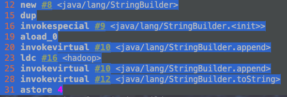

##  1、特性

*   String类使用final修饰，不可变性、不可被继承

    >   即一旦被创建，对其的任何操作【拼接，掐头去尾等】都需要重新开辟内存空间。再往深了将，就是`字符串常量池`中字符串只能保存一份，记住是字符串常量池中字符串，而不是堆中字符串。

*   实现Serialzable、Compareable接口，拥有序列化和排序特性

*   jdk8底层由char【】构成，jdk9改为了byte【】构成

    >   缘由 : char占两个字节，而绝大多数字符串是阿拉伯数字以及字母组成，因此需要一个字节byte就足够了。
    >
    >   针对中文以及甚至更多字节的情况，String类定义了 private final byte coder 用来存放当前内容的编码，从而采用是字符还是字节
    
*   字符串是引用类型，参数是值，基本数据类型做参数是是引用

    ```java
    public class StringExer {
        String str = new String("good");
        char [] ch = {'t','e','s','t'};
    
        public void change(String str, char ch []) {
            str = "test ok";
            ch[0] = 'b';
        }
    
        public static void main(String[] args) {
            StringExer ex = new StringExer();
            ex.change(ex.str, ex.ch);
            System.out.println(ex.str);
            System.out.println(ex.ch);
        }
    }
    //good
    //best
    ```

    

## 2、创建

### 0、引言

* jdk7之后==字符串常量池==和==静态变量==都存放在==堆==中，JDK6及之前存放在永久代也就是JDK8中元空间
* jdk8之后元空间中存放的是 ==JIT代码缓存==和==类型信息==
* 堆中内存可以分为三块。==一是所有new的对象==，==二是字符串常量池==，==三是静态变量==


### 1、字面量

```java
String name = "字面量创建字符串";
```

* 直接在 字符串常量池中进行创建，JDK7之后都是堆中。
* ==不可以重复==

> -Xmx10m -Xms10m -Xss10m -XX:MetaspaceSize=10m -XX:MaxMetaspaceSize=10m

```java
public static void main(String[] args) throws InterruptedException {
        List list = new ArrayList();
        while (true){
            Thread.sleep(1);
            String s = new String("new对象创建字符串");
            list.add(new String(String.valueOf(System.currentTimeMillis())).intern());
            list.add(s);
        }
    }
```


### 2、new

```java
String a = new String("new对象创建字符串");
```

* 所有new的对象都存放在堆中，并不是和字符串常量池中内存一块
* ==可以重复==

> -Xmx10m -Xms10m -Xss10m -XX:MetaspaceSize=10m -XX:MaxMetaspaceSize=10m

```java
public static void main(String[] args) throws InterruptedException {
        List list = new ArrayList();
        while (true){
            Thread.sleep(1);
            String s = new String("new对象创建字符串");
            list.add(new String(String.valueOf(System.currentTimeMillis())).intern());
            list.add(s);
        }
    }
```


### 3、intern()

```java
new String("字符串").intern();//将创建的对象放入到字符串常量池中并返回此常量池中的地址，而不是对象中地址
```

> <font color=ff00aa size=5>以上代码比较特殊，先会在堆内存中创建对象，然后调用intern方法后存放在字符串常量池中一份【前提是串池中没有改字符串】。会创建两份，内存地址并不一样</font>

JDK1.6 : 

-   如果串池中有，则并不会放入。返回已有的串池中的对象的地址
-   如果没有，会把此**对象复制一份**，放入串池，并返回串池中的对象地址

JDK1.7 之后 :

-   如果串池中有，则并不会放入。返回已有的串池中的对象的地址
-   如果没有，则会把**对象的引用地址**复制一份，放入串池，并返回串池中的引用地址


`例1`

```java
String s = new String("a")+new String("b");
String s1 = s.intern();
System.out.println(s=="ab"); 
System.out.println(s1=="ab");
```

jdk1.6 中 如下图示 ：


```java
System.out.println(s=="ab"); //false    这里的“ab”为字面量，属于串池
System.out.println(s1=="ab");//true
```


jdk1.7之后 如下图示


```java
System.out.println(s=="ab"); //true    最终引用内容都在对象内存块。
System.out.println(s1=="ab");//true
```


`例2`

```java
String x = "ab";
String s = new String("a") + new String("b");
String s1 = s.intern();// 串池用已有，不会放入，s1为s的地址，即对象内存块地址
System.out.println(s==x); 
System.out.println(s1==x);

*   先在串池中创建“ab”对象
*   对象内存块中 创建 “a” “b”“ab” 对象，StringBuilder 指向“ab”，StringBuilder地址赋予 s，
*   即 内存块中有“a”“b”“ab”对象，串池中有“ab”对象，而x指向串池中“ab”，s指向对象内存块中“ab”
*   s1 因为串池中已有“ab”，因此直接返回串池中“ab”，最终，s1指向串池中“ab”


```java
System.out.println(s==x); //false
System.out.println(s1==x);//true
//jdk 6/7/8 都一样，因为 s.intern(); 已经存在，并没有 对象和对象地址区分。仍然使用的是原来的地址
```


## 3、不可变性

`缘由`

- 安全性

因为字符串是不可变的，所以**是多线程安全的**，同一个字符串实例可以被多个线程共享。这样便不用因为线程安全问题而使用同步。字符串自己便是线程安全的。

String被许多的Java类(库)用来当做参数，比如网络连接地址URL，文件路径path，还有反射机制所需要的String参数等，假若String不是固定不变的，将会引起各种安全隐患。

- 效率

**字符串不变性保证了hash码的唯一性**，因此可以放心的进行缓存，这也是一种性能优化手段，意味着不必每次都取计算新的哈希码。

```java
public static void test1() {
  //todo 字面量定义的方式，“abc”存储在字符串常量池中
  String s1 = "abc";
  String s2 = "abc";
  System.out.println(s1 == s2);//"abc"在字符串常量池中只有一份      s1和s2在局部变量表中存放同一个引用地址       因此地址引用是一样的
  s1 = "hello"; //字符串常量池中新建 "hello"       现在保存了两个字符串 "hello"和"abc"       s1重新指向 "hello"。
  System.out.println(s1 == s2);//s2仍然指向"abc"        而s1指向"hello"        因此地址不一样
  System.out.println(s1);
  System.out.println(s2);
  System.out.println("----------------");
}

public static void test2() {
  //todo 字面量定义的方式，“abc”存储在字符串常量池中
  String s1 = "abc";
  String s2 = "abc";
  s2 += "def";//字符串常量池新创建"def"        继续创建一个字符串"abcdef"        s2指向"abcdef"
  System.out.println(s1);
  System.out.println(s2);
  System.out.println("----------------");
}

public static void test3() {
  //todo 字面量定义的方式，“abc”存储在字符串常量池中
  String s1 = "abc";
  String s2 = s1.replace('a', 'm');//字符串常量池中创建"mbc"       s2指向"mbc"
  System.out.println(s1);
  System.out.println(s2);
}

public static void test4(){
  String s1 = "a" + "b" + "c";  //字符串常量池中创建"a" "b"  "c"   "abc"
  String s2 = "abc"; //仍然指向  常量池中"abc"
  System.out.println(s1 == s2); // true，因为存放在字符串常量池
  System.out.println(s1.equals(s2)); // true
}

public static void main(String[] args) {
  test1();
  test2();
  test3();
  test4();
}
```


## 字符串常量池长度

String的string Pool是一个固定大小的Hashtable，默认值大小长度是1009。如果放进string Pool的string非常多，就会造成Hash冲突严重，从而导致链表会很长，而链表长了后直接会造成的影响就是当调用string.intern时性能会大幅下降。

* 使用-XX:StringTablesize可设置stringTab1e的长度

* 在jdk6中stringTable是固定的，就是1009的长度，所以如果常量池中的字符串过多就会导致效率下降很快。stringTablesize设置没有要求

* 在jdk7中，stringTable的长度默认值是60013，

* 在JDK8中，StringTable可以设置的最小值为1009


## JDK1.6到1.7字符串常量池和静态变量由永久代转到堆中缘由

* 永久代回收频率小
* 永久代默认内存小


## 字符串拼接操作

- 常量池中不会存在相同内容的变量
- 只要其中有一个是变量，结果就在堆中。变量拼接的原理是StringBuilder
- 如果拼接的结果调用intern()方法，则主动将常量池中还没有的字符串对象放入池中，并返回此对象地址

`普通字符串变量案例:`

```java
 public static void test5(){
        String s1 = "javaEE";
        String s2 = "hadoop";
        String s3 = "javaEEhadoop";
        String s4 = "javaEE" + "hadoop"; //字符串常量池中已有"javaEE"，"hadoop"，"javaEEhadoop"，     此时s4指向仍然是"javaEEhadoop"
        String s5 = s1 + "hadoop";//只要有变量则在堆中创建， 堆中地址为javaEEhadoop
        String s6 = "javaEE" + s2;
        String s7 = s1 + s2;

        System.out.println(s3 == s4); // true
        System.out.println(s3 == s5); // false
        System.out.println(s3 == s6); // false
        System.out.println(s3 == s7); // false
        System.out.println(s5 == s6); // false
        System.out.println(s5 == s7); // false
        System.out.println(s6 == s7); // false

        String s8 = s6.intern();
        System.out.println(s3 == s8); // true
    }
```


> String s3 = "javaEEhadoop";
> String s4 = "javaEE" + "hadoop"; //字符串常量池中已有"javaEE"，"hadoop"，"javaEEhadoop"，     此时s4指向仍然是"javaEEhadoop"
>
> <font color=ff00aa size=4>s3和s4由jvm字节码可知，用的就是同一个字符串常量池中的内容</font>

> String s5 = s1 + "hadoop";//只要有变量则在堆中创建， 堆中地址为javaEEhadoop。字节码如下：
>
> ​	可知，底层是new 了一个字符串对象。然后创建了一个StringBuilder，并使用append拼接了”hadoop“。
>
> 1. new String("javaEE")
> 2. StringBuilder a = new StringBuilder()
> 3. a.append("hadoop")
> 4. a.toString()
>
> <font color=f00aa size=4>只要其中有一个是变量，结果就在堆中。变量拼接的原理是StringBuilder</font>




`final字符串案例:`


> String s4 = s1 + s2;
>
> <font color=f00aa size=4>字符串拼接，如果是是变量字符串拼接，并且变量final修饰是常量，则不需要new对象和new StringBuilder，直接从字符串常量池中获取。</font>


### 1、+ 拼接和append性能对比

```java
    public static void main(String[] args) {
        int times = 10000*10;
        long method1_start = System.currentTimeMillis();
        method1(times);
        System.out.println("方法一执行时间 ： "+String.valueOf(System.currentTimeMillis()-method1_start));
        long method2_start = System.currentTimeMillis();
        method2(times);
        System.out.println("方法二执行时间 ： "+String.valueOf(System.currentTimeMillis()-method2_start));
        long method3_start = System.currentTimeMillis();
        method3(times);
        System.out.println("方法三执行时间 ： "+String.valueOf(System.currentTimeMillis()-method3_start));
    }
    public static void method1(int highLevel) {
        String src = "";
        for (int i = 0; i < highLevel; i++) {
            src += "a"; // 每次循环都会创建一个StringBuilder对象
        }
    }

    public static void method2(int highLevel) {
        StringBuilder sb = new StringBuilder();
        for (int i = 0; i < highLevel; i++) {
            sb.append("a");
        }
    }
    public static void method3(int highLevel) {
        for (int i = 0; i < highLevel; i++) {
            String a = "aa"+"bb";
        }
    }
```

```bash
方法一执行时间 ： 4022
方法二执行时间 ： 2
方法三执行时间 ： 1
```

> <font color=f00aa size=4>总结:</font>因此以后在字符串拼接时
>
> * 全是字符串，例如method2 则也可以
> * 如果字符串拼接频繁并且容量大，则最好使用stringBuilder.
> * 千万不要使用 变量字符串进行拼接

`面试题:`

```java
/**
 * new String("ab") 会创建几个对象？ 看字节码就知道是2个对象
 *
 * @author: 陌溪
 * @create: 2020-07-11-11:17
 */
public class StringNewTest {
    public static void main(String[] args) {
        String str = new String("a") + new String("b");
    }
}
```

字节码文件为

```bash
 0 new #2 <java/lang/StringBuilder>
 3 dup
 4 invokespecial #3 <java/lang/StringBuilder.<init>>
 7 new #4 <java/lang/String>
10 dup
11 ldc #5 <a>
13 invokespecial #6 <java/lang/String.<init>>
16 invokevirtual #7 <java/lang/StringBuilder.append>
19 new #4 <java/lang/String>
22 dup
23 ldc #8 <b>
25 invokespecial #6 <java/lang/String.<init>>
28 invokevirtual #7 <java/lang/StringBuilder.append>
31 invokevirtual #9 <java/lang/StringBuilder.toString>
34 astore_1
35 return
```

我们创建了6个对象

-   对象1：new StringBuilder()
-   对象2：new String("a")
-   对象3：常量池的 a
-   对象4：new String("b")
-   对象5：常量池的 b
-   对象6：toString中会创建一个 new String("ab")
    -   调用toString方法，不会在常量池中生成ab


## StringTable 中的GC

*   GC中字符串指的是堆中对象内存块的字符串，本身字符串常量池就不允许重复字符串。因此不需要GC
*   GC主要作用是去重，即祛除堆中对象内存块中重复的字符串。
*   因此我们在使用字符串时，尽量使用字面量的方式进行创建


## 附录1 - String、StringBuffer、StringBuilder

| String                                                       | StringBuffer                                                 | StringBuilder    |
| ------------------------------------------------------------ | ------------------------------------------------------------ | ---------------- |
| String的值是不可变的，这就导致每次对String的操作都会生成新的String对象，不仅效率低下，而且浪费大量优先的内存空间 | StringBuffer是可变类，和线程安全的字符串操作类，任何对它指向的字符串的操作都不会产生新的对象。每个StringBuffer对象都有一定的缓冲区容量，当字符串大小没有超过容量时，不会分配新的容量，当字符串大小超过容量时，会自动增加容量 | 可变类，速度更快 |
| 不可变                                                       | 可变                                                         | 可变             |
|                                                              | 线程安全                                                     | 线程不安全       |
|                                                              | 多线程操作字符串                                             | 单线程操作字符串 |