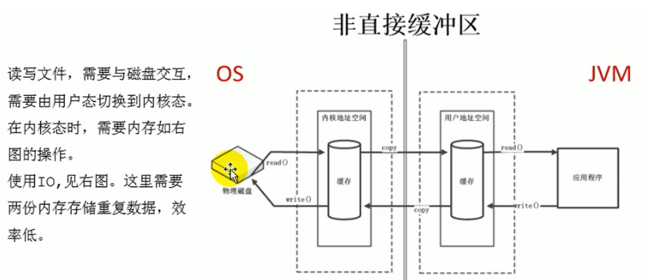
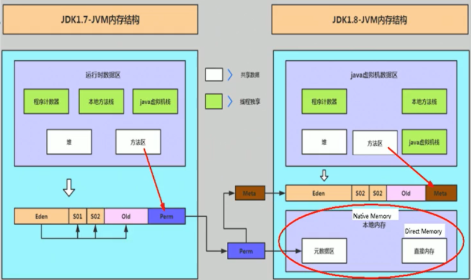

## 是什么

NIO的Buffer提供了一个可以不经过JVM内存直接访问系统物理内存的类——DirectBuffer。 DirectBuffer类继承自ByteBuffer，但和普通的ByteBuffer不同，普通的ByteBuffer仍在JVM堆上分配内存，其最大内存受到最大堆内存的限制；而DirectBuffer直接分配在物理内存中，并不占用堆空间，其可申请的最大内存受操作系统限制。

简单来讲：

* Java NIO模型中提供了一种直接访问本地内存的实现【DirectBuffer】，其表现为：

	* 不受jvm内存管控，也不受-xmx 参数控制，与方法区类似

	* 直接内存读写速度比普通的I/O buffer要快，但是创建和销毁慢。如下图

		

* jdk8之后永久代改为了元空间，之前讲元空间主要就是方法区，其实还有一个直接内存。如下图

	

* 直接内存 适合于 大内存空间且频繁访问的场合，不适合频繁申请释放内存的场合