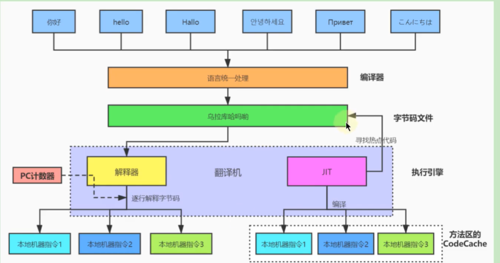
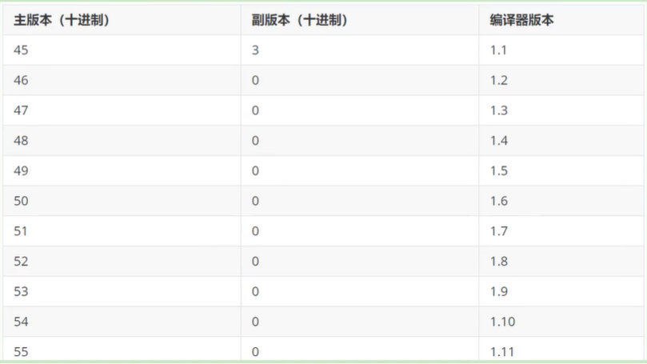
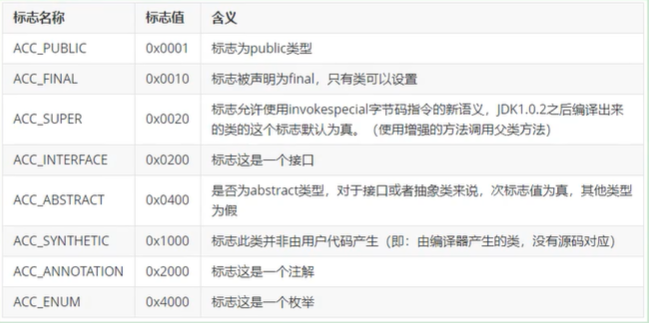
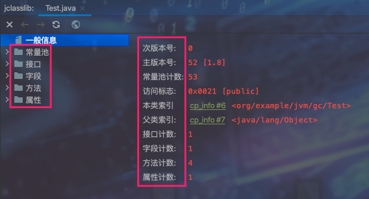

`引言:`

* 内存与垃圾回收中 -- 类加载子系统中，大概介绍了字节码文件的作用以及Class对象存储位置

## 相关概念

### 1、跨平台

* Java时跨平台的语言
* JVM是跨语言的平台

### 2、前端编译器和后端编译器

分析上图，可知：

* javac编译器 将 各个平台Java文件 编译为 字节码文件，为了和JIT区分，这里就叫 ==前端编译器==
* 字节码文件 经由类加载子系统 ，存放到运行时数据区，然后由 JVM执行引擎执行 虚拟机栈中栈顶 栈帧
* 执行一个个栈帧的时候 需要对字节码文件中jvm指令进行 解释为机器执行交由CPU执行，这一过程由解释器执行
* 解释器 特点是同样的代码多次运行需要的时间是一样的，即响应时间快
* for循环、while等语句，如果使用解释器执行次次解释执行就有点得不偿失了，为了提升性能，最常用最有效的武器 -- 缓存【JIT编译器】
* JIT编译器 利用热点探测 将for、while等循环执行的语句 赛选出来，将它们的机器码 存放到方法区，下次执行直接使用机器码，省去了解释过程

> :hatching_chick:解释器Tips：
>
> * Idea 默认前端编译器为 javac，只要Java文件更新则全盘编译
> * Eclipse 默认前端编译器为 Eclipse compiler for Jav（EJC），Ctrl+s 只编译 未编译的代码
> * 而 jsp 需要编译为servlet 也就是class字节码文件，其用到的前端编译器 就是 EJC

## Class文件结构

### 1、Class类本质

Class文件都对应着唯一一个类或结构的定义信息，其是由一组8位字节为基础单位的二进制流。

### 2、Class文件格式

结构 不像 XML 等描述语言，没有任何分割符号以及特定的标签。主要就是节省内存。因此其中的数据项必须严格限制以及定义，例如长度、数量、先后顺序等。

### 3、Class文件内容

1. 魔数

	class文件 开头的四个字节的无符号整数，固定值为0xCAFEBABE，其他类型的文件格式都有此魔数，用以判定是否符合要求。

	为什么不使用扩展名来判定格式是否符合要求？因为文件扩展名是可以随意更改的。

2. Class文件版本号

	紧接着魔数的四个字节存储的是Class文件的版本号，同样也是四个字节。第五六字节是minor_version,第七八个字节是major_version

	**版本号和Java编译器的对应关系如下表：**

	

	> 高版本JDK编译出来的字节码文件不能使用低版本JRE去运行，因为字节码文件在类加载子系统中 ==链接==中验证 会验证 字节码文件版本是否大于等于版本号，如果小于则不能正常加载class文件

3. 常量池

	常量池中是Class文件中内容最多的数据项，常量池中保存着该类文件中字段或者方法中通用的数据

	`内容:`

	* 字面量

	* 符号引用

		> 在 类加载子系统中  链接-解析  阶段中将符号引用变为直接引用

	

4. 访问标识

	用以标识类或者接口的访问信息，以及这个Class是class或者接口，访问修饰符、是否为abstract抽象类，以及是否为final等。如下：

	

5. 类索引、父类索引、接口索引集合

6. 字段表集合

7. 方法表集合

8. 属性表集合

### 4、Class文件解析

1. javap 指令

	javac -g 会生成局部变量表、指令和代码行偏移量以及常量池等。。

2. jclasslib

## 字节码指令集

