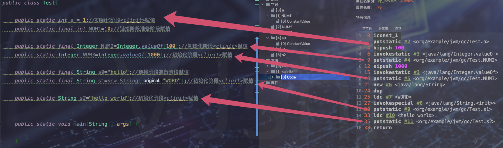

`引言:`

在 MD-Book/Java高级/Java类加载中 已经了解到了 类加载流程以及相关机制。

> 基本数据类型不需要进行加载，只有引用类型才需要被类加载

## 类的声明周期

1. 加载     

	* 通过这个类的全限定名 查找并加载 这个类的二进制字节流
	* 将这个类所代表的的静态存储结构放入到 方法区，称为类元信息
	* 堆中创建这个类的Class对象，创建的所有该类对象实例都指向该Class对象，该Class对象执行方法区的类元信息

	> 上面提过，基本数据类型不需要加载，而数组比较特殊，如果数组元素为基本数据类型则只关注其长度即可，而如果是引用类型则需要动态创建

2. 验证

	确保要加载的字节码符合规范,防止危害JVM安全

	* 文件格式验证  ： 验证字节流是否符合Class文件格式规范(比如Class文件主,次版本号是否在当前虚拟机兼容范围内...)
	* 元数据验证  ：类元数据进行语义验证，比如 有没有父类以及有没有实现父类中的方法等，类似于语法检查
	* 字节码验证  ： 对字节码进行验证,保证校验的类在运行时不会做出对JVM危险的行为，比如类型转换
	* 符号引用验证  ： 发生在解析阶段前:符号引用转换为直接引用

3. 准备

	> 准备阶段为类变量(静态变量)分配内存并默认初始化   静态常量显式初始化

	上面这句话是错误的，并不是所有的静态常量都会显式初始化
	

	

	* 上图中ConstantValue表示此字段在类加载 -- 链接  -- 准备阶段赋值
	* 上图中只有NUM1和s0变量在类加载 -- 链接  -- 准备阶段赋值，其余都只是在准备阶段赋默认值，初始化阶段赋值

	> 准备阶段为类变量(静态变量)分配内存并默认初始化  
	>
	> 只有 ==被final修饰的基本类型或字面量 的类变量== 才会被显式赋值

	上面这句话是正确的 

4. 解析

	将常量池中**符号引用替换为直接引用**（把符号引用代表的地址替换为真实地址）

5. 初始化<clinit>

	- 是**javac编译器 在编译期间自动收集==类变量==赋值的语句和静态代码块合并 自动生成的**
	- 如果没有对类变量赋值【即准备阶段没有赋值的类变量在此处进行初始化】动作或者静态代码块可能不会生成 <clinit>方法(带有`ConstantValue`属性的类变量初始化已经在准备阶段做过了,不会在这里初始化)

	

6. 使用

7. 卸载

	对象的回收比较复杂，需要满足如下条件：

	1. 没有该类的任何实例对象
	2. 加载该类的类加载器被回收
	3. 该类对应的Class对象没在任何地方被引用

	> 注意: 就算被允许回收也不一定会被回收, 一般只会回收自定义的类加载器加载的类

> 方法区的回收 主要包含：不使用的常量  和  类
>
> 方法区回收性价比低，因为不使用的常量和类比较少
>
> 