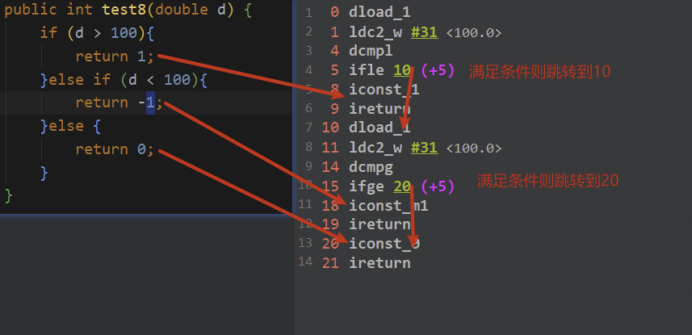

`引言：`

​	之前在第一章讲到，`指令集架构`一般分为：`基于栈`，另外一种分为`基于寄存器`。而 Java由于跨平台特性，几乎所有的jvm虚拟机都选择了 `基于栈架构的指令集`。其优点是跨平台，指令集小，编译器容易实现(只有进站和出站)，缺点是性能下降，实现同样的功能需要更多的指令。   


`数据类型:`


* i 代表int类型的数据操作
* l 代表 long
* s 代表 short
* b 代表byte
* c 代表char
* f 代表float
* d 代表double
* a 代表 object


### 1、加载与存储指令

> 用以 将数据从栈帧局部变量和操作数栈之间来回传递

* 局部变量压栈指令 ： 将一个局部变量加载到操作数栈

	xload 、xload_<n>

	> 其中x 为 数据类型即 i、l 、s 、b 、c 、 f、 d   而n为 0、1、2、3

* 常量入栈指令 ： 将一个常量加载到操作数栈

	iconst_<i>、lconst_<l>、fconst_<f>、dconst_<d>、bipush、sipush、ldc、ldc_w、ldc2_w、aconst_null、iconst_m1、

	> :baby_chick:这么多指令都是 常量入栈指令，又有何区别呢？
	>
	> ==iconst_<i>（i取值从-1到5），lconst_<l>（l从0到1）、fconst_<f>（f从0到2）、dconst_<d>（d从0到1）、aconst_null
	>
	> * 当int取值为-1 则采用iconst_m1
	> * 当int 取值在-1~5 则采用 iconst
	> * 当int取值-128~127 则采用bipush
	> * aconst_null将null压入操作数栈
	> * lconst_、lconst_1 分别将长整数0和1压入栈
	> * fconst_0、focnst_1、fconst_2 将浮点数0、1、2压入栈
	> * dconst_0、dconst_1 分别将double型0、1压入栈
	> * 当int取值-32768~32767 则采用sipush指令
	> * 当int取值-2147483648~2147483647采用 ldc 指令
	> * aconst_null将null压入操作数栈

	

* 出栈存储到局部变量表

	xstore、xstore_<n>

	> 其中x为 数据类型即 i、l 、a、n 、 f、 d   而n为 0、1、2、3即局部变量下标位置；xastore 中x为 i、l 、s 、b 、c 、 f、 d 、a

> 其中 byte、char、short、boolean数据类型时，经常用int类型的指令来表示


### 2、算术指令

> 用以将两个==操作数栈上的值==进行某种特定的运算、并把==结果重新压入操作数栈中==

算术指令应该按照数据类型进行分类，每一个分类中都应该包含对应的算术指令，但是 byte/short/char/boolean型的类型没有对应的算术指令，直接使用int类型的算术指令。


`无穷大和NaN:`

当一个操作产生溢出是，将使用有符号的无穷大表示，当某个操作结果没有明确的数据定义的话，将使用NaN来表示，而且所有使用NaN值作为操作数的算术操作都将返回NaN;

```java
// 无穷大
double j = 1 / 0.0;
System.out.println(j);
//结果值：Infinity

//NaN
double b1 = 0.0;
double b2 = b1/0.0;
System.out.println(b2);
//结果值：NaN
```

* 对整形数据 运算

	

* 浮点类型数据运算


### 3、比较指令

dcmpg、dcmpl、fcmpg、fcmpl、lcmp

> 指令fcmpg、gcmpl 都从栈中弹出两个操作数、并比较，设栈顶元素为v2，下面元素为v1,若v1=v2 则压入0，若v1>v2则压入1 ，若v1<v2 则压入-1

### 3、类型转换指令

将两种不同类型的数值进行转换，一般用于实现用户代码中的显式类型转换操作

* 宽化类型转换

	> 小范围数据类型向大范围数据类型转换

	* Int           -->     long | float | double          ： i2l、i2f、i2d
	* long        -->      float | double                   :   l2f、l2d
	* float        -->      double                            :    f2d
	* byte,short,char   使用int类型的指令

	> 简化为 ： int    -->    long   -->    float     -->   double

	`精度丢失问题:`

	* int-->  long             int-->double     不会发生精度丢失问题
	* int | long  -->  float    或者   long -->double   可能发生精度丢失问题，可能丢失掉最低有效位上的值，转化后的浮点数值是根据IEEE754最接近舍入模式所得到的正确整数值

	```java
	public void test2(){
	  long l1 =  123412345L;
	  long l2 =  1234567891234567899L;
	
	  float f1 = l1;
	  System.out.println(f1);
	  //123412345L
	  //1.23412344E8
	
	  double d1 = l2;
	  System.out.println(d1);
	  //1234567891234567899L
	  //1.23456789123456794E18
	}
	```

	

* 窄化类型转化

	* int->byte,char,short : `i2b`,`i2c`,`i2s`
	* long->int : `l2i`
	* float->long,int : `f2l`,`f2i`
	* double->float,long,int : `d2f`,`d2l`,`d2i`

	> 如果long,float,double要转换为byte,char,short可以先转为int再转为相对应类型

`精度丢失问题:`

> 会发生精度丢失问题

### 4、对象的创建与访问指令

1. 创建指令

	`new`: 创建实例

	`newarray`: 创建一维基本类型数组

	`anewarray`: 创建一维引用类型数组

	`multianewarray`: 创建多维数组

2. 字段访问指令

	`getstatic`: 对静态字段进行读操作

	`putstatic`: 对静态字段进行写操作

	`getfield`: 对实例字段进行读操作

	`putfield`: 对实例字段进行写操作

> 读操作 :  把要进行读操作的字段入栈
>
> 写操作 :  把要写操作的值出栈再写到对应的字段

​	


3. 数组操作指令

	* `b/c/s/i/l/f/d/a aload` : **表示将数组中某索引元素入栈** (读)
	* `b/c/s/i/l/f/d/a astore`: **表示将某值出栈并写入数组某索引元素** (写)

	> b开头的指令对byte和boolean通用

4. 获取数组长度指令

	* arraylength

	

5. 类型检查指令

	* instanceof : 判断某对象是否为某类的实例
	* checkcast : 检查引用类型是否可以强制转换

	

### 5、方法调用与返回指令

* 非虚方法：静态方法,私有方法,父类中的方法,被final修饰的方法,实例构造器
* 虚方法 ： 不是非虚方法就是虚方法

* 普通调用指令

	* `invokestatic`:调用静态方法
	* `invokespecial`:调用私有方法,父类中的方法,实例构造器方法,final方法
	* `invokeinterface`:调用接口方法
	* `nvokevirtual`: 调用虚方法

	> **使用`invokestatic`和`invokespecial`指令的一定是非虚方法**
	>
	> 使用`invokeinterface`指令一定是虚方法(因为接口方法需要具体的实现类去实现)
	>
	> 使用`invokevirtual`指令可能是虚方法

* 动态调用指令

	- `invokedynamic`: 动态解析出需要调用的方法再执行


* 方法返回指令

	> 方法返回指令: 方法结束前,将栈顶元素(最后一个元素)出栈 ,返回给调用者

	

### 6、操作数栈管理指令

* 出栈
	- `pop/pop2`出栈1个/2个栈顶元素
* 入栈
	- `dup/dup2` 复制栈顶1个/2个slot并重新入栈
	- `dup_x1` 复制栈顶1个slot并插入到栈顶开始的第2个slot下
	- `dup_x2 `复制栈顶1个slot并插入到栈顶开始的第3个slot下
	- `dup2_x1`复制栈顶2个slot并插入到栈顶开始的第3个slot下
	- `dup2_x2`复制栈顶2个slot并插入到栈顶开始的第4个slot下
		- 插入到具体的slot计算: dup的系数 + `_x`的系数

### 7、比较控制指令

> 通常先进行比较指令,再进行条件跳转指令

* 条件跳转指令

	> 出栈栈顶元素,判断它是否满足条件,若满足条件则跳转到指定位置




* 比较跳转指令

	> 类似于 比较指令和条件跳转指令 的结合体


### 8、异常处理指令

* throw抛出异常对应`athrow`: 清除该操作数栈上所有内容,将异常实例压入调用者操作数栈上

	

* try-catch/try-final/throws时会产生异常表，并不需要对应的jvm指令

	


### 9、同步控制指令

synchronized作用于方法时,方法的访问标识会有**ACC_SYNCHRONIZED表示该方法需要加锁**

synchronized作用于某个对象时,对应着**`monitorentry`加锁字节码指令和 `monitorexit`解锁字节码指令**

**Java中的synchronized默认是可重入锁**

- 当线程要访问需要加锁的对象时 (执行monitorentry)

1. 先查看对象头中加锁次数,如果为0说明未加锁,获取后,加锁次数自增
2. 如果不为0,再查看获取锁的线程是不是自己,如果是自己就可以访问,加锁次数自增
3. 如果不为0且获取锁线程不是自己,就阻塞

当线程释放锁时 (执行monitorexit)会让加锁次数自减


==为什么会有2个monitorexit ?==

程序正常执行应该是一个monitorentry对应一个monitorexit的

如果程序在加锁的代码中抛出了异常,没有释放锁,那不就会造成其他阻塞的线程永远也拿不到锁了吗

所以在程序抛出异常时(跳转PC偏移量为15的指令)继续往下执行,**抛出异常前要释放锁**


## i++和++i在jvm指令区别

### 1、没有赋值

```java
 public static void main(String[] args) {
   int i =1;
   i++;
   System.out.println(i);
   ++i;
 }
```


0. 从常量池中加载 1  到操作数栈

1. 操作数栈push 1 到局部变量表下标为1的地方，即变量i
2. 局部变量表下标1的变量i自增

5. 获取静态方法
6. 从局部变量表中加载下标为1的变量i到操作数栈

8. 从局部变量表中加载下标为1的变量i到操作数栈

12. 局部变量表下标1的变量i自增

15. 返回

> 在没有赋值情况下 i++和++i结果以及jvm指令操作都一样

### 2、有赋值


0. 从常量池中加载 1  到操作数栈

1. 操作数栈push 1 到局部变量表下标为1的地方，即变量i
2. <font color=ff00aa>从局部变量表下标1的位置即变量i 加载到操作数栈</font>
3. <font color=ff00aa>局部变量表 下标1 的变量i 自增 为2，注意此时 操作数栈中存在 3步骤中的变量i 即没有自增之前的 i </font>

6. <font color=ff00aa>操作数栈中 变量i =1 存储到局部变量表中 下标2的位置</font>
7. <font color=ffaa00>7 、10 、11 PC寄存器偏移量 执行输出   此时输出的是 操作数栈中 i= 1</font>

14. 局部变量下标1的变量i 自增

17. <font color=ff00aa>从局部变量表下标1的位置即变量i 加载到操作数栈，此时变量i= 2</font>
18. <font color=ff00aa>操作数栈中 变量i =2 存储到局部变量表中 下标3的位置</font>
19. <font color=ffaa00>19、22、23 PC寄存器偏移量 执行输出   此时输出的是 操作数栈中 i= 2</font>

> *  a=i++  则会先把i的值push到操作数栈中，然后执行自增 icc by 1，此时局部变量表中i为1 ,然后进行store 将之前存入的I 的值 store到局部变量表中为1
>
> * a=++I  先执行 自增 即icc by 1 此时局部变量表中的I 为 2 然后 push的操作数栈中,然后再store到局部变量中为a 也就是2


## 锁关键字Synchronized

Synchronized 关键字不会再字节码层面添加任何东西，只是在该方法的访问标识添加synch。。。。如果多线程发现该方法的修饰符为synch 。。。**则等待锁**


## 附录一

### 1、NaN和Infinity

> 浮点数 运算中会有如下两种特殊的情况

* NaN

	不是一个数

* Infinity

	无穷大

**Double中是如下定义Infinity和NaN**

```java
public static final double POSITIVE_INFINITY = 1.0 / 0.0;
public static final double NEGATIVE_INFINITY = -1.0 / 0.0;
public static final double NaN = 0.0d / 0.0;
```

**Float中是如下定义Infinity和NaN**

```java
public static final float POSITIVE_INFINITY = 1.0f / 0.0f;
public static final float NEGATIVE_INFINITY = -1.0f / 0.0f;
public static final float NaN = 0.0f / 0.0f;
```


1. 非零浮点数被零除的无穷值，即

	```bash
	1.0 /0 = Infinity, -1.0/0 = -Infinity
	```

2. 零浮点数除以零=Nan，即

	```bash
	0.0/0=Nan
	```

3. NaN参与的运算都为NaN，即

	```bash
	NaN+NaN = NaN, 
	NaN-NaN = NaN, 
	NaN * NaN = NaN, 
	NaN / NaN = NaN,
	NaN / 1.0 = NaN, 
	NaN / Infinity = NaN, 
	NaN / -Infinity = NaN
	```

4. Infinity与-Infinity参与的运算，即

	```bash
	Infinity + Infinity = Infinity, 
	
	Infinity-Infinity = NaN
	
	Infinity*Infinity=Infinity, 
	Infinity / Infinity = NaN
	
	-Infinity + -Infinity = -Infinity, 
	-Infinity - -Infinity = NaN,
	
	-Infinity * -Infinity = Infinity, 
	-Infinity / -Infinity = NaN
	
	Infinity / 0 = Infinity, 
	-Infinity / 0 = -Infinity
	
	Infinity / 1.0 = Infinity, 
	Infinity / -1.0 = -Infinity,
	-Infinity / 1.0 = -Infinity, 
	-Infinity / -1.0 = Infinity
	```

5. 有限数与Infinity、-Infinity的运算：

	```bash
	1.0 / Infinity = 0.0, 
	-1.0 / Infinity = 0.0, 
	1.0 / -Infinity = -0.0, 
	-1.0/Infinity = -0.0
	```

6. 零与Infinity、-Infinity的运算：

	```bash
	0 / Infinity = 0.0, 
	0 / -Infinity = -0.0
	```

	


