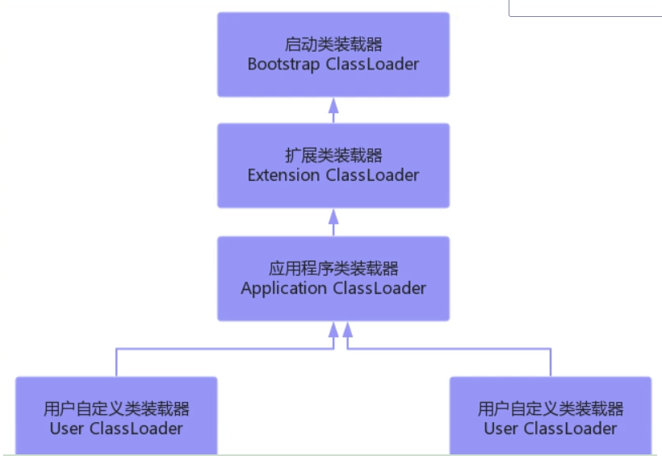
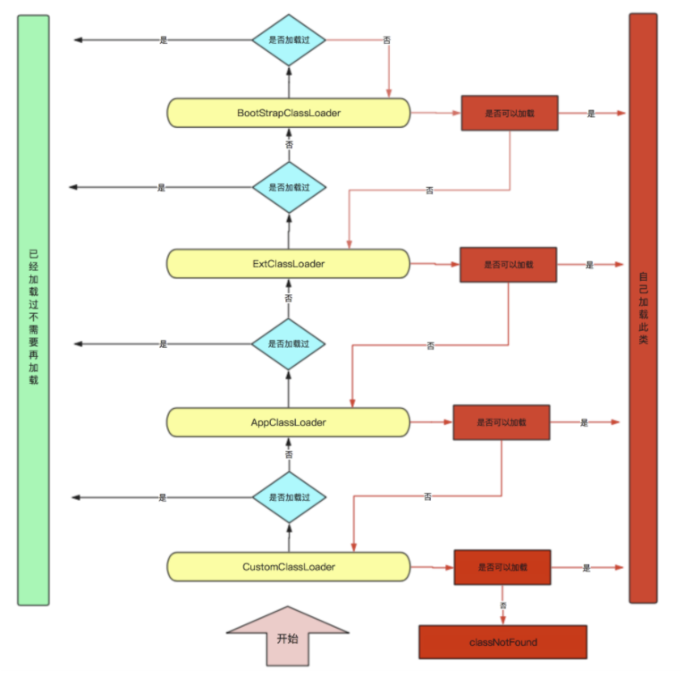
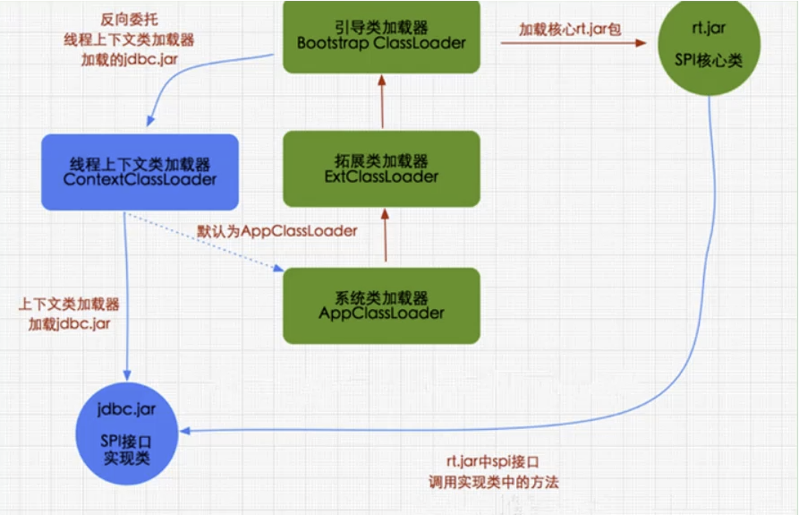
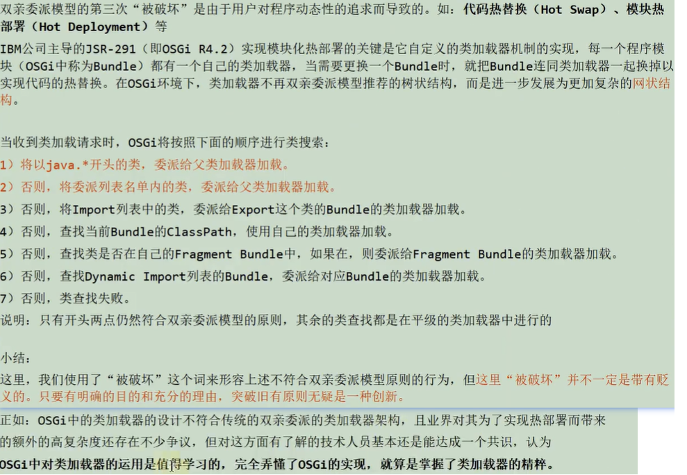
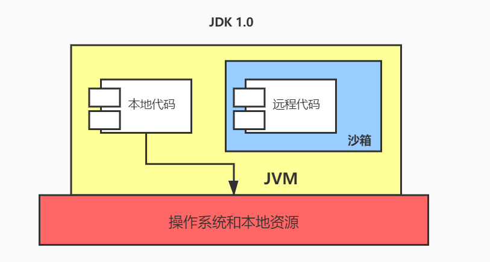
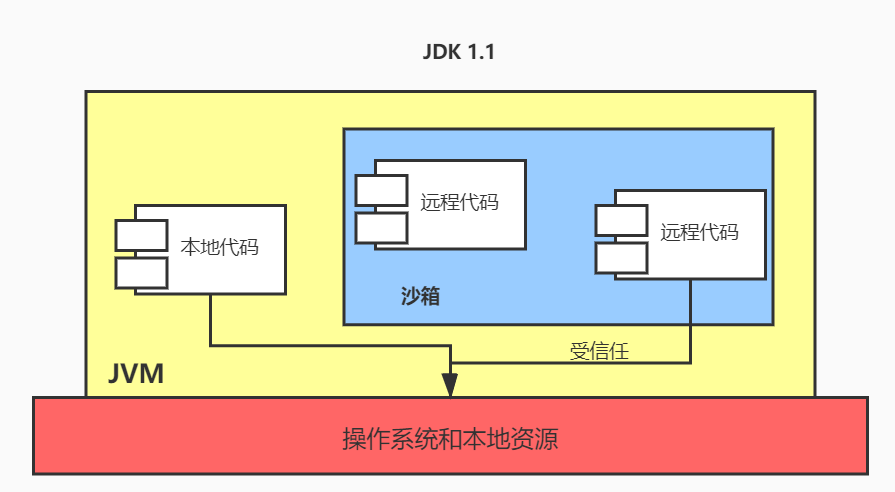
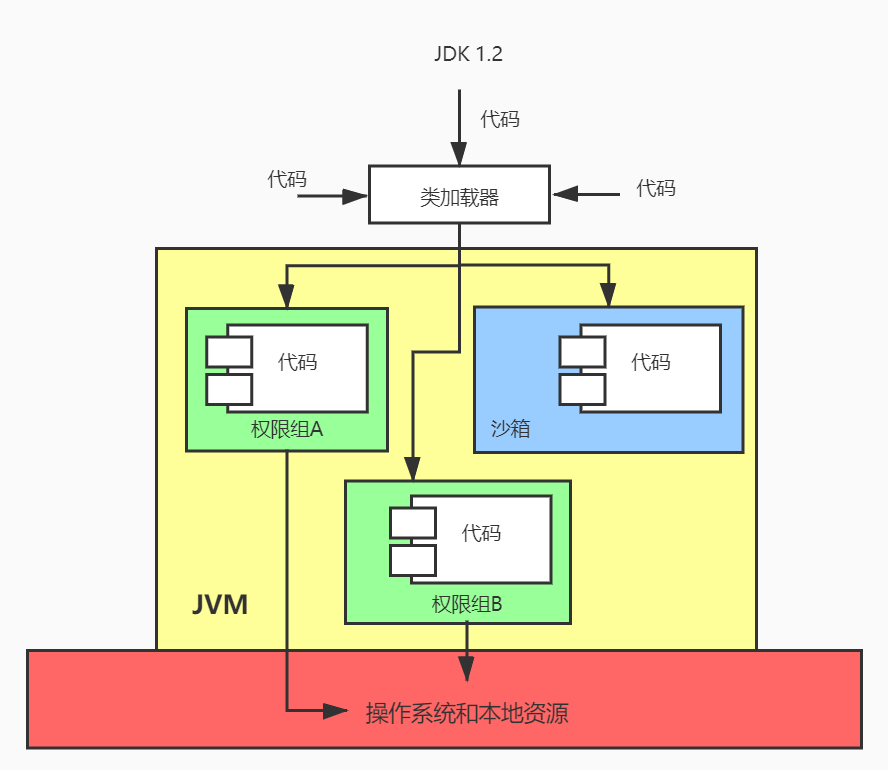
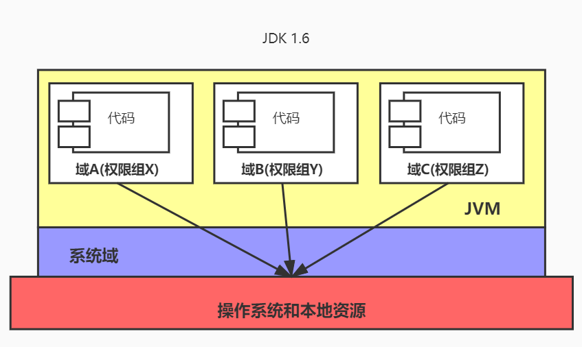
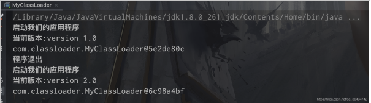

## 类加载器分类



* 如果没有自定义类加载器加载指定类，则该类由Application加载器加载
* 双亲委派，向上委派、向下查找
* 启动类加载器、扩展类加载器、应用程序类加载器 都加载指定路径下的字节码文件

* <font color=ff00aa>数组类加载器类型是由数组中元素类加载决定的</font>
* 基本数据类型不需要类加载器加载，已经存在于jvm中直接调用即可
* 启动类加载器是由c/c++编写，在Java中获取启动类加载器结果是null
* <font color=ff00aa>父类加载器无法访问子类加载器</font>
* <font color=ff00aa>类加载器类中有一个容器，用以存放加载过的类，而每个类中又有一个属性，存放了该类加载器的引用，即互相引用</font>


## 双亲委派实现



`ClassLoader类`

```java
    protected Class<?> loadClass(String name, boolean resolve)
        throws ClassNotFoundException
    {
      //加锁同步 保证只加载一次
        synchronized (getClassLoadingLock(name)) {
            // 首先检查这个class是否已经加载过了
            Class<?> c = findLoadedClass(name);
            if (c == null) {
                long t0 = System.nanoTime();
                try {
                  // c==null表示没有加载，如果有父类的加载器则让父类加载器加载
                    if (parent != null) {
                        c = parent.loadClass(name, false);
                    } else {
                      //如果父类的加载器为空 则说明递归到bootStrapClassloader了
                        //则委托给BootStrap加载器加载
                        //bootStrapClassloader比较特殊无法通过get获取
                        c = findBootstrapClassOrNull(name);
                    }
                } catch (ClassNotFoundException e) {
                    //父类无法加载抛出异常
                }
							//如果父类加载器仍然没有加载过，则尝试自己去加载class
                if (c == null) {
                    // If still not found, then invoke findClass in order
                    // to find the class.
                    long t1 = System.nanoTime();
                    c = findClass(name);

                    // this is the defining class loader; record the stats
                    sun.misc.PerfCounter.getParentDelegationTime().addTime(t1 - t0);
                    sun.misc.PerfCounter.getFindClassTime().addElapsedTimeFrom(t1);
                    sun.misc.PerfCounter.getFindClasses().increment();
                }
            }
            //是否要解析
            if (resolve) {
                resolveClass(c);
            }
            return c;
        }
    }
```

* 类加载 多线程下怎么保证线程安全

	> loadClass 中 使用 synchronized 加锁，确保线程安全


##  Class.forName()与ClassLoader.loadClass()区别

- Class.forName()
	- 传入一个类的全限定名返回一个Class对象
	- **将Class文件加载到内存时会初始化,主动引用**
- ClassLoader.loadClass()
	- 需要class loader对象调用
	- 通过上面的源码分析可以知道,双亲委派模型调用loadClass,**只是将Class文件加载到内存,不会初始化和解析,直到这个类第一次使用才进行初始化**


## 破坏双亲委派机制

### 1、为什么要去破坏双亲委派机制

因为双亲委派机制是存在缺陷的。

> 比如 一个由bootstrap加载器加载的系统接口，我应用类实现了该接口，那么当bootstrap加载接口中子类实现方法时，势必会加载实现类，但是实现类是应用类，bootstrap加载器只能加载jre/bin下类，导致报错

### 2、破坏双亲委派机制

1. 第一次破坏双亲委派模型

	jdk1.2前还没有双亲委派模型,为了加入双亲委派模型,兼容用户自定义的类加载器代码加入了`findClass()`方法,引导用户不要覆写`loadClass()`方法,而是去覆写`findClass()`

2. 第二次破坏双亲委派模型

	上文说过**父类加载器无法访问子类加载器**，服务提供者接口SPI(rt.jar中提供外部服务,可由应用层自行实现的接口)

	> 例如：当JDBC等不仅要加载基本类还可能要加载其他厂商实现的服务提供者接口SPI时就会破坏双亲委派机制(有基础类型又要调回用户代码,这是双亲委派模型的弊端)

	`解决方案:`

	引入==线程上下文类加载器==  ：==线程上下文类加载器==在创建线程时未设置会在父线程中继承,全局范围都没设置的话默认系统类加载器

	


3. 第三次破坏双亲委派机制

	> 开发者模式下 方便大家在不启动项目时进行热部署以及热替换，例如tomcat jsp热替换和idea中热部署

	


## 沙箱安全机制

> JDK1.0

Java将执行程序分为**本地代码和远程代码**，本地代码是可信任的,可以访问本地资源，而不可信任的远程代码安全依赖于沙箱机制



> JDK1.1

增加安全策略,给受信任的远程代码也可以访问到本地资源



> JDK1.2

改进安全机制,增加代码签名

无论本地代码还是远程代码都按照用户的安全策略,由类加载器把代码加载到不同权限的空间



> JDK1.6

引入域的概念，把代码加载到不同的应用域和系统域( 类似 Linux用户态和内核态 )，系统域负责与本地资源交互，应用域负责通过系统域提供的接口来进行对需要资源的访问，应用域中各部分权限不同,可以使用系统域提供的接口权限也不同




## 热部署和热替换

> 来源于 第三次破坏双亲委派机制。其原理也就是利用 自定义类加载器实现

* tomcat中jsp热替换

* tomcat下多个webapp是如何隔离【因为每个app可能引用同一个jar包，但是包的版本不一样，并且web容器也需要自己的类库，如果不隔离则报错】
* idea | spring boot热部署

`克服的困难:`

* jvm类加载器 有缓存机制，即懒加载，并且只加载一次，如果想字节码文件同步更新到jvm内存中则需要重启jvm
* class字节码 装入jvm 时 ，不仅将类元信息放入了方法区，也将Class对象放入了堆中。
* 有可能Class对象有很多个对象实例，如何处理？Class对象需要销毁后重新class走一遍类加载子系统？
* 有可能Class对象对象实例正在运行，需要销毁对象吗或者是暂停用户线程吗？STW

`实现思路:`

1. 我们可以通过自定义类加载器来加载我们需要热部署的字节码文件【即第三次破坏双亲委派机制】

	```java
	package com.classloader;
	
	import com.Application;
	import com.Test;
	
	import java.io.File;
	import java.io.FileInputStream;
	import java.io.InputStream;
	import java.util.ArrayList;
	import java.util.List;
	
	public class MyClassLoader extends ClassLoader {
	
	    //目的 让缓存里面永远能返回一个Class对象 这样就不需要走父类加载器了
	    //在构造方法里面加载类  loadClass
	
	    //项目的根路径
	    public String rootPath;
	
	    //所有需要由我这个类加载器加载的类存在这个集合
	    public List<String> clazzs;
	    //两个classloader  一个是负责加载 需要被热部署的代码的
	    //一个是加载系统的一些类的
	
	    //classPaths: 需要被热部署的加载器去加载的目录
	    public MyClassLoader(String rootPath, String... classPaths) throws Exception {
	        this.rootPath = rootPath;
	        this.clazzs = new ArrayList<>();
	        for (String classPath : classPaths) {
	            scanClassPath(new File(classPath));
	        }
	    }
	
	
	    //扫描项目里面传进来的一些class
	    public void scanClassPath(File file) throws Exception {
	        if (file.isDirectory()) {
	            for (File file1 : file.listFiles()) {
	                scanClassPath(file1);
	            }
	        } else {
	            String fileName = file.getName();
	            String filePath = file.getPath();
	            String endName = fileName.substring(fileName.lastIndexOf(".") + 1);
	            if (endName.equals("class")) {
	                //现在我们加载到的是一个Class文件
	                //如何吧一个Class文件 加载成一个Class对象？？？？
	                InputStream inputStream = new FileInputStream(file);
	                byte[] bytes = new byte[(int) file.length()];
	                inputStream.read(bytes);
	
	                //文件名转类名
	                String className = fileNameToClassName(filePath);
	
	                //类名
	                defineClass(className, bytes, 0, bytes.length);
	                clazzs.add(className);
	                //loadClass 是从当前ClassLoader里面去获取一个Class对象
	            }
	        }
	
	    }
	
	    //文件名转类名，这儿操作系统不同可能文件的分隔符不一样，所以这儿需要注意，笔者用的Mac。Windows操作需要自行修改。
	    public String fileNameToClassName(String filePath) {
	        String className = filePath.replace(rootPath, "").replaceAll("/", ".");
	        className = className.substring(1, className.lastIndexOf("."));
	        return className;
	    }
	
	    @Override
	    public Class<?> loadClass(String name) throws ClassNotFoundException {
	        Class<?> loadClass = findLoadedClass(name);
	        //第一情况 这个类 不需要由我们加载
	        //第二种情况 这个类需要由我们加载 但是 确实加载不到
	        if (loadClass == null) {
	            if (!clazzs.contains(name)) {
	                loadClass = getSystemClassLoader().loadClass(name);
	            } else {
	                throw new ClassNotFoundException("没有加载到类");
	            }
	        }
	        return loadClass;
	    }
	
	    //当文件被修改的时候再进行热部署
	    public static void main(String[] args) throws Exception {
	        //双亲委派机制
	        Application.run(MyClassLoader.class);
	    }
	}
	```

2. 文件监听，监听我们要热部署的类路径，类更新后使用自定义加载器重新加载

	```java
	package com;
	
	import com.classloader.MyClassLoader;
	import org.apache.commons.io.monitor.FileAlterationMonitor;
	import org.apache.commons.io.monitor.FileAlterationObserver;
	
	import java.io.File;
	
	public class Application {
	
	    public static String rootPath;
	
	    public static void run(Class<?> clazz) throws Exception {
	        String rootPath = MyClassLoader.class.getResource("/").getPath().replaceAll("%20", " ");
	        rootPath = new File(rootPath).getPath();
	        Application.rootPath = rootPath;
	        MyClassLoader myClassLoader = new MyClassLoader(rootPath, rootPath + "/com");
	        //用我们自己的类加载器加载程序入口
	        startFileListener(rootPath);
	        start0(myClassLoader);
	    }
	
	  //开启文件监听器
	    public static void startFileListener(String rootPath) throws Exception {
	        FileAlterationObserver fileAlterationObserver = new FileAlterationObserver(rootPath);
	        fileAlterationObserver.addListener(new FileListener());
	        FileAlterationMonitor fileAlterationMonitor = new FileAlterationMonitor(500);
	        fileAlterationMonitor.addObserver(fileAlterationObserver);
	        fileAlterationMonitor.start();
	        //要实现文件监听：  写一个线程 去定时监听某个路径下所有的文件
	        //如果文件发生改动 就回调监听器
	    }
	
	    //新的classLoader
	    public static void start() {
	        System.out.println("启动我们的应用程序");
	        new Test().test();
	    }
	
	    public static void stop() {
	        System.out.println("程序退出");
	        //告诉jvm需要gc了
	        System.gc();
	        //告诉jvm可以清除对象引用
	        System.runFinalization();
	    }
	
	    public static void start0(MyClassLoader classLoader) throws Exception {
	      //全盘委托的机制，通过自定义的类加载加载，然后start方法中的new Test()也会通过自定义的类加载器加载
	        Class<?> aClass = classLoader.loadClass("com.Application");
	        aClass.getMethod("start").invoke(aClass.newInstance());
	    }
	
	}
	```

3. 文件监听

	```java
	package com;
	
	import com.classloader.MyClassLoader;
	import org.apache.commons.io.monitor.FileAlterationListenerAdaptor;
	
	import java.io.File;
	
	public class FileListener extends FileAlterationListenerAdaptor {
	
	    @Override
	    public void onFileChange(File file) {
	        if (file.getName().indexOf(".class") != -1) {
	            try {
	                MyClassLoader myClassLoader = new MyClassLoader(Application.rootPath, Application.rootPath + "/com");
	                Application.stop();
	                Application.start0(myClassLoader);
	            } catch (Exception e) {
	                e.printStackTrace();
	            }
	        }
	    }
	}
	```

4. 测试

	```java
	package com;
	
	public class Test {
	
	    public void test() {
	        System.out.println("当前版本:version 1.0");
	        System.out.println(this.getClass().getClassLoader());
	    }
	}
	```

	


## 代码加密

通常情况下，我们都是直接使用系统类加载器。但是，有的时候，我们也需要自定义类加载器。比如应用是通过网络来传输 Java 类的字节码，为保证安全性，这些字节码经过了加密处理，这时系统类加载器就无法对其进行加载，这样则需要自定义类加载器来实现。自定义类加载器一般都是继承自 ClassLoader 类，从上面对 loadClass 方法来分析来看，我们只需要重写 findClass 方法即可。下面我们通过一个示例来演示自定义类加载器的流程：

```java
package com.ys.classloader;

import java.io.*;


public class MyClassLoader extends ClassLoader {

    private String root;

    protected Class<?> findClass(String name) throws ClassNotFoundException {
        byte[] classData = loadClassData(name);
        if (classData == null) {
            throw new ClassNotFoundException();
        } else {
            return defineClass(name, classData, 0, classData.length);
        }
    }

    private byte[] loadClassData(String className) {
        String fileName = root + File.separatorChar
                + className.replace('.', File.separatorChar) + ".class";
        try {
            InputStream ins = new FileInputStream(fileName);
            ByteArrayOutputStream baos = new ByteArrayOutputStream();
            int bufferSize = 1024;
            byte[] buffer = new byte[bufferSize];
            int length = 0;
            while ((length = ins.read(buffer)) != -1) {
                baos.write(buffer, 0, length);
            }
            return baos.toByteArray();
        } catch (IOException e) {
            e.printStackTrace();
        }
        return null;
    }

    public String getRoot() {
        return root;
    }

    public void setRoot(String root) {
        this.root = root;
    }

    public static void main(String[] args)  {

        MyClassLoader classLoader = new MyClassLoader();
        classLoader.setRoot("/User/king/temp");

        Class<?> testClass = null;
        try {
            testClass = classLoader.loadClass("com.ys.classloader.Test2");
            Object object = testClass.newInstance();
            System.out.println(object.getClass().getClassLoader());
        } catch (ClassNotFoundException e) {
            e.printStackTrace();
        } catch (InstantiationException e) {
            e.printStackTrace();
        } catch (IllegalAccessException e) {
            e.printStackTrace();
        }
    }
}
```

> 自定义类加载器的核心在于对字节码文件的获取，如果是加密的字节码则需要在该类中对文件进行解密。由于这里只是演示，我并未对class文件进行加密，因此没有解密的过程。