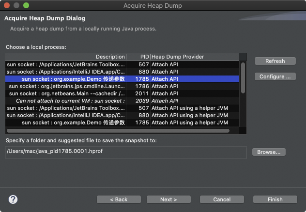

`引用：`

使用上一章命令行工具或组合能帮您获取目标Java应用性能相关的基础信息，但它们存在下列局限：

- 1．无法获取方法级别的分析数据，如方法间的调用关系、各方法的调用次数和调用时间等（这对定位应用性能瓶颈至关重要）。
- 2．要求用户登录到目标 Java 应用所在的宿主机上，使用起来不是很方便。
- 3．分析数据通过终端输出，结果展示不够直观。

为此，JDK提供了一些内存泄漏的分析工具，如jconsole，jvisualvm等，用于辅助开发人员定位问题，但是这些工具很多时候并不足以满足快速定位的需求。所以这里我们介绍的工具相对多一些、丰富一些。

## 图形化工具

### 1、JDK自带工具

* jconsole

	功能简单，支持查看Java应用程序的运行概况、监控堆信息、永久区（或元空间）使用情况、类加载情况等

	`检测死锁示例`

	

	

* Visual VM

	相较jconsole强大。支持的功能也更为丰富，并且支持插件安装

	`远程连接示例`

	

	`导出dump文件示例`

	

	`检测死锁示例`

	

* JMC

	内置Java Flight Recorder。能够以极低的性能开销收集Java虚拟机的性能数据。

### 2、第三方工具

* MAT

	是基于Eclipse的内存分析工具，是一个快速、功能丰富的Java heap分析工具，它可以帮助我们查找内存泄漏和减少内存消耗。主要用于hump文件分析

	通过对hump文件分析可以获取如下内存信息：

	- 所有的对象信息，包括对象实例、成员变量、存储于栈中的基本类型值和存储于堆中的其他对象的引用值。
	- 所有的类信息，包括classloader、类名称、父类、静态变量等
	- GCRoot到所有的这些对象的引用路径
	- 线程信息，包括线程的调用栈及此线程的线程局部变量（TLS）

	`查看dump文件示例`

	* 离线dump查看

		

		

	* 在线内存分析

		

		

* JProfiler

	商业软件，需要付费。功能强大。

	**特点：**

	- 使用方便、界面操作友好（简单且强大）
	- 对被分析的应用影响小（提供模板）
	- CPU，Thread，Memory分析功能尤其强大
	- 支持对jdbc，noSql，jsp，servlet，socket等进行分析
	- 支持多种模式（离线，在线）的分析
	- 支持监控本地、远程的JVM
	- 跨平台，拥有多种操作系统的安装版本

	**主要功能：**

	- 1-方法调用：对方法调用的分析可以帮助您了解应用程序正在做什么，并找到提高其性能的方法
	- 2-内存分配：通过分析堆上对象、引用链和垃圾收集能帮您修复内存泄露问题，优化内存使用
	- 3-线程和锁：JProfiler提供多种针对线程和锁的分析视图助您发现多线程问题
	- 4-高级子系统：许多性能问题都发生在更高的语义级别上。例如，对于JDBC调用，您可能希望找出执行最慢的SQL语句。JProfiler支持对这些子系统进行集成分析

* Arthas

	阿里巴巴开源的Java诊断工具。功能十分强大

* Btrace

	Java运行时追踪工具，可以在不停机的情况下，跟中指定的方法调用，构造函数调用和系统内存等信息

## 案例分析

### 1、Tomcat堆溢出分析

> Tomca本身也是由Java实现，因此我们可以像监控Java进程一样监控Tomcat进程

1. 发生OOM，首先查看大对象

	

2. 查看其外引用和内引用

	

	

	

3. 可知，是由于线程池中阻塞队列造成的