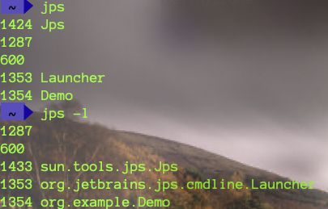
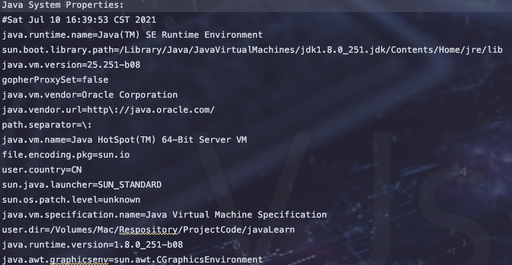

`引言:`

无监控、不调优


## JPS

> 必须要保证Java进程开启UserPerfData参数，如果关闭则jps命令不可使用。使用-XX:+UsePerfData开启

>  （Java process status）用以查询正在运行的Java进程，对于本地虚拟机进程来说，进程的本地虚拟机ID与操作系统的进程ID是一志的、唯一的

`语法:`


`jps -q`

> 简略显示


`jps -l`

> 详细显示




`jps -m`

> 输出虚拟机进程启动时传递给主类main的参数

==jps -m > a.txt==


==jps -l -m > b.txt==


`jps -v`

> 查看进程jvm参数


## jstat

> 查看jvm统计信息，它可以显示本地或者远程虚拟机进程中的类装载、内存、垃圾收集、JIT编译等运行数据。在没有GUI图形界面，只提供了纯文本控制台环境的服务器上，它将是运行期定位虚拟机性能问题的首选工具。常用于检测垃圾回收问题以及内存泄漏问题。


`语法：`

```bash
jstat -<option> [-t] [-h<lines>] <vmid> [<interval> [<count>]]
```


**option参数**

选项option可以由以下值构成。

==类装载相关的：==

- -class：显示ClassLoader的相关信息：当前进程类的装载个数、占用空间、卸载个数、类装载所消耗的时间等

	

==垃圾回收相关的：==

- -gc：显示与GC相关的堆信息。包括Eden区、两个Survivor区、老年代、永久代等的容量、已用空间、GC时间合计等信息。
- -gccapacity：显示内容与-gc基本相同，但输出主要关注Java堆各个区域使用到的最大、最小空间。
- -gcutil：显示内容与-gc基本相同，但输出主要关注已使用空间占总空间的百分比。
- -gccause：与-gcutil功能一样，但是会额外输出导致最后一次或当前正在发生的GC产生的原因。
- -gcnew：显示新生代GC状况
- -gcnewcapacity：显示内容与-gcnew基本相同，输出主要关注使用到的最大、最小空间
- -geold：显示老年代GC状况
- -gcoldcapacity：显示内容与-gcold基本相同，输出主要关注使用到的最大、最小空间
- -gcpermcapacity：显示永久代使用到的最大、最小空间。

JIT相关的：

- -compiler：显示JIT编译器编译过的方法、耗时等信息
- -printcompilation：输出已经被JIT编译的方法


**interval参数：** 用于指定输出统计数据的周期，单位为毫秒。即：查询间隔

> 如果没有指定interval 则默认打印一次


**count参数：** 用于指定查询的总次数


**-t参数：** 可以在输出信息前加上一个Timestamp列，显示程序的总体运行时间。单位：秒


**-h参数：** 可以在周期性数据输出时，输出多少行数据后输出一个表头信息

> 输出三行数据后打印表头


> :jack_o_lantern:判断堆健康总结：
>
> ​	我们可以使用jstat -t 进程号 时间间隔 次数   来获取到GC时间在一段运行时间的占比情况如果比例超过20%则表明目前堆的压力比较大，如果比例超过90%则表明堆中几乎没有可用空间，随时OOM。如下图：


* ```java
	public static void main(String[] args) throws InterruptedException {
	    List<byte[]> list = new ArrayList<>();
	
	    for (int i = 0; i < 10000; i++) {
	        byte[] bytes = new byte[1024 * 1024*3];//5mb
	        list.add(bytes);
	        Thread.sleep(200);
	    }
	}
	```

* > 在一段时间（23.8-16.7）GC时间（0.134-0.093）占比 = （0.134-0.093）/（23.8-16.7）= 0.041/7.1=5.7% 。占比低于20% 说明很健康

> :jack_o_lantern:判断内存泄漏总结：
>
> 获取几组数据【如上jstat -gc -t 1165 1000 30这种为一组】从每组中获取 OU（即老年代占用字节）最小值。然后判断这几组中OU是否持续升高，如果持续升高则发生了内存泄漏。当然可以使用jvisualvm更直观的看到


## jinfo

（Configuration Info for Java），查看虚拟机配置参数信息，也可用于调整虚拟机的配置参数


`语法:`

```bash
jinfo [options] pid
```

`options参数`

| 选项             | 选项说明                                                     |
| ---------------- | ------------------------------------------------------------ |
| no option        | 输出全部的参数和系统属性                                     |
| -flag name       | 输出对应名称的参数                                           |
| -flag [+-]name   | 开启或者关闭对应名称的参数 只有被标记为manageable的参数才可以被动态修改 |
| -flag name=value | 设定对应名称的参数                                           |
| -flags           | 输出进程全部的jvm参数                                        |
| -sysprops        | 输出系统属性                                                 |

### 1、查看参数

==jinfo -sysprops 942 > d.txt==



==jinfo -flags 942==


==jinfo -flag 参数名称 进程号==


### 2、配置参数

> 正在运行的程序并不是所有的参数都支持配置的，只是部分支持，即参数标记为manageable的参数。

`查看标记为manageable参数`


`修改参数`


### 3、拓展命令

* java -XX:+PrintFlagsInitial 查看所有JVM参数启动的初始值
* java -XX:+PrintFlagsFinal 查看所有JVM参数的最终值
* java -XX:+PrintCommandLineFlags 查看哪些已经被用户或者JVM设置过的详细的XX参数的名称和值


## jmap

> JVM Memory Map导出内存映像文件&内存使用情况。
>
> 一方面是获取dump文件（堆转储快照文件，二进制文件），它还可以获取目标Java进程的内存相关信息，包括Java堆各区域的使用情况、堆中对象的统计信息、类加载信息等。开发人员可以在控制台中输入命令“jmap -help”查阅jmap工具的具体使用方式和一些标准选项配置。

`语法`

```bash
jmap [option] <pid>
jmap [option] <executable <core>
jmap [option] [server_id@] <remote server IP or hostname>
```

`options参数`

| 选项           | 作用                                                         |
| -------------- | ------------------------------------------------------------ |
| -dump          | 生成dump文件（Java堆转储快照），-dump:live只保存堆中的存活对象 |
| -heap          | 输出整个堆空间的详细信息，包括GC的使用、堆配置信息，以及内存的使用信息等 |
| -histo         | 输出堆空间中对象的统计信息，包括类、实例数量和合计容量，-histo:live只统计堆中的存活对象 |
| -J <flag>      | 传递参数给jmap启动的jvm                                      |
| -finalizerinfo | 显示在F-Queue中等待Finalizer线程执行finalize方法的对象，仅linux/solaris平台有效 |
| -permstat      | 以ClassLoader为统计口径输出永久代的内存状态信息，仅linux/solaris平台有效 |
| -F             | 当虚拟机进程对-dump选项没有任何响应时，强制执行生成dump文件，仅linux/solaris平台有效 |


### 1、导出内存映像文件

1. 手动导出映像文件

	* ```bash
		jmap -dump,format=b,file=<filename.hprof> <pid>     #显示详细信息
		```

	* ```bash
		jmap -dump:live,format=b,file=<filename.hprof> <pid>    #生产环境一般使用这种方式，只保留存货对象，因此容量比较小
		```

	

	

2. 自动导出映像文件

	* ```bash
		-XX:+HeapDumpOnOutOfMemoryError   # 在程序发生OOM时，导出应用程序的当前快照
		```

	* ```bash
		-XX:HeapDumpPath=<filename.hprof>   #可以指定堆快照保存位置
		```

	* ```bash
		-Xms100m -Xmx100m -XX:+HeapDumpOnOutOfMemoryError -XX:HeapDumpPath=/Users/mac/auto.hprof   # idea配置，当发生OOM时生成文件
		```

		


### 2、显示堆内存相关信息

* ```bash
	jmap -heap pid
	```

* ```bash
	jmap -hist pid
	```


> 只能进行某一时刻监控，而不能像jstat持续监控


## jhat

> (JVM Heap Analysis Tool)：Sun JDK提供的jhat命令与jmap命令搭配使用，用于分析jmap生成的heap dump文件（堆转储快照）。jhat内置了一个微型的HTTP/HTML服务器，生成dump文件的分析结果后，用户可以在浏览器中查看分析结果（分析虚拟机转储快照信息）。

使用了jhat命令，就启动了一个http服务，端口是7000，即http://localhost:7000/，就可以在浏览器里分析。

<font color=ff00aa>说明：jhat命令在JDK9、JDK10中已经被删除，官方建议用VisualVM代替</font>


```bash
Jhat /Users/mac/2.hprof
```


## jstack

> （JVM Stack Trace）：用于生成虚拟机指定==进程当前时刻的线程快照==（虚拟机堆栈跟踪）。==线程快照==就是当前虚拟机内指定进程的每一条线程正在执行的方法堆栈的集合。


`作用：`

> 生成线程快照的作用：可用于定位线程出现长时间停顿的原因，如线程间死锁、死循环、请求外部资源导致的长时间等待等问题。这些都是导致线程长时间停顿的常见原因。当线程出现停顿时，就可以用jstack显示各个线程调用的堆栈情况。


在thread dump中，要留意下面几种状态

- **死锁，Deadlock（重点关注）**
- **等待资源，Waiting on condition（重点关注）**
- **等待获取监视器，Waiting on monitor entry（重点关注）**
- **阻塞，Blocked（重点关注）**
- 执行中，Runnable
- 暂停，Suspended
- 对象等待中，Object.wait() 或 TIMED＿WAITING
- 停止，Parked


`语法:`

| option参数 | 作用                                         |
| ---------- | -------------------------------------------- |
| -F         | 当正常输出的请求不被响应时，强制输出线程堆栈 |
| -l         | 除堆栈外，显示关于锁的附加信息               |
| -m         | 如果调用本地方法的话，可以显示C/C++的堆栈    |


`实例`

```java
public static void main(String[] args) throws InterruptedException {
  Object o1 = new Object();
  Object o2 = new Object();

  new Thread(()->{
    synchronized (o1){
      System.out.println("线程 "+Thread.currentThread().getName()+"获取到了锁 o1");
      try {
        Thread.sleep(500);
      } catch (InterruptedException e) {
        e.printStackTrace();
      }
      synchronized (o2){
        System.out.println("线程 "+Thread.currentThread().getName()+"获取到了锁 o2");
      }
    }
  },"线程一").start();

  new Thread(()->{
    synchronized (o2){
      System.out.println("线程 "+Thread.currentThread().getName()+"获取到了锁 o2");
      try {
        Thread.sleep(500);
      } catch (InterruptedException e) {
        e.printStackTrace();
      }
      synchronized (o1){
        System.out.println("线程 "+Thread.currentThread().getName()+"获取到了锁 o1");
      }
    }
  },"线程二").start();
}
```


1. 查看线程死锁

	```bash
	jstack pid >aa.txt
	```

	```text
	2021-07-11 10:14:55
	Full thread dump Java HotSpot(TM) 64-Bit Server VM (25.251-b08 mixed mode):
	
	"Attach Listener" #13 daemon prio=9 os_prio=31 tid=0x00007fc1d9059800 nid=0x5503 waiting on condition [0x0000000000000000]
	   java.lang.Thread.State: RUNNABLE
	
	"DestroyJavaVM" #12 prio=5 os_prio=31 tid=0x00007fc1ea002800 nid=0x1003 waiting on condition [0x0000000000000000]
	   java.lang.Thread.State: RUNNABLE
	
	"线程二" #11 prio=5 os_prio=31 tid=0x00007fc1ea026000 nid=0x3f03 waiting for monitor entry [0x0000700005bcc000]
	   java.lang.Thread.State: BLOCKED (on object monitor)
		at org.example.Demo.lambda$main$1(Demo.java:46)
		- waiting to lock <0x00000007be04a9f0> (a java.lang.Object)
		- locked <0x00000007be04aa00> (a java.lang.Object)
		at org.example.Demo$$Lambda$2/189568618.run(Unknown Source)
		at java.lang.Thread.run(Thread.java:748)
	
	"线程一" #10 prio=5 os_prio=31 tid=0x00007fc1eb199800 nid=0x4103 waiting for monitor entry [0x0000700005ac9000]
	   java.lang.Thread.State: BLOCKED (on object monitor)
		at org.example.Demo.lambda$main$0(Demo.java:32)
		- waiting to lock <0x00000007be04aa00> (a java.lang.Object)
		- locked <0x00000007be04a9f0> (a java.lang.Object)
		at org.example.Demo$$Lambda$1/1915910607.run(Unknown Source)
		at java.lang.Thread.run(Thread.java:748)
	
	"Service Thread" #9 daemon prio=9 os_prio=31 tid=0x00007fc1ea045000 nid=0x4403 runnable [0x0000000000000000]
	   java.lang.Thread.State: RUNNABLE
	
	"C1 CompilerThread2" #8 daemon prio=9 os_prio=31 tid=0x00007fc1eb082000 nid=0x3b03 waiting on condition [0x0000000000000000]
	   java.lang.Thread.State: RUNNABLE
	
	"C2 CompilerThread1" #7 daemon prio=9 os_prio=31 tid=0x00007fc1c906b800 nid=0x4603 waiting on condition [0x0000000000000000]
	   java.lang.Thread.State: RUNNABLE
	
	"C2 CompilerThread0" #6 daemon prio=9 os_prio=31 tid=0x00007fc1c9020000 nid=0x4803 waiting on condition [0x0000000000000000]
	   java.lang.Thread.State: RUNNABLE
	
	"Monitor Ctrl-Break" #5 daemon prio=5 os_prio=31 tid=0x00007fc1e904c000 nid=0x3903 runnable [0x00007000054b7000]
	   java.lang.Thread.State: RUNNABLE
		at java.net.SocketInputStream.socketRead0(Native Method)
		at java.net.SocketInputStream.socketRead(SocketInputStream.java:116)
		at java.net.SocketInputStream.read(SocketInputStream.java:171)
		at java.net.SocketInputStream.read(SocketInputStream.java:141)
		at sun.nio.cs.StreamDecoder.readBytes(StreamDecoder.java:284)
		at sun.nio.cs.StreamDecoder.implRead(StreamDecoder.java:326)
		at sun.nio.cs.StreamDecoder.read(StreamDecoder.java:178)
		- locked <0x00000007be0bfe90> (a java.io.InputStreamReader)
		at java.io.InputStreamReader.read(InputStreamReader.java:184)
		at java.io.BufferedReader.fill(BufferedReader.java:161)
		at java.io.BufferedReader.readLine(BufferedReader.java:324)
		- locked <0x00000007be0bfe90> (a java.io.InputStreamReader)
		at java.io.BufferedReader.readLine(BufferedReader.java:389)
		at com.intellij.rt.execution.application.AppMainV2$1.run(AppMainV2.java:47)
	
	"Signal Dispatcher" #4 daemon prio=9 os_prio=31 tid=0x00007fc1c9003800 nid=0x4a03 runnable [0x0000000000000000]
	   java.lang.Thread.State: RUNNABLE
	
	"Finalizer" #3 daemon prio=8 os_prio=31 tid=0x00007fc1ea000800 nid=0x5203 in Object.wait() [0x00007000051ab000]
	   java.lang.Thread.State: WAITING (on object monitor)
		at java.lang.Object.wait(Native Method)
		- waiting on <0x00000007bdf08ee0> (a java.lang.ref.ReferenceQueue$Lock)
		at java.lang.ref.ReferenceQueue.remove(ReferenceQueue.java:144)
		- locked <0x00000007bdf08ee0> (a java.lang.ref.ReferenceQueue$Lock)
		at java.lang.ref.ReferenceQueue.remove(ReferenceQueue.java:165)
		at java.lang.ref.Finalizer$FinalizerThread.run(Finalizer.java:216)
	
	"Reference Handler" #2 daemon prio=10 os_prio=31 tid=0x00007fc1e9007800 nid=0x3003 in Object.wait() [0x00007000050a8000]
	   java.lang.Thread.State: WAITING (on object monitor)
		at java.lang.Object.wait(Native Method)
		- waiting on <0x00000007bdf06c00> (a java.lang.ref.Reference$Lock)
		at java.lang.Object.wait(Object.java:502)
		at java.lang.ref.Reference.tryHandlePending(Reference.java:191)
		- locked <0x00000007bdf06c00> (a java.lang.ref.Reference$Lock)
		at java.lang.ref.Reference$ReferenceHandler.run(Reference.java:153)
	
	"VM Thread" os_prio=31 tid=0x00007fc1eb044800 nid=0x5303 runnable 
	
	"GC task thread#0 (ParallelGC)" os_prio=31 tid=0x00007fc1eb004000 nid=0x1b07 runnable 
	
	"GC task thread#1 (ParallelGC)" os_prio=31 tid=0x00007fc1eb004800 nid=0x1f03 runnable 
	
	"GC task thread#2 (ParallelGC)" os_prio=31 tid=0x00007fc1eb005000 nid=0x1d03 runnable 
	
	"GC task thread#3 (ParallelGC)" os_prio=31 tid=0x00007fc1eb005800 nid=0x2a03 runnable 
	
	"GC task thread#4 (ParallelGC)" os_prio=31 tid=0x00007fc1eb006800 nid=0x2c03 runnable 
	
	"GC task thread#5 (ParallelGC)" os_prio=31 tid=0x00007fc1e9805800 nid=0x2d03 runnable 
	
	"VM Periodic Task Thread" os_prio=31 tid=0x00007fc1e983d000 nid=0x4203 waiting on condition 
	
	JNI global references: 319
	
	
	Found one Java-level deadlock:
	=============================
	"线程二":
	  waiting to lock monitor 0x00007fc1e900d558 (object 0x00000007be04a9f0, a java.lang.Object),
	  which is held by "线程一"
	"线程一":
	  waiting to lock monitor 0x00007fc1e900c0b8 (object 0x00000007be04aa00, a java.lang.Object),
	  which is held by "线程二"
	
	Java stack information for the threads listed above:
	===================================================
	"线程二":
		at org.example.Demo.lambda$main$1(Demo.java:46)
		- waiting to lock <0x00000007be04a9f0> (a java.lang.Object)
		- locked <0x00000007be04aa00> (a java.lang.Object)
		at org.example.Demo$$Lambda$2/189568618.run(Unknown Source)
		at java.lang.Thread.run(Thread.java:748)
	"线程一":
		at org.example.Demo.lambda$main$0(Demo.java:32)
		- waiting to lock <0x00000007be04aa00> (a java.lang.Object)
		- locked <0x00000007be04a9f0> (a java.lang.Object)
		at org.example.Demo$$Lambda$1/1915910607.run(Unknown Source)
		at java.lang.Thread.run(Thread.java:748)
	
	Found 1 deadlock.
	```

	> Jstack 本身也为我们进行了分析，并发现了死锁 Found 1 deadlock.


## jcmd

> 在JDK 1.7以后，新增了一个命令行工具jcmd。它是一个多功能的工具，可以用来实现前面除了jstat之外所有命令的功能。比如：用它来导出堆、内存使用、查看Java进程、导出线程信息、执行GC、JVM运行时间等。

<font color=ff00aa>jcmd拥有jmap的大部分功能，并且在Oracle的官方网站上也推荐使用jcmd命令代jmap命令</font>

| 参数         | 作用                               |
| ------------ | ---------------------------------- |
| -l           | 列出所有JVM进程，与jps类似         |
| pid help     | 针对指定的进程，列出支持的所有命令 |
| pid 具体命令 | 显示制定进程的指定命令的数据       |


`示例:`

1. 查看进程

	

2. 查看指定进程支持的命令

	

	

3. 指定进程指定命令

	* 打印进程下线程信息  jcmd pid Thread.print

		

	* 打印堆数据文件    jcmd pid GC.heap_dump 

		

		


## jstatd

> 远程主机信息采集

之前的指令只涉及监控本机的Java进程，而在这些工具中，一些监控工具也支持对远程计算机的监控例如jps、jstat等。为了启用远程监控，则需要配合使用jstatd工具。

命令jstatd是一个RMI服务端程序，作用相当于代理服务器，建立本地计算机与远程监控工具的通信，jstatd服务器将本机的Java应用程序信息传递到远程计算机


