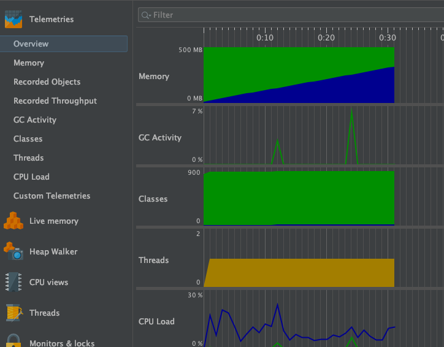
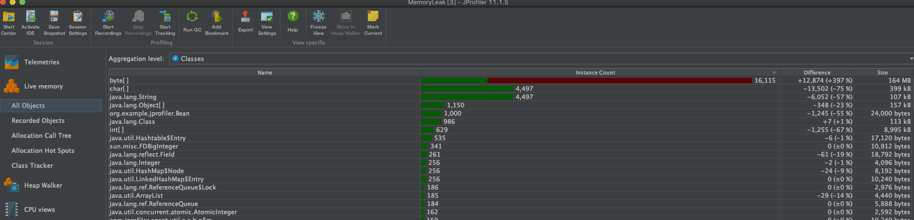
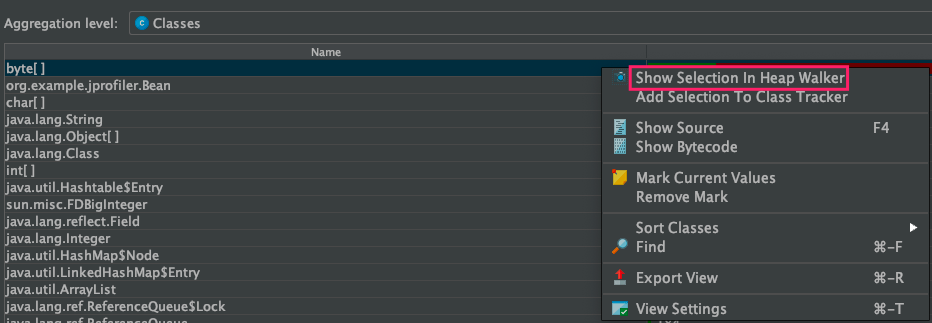
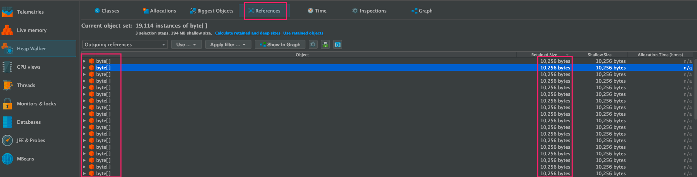
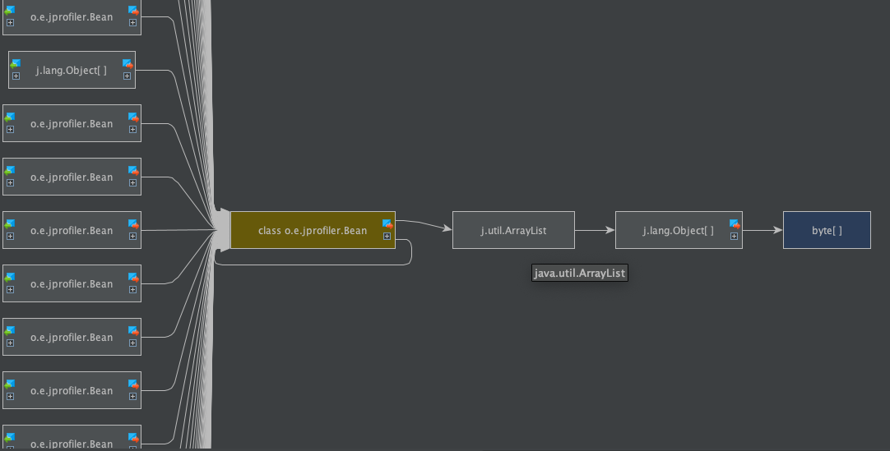

## 代码

```java
public class MemoryLeak {
    public static void main(String[] args) throws InterruptedException {
        while (true){
            ArrayList beanList = new ArrayList();
            for (int i = 0; i < 500; i++) {
                Bean data = new Bean();
                data.list.add(new byte[1024*10]);//10kb
                beanList.add(data);
            }
            TimeUnit.MILLISECONDS.sleep(500);
        }
    }
}
class Bean{
    int size=10;
    String info = "hello world";
    static ArrayList list = new ArrayList();
}
```

> 静态变量list是GC Root对象，给静态变量持续添加数据。并且将此类加入到ArrayList中，因此在GC时和GC Root想关联的对象Bean、ArrayList都不得回收


## VM参数配置

```bash
-Xms5000m -Xmx5000m -XX:+HeapDumpOnOutOfMemoryError -XX:HeapDumpPath=/Users/mac/auto.hprof
```


## 遥感监测



> 随着GC的执行，内存总体猛增，gc并无作用，并不健康，存在内存泄漏


## 内存分析



> 发下byte[] 增势迅猛，并且在GC执行后，仍然继续增长，因此定位到是此对象是大对象并且内存泄漏



> 进一步定位 byte[]对象的调用链



> 发现有很多个byte[]对象，并且每个byte[]对象是10kb



> 上图调用链可知，byte[]存放在Bean对象中，而且bean对象有很多个，即每个bean对象中有一个byte[]占10kb，有N个bean则容量为N*10kb