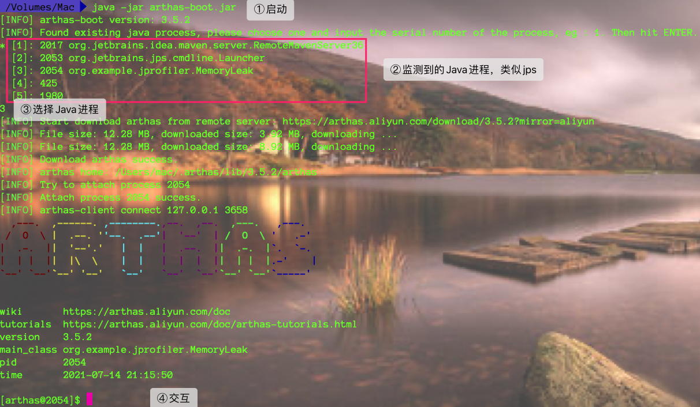
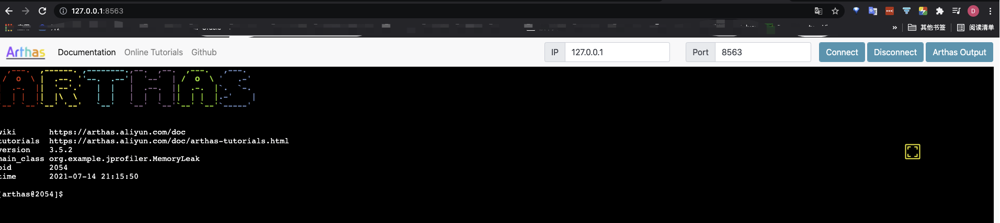
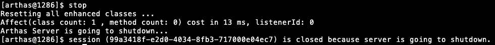
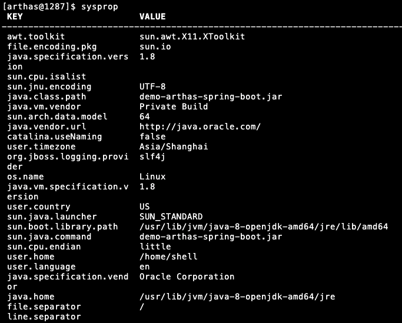
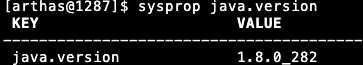
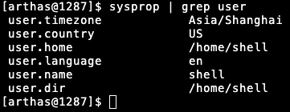
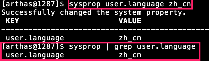
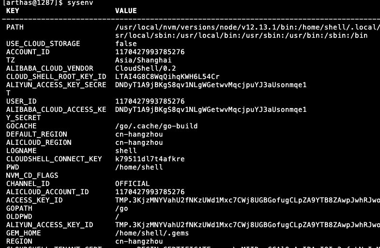
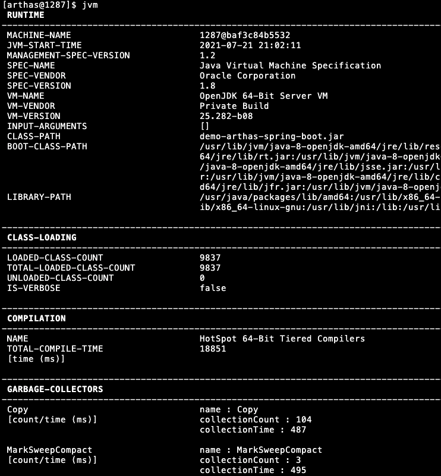
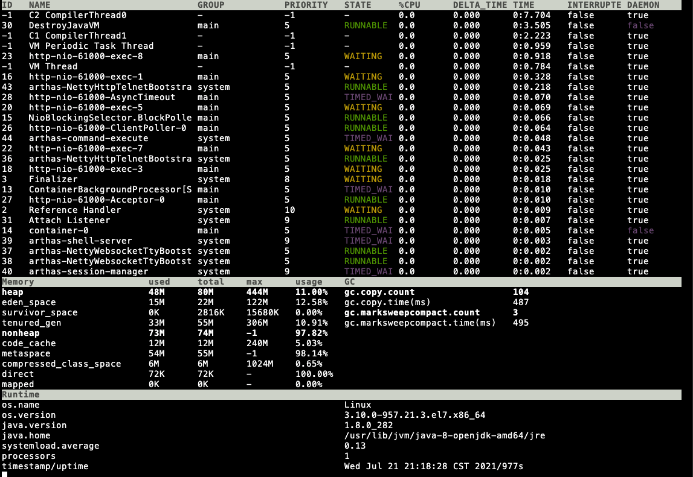

`引言:`

* 为什么有了上面的三款软件 MAT、jvisualvm、JProfiler还要有 Arthas，因为通常程序是部署下服务器上的，如果想要进行调优还需要远程连接，这样就涉及到网关防火墙等一系列配置，麻烦。
* 支持Linux、Mac、Windows
* 采用命令交互模式，tab自动补全。


## 能做什么

1. 这个类从哪个jar包加载的？为什么会爆各种类相关的Exception
2. 我改的代码为什么没有执行到？难道我没有commit？分支搞错了？
3. 遇到问题无法线上debug，难道只能通过加日志再重新发布？
4. 线上遇到某个用户的数据处理有问题，但线上同样无法debug，线下无法重现
5. 是否有一个全局视角查看系统的运行情况
6. 有什么办法可以监控到JVM的实时运行状态？
7. 有什么快速定位应用的热点，生成火焰图？


## 使用流程

1. 下载jar包

2. 启动

	

3. 可以浏览器访问

	```bash
	Http:127.0.0.1:8563/
	```

	
	
	

4. 退出和彻底退出

	**退出**

	```bash
	ctrl + c  
	或者
	quit
	或者exit
	```

	**彻底退出**

	> 使用上面退出时，并不能把 arthas-server退出，该进程仍然在运行

	```bash
	stop   #完全退出arthas
	```

	


## 相关指令

`帮助指令`

```bash
指令 -h
```

### 基础指令

```bash
quit/exit 退出当前 Arthas客户端，其他 Arthas喜户端不受影响
stop/shutdown 关闭 Arthas服务端，所有 Arthas客户端全部退出
help 查看命令帮助信息
cat 打印文件内容，和linux里的cat命令类似
echo 打印参数，和linux里的echo命令类似
grep 匹配查找，和linux里的gep命令类似
tee 复制标隹输入到标准输出和指定的文件，和linux里的tee命令类似
pwd 返回当前的工作目录，和linux命令类似
cs 清空当前屏幕区域
session 查看当前会话的信息
reset 重置增强类，将被 Arthas增强过的类全部还原, Arthas服务端关闭时会重置所有增强过的类
version 输出当前目标Java进程所加载的 Arthas版本号
history 打印命令历史
keymap Arthas快捷键列表及自定义快捷键
```


### jvm相关指令

```bash
dashboard 当前系统的实时数据面板
thread 查看当前JVM的线程堆栈信息
jvm 查看当前JVM的信息
sysprop 查看和修改JVM的系统属性
sysem 查看JVM的环境变量
vmoption 查看和修改JVM里诊断相关的option
perfcounter 查看当前JVM的 Perf Counter信息
logger 查看和修改logger
getstatic 查看类的静态属性
ognl 执行ognl表达式
mbean 查看 Mbean的信息
heapdump dump java heap，类似jmap命令的 heap dump功能
```


### class/classloader相关

```bash
sc 查看JVM已加载的类信息
	-d 输出当前类的详细信息，包括这个类所加载的原始文件来源、类的声明、加载的Classloader等详细信息。如果一个类被多个Classloader所加载，则会出现多次
	-E 开启正则表达式匹配，默认为通配符匹配
	-f 输出当前类的成员变量信息（需要配合参数-d一起使用）
	-X 指定输出静态变量时属性的遍历深度，默认为0，即直接使用toString输出
sm 查看已加载类的方法信息
	-d 展示每个方法的详细信息
	-E 开启正则表达式匹配,默认为通配符匹配
jad 反编译指定已加载类的源码
mc 内存编译器，内存编译.java文件为.class文件
retransform 加载外部的.class文件, retransform到JVM里
redefine 加载外部的.class文件，redefine到JVM里
dump dump已加载类的byte code到特定目录
classloader 查看classloader的继承树，urts，类加载信息，使用classloader去getResource
	-t 查看classloader的继承树
	-l 按类加载实例查看统计信息
	-c 用classloader对应的hashcode来查看对应的 Jar urls
```


### monitor/watch/trace相关

```bash
monitor 方法执行监控，调用次数、执行时间、失败率
	-c 统计周期，默认值为120秒
watch 方法执行观测，能观察到的范围为：返回值、抛出异常、入参，通过编写groovy表达式进行对应变量的查看
	-b 在方法调用之前观察(默认关闭)
	-e 在方法异常之后观察(默认关闭)
	-s 在方法返回之后观察(默认关闭)
	-f 在方法结束之后(正常返回和异常返回)观察(默认开启)
	-x 指定输岀结果的属性遍历深度,默认为0
trace 方法内部调用路径,并输出方法路径上的每个节点上耗时
	-n 执行次数限制
stack 输出当前方法被调用的调用路径
tt 方法执行数据的时空隧道,记录下指定方法每次调用的入参和返回信息,并能对这些不同的时间下调用进行观测
```

### 其他

```bash
jobs 列出所有job
kill 强制终止任务
fg 将暂停的任务拉到前台执行
bg 将暂停的任务放到后台执行
grep 搜索满足条件的结果
plaintext 将命令的结果去除ANSI颜色
wc 按行统计输出结果
options 查看或设置Arthas全局开关
profiler 使用async-profiler对应用采样，生成火焰图
```


## 功能

### 查看JVM信息

`sysprop 系统信息`

* 打印所有的System Properties信息

	

* 指定单个key

	

* 管道查询

	

* 设置新的value

	


`sysenv 环境变量`

* 获取到环境变量。和`sysprop`命令类似

	


`jvm jvm相关信息`




`dashboard 当前系统实时数据面板`




## 案例

### 1、排查函数调用异常


### 2、热更新代码


### 3、动态更新应用的Logger Level


### 4、获取spring context 然后在获取bean并调用函数


### 5、排查HTTP请求返回401


### 6、排查HTTP请求返回404


### 7、查找Top N线程


