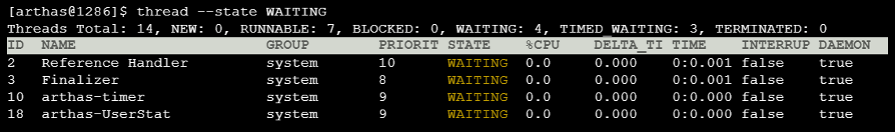
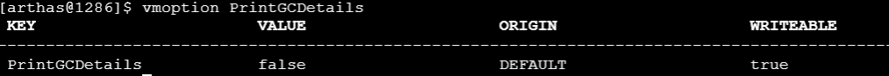
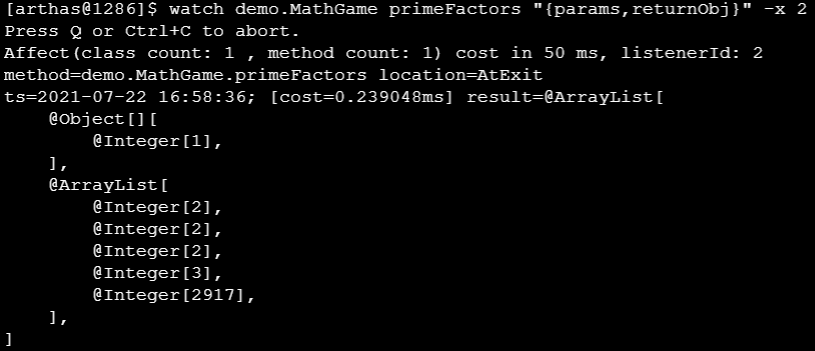

`引言:`

* 为什么有了上面的三款软件 MAT、jvisualvm、JProfiler还要有 Arthas，因为通常程序是部署下服务器上的，如果想要进行调优还需要远程连接，这样就涉及到网关防火墙等一系列配置，麻烦。
* 支持Linux、Mac、Windows
* 采用命令交互模式，tab自动补全。


## 能做什么

1. 这个类从哪个jar包加载的？为什么会爆各种类相关的Exception

2. 我改的代码为什么没有执行到？难道我没有commit？分支搞错了？

    >   使用 jad 反编译即可

3. 遇到问题无法线上debug，难道只能通过加日志再重新发布？

    >   修改代码并热部署，retransform  和 mc  和 jad

4. 线上遇到某个用户的数据处理有问题，但线上同样无法debug，线下无法重现

5. 是否有一个全局视角查看系统的运行情况

6. 有什么办法可以监控到JVM的实时运行状态？

7. 有什么快速定位应用的热点，生成火焰图？


## 使用流程

1. 下载jar包

2. 启动

	

3. 可以浏览器访问

	```bash
	Http:127.0.0.1:8563/
	```

	
	
	

4. 退出和彻底退出

	**退出**

	```bash
	ctrl + c  
	或者
	quit
	或者exit
	```

	**彻底退出**

	> 使用上面退出时，并不能把 arthas-server退出，该进程仍然在运行

	```bash
	stop   #完全退出arthas
	```

	


## 相关指令

`帮助指令`

```bash
指令 -h
```

### 基础指令

```bash
quit/exit 退出当前 Arthas客户端，其他 Arthas喜户端不受影响
stop/shutdown 关闭 Arthas服务端，所有 Arthas客户端全部退出
help 查看命令帮助信息
cat 打印文件内容，和linux里的cat命令类似
echo 打印参数，和linux里的echo命令类似
grep 匹配查找，和linux里的gep命令类似
tee 复制标隹输入到标准输出和指定的文件，和linux里的tee命令类似
pwd 返回当前的工作目录，和linux命令类似
cs 清空当前屏幕区域
session 查看当前会话的信息
reset 重置增强类，将被 Arthas增强过的类全部还原, Arthas服务端关闭时会重置所有增强过的类
version 输出当前目标Java进程所加载的 Arthas版本号
history 打印命令历史
keymap Arthas快捷键列表及自定义快捷键
```


### jvm相关指令

```bash
dashboard 当前系统的实时数据面板
thread 查看当前JVM的线程堆栈信息
jvm 查看当前JVM的信息
sysprop 查看和修改JVM的系统属性
sysem 查看JVM的环境变量
vmoption 查看和修改JVM里诊断相关的option
perfcounter 查看当前JVM的 Perf Counter信息
logger 查看和修改logger
getstatic 查看类的静态属性
ognl 执行ognl表达式
mbean 查看 Mbean的信息
heapdump dump java heap，类似jmap命令的 heap dump功能
```


### class/classloader相关

```bash
sc 查看JVM已加载的类信息
	-d 输出当前类的详细信息，包括这个类所加载的原始文件来源、类的声明、加载的Classloader等详细信息。如果一个类被多个Classloader所加载，则会出现多次
	-E 开启正则表达式匹配，默认为通配符匹配
	-f 输出当前类的成员变量信息（需要配合参数-d一起使用）
	-X 指定输出静态变量时属性的遍历深度，默认为0，即直接使用toString输出
sm 查看已加载类的方法信息
	-d 展示每个方法的详细信息
	-E 开启正则表达式匹配,默认为通配符匹配
jad 反编译指定已加载类的源码
mc 内存编译器，内存编译.java文件为.class文件
retransform 加载外部的.class文件, retransform到JVM里
redefine 加载外部的.class文件，redefine到JVM里
dump dump已加载类的byte code到特定目录
classloader 查看classloader的继承树，urts，类加载信息，使用classloader去getResource
	-t 查看classloader的继承树
	-l 按类加载实例查看统计信息
	-c 用classloader对应的hashcode来查看对应的 Jar urls
```


### monitor/watch/trace相关

```bash
monitor 方法执行监控，调用次数、执行时间、失败率
	-c 统计周期，默认值为120秒
watch 方法执行观测，能观察到的范围为：返回值、抛出异常、入参，通过编写groovy表达式进行对应变量的查看
	-b 在方法调用之前观察(默认关闭)
	-e 在方法异常之后观察(默认关闭)
	-s 在方法返回之后观察(默认关闭)
	-f 在方法结束之后(正常返回和异常返回)观察(默认开启)
	-x 指定输岀结果的属性遍历深度,默认为0
trace 方法内部调用路径,并输出方法路径上的每个节点上耗时
	-n 执行次数限制
stack 输出当前方法被调用的调用路径
tt 方法执行数据的时空隧道,记录下指定方法每次调用的入参和返回信息,并能对这些不同的时间下调用进行观测
```

### 其他

```bash
jobs 列出所有job
kill 强制终止任务
fg 将暂停的任务拉到前台执行
bg 将暂停的任务放到后台执行
grep 搜索满足条件的结果
plaintext 将命令的结果去除ANSI颜色
wc 按行统计输出结果
options 查看或设置Arthas全局开关
profiler 使用async-profiler对应用采样，生成火焰图
```


## 指令详解

### 1、cat

>   和Linux下的cat命令不敢说很相似，简直是一毛一样


### 2、cls

>   清空屏幕，和clear | ctrl+l 一毛一样


### 3、echo、grep、base64、tee、pwd、session、

>   和Linux中命令 一毛一样


### 4、reset

>   重置增强类，将被 Arthas 增强过的类全部还原，Arthas 服务端关闭时会重置所有增强过的类


### 5、version、history、quit、stop、keymap

>   见指令描述即可


### 6、dashboard

>   当前进程的实时数据面板，包含有 线程、内存、gc、runtime等信息

`参数`

*   -i    刷新实时数据的时间间隔 (ms)，默认5000ms
*   -n   刷新实时数据的次数

`样式`


`样式说明`

*   ID: Java级别的线程ID，注意这个ID不能跟jstack中的nativeID一一对应。
*   NAME: 线程名
*   GROUP: 线程组名
*   PRIORITY: 线程优先级, 1~10之间的数字，越大表示优先级越高
*   STATE: 线程的状态
*   CPU%: 线程的cpu使用率。比如采样间隔1000ms，某个线程的增量cpu时间为100ms，则cpu使用率=100/1000=10%
*   DELTA_TIME: 上次采样之后线程运行增量CPU时间，数据格式为`秒`
*   TIME: 线程运行总CPU时间，数据格式为`分:秒`
*   INTERRUPTED: 线程当前的中断位状态
*   DAEMON: 是否是daemon线程


### 7、thread

>   查看当前线程的堆栈信息

`参数`

*   id	 显示指定线程信息

    

*   -n xx   指定最忙的前N个线程并打印堆栈

    

*   -b    判断当前进程是否有阻塞线程

    

    >   注意， 目前只支持找出synchronized关键字阻塞住的线程， 如果是`java.util.concurrent.Lock`， 目前还不支持。

*   -i xx    指定cpu使用率统计的采样间隔，单位为毫秒，默认值为200

    

    >   两秒间隔去采集数据并呈现

*   --all	显示所有的线程

    

*   --state

    >   查看指定状态的线程

    


### 8、jvm

>   查看进程jvm相关信息


**THREAD相关**

-   COUNT: JVM当前活跃的线程数
-   DAEMON-COUNT: JVM当前活跃的守护线程数
-   PEAK-COUNT: 从JVM启动开始曾经活着的最大线程数
-   STARTED-COUNT: 从JVM启动开始总共启动过的线程次数
-   DEADLOCK-COUNT: JVM当前死锁的线程数

**文件描述符相关**

-   MAX-FILE-DESCRIPTOR-COUNT：JVM进程最大可以打开的文件描述符数
-   OPEN-FILE-DESCRIPTOR-COUNT：JVM当前打开的文件描述符数


### 9、sysprop

>   查看当前JVM的系统属性(`System Property`)

*   查看所有属性

    ```bash
    sysprop
    ```

*   查看指定key属性

    ```bash
    sysprop key
    ```

    

*   修改属性值(修改编译器为全jit编译)

    ```pash
    sysprop key value
    ```

    


### 10、sysenv

>   查看当前JVM的环境属性(`System Environment Variables`)


*   查看单个环境变量

    ```bash
    sysenv key
    ```


### 11、vmoption

>   查看，更新VM诊断相关的参数


*   查看指定key的option

    ```bash
    vmoption key
    ```

    

*   修改指定key的value

    ```bash
    vmoption key value
    ```

    


### 12、perfcounter

>   查看当前JVM的 Perf Counter信息


​	

### 13、logger

>   查看logger信息，更新logger level

*   查看所有logger信息

    以下面的`logback.xml`为例：

    ```xml
    <?xml version="1.0" encoding="UTF-8"?>
    <configuration>
        <appender name="APPLICATION" class="ch.qos.logback.core.rolling.RollingFileAppender">
            <file>app.log</file>
            <rollingPolicy class="ch.qos.logback.core.rolling.SizeAndTimeBasedRollingPolicy">
                <fileNamePattern>mylog-%d{yyyy-MM-dd}.%i.txt</fileNamePattern>
                <maxFileSize>100MB</maxFileSize>
                <maxHistory>60</maxHistory>
                <totalSizeCap>2GB</totalSizeCap>
            </rollingPolicy>
            <encoder>
                <pattern>%logger{35} - %msg%n</pattern>
            </encoder>
        </appender>
     
        <appender name="ASYNC" class="ch.qos.logback.classic.AsyncAppender">
            <appender-ref ref="APPLICATION" />
        </appender>
     
        <appender name="CONSOLE" class="ch.qos.logback.core.ConsoleAppender">
            <encoder>
                <pattern>%-4relative [%thread] %-5level %logger{35} - %msg %n
                </pattern>
                <charset>utf8</charset>
            </encoder>
        </appender>
     
        <root level="INFO">
            <appender-ref ref="CONSOLE" />
            <appender-ref ref="ASYNC" />
        </root>
    </configuration>
    ```

    

    使用`logger`命令打印的结果是：

    ```bash
    [arthas@2062]$ logger
     name                                   ROOT
     class                                  ch.qos.logback.classic.Logger
     classLoader                            sun.misc.Launcher$AppClassLoader@2a139a55
     classLoaderHash                        2a139a55
     level                                  INFO
     effectiveLevel                         INFO
     additivity                             true
     codeSource                             file:/Users/hengyunabc/.m2/repository/ch/qos/logback/logback-classic/1.2.3/logback-classic-1.2.3.jar
     appenders                              name            CONSOLE
                                            class           ch.qos.logback.core.ConsoleAppender
                                            classLoader     sun.misc.Launcher$AppClassLoader@2a139a55
                                            classLoaderHash 2a139a55
                                            target          System.out
                                            name            APPLICATION
                                            class           ch.qos.logback.core.rolling.RollingFileAppender
                                            classLoader     sun.misc.Launcher$AppClassLoader@2a139a55
                                            classLoaderHash 2a139a55
                                            file            app.log
                                            name            ASYNC
                                            class           ch.qos.logback.classic.AsyncAppender
                                            classLoader     sun.misc.Launcher$AppClassLoader@2a139a55
                                            classLoaderHash 2a139a55
                                            appenderRef     [APPLICATION]
    ```

    

    从`appenders`的信息里，可以看到

    *   `CONSOLE` logger的target是`System.out`
    *   `APPLICATION` logger是`RollingFileAppender`，它的file是`app.log`
    *   `ASYNC`它的`appenderRef`是`APPLICATION`，即异步输出到文件里

*   查看指定名字的logger信息

    ```bash
    [arthas@2062]$ logger -n org.springframework.web
     name                                   org.springframework.web
     class                                  ch.qos.logback.classic.Logger
     classLoader                            sun.misc.Launcher$AppClassLoader@2a139a55
     classLoaderHash                        2a139a55
     level                                  null
     effectiveLevel                         INFO
     additivity                             true
     codeSource                             file:/Users/hengyunabc/.m2/repository/ch/qos/logback/logback-classic/1.2.3/logback-classic-1.2.3.jar
    ```

*   查看指定classloader的logger信息

    >   注意hashcode是变化的，需要先查看当前的ClassLoader信息，提取对应ClassLoader的hashcode。如果你使用`-c`，你需要手动输入hashcode：`-c <hashcode>`

    ```bash
    [arthas@2062]$ logger -c 2a139a55
     name                                   ROOT
     class                                  ch.qos.logback.classic.Logger
     classLoader                            sun.misc.Launcher$AppClassLoader@2a139a55
     classLoaderHash                        2a139a55
     level                                  DEBUG
     effectiveLevel                         DEBUG
     additivity                             true
     codeSource                             file:/Users/hengyunabc/.m2/repository/ch/qos/logback/logback-classic/1.2.3/logback-classic-1.2.3.jar
     appenders                              name            CONSOLE
                                            class           ch.qos.logback.core.ConsoleAppender
                                            classLoader     sun.misc.Launcher$AppClassLoader@2a139a55
                                            classLoaderHash 2a139a55
                                            target          System.out
                                            name            APPLICATION
                                            class           ch.qos.logback.core.rolling.RollingFileAppender
                                            classLoader     sun.misc.Launcher$AppClassLoader@2a139a55
                                            classLoaderHash 2a139a55
                                            file            app.log
                                            name            ASYNC
                                            class           ch.qos.logback.classic.AsyncAppender
                                            classLoader     sun.misc.Launcher$AppClassLoader@2a139a55
                                            classLoaderHash 2a139a55
                                            appenderRef     [APPLICATION]
    ```

    对于只有唯一实例的ClassLoader可以通过`--classLoaderClass`指定class name，使用起来更加方便：

    ```bash
    logger --classLoaderClass sun.misc.Launcher$AppClassLoader
    ```

    >   注: 这里classLoaderClass 在 java 8 是 sun.misc.Launcher$AppClassLoader，而java 11的classloader是jdk.internal.loader.ClassLoaders$AppClassLoader。

    `--classLoaderClass` 的值是ClassLoader的类名，只有匹配到唯一的ClassLoader实例时才能工作，目的是方便输入通用命令，而`-c <hashcode>`是动态变化的。

*   更新logger level

    ```bash
    [arthas@2062]$ logger --name ROOT --level debug
    update logger level success.
    ```

    

*   指定classloader更新 logger level

    >   默认情况下，logger命令会在SystemClassloader下执行，如果应用是传统的`war`应用，或者spring boot fat jar启动的应用，那么需要指定classloader。可以先用 `sc -d yourClassName` 来查看具体的 classloader hashcode，然后在更新level时指定classloader：

    ```bash
    [arthas@2062]$ logger -c 2a139a55 --name ROOT --level debug
    ```

    

### 14、mbean

>   便捷的查看或监控 Mbean 的属性信息。


`参数`

*   name-pattern	名称表达式匹配
*   attribute-pattern	属性名表达式匹配
*   -m	查看元信息
*   -i	刷新属性值的时间间隔 (ms)
*   -n	刷新属性值的次数
*   -E	开启正则表达式匹配，默认为通配符匹配。仅对属性名有效

`案例`

*   查看 Mbean 的元信息：

```
mbean -m java.lang:type=Threading
```

*   查看mbean属性信息：

```
mbean java.lang:type=Threading 
```

*   mbean的name支持通配符匹配：

```
mbean java.lang:type=Th*
```

>   注意：ObjectName 的匹配规则与正常的通配符存在差异，详细参见：[javax.management.ObjectName](https://docs.oracle.com/javase/8/docs/api/javax/management/ObjectName.html?is-external=true)

*   通配符匹配特定的属性字段：

```
mbean java.lang:type=Threading *Count
```

*   使用`-E`命令切换为正则匹配：

```
mbean -E java.lang:type=Threading PeakThreadCount|ThreadCount|DaemonThreadCount
```

*   使用`-i`命令实时监控：

```
mbean -i 1000 java.lang:type=Threading *Count
```


### 15、getstatic

>   通过getstatic命令可以方便的查看类的静态属性。推荐使用ognl，功能更加的强大

`格式`

```bash
getstatic class_name field_name
```


### 16、ognl

>   执行ognl表达式

`选项`

*   express	执行的表达式
*   -c	执行表达式的 ClassLoader 的 hashcode，默认值是SystemClassLoader
*   -classLoaderClass	指定执行表达式的 ClassLoader 的 class name
*   -x	结果对象的展开层次，默认值1

#### 查看第一个参数：

```
$ watch com.taobao.container.Test test "params[0]"
Press Ctrl+C to abort.
Affect(class-cnt:1 , method-cnt:1) cost in 34 ms.
@ArrayList[
    @Pojo[com.taobao.container.Test$Pojo@75a1cd57],

    @Pojo[com.taobao.container.Test$Pojo@3d012ddd],

    @Pojo[com.taobao.container.Test$Pojo@6f2b958e],

    @Pojo[com.taobao.container.Test$Pojo@1eb44e46],

    @Pojo[com.taobao.container.Test$Pojo@6504e3b2],
```

#### 查看第一个参数的size：

```
$ watch com.taobao.container.Test test "params[0].size()"
Press Ctrl+C to abort.
Affect(class-cnt:1 , method-cnt:1) cost in 22 ms.
@Integer[40]
```

#### 将结果按name属性投影：

```
$ watch com.taobao.container.Test test "params[0].{ #this.name }"
Press Ctrl+C to abort.
Affect(class-cnt:1 , method-cnt:1) cost in 25 ms.
@ArrayList[
    @String[name 0],

    @String[name 1],
```

#### 按条件过滤：

```
$ watch com.taobao.container.Test test "params[0].{? #this.name == null }" -x 2
Press Ctrl+C to abort.
Affect(class-cnt:1 , method-cnt:1) cost in 27 ms.
@ArrayList[
    @Pojo[
        name=null,
        age=@Integer[32],
        hobby=null,
    ],
]
@ArrayList[
    @Pojo[
        name=null,
        age=@Integer[31],
        hobby=null,
    ],
]

$ watch com.taobao.container.Test test "params[0].{? #this.name != null }" -x 2
Press Ctrl+C to abort.
Affect(class-cnt:1 , method-cnt:1) cost in 24 ms.
@ArrayList[
    @Pojo[
        name=@String[name 1],
        age=@Integer[3],
        hobby=null,
    ],
```

#### 过滤后统计：

```
$ watch com.taobao.container.Test test "params[0].{? #this.age > 10 }.size()" -x 2
Press Ctrl+C to abort.
Affect(class-cnt:1 , method-cnt:1) cost in 29 ms.
@Integer[31]
@Integer[31]
```

#### 判断字符串相等

比如第一个参数是String类型：

```
$ watch com.demo.Test test 'params[0]=="xyz"'
```

#### 判断long型

```
$ watch com.demo.Test test 'params[0]==123456789L'
```


### 17、sc

>   查看JVM已加载的类信息

`选项`

*   class-pattern	类名表达式匹配
*   method-pattern	方法名表达式匹配
*   -d	输出当前类的详细信息，包括这个类所加载的原始文件来源、类的声明、加载的ClassLoader等详细信息。如果一个类被多个ClassLoader所加载，则会出现多次
*   -E	开启正则表达式匹配，默认为通配符匹配
*   -f	输出当前类的成员变量信息（需要配合参数-d一起使用）
*   -x	指定输出静态变量时属性的遍历深度，默认为 0，即直接使用 toString 输出
*   -c	指定class的 ClassLoader 的 hashcode
*   -classLoaderClass	指定执行表达式的 ClassLoader 的 class name
*   -n	具有详细信息的匹配类的最大数量（默认为100）

>   class-pattern支持全限定名，如com.taobao.test.AAA，也支持com/taobao/test/AAA这样的格式，这样，我们从异常堆栈里面把类名拷贝过来的时候，不需要在手动把`/`替换为`.`啦。
>
>   sc 默认开启了子类匹配功能，也就是说所有当前类的子类也会被搜索出来，想要精确的匹配，请打开`options disable-sub-class true`开关

`案例`

-   模糊搜索

    

-   打印类的详细信息

    

-   打印出类的Field信息

    


### 18、sm

>   查看已加载类的方法信息

`选项`

*   class-pattern	类名表达式匹配
*   method-pattern	方法名表达式匹配
*   -d	展示每个方法的详细信息
*   -E	开启正则表达式匹配，默认为通配符匹配
*   -c	指定class的 ClassLoader 的 hashcode
*   -classLoaderClass	指定执行表达式的 ClassLoader 的 class name
*   -n	具有详细信息的匹配类的最大数量（默认为100）

`案例`

*   查看类中所有方法

    

*   查看类中指定方法

    


### 19、dump

>   dump 已加载类的 bytecode 到特定目录

`参数`

*   class-pattern	类名表达式匹配
*   -c	类所属 ClassLoader 的 hashcode
*   -classLoaderClass	指定执行表达式的 ClassLoader 的 class name
*   -d	设置类文件的目标目录
*   -E	开启正则表达式匹配，默认为通配符匹配


`案例`

*   将指定已加载类拷贝出来

    

*   指定classLoader

    >   注意hashcode是变化的，需要先查看当前的ClassLoader信息，提取对应ClassLoader的hashcode。如果你使用`-c`，你需要手动输入hashcode：`-c <hashcode>`

    ```bash
    $ dump -c 3d4eac69 demo.*
    ```


### 20、heapdump

>   dump java heap, 类似jmap命令的heap dump功能。


`案例`

*   dump到指定文件

    

*   只dump live对象

    

*   dump到临时文件

    


### 21、vmtool

>   `vmtool` 利用`JVMTI`接口，实现查询内存对象，强制GC等功能。


`案例`

*   强制GC

    ```BASH
    vmtool --action forceGc
    ```

*   获取对象

    ```bash
    $ vmtool --action getInstances --className java.lang.String --limit 10
    @String[][
        @String[com/taobao/arthas/core/shell/session/Session],
        @String[com.taobao.arthas.core.shell.session.Session],
        @String[com/taobao/arthas/core/shell/session/Session],
        @String[com/taobao/arthas/core/shell/session/Session],
        @String[com/taobao/arthas/core/shell/session/Session.class],
        @String[com/taobao/arthas/core/shell/session/Session.class],
        @String[com/taobao/arthas/core/shell/session/Session.class],
        @String[com/],
        @String[java/util/concurrent/ConcurrentHashMap$ValueIterator],
        @String[java/util/concurrent/locks/LockSupport],
    ]
    ```


### 22、jad

>   反编译源码

`参数`

*   class-pattern	类名表达式匹配
*   -c	类所属 ClassLoader 的 hashcode
*   -classLoaderClass	指定执行表达式的 ClassLoader 的 class name
*   -E	开启正则表达式匹配，默认为通配符匹配

`案例`

*   反编译进程中类

    ```bash
    jad 全限定类名
    ```

    

*   反编译进程中类中方法

    ```bash
    jad 全限定类名 方法名
    ```

    


*   反编译不显示行号

    ```bash
    jad demo.MathGame main --lineNumber false
    ```

    


### 23、classloader

>   查看classloader的继承树，urls，类加载信息

>   `classloader` 命令将 JVM 中所有的classloader的信息统计出来，并可以展示继承树，urls等。
>
>   可以让指定的classloader去getResources，打印出所有查找到的resources的url。对于`ResourceNotFoundException`比较有用。

`参数`

*   -l	按类加载实例进行统计
*   -t	打印所有ClassLoader的继承树
*   -a	列出所有ClassLoader加载的类，请谨慎使用
*   -c:	ClassLoader的hashcode
*   -classLoaderClass:	指定执行表达式的 ClassLoader 的 class name
*   -c: r:	用ClassLoader去查找resource
*   -c: load:	用ClassLoader去加载指定的类


`案例`

*   按类加载类型查看统计信息

    

*   按类加载实例查看统计信息

    ```bash
    $ classloader -l
     name                                                loadedCount  hash      parent
     BootstrapClassLoader                                1861         null      null
     com.taobao.arthas.agent.ArthasClassloader@68b31f0a  2115         68b31f0a  sun.misc.Launcher$ExtClassLoader@66350f69
     sun.misc.Launcher$AppClassLoader@3d4eac69           4            3d4eac69  sun.misc.Launcher$ExtClassLoader@66350f69
     sun.misc.Launcher$ExtClassLoader@66350f69           1            66350f69  null
    Affect(row-cnt:4) cost in 2 ms.
    ```

*   查看ClassLoader的继承树

    

*   查看URLClassLoader实际的urls

    ```bash
    $ classloader -c 3d4eac69
    file:/private/tmp/math-game.jar
    file:/Users/hengyunabc/.arthas/lib/3.0.5/arthas/arthas-agent.jar
     
    Affect(row-cnt:9) cost in 3 ms.
    ```

    >   *注意* hashcode是变化的，需要先查看当前的ClassLoader信息，提取对应ClassLoader的hashcode。对于只有唯一实例的ClassLoader可以通过class name指定，使用起来更加方便：

    ```bash
    $ classloader --classLoaderClass sun.misc.Launcher$AppClassLoader
    file:/private/tmp/math-game.jar
    file:/Users/hengyunabc/.arthas/lib/3.0.5/arthas/arthas-agent.jar
     
    Affect(row-cnt:9) cost in 3 ms.
    ```

    

*   使用ClassLoader去查找resource

    ```bash
    $ classloader -c 3d4eac69  -r META-INF/MANIFEST.MF
     jar:file:/System/Library/Java/Extensions/MRJToolkit.jar!/META-INF/MANIFEST.MF
     jar:file:/private/tmp/math-game.jar!/META-INF/MANIFEST.MF
     jar:file:/Users/hengyunabc/.arthas/lib/3.0.5/arthas/arthas-agent.jar!/META-INF/MANIFEST.MF
    ```

    也可以尝试查找类的class文件：

    ```bash
    $ classloader -c 1b6d3586 -r java/lang/String.class
     jar:file:/Library/Java/JavaVirtualMachines/jdk1.8.0_60.jdk/Contents/Home/jre/lib/rt.jar!/java/lang/String.class
    ```

    

*   使用ClassLoader去加载类

    ```bash
    $ classloader -c 3d4eac69 --load demo.MathGame
    load class success.
     class-info        demo.MathGame
     code-source       /private/tmp/math-game.jar
     name              demo.MathGame
     isInterface       false
     isAnnotation      false
     isEnum            false
     isAnonymousClass  false
     isArray           false
     isLocalClass      false
     isMemberClass     false
     isPrimitive       false
     isSynthetic       false
     simple-name       MathGame
     modifier          public
     annotation
     interfaces
     super-class       +-java.lang.Object
     class-loader      +-sun.misc.Launcher$AppClassLoader@3d4eac69
                         +-sun.misc.Launcher$ExtClassLoader@66350f69
     classLoaderHash   3d4eac69
    ```

    

### 24、mc

>   Memory Compiler/内存编译器，编译`.java`文件生成`.class`。


`案例`

*   编译指定Java文件

    ```bash
    mc /tmp/Test.java
    ```

    可以通过`-c`参数指定classloader：

    ```bash
    mc -c 327a647b /tmp/Test.java
    ```

    也可以通过`--classLoaderClass`参数指定ClassLoader：

    ```
    $ mc --classLoaderClass org.springframework.boot.loader.LaunchedURLClassLoader /tmp/UserController.java -d /tmp
    Memory compiler output:
    /tmp/com/example/demo/arthas/user/UserController.class
    Affect(row-cnt:1) cost in 346 ms
    ```
    
    可以通过`-d`命令指定输出目录：

    ```
    mc -d /tmp/output /tmp/ClassA.java /tmp/ClassB.java
    ```
    
    编译生成`.class`文件之后，可以结合[retransform](https://arthas.aliyun.com/doc/retransform.html)命令实现热更新代码。

>   注意，mc命令有可能失败。如果编译失败可以在本地编译好`.class`文件，再上传到服务器。具体参考[retransform](https://arthas.aliyun.com/doc/retransform.html)命令说明。


### 25、retransform

>   加载外部的`.class`文件，retransform jvm已加载的类。


`使用`

*   retransform 指定的 .class 文件

    ```
    $ retransform /tmp/MathGame.class
    retransform success, size: 1, classes:
    demo.MathGame
    ```
    
    >   加载指定的 .class 文件，然后解析出class name，再retransform jvm中已加载的对应的类。每加载一个 `.class` 文件，则会记录一个 retransform entry.
    
    >   如果多次执行 retransform 加载同一个 class 文件，则会有多条 retransform entry.

*   查看 retransform entry

    ```
    $ retransform -l
    Id              ClassName       TransformCount  LoaderHash      LoaderClassName
    1               demo.MathGame   1               null            null
    ```
    
    >   TransformCount 统计在 ClassFileTransformer#transform 函数里尝试返回 entry对应的 .class文件的次数，但并不表明transform一定成功。

*   删除指定 retransform entry

    需要指定 id：

    ```
    retransform -d 1
    ```

*   删除所有 retransform entry

    ```bash
    retransform --deleteAll
    ```

*   显式触发 retransform

    ```
    $ retransform --classPattern demo.MathGame
    retransform success, size: 1, classes:
    demo.MathGame
    ```
    
    >   注意：对于同一个类，当存在多个 retransform entry时，如果显式触发 retransform ，则最后添加的entry生效(id最大的)。

*   消除 retransform 的影响

    如果对某个类执行 retransform 之后，想消除影响，则需要：

    *   删除这个类对应的 retransform entry
    *   重新触发 retransform

    >   如果不清除掉所有的 retransform entry，并重新触发 retransform ，则arthas stop时，retransform过的类仍然生效。

*   结合 jad/mc 命令使用

    ```
    jad --source-only com.example.demo.arthas.user.UserController > /tmp/UserController.java
    
    mc /tmp/UserController.java -d /tmp
    
    retransform /tmp/com/example/demo/arthas/user/UserController.class
    ```
    
    *   jad命令反编译，然后可以用其它编译器，比如vim来修改源码
    *   mc命令来内存编译修改过的代码
    *   用retransform命令加载新的字节码

*   上传 .class 文件到服务器的技巧

    >   使用`mc`命令来编译`jad`的反编译的代码有可能失败。可以在本地修改代码，编译好后再上传到服务器上。有的服务器不允许直接上传文件，可以使用`base64`命令来绕过。
    
    1.  在本地先转换`.class`文件为base64，再保存为result.txt
    
        ```bash
        base64 < Test.class > result.txt
        ```
    
    2.  到服务器上，新建并编辑`result.txt`，复制本地的内容，粘贴再保存
    
    3.  把服务器上的 `result.txt`还原为`.class`
    
        ```bash
        base64 -d < result.txt > Test.class
        ```
    
    4.  用md5命令计算哈希值，校验是否一致
    
        
    
    `retransform的限制`
    
    *   不允许新增加field/method
    
    *   正在跑的函数，没有退出不能生效，比如下面新增加的`System.out.println`，只有`run()`函数里的会生效
    
        ```java
        public class MathGame {
            public static void main(String[] args) throws InterruptedException {
                MathGame game = new MathGame();
                while (true) {
                    game.run();
                    TimeUnit.SECONDS.sleep(1);
                    // 这个不生效，因为代码一直跑在 while里
                    System.out.println("in loop");
                }
            }
         
            public void run() throws InterruptedException {
                // 这个生效，因为run()函数每次都可以完整结束
                System.out.println("call run()");
                try {
                    int number = random.nextInt();
                    List<Integer> primeFactors = primeFactors(number);
                    print(number, primeFactors);
         
                } catch (Exception e) {
                    System.out.println(String.format("illegalArgumentCount:%3d, ", illegalArgumentCount) + e.getMessage());
                }
            }


### 26、redefine

>   推荐使用 [retransform](https://arthas.aliyun.com/doc/retransform.html) 命令。效果和retransform一样


`参数`

*   -c	ClassLoader的hashcode
*   -classLoaderClass	指定执行表达式的 ClassLoader 的 class name


`使用参考`

```bash
redefine /tmp/Test.class
redefine -c 327a647b /tmp/Test.class /tmp/Test\$Inner.class
redefine --classLoaderClass sun.misc.Launcher$AppClassLoader /tmp/Test.class /tmp/Test\$Inner.class
```


*   结合 jad/mc 命令使用

    ```bash
    jad --source-only com.example.demo.arthas.user.UserController > /tmp/UserController.java
     
    mc /tmp/UserController.java -d /tmp
     
    redefine /tmp/com/example/demo/arthas/user/UserController.class
    ```

    -   jad命令反编译，然后可以用其它编译器，比如vim来修改源码
    -   mc命令来内存编译修改过的代码
    -   用redefine命令加载新的字节码


### 27、minitor

>   方法执行监控   ： 对匹配 `class-pattern`／`method-pattern`／`condition-express`的类、方法的调用进行监控

>   `monitor` 命令是一个非实时返回命令.
>
>   实时返回命令是输入之后立即返回，而非实时返回的命令，则是不断的等待目标 Java 进程返回信息，直到用户输入 `Ctrl+C` 为止。
>
>   服务端是以任务的形式在后台跑任务，植入的代码随着任务的中止而不会被执行，所以任务关闭后，不会对原有性能产生太大影响，而且原则上，任何Arthas命令不会引起原有业务逻辑的改变。

`监控维度`

| timestamp | 时间戳                     |
| --------- | -------------------------- |
| class     | Java类                     |
| method    | 方法（构造方法、普通方法） |
| total     | 调用次数                   |
| success   | 成功次数                   |
| fail      | 失败次数                   |
| rt        | 平均RT                     |
| fail-rate | 失败率                     |

`参数`

| 参数名称            | 参数说明                                |
| ------------------- | --------------------------------------- |
| *class-pattern*     | 类名表达式匹配                          |
| *method-pattern*    | 方法名表达式匹配                        |
| *condition-express* | 条件表达式                              |
| - E                 | 开启正则表达式匹配，默认为通配符匹配    |
| -c                  | 统计周期，默认值为120秒                 |
| -b                  | 在**方法调用之前**计算condition-express |

`案例`


### 28、watch

>   方法执行数据观测
>
>   让你能方便的观察到指定方法的调用情况。能观察到的范围为：`返回值`、`抛出异常`、`入参`，通过编写 OGNL 表达式进行对应变量的查看。

`参数`

| 参数名称            | 参数说明                                   |
| ------------------- | ------------------------------------------ |
| *class-pattern*     | 类名表达式匹配                             |
| *method-pattern*    | 方法名表达式匹配                           |
| *express*           | 观察表达式                                 |
| *condition-express* | 条件表达式                                 |
| -b                 | 在**方法调用之前**观察                     |
| -e                 | 在**方法异常之后**观察                     |
| -s                 | 在**方法返回之后**观察                     |
| -f                 | 在**方法结束之后**(正常返回和异常返回)观察 |
| -E                 | 开启正则表达式匹配，默认为通配符匹配       |
| -x                | 指定输出结果的属性遍历深度，默认为 1       |

>   这里重点要说明的是观察表达式，观察表达式的构成主要由 ognl 表达式组成，所以你可以这样写`"{params,returnObj}"`，只要是一个合法的 ognl 表达式，都能被正常支持。
>
>   观察的维度也比较多，主要体现在参数 `advice` 的数据结构上。`Advice` 参数最主要是封装了通知节点的所有信息。请参考[表达式核心变量](https://arthas.aliyun.com/doc/advice-class.html)中关于该节点的描述。

>   -   watch 命令定义了4个观察事件点，即 `-b` 方法调用前，`-e` 方法异常后，`-s` 方法返回后，`-f` 方法结束后
>   -   4个观察事件点 `-b`、`-e`、`-s` 默认关闭，`-f` 默认打开，当指定观察点被打开后，在相应事件点会对观察表达式进行求值并输出
>   -   这里要注意`方法入参`和`方法出参`的区别，有可能在中间被修改导致前后不一致，除了 `-b` 事件点 `params` 代表方法入参外，其余事件都代表方法出参
>   -   当使用 `-b` 时，由于观察事件点是在方法调用前，此时返回值或异常均不存在

`案例`

*   观察方法出参和返回值



*   观察方法入参

    

    >   -   对比前一个例子，返回值为空（事件点为方法执行前，因此获取不到返回值）


*   同时观察方法调用前和方法返回后

     	

    >   -   参数里`-n 2`，表示只执行两次
    >   -   这里输出结果中，第一次输出的是方法调用前的观察表达式的结果，第二次输出的是方法返回后的表达式的结果
    >   -   结果的输出顺序和事件发生的先后顺序一致，和命令中 `-s -b` 的顺序无关

>   见官网


### 29、trace

>   方法内部调用路径，并输出方法路径上的每个节点上耗时
>
>   `trace` 命令能主动搜索 `class-pattern`／`method-pattern` 对应的方法调用路径，渲染和统计整个调用链路上的所有性能开销和追踪调用链路。

`参数`

| 参数名称            | 参数说明                             |
| ------------------- | ------------------------------------ |
| *class-pattern*     | 类名表达式匹配                       |
| *method-pattern*    | 方法名表达式匹配                     |
| *condition-express* | 条件表达式                           |
| -E                  | 开启正则表达式匹配，默认为通配符匹配 |
| `-n`                | 命令执行次数                         |
| `#cost`             | 方法执行耗时                         |

`案例`

*   查询方法调用链


*   查询方法调用链指定次数

    ```bash
     trace demo.MathGame run -n 1
    ```

    

*   查询方法调用链并包含JDK中方法

    ```bash
    trace --skipJDKMethod false demo.MathGame run
    ```

    

*   查询方法调用链并过滤出耗时长的方法

    ```bash
    $ trace demo.MathGame run '#cost > 10'
    Press Ctrl+C to abort.
    Affect(class-cnt:1 , method-cnt:1) cost in 41 ms.
    `---ts=2018-12-04 01:12:02;thread_name=main;id=1;is_daemon=false;priority=5;TCCL=sun.misc.Launcher$AppClassLoader@3d4eac69
        `---[12.033735ms] demo.MathGame:run()
            +---[0.006783ms] java.util.Random:nextInt()
            +---[11.852594ms] demo.MathGame:primeFactors()
            `---[0.05447ms] demo.MathGame:print()
    ```


### 30、stack

>   输出当前方法被调用的调用路径
>
>   很多时候我们都知道一个方法被执行，但这个方法被执行的路径非常多，或者你根本就不知道这个方法是从那里被执行了，此时你需要的是 stack 命令。

`参数`

| 参数名称            | 参数说明                             |
| ------------------- | ------------------------------------ |
| *class-pattern*     | 类名表达式匹配                       |
| *method-pattern*    | 方法名表达式匹配                     |
| *condition-express* | 条件表达式                           |
| -E                  | 开启正则表达式匹配，默认为通配符匹配 |
| -n                  | 执行次数限制                         |

`案例`

*   查询方法调用链


*   据条件表达式来过滤

    ```
    $ stack demo.MathGame primeFactors 'params[0]<0' -n 2
    Press Ctrl+C to abort.
    Affect(class-cnt:1 , method-cnt:1) cost in 30 ms.
    ts=2018-12-04 01:34:27;thread_name=main;id=1;is_daemon=false;priority=5;TCCL=sun.misc.Launcher$AppClassLoader@3d4eac69
        @demo.MathGame.run()
            at demo.MathGame.main(MathGame.java:16)
     
    ts=2018-12-04 01:34:30;thread_name=main;id=1;is_daemon=false;priority=5;TCCL=sun.misc.Launcher$AppClassLoader@3d4eac69
        @demo.MathGame.run()
            at demo.MathGame.main(MathGame.java:16)
     
    Command execution times exceed limit: 2, so command will exit. You can set it with -n option.
    ```


*   据执行时间来过滤

    ```bash
    $ stack demo.MathGame primeFactors '#cost>5'
    Press Ctrl+C to abort.
    Affect(class-cnt:1 , method-cnt:1) cost in 35 ms.
    ts=2018-12-04 01:35:58;thread_name=main;id=1;is_daemon=false;priority=5;TCCL=sun.misc.Launcher$AppClassLoader@3d4eac69
        @demo.MathGame.run()
            at demo.MathGame.main(MathGame.java:16)
    ```

    

### 31、tt

>   方法执行数据的时空隧道，记录下指定方法每次调用的入参和返回信息，并能对这些不同的时间下调用进行观测

>   `watch` 虽然很方便和灵活，但需要提前想清楚观察表达式的拼写，这对排查问题而言要求太高，因为很多时候我们并不清楚问题出自于何方，只能靠蛛丝马迹进行猜测。
>
>   这个时候如果能记录下当时方法调用的所有入参和返回值、抛出的异常会对整个问题的思考与判断非常有帮助。
>
>   于是乎，TimeTunnel 命令就诞生了。

`参数`

-   命令参数解析

    -   `-t`

        tt 命令有很多个主参数，`-t` 就是其中之一。这个参数的表明希望记录下类 `*Test` 的 `print` 方法的每次执行情况。

    -   `-n 3`

        当你执行一个调用量不高的方法时可能你还能有足够的时间用 `CTRL+C` 中断 tt 命令记录的过程，但如果遇到调用量非常大的方法，瞬间就能将你的 JVM 内存撑爆。

        此时你可以通过 `-n` 参数指定你需要记录的次数，当达到记录次数时 Arthas 会主动中断tt命令的记录过程，避免人工操作无法停止的情况。

`案例`

```bash
 tt -t demo.MathGame primeFactors
```


| 表格字段  | 字段解释                                                     |
| --------- | ------------------------------------------------------------ |
| INDEX     | 时间片段记录编号，每一个编号代表着一次调用，后续tt还有很多命令都是基于此编号指定记录操作，非常重要。 |
| TIMESTAMP | 方法执行的本机时间，记录了这个时间片段所发生的本机时间       |
| COST(ms)  | 方法执行的耗时                                               |
| IS-RET    | 方法是否以正常返回的形式结束                                 |
| IS-EXP    | 方法是否以抛异常的形式结束                                   |
| OBJECT    | 执行对象的`hashCode()`，注意，曾经有人误认为是对象在JVM中的内存地址，但很遗憾他不是。但他能帮助你简单的标记当前执行方法的类实体 |
| CLASS     | 执行的类名                                                   |
| METHOD    | 执行的方法名                                                 |


### 32、profiler

>   使用[async-profiler](https://github.com/jvm-profiling-tools/async-profiler)生成火焰图
>
>   `profiler` 命令支持生成应用热点的火焰图。本质上是通过不断的采样，然后把收集到的采样结果生成火焰图。

`格式`

```bash
profiler action [actionArg]
```

`参数`

| 参数名称    | 参数说明                                                     |
| ----------- | ------------------------------------------------------------ |
| *action*    | 要执行的操作                                                 |
| *actionArg* | 属性名模式                                                   |
| -i          | 采样间隔（单位：ns）（默认值：10'000'000，即10 ms）          |
| -f          | 将输出转储到指定路径                                         |
| -d          | 运行评测指定秒                                               |
| -e          | 要跟踪哪个事件（cpu, alloc, lock, cache-misses等），默认是cpu |


`使用`

1.  启动profiler

    ```bash
    profiler start
    ```

    >   默认情况下，生成的是cpu的火焰图，即event为`cpu`。可以用`--event`参数来指定。


>   看官网


## 功能

### 查看JVM信息

`sysprop 系统信息`

* 打印所有的System Properties信息

	

* 指定单个key

	

* 管道查询

	

* 设置新的value

	


`sysenv 环境变量`

* 获取到环境变量。和`sysprop`命令类似

	


`jvm jvm相关信息`


`dashboard 当前系统实时数据面板`


## 案例

### 1、排查函数调用异常


### 2、热更新代码


### 3、动态更新应用的Logger Level


### 4、获取Spring Context 然后再获取Bean并调用函数


### 5、排查HTTP请求返回401


### 6、排查HTTP请求返回404


### 7、查找Top N线程


